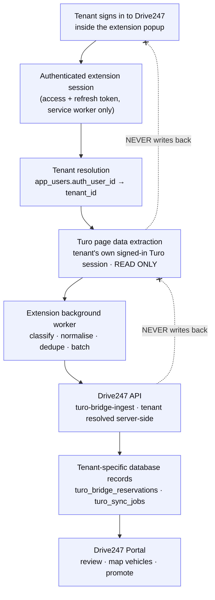

# Turo → Drive247 Browser Extension

> **Canonical document.** This file is the single source of truth for the Turo
> integration. `turo-bridge-poc/TURO_DRIVE247_EXTENSION_IMPLEMENTATION.md` is a
> pointer to it and holds no content of its own.

**The integration is ONE-WAY. Turo → Extension → Drive247 Backend → Drive247 Portal.
No Drive247 data is ever written back to Turo. Nothing in Turo is created, updated,
deleted, or automated by this extension. The Turo website is read-only from the
extension's perspective.**

---

## 1. Current implementation status

| Area | Status | Where |
|---|---|---|
| Turo read layer (feed walk, pagination, degraded-read taxonomy, normalisation) | **Already complete** before this change | `turo-bridge-poc/extension/turo-read-contract.js`, `content-turo.js` |
| Service-worker sync orchestrator (resumable run, tenant guard, absence ledger) | **Already complete** | `turo-bridge-poc/extension/background.js` |
| Backend ingest (staging table, upsert, run/job lifecycle, degraded-run gate) | **Already complete** | `supabase/functions/turo-bridge-ingest/index.ts` |
| Reconcile / promote / vehicle-map functions | **Already complete** | `supabase/functions/turo-bridge-{reconcile,promote,confirm-vehicle-map}` |
| Portal review surface | **Already complete** | `apps/portal/src/app/(dashboard)/turo-bridge/` |
| **Drive247 sign-in inside the extension** | **Added by this change** | `background.js` (auth module), `popup.{html,js,css}` |
| **Session-based tenant resolution on the backend** | **Added by this change** | `turo-bridge-ingest/index.ts` |
| **Session restore, refresh, expiry and sign-out cleanup** | **Added by this change** | `background.js` |
| **Unchanged-record suppression** | **Added by this change** | `background.js` + `turo-bridge-ingest/index.ts` |
| **Authenticated-only UI, last-sync line, technical controls removed** | **Added by this change** | `popup.{html,js,css}` |
| **Sign-in error taxonomy** (13 distinct outcomes, not one blanket message) | **Added by this change** | `background.js` |
| **Email retention, password retention on failure, password reveal toggle** | **Added by this change** | `popup.{html,js,css}` |
| **`app_users` RLS — closing anonymous read/write of every staff record** | **Written, NOT YET DEPLOYED** | `supabase/migrations/20260904120000_secure_app_users_read_access.sql` |

The credential was previously a **pairing token pasted into the popup**. It is now a
**Drive247 account sign-in**. The pairing-token path is retained as a fallback because
tokens are already minted and already pasted into installed extensions, and
`use-turo-bridge.ts` still documents that wire format.

Not yet applied to production (pre-existing, unchanged by this work):
`turo-bridge-poc/sql/03-foundation-schema.sql` has been written and dry-run but not
applied; `turo_bridge_tokens` still holds tokens in the clear with no `token_hash`
column on the live project. Both matter only to the legacy token path.

---

## 2. Existing components reused

Nothing was rebuilt. The following were reused as-is:

- **`turo-read-contract.js`** — the whole read/normalise/classify layer, its outcome
  taxonomy, its cursor model, and `fingerprint()`, which the tenant guard now hashes
  the credential identity with.
- **`content-turo.js`** — the page reader. Untouched; it was already read-only.
- **`background.js` orchestrator** — the resumable run, the pump/alarm revival, the
  absence ledger, the degraded-read handling. Only the *credential* plumbing changed.
- **`turo-bridge-ingest`** — the staging write, the upsert key, the job lifecycle, the
  degraded-run gate. Only the *auth* block changed, plus one additive presence path.
- **`turo-bridge-reconcile`'s `resolveActor()`** — copied idiom for the JWT → `app_users`
  → tenant lookup, so the two functions cannot drift.
- **`apps/portal/src/stores/auth-store.ts`** — the sign-in gates (`is_active` with a
  super-admin bypass, `must_change_password`, "a transport failure is not a denial")
  are mirrored exactly rather than reinvented.
- **`_shared/cors.ts`** — unchanged; the header whitelist is what dictates where each
  credential travels.

No new libraries were added. The extension has no dependencies.

---

## 2b. The "Email or password is incorrect" investigation

A tenant reported that message against credentials they believed were valid. It
was diagnosed against the live project rather than guessed at, and there were
**two findings**.

**Finding 1 — the configuration is correct.** Probing
`hviqoaokxvlancmftwuo.supabase.co` directly confirmed:

- The extension's `SUPABASE_URL` and `SUPABASE_ANON_KEY` are **byte-identical**
  to the portal's in `apps/portal/src/integrations/supabase/client.ts`. Same
  project, same key.
- The password grant **succeeds with an `apikey` header alone** — the portal's
  extra `Authorization: Bearer <anon>` header changes nothing. Both variants
  return an identical `400 invalid_credentials` for a bad password.
- The `chrome-extension://` preflight passes: `OPTIONS` returns `200` with
  `access-control-allow-origin: *`.
- `app_users` exposes every column the profile lookup selects, including
  `must_change_password`.
- `host_permissions` already covers the Supabase host, and the message router's
  sender check passes for the popup (which has no `sender.tab`).

So the endpoint, key, headers, permissions and message passing were all fine.

**Finding 2 — the account in the screenshot does not exist, and the extension
could not say so.** `neema@cortek.uk` has **no row in `app_users`**; the domain
is `cortek.io`. GoTrue's `invalid_credentials` was, in that instance, literally
correct.

The defect was that **the code could not have told anyone otherwise**. Every
non-2xx from the password grant returned the same sentence, so a typo'd domain
was indistinguishable from a dead server, a misconfigured build, or a malformed
request. A tenant's only available response to "your password is wrong" is to
retype a password that was never wrong.

Worth noting for whoever tests next: both real `cortek.io` accounts would also
have failed, and under the old code both would have shown that same misleading
sentence.

| Account | State | What it now says |
|---|---|---|
| `owner@cortek.io` | super admin, `tenant_id` NULL | "Super admin accounts are not tied to a single rental account…" |
| `admin@cortek.io` | `is_active: false`, `must_change_password: true` | "This Drive247 account has been deactivated…" |

**The fix** is the taxonomy in §3a. **The enumeration defence survives it**: wrong
password, unknown email and unknown domain still collapse to one code and one
sentence, so the form tells a prober nothing about which accounts exist. What
changed is that things which are *not* credential problems stopped pretending to
be.

---

## 3. Authentication flow

```
Popup (extension page)                Service worker                    Supabase
──────────────────────                ──────────────                    ────────
  email + password  ──AUTH_SIGN_IN──▶
                                       POST /auth/v1/token
                                            ?grant_type=password  ────▶  GoTrue
                                       ◀── access + refresh + user.id ──
                                       GET  /rest/v1/app_users
                                            ?auth_user_id=eq.<uid>  ──▶  PostgREST (as the user, RLS on)
                                       ◀── staff row ──
                                       gates: has a row? is_active?
                                              must_change_password?
                                              tenant_id present?
                                       GET  /rest/v1/tenants  (display name only)
                                       store  d247Session   (tokens)
                                       store  d247Identity  (no credential)
  ◀────── { ok, identity } ──────────
```

- The password is used **once**, in that one call. It is never stored, never logged and
  never echoed back to the popup. It is cleared from the form **only on success** — a
  failed attempt keeps both fields, because wiping the password on every rejection is
  what made a typo'd email cost a tenant their password five times over. See §3a.
- Rejections are **classified**, not collapsed: thirteen outcomes, each with a stable
  code and its own sentence (§3a). Exactly one of them — `bad_credentials` — blames the
  credentials, and it covers wrong password, unknown email and unknown domain alike, so
  the form is still not an oracle for which Drive247 accounts exist.
- A sign-in that passes the password but fails a gate **revokes the server-side session**
  (`POST /auth/v1/logout?scope=local`) rather than leaving a usable refresh token behind.
- **Restore on reopen**: `d247Session` lives in `chrome.storage.local`, so a tenant who
  closes Chrome is still signed in tomorrow. The popup does not trust it on its own — it
  asks the worker (`AUTH_STATE`), which is the only context that can attempt a refresh.
- **Refresh**: an access token within 60 s of expiry is refreshed before use. Concurrent
  refreshes are collapsed behind a single in-flight promise, because GoTrue rotates the
  refresh token and two racing refreshes would spend the same single-use token.
- **Expiry vs failure** — the distinction the code is most careful about:
  - `400 / 401 / 403` from the refresh endpoint means the session is *gone*: clear it,
    report `expired: true`, show "sign in again".
  - a network failure, a timeout, or a `5xx` means we could not *ask*: keep the session,
    report `expired: false`, park the run, retry. Signing a tenant out because their wifi
    dropped for four seconds would discard a half-finished sync.
- **401 from the ingest** on the session path clears the session locally, because the
  refresh check passed moments earlier and the token has therefore been revoked. A `403`
  does **not** clear it — that means "this account may not do this", and signing them out
  would hide the reason.
- **Sign-out** revokes locally-scoped (so the tenant's portal session in another tab
  survives), then removes the session, the identity, **and every run artefact** —
  cursor, view state, pending queue, summary, manifest, last-run, last-sync, digests.

### 3a. Sign-in failure taxonomy

Every failure carries a stable `code` as well as a sentence. Tests assert on the
code; only humans read the sentence.

| Code | Trigger | Blames |
|---|---|---|
| `bad_credentials` | `400` + `invalid_credentials`/`invalid_grant` with an "invalid login" message | the credentials — **the only code that does** |
| `unconfirmed` | `400` + `email_not_confirmed` | the unconfirmed inbox |
| `misconfigured` | `401`/`403` (bad API key), `404`, `validation_failed`, or an unsupported grant type | the build |
| `unavailable` | `5xx` from either GoTrue or PostgREST | Supabase |
| `offline` / `timeout` | a thrown or aborted fetch | the connection |
| `rate_limited` | `429` | too many attempts |
| `unexpected` | anything unrecognised, or a token response missing required fields | an unreadable answer |
| `no_profile` | authenticated, but no `app_users` row | missing portal access |
| `inactive` | `is_active = false` | a deactivated account |
| `must_change_password` | `must_change_password` and not a super admin | a pending password change |
| `super_admin` | `tenant_id` NULL **and** `is_super_admin` | the wrong login for this job |
| `no_tenant` | `tenant_id` NULL and *not* a super admin | an unlinked account |
| `profile_lookup` | a non-5xx failure reading `app_users` (e.g. RLS `403`) | the lookup, not the person |

Two traps this had to be written around, both now covered by tests:

1. **GoTrue reports an unsupported `grant_type` with `error_code:
   "invalid_credentials"`.** Matching on the error code alone would blame a
   tenant's password for a broken request. The classifier checks the message too.
2. **`401` here is never a wrong password.** GoTrue answers a bad password with
   `400`; a `401` means the gateway rejected our API key before GoTrue saw the
   request. That is a build problem and says so.

A `authConfigProblem()` guard also runs **before** the first request, so a build
with a missing or truncated URL/key fails with `misconfigured` rather than
producing a network failure that could be mistaken for a rejection.

---

## 4. Tenant-resolution flow

**The extension never names a tenant. The server resolves it from the credential.**
`tenant_id` appears in no request body this extension builds; there is an automated test
asserting it, including that it is not smuggled in as a slug.

Server side, `turo-bridge-ingest` has two doors:

| Door | Credential | Where it travels | Resolves via |
|---|---|---|---|
| A | Drive247 session (Supabase JWT) | `Authorization: Bearer …` | `auth.getUser(jwt)` → `app_users.auth_user_id` → `app_users.tenant_id` |
| B | Pairing token (legacy) | JSON body (`token`) | `sha256(token)` → `turo_bridge_tokens.token_hash` → `tenant_id` |

- Door B is checked first only because it is the cheaper lookup. There is **no
  precedence** between them: if both are present and name **different tenants**, the
  request is refused with `403` and the same sentence `turo-bridge-reconcile` already
  uses. Cross-tenant confusion is refused, never resolved.
- A **super admin** (`tenant_id IS NULL` by design) is refused with `403`: a scraped Turo
  trip has to land in exactly one account, and guessing one is the write this feature
  exists to make impossible. The extension also refuses this at sign-in, so the tenant
  finds out immediately rather than at the end of their first sync.
- A deactivated user (`app_users.is_active = false`) resolves to nothing and gets `401`.
- Neither credential → `401`.
- Every subsequent statement in the function reads `resolvedTenantId`, a narrowed
  non-null constant, and every query against tenant data carries `.eq("tenant_id",
  resolvedTenantId)`.

Why the pairing token may **not** move to the `Authorization` header: it is not a JWT,
and the gateway may attempt to parse that header as one even with `verify_jwt = false`,
producing a `401` the function never sees. A custom header fails the OPTIONS preflight,
because `_shared/cors.ts` whitelists exactly `authorization, x-client-info, apikey,
content-type, x-tenant-slug`. A real Supabase access token **is** a JWT and does belong
in that header — it is the same header `turo-bridge-reconcile` has always accepted.

---

## 5. Extension architecture

```
popup.html / popup.js / popup.css     ← view only. Holds no credential, ever.
        │  chrome.runtime.sendMessage
        ▼
background.js  (MV3 service worker)   ← owns auth, owns the run, talks to Drive247
        │  chrome.scripting.executeScript, into a real turo.com tab
        ▼
content-turo.js + turo-read-contract.js  ← reads the page/feed. Read-only.
```

**Popup** — sign in, sign out, show the signed-in tenant and person, the sync button,
this sync's progress, the last successful sync, and one plain sentence about how it went.

Field handling, which is deliberate in every particular:

- **The email is remembered** under `lastEmail` in `chrome.storage.local` and
  restored when the popup reopens. It is not a credential.
- **The password is never persisted** — not in `chrome.storage`, not in
  `localStorage`, not in a log, not in the source. It exists in the DOM node for
  the life of the popup window and in exactly one request body, and there are
  tests asserting both.
- **Both fields survive a failed attempt.** Wiping the password on rejection is
  what made a typo'd email cost a tenant their password five times over. It is
  cleared only on success, when the form is about to be hidden anyway.
- **A reveal toggle** sits inside the password input: `type="button"` (an untyped
  button inside a `<form>` is a submit button), `aria-pressed` and an
  `aria-label` that flips between "Show password" and "Hide password", and it
  restores the caret position rather than dumping focus.
- **A submit latch** ignores a second Enter or click while a request is in
  flight. The loading state sets `disabled` and label text only — it never
  assigns to `.value` and never rebuilds the form.
- **The error has a reserved slot** in the layout, so appearing does not shove
  the Sign in button down at the moment a tenant is reaching for it.
It reads `d247Identity` (a name, an email, a tenant name — no credential) and never
touches `d247Session`. Auth state comes from the worker, not from storage, because only
the worker can tell a live session from one whose refresh token has since been rejected.

**Service worker** — the only holder of tokens. It signs in, refreshes, signs out,
resolves the credential for each request, drives the resumable run, and calls Drive247.
`chrome.runtime.onMessage` validates the sender: same extension id, and for anything
touching the session, no `sender.tab` — a content script running inside turo.com has no
business signing anyone in or reading who is signed in. Tested.

**Content script** — reads the current Turo page. Every request it makes is a `GET`;
there is a test asserting no non-`GET` request is ever aimed at `turo.com`.

State lives in `chrome.storage.local` because the popup is destroyed the moment it
closes and a multi-batch sync deliberately outlives it. The popup renders storage on
open and follows `chrome.storage.onChanged`.

---

## 6. Turo data extraction flow

1. The worker finds or opens a `turo.com` tab (the fetch must happen inside a real
   turo.com page context — a service-worker fetch presenting `Origin:
   chrome-extension://` is rejected by Turo's edge).
2. `content-turo.js` is injected and reads the host feed using the tenant's **existing
   Turo browser session**. No Turo username or password is ever requested or stored.
3. Each HTTP response is **classified before it is parsed** — `OK`, `NO_TRIPS_CONFIRMED`,
   `EMPTY_UNCONFIRMED` (the WAF's empty 200), `NOT_LOGGED_IN`, `BOT_BLOCKED`,
   `RATE_LIMITED`, `UNREACHABLE`, `SHAPE_CHANGED`, `TRUNCATED`, `PAGINATION_STALLED`,
   `UNPARSEABLE`. This is what stops a bot challenge being rendered as "you have no
   bookings".
4. Records are normalised: ISO dates, trimmed names, upper-cased currency, a plate
   extracted where one is legible, a Turo vehicle id and guest id where present.
   **Missing fields are recorded as missing, never invented** — a trip with no date or no
   id is left out rather than imported with a guess, and the omission is reported in the
   popup's diagnostics drawer.
5. Selectors and key aliases are centralised in `turo-read-contract.js`. Extraction
   prefers stable application data (the Next.js flight payload, `data-testid` hooks) over
   visual selectors.
6. The result is a structured record set plus a run verdict, never loosely formatted text.

---

## 7. One-way sync flow



The dotted arrows are the two directions this system **must not** have. There is no
Turo write path anywhere in the codebase: no `POST`, `PUT`, `PATCH` or `DELETE` is ever
issued to `turo.com`, no action is automated on the tenant's behalf inside Turo, and no
Drive247 value is ever pushed to Turo. This is asserted by a test.

---

## 8. API endpoints used or added

| Endpoint | Method | Auth | Added / changed |
|---|---|---|---|
| `/auth/v1/token?grant_type=password` | POST | `apikey` | **Now used** by the extension |
| `/auth/v1/token?grant_type=refresh_token` | POST | `apikey` | **Now used** |
| `/auth/v1/logout?scope=local` | POST | `apikey` + Bearer | **Now used** |
| `/rest/v1/app_users?auth_user_id=eq.…` | GET | Bearer (RLS as the user) | **Now used** |
| `/rest/v1/tenants?id=eq.…` | GET | Bearer (RLS as the user) | **Now used** — display name only |
| `/functions/v1/turo-bridge-ingest` | POST | Bearer **or** body token | **Changed**: accepts a session; accepts `seen_reservation_ids` |
| `/functions/v1/turo-bridge-reconcile` | POST | Bearer **or** body token | **Unchanged** — it already accepted both |
| `/functions/v1/turo-bridge-promote` | POST | Portal JWT (`verify_jwt` default) | Unchanged, not called by the extension |
| `/functions/v1/turo-bridge-confirm-vehicle-map` | POST | Portal JWT | Unchanged, not called by the extension |

`promote` and `confirm-vehicle-map` deliberately have **no** `supabase/config.toml` entry,
so the gateway applies `verify_jwt = true` and both refuse without a real portal session.
That is load-bearing and was not changed: promotion creates rentals and customers, and a
vehicle mapping stamps `confirmed_by`. Neither decision may be made by a credential that
proves a tenant but not a person.

New request field on `turo-bridge-ingest`:

```jsonc
{
  "seen_reservation_ids": ["t-1", "t-2"],   // ids read this run and unchanged
  "reservations": [],                        // may be empty when only ids are sent
  "job": { /* run envelope, unchanged */ }
}
```

---

## 9. Data models and field mapping

Landing table: **`turo_bridge_reservations`**, unique on `(tenant_id, reservation_id)`.
Deliberately not `rentals` — a half-formed staged row in `rentals` would enter the
pricing, agreement, Stripe and cron machinery (eight triggers fire on `rentals` INSERT,
four with external side effects). Promotion into a real rental is a separate, explicitly
operator-driven step.

| Turo concept | Column | Notes |
|---|---|---|
| Trip / reservation id | `reservation_id` | The stable identifier. Half of the upsert key. |
| Guest name | `guest_name` | Customer data. Never logged. |
| Guest id | `turo_guest_id` | |
| Vehicle display label | `vehicle_label` | |
| Vehicle plate | `vehicle_plate` | **The only safe vehicle join key** — `vehicles.reg` is unique 461/461, `vehicles.vin` is not (326 distinct across 400) |
| Turo vehicle id | `turo_vehicle_id` | Also feeds `observed_turo_vehicle_ids` on the run |
| Turo's own trip status | `turo_status` | Turo's word, kept separate from ours |
| Start / end | `starts_at`, `ends_at` | ISO, normalised; a trip with neither is rejected, not guessed |
| Price | `total_amount`, `currency` | Currency upper-cased |
| Timezone | `raw.__turo_timezone` | Only when actually read; never assumed |
| Everything else | `raw` | Capped at 64 KB; keys we could not map are listed in `unmapped` with what was tried |
| Our import lane | `status` | Ours, not Turo's |
| Confidence per field | `field_confidence` | What evidence each value came from |
| Presence bookkeeping | `last_seen_at`, `last_seen_job_id`, `first_seen_job_id` | How reconcile knows a booking is still there |

Run table: **`turo_sync_jobs`**. `completeness`, `is_authoritative`,
`observed_complete` and `progress_denominator` are `GENERATED ALWAYS … STORED`, so the
client cannot assert its own authority — a partial read can never claim to be a
complete one.

**The core invariant, unchanged: absence never deletes.** Releasing a block requires
positive evidence the feed was read to its end. A trip that merely did not appear is
never treated as cancelled.

---

## 10. Duplicate-handling strategy

Three layers, all pre-existing except the third:

1. **Upsert on `(tenant_id, reservation_id)`.** Re-syncing the same trip updates one row;
   it never creates a second. A worker killed between a landed POST and its local
   acknowledgement re-POSTs, and the upsert absorbs it.
2. **`first_seen_job_id` is stamped only on rows we have never held**, so re-syncing does
   not rewrite history.
3. **Unchanged-record suppression (new).** The extension keeps a digest of the exact wire
   payload it last had *accepted* for each reservation. On a later run, a record whose
   payload hashes identically is not re-sent — but **its id is still reported**, in
   `seen_reservation_ids` on the finalisation call.

   That second half is not an optimisation, it is the safety property.
   `turo-bridge-reconcile` decides a booking is missing by `last_seen_job_id !== jobId`.
   An extension that simply went quiet about steady bookings would report every one of
   them as absent and walk them toward a released block — the one unrecoverable failure
   in this system. Skipping the payload is safe; skipping the id is not.

   Guards on it:
   - The digest is written **only after the server acknowledges the write**, and never
     for a rejected record — so "unchanged" always means "identical to something Drive247
     confirmed it holds".
   - It is computed over the **wire payload** with sorted keys, so any field that could
     reach a column is inside the hash by construction. There is no hand-maintained list
     of "fields that matter" to fall out of date.
   - `seen_reservation_ids` may move `last_seen_job_id` and **nothing else** — not a date,
     not a status, not a name. "Unchanged" is the client's opinion, and the client is the
     component most likely to be stale.
   - Capped at 400 ids per run; beyond that, records are sent in full.
   - Digests are cleared on sign-out, so a new tenant's identical reservation id can never
     be skipped against a row they have never had.
   - Reached only past the degraded-run gate, so an untrusted read advances nobody's
     presence.

---

## 10a. The `app_users` exposure, and the migration that closes it

Found while diagnosing the sign-in failure (§2b), not reported by anyone.

### What was wrong

`public.app_users` carries six RLS policies and **RLS was never enabled on the
table**. A policy on a table with RLS off is stored by Postgres and ignored, so
all six were inert and `GRANT ALL ON TABLE public.app_users TO anon` was the
entire access model.

Verified against the live project with nothing but the **public anon key** and no
user session:

| Probe | Result |
|---|---|
| `GET /rest/v1/app_users?select=email,tenant_id,auth_user_id` | `200`, **all 78 rows** |
| `GET …?email=eq.<address>` | `200`, matched — searchable by email |
| `GET …?tenant_id=eq.<uuid>` | `200`, matched — enumerable per tenant |
| `PATCH …?id=eq.<all-zero uuid>` | `204` — **writes were permitted too** |
| `DELETE …?id=eq.<all-zero uuid>` | `204` — **so were deletes** |

The two write probes used an all-zero uuid so they could match no row. Nothing
was read into them and no data was changed; they are recorded because they prove
the exposure was never read-only. Exposed fields included email, `tenant_id`,
`auth_user_id`, `role`, `is_active` and `is_super_admin`, across every tenant.

The anon key is **public by design** and is not the bug. Rotating or hiding it
would fix nothing.

### Why "own row only" would have broken the portal

Enabling RLS alone was not enough. The two existing SELECT policies cover your
own row and a super admin — but four shipped paths read *other people's* rows
inside the caller's own tenant, all from the browser under the caller's session:

| File | What it reads |
|---|---|
| `apps/portal/src/app/(dashboard)/users/page.tsx:86` | the tenant's staff list |
| `apps/portal/src/app/(dashboard)/settings/users/page.tsx:57` | the tenant's staff list |
| `apps/portal/src/hooks/use-audit-logs.ts:127` | the audit-log actor filter |
| `apps/portal/src/lib/services/notification-service.ts:169` | admin notification routing |

So the migration adds one policy. It is **not** restricted by role, deliberately:
`getAdminUserIds()` is reached from notification paths any role can trigger, and
narrowing by role would silently stop notifications for `ops`, `viewer` and
`manager`. Every authenticated user can read every row today; scoping them to
their own tenant is already a large tightening. Narrowing further by role is a
separate change that needs each role's flows traced first.

### Audited and needing nothing

The list below is the result of a repo-wide sweep, not an app-by-app guess.
`apps/bonzah` is worth calling out: it is a fifth Next.js app that CLAUDE.md does
not mention, and the first pass missed it entirely. It reads `app_users`, and it
turns out to read only its own row — but that was luck rather than judgement, and
the next audit should start from `grep -rl app_users apps/` rather than from the
documented app list.

| Consumer | Why it survives |
|---|---|
| Turo extension profile lookup | `auth_user_id=eq.<uid>` as the signed-in user → `users_read_self` |
| Portal login (`auth-store.ts:87,249`) | same shape |
| Admin console login (`authStore.ts:36,78`) | same shape |
| Admin cross-tenant screens | super-admin-only pages → `super_admin_read_all` |
| Sales agents | `Sidebar.tsx:52` confines them to the Sales group; own row only |
| Avatar upload (`user-menu.tsx:82`) | own-row UPDATE → `p_update_own_password_flag` |
| **Every** edge function | all build a service-role client; `service_role` bypasses RLS |
| Booking app | references `app_users` in generated types only — no queries |
| Bonzah partner portal (`apps/bonzah/store/authStore.ts:35,63`) | own-row reads by `auth_user_id` → `users_read_self` |

### The migration

`supabase/migrations/20260904120000_secure_app_users_read_access.sql`

1. `ALTER TABLE public.app_users ENABLE ROW LEVEL SECURITY` — the actual fix.
2. `REVOKE ALL … FROM anon` — so an anon request is refused before any policy
   is consulted. A `200 []` would not be good enough; the table must not be
   addressable at all.
3. `authenticated` re-granted narrowly as `SELECT, INSERT, UPDATE, DELETE`.
   `GRANT ALL` additionally carried **TRUNCATE, which is not subject to RLS** —
   a table-wide delete every policy would have watched go past. PostgREST cannot
   emit TRUNCATE, so this closes a door rather than a breach.
4. One new policy, `app_users_read_same_tenant`.

The six existing policies are **left exactly as they are**. They were never the
problem, and re-creating them would put six working rules at risk to fix one that
was absent. No column, row or default is touched.

`FORCE ROW LEVEL SECURITY` is deliberately **not** used: the helper functions are
`SECURITY DEFINER` owned by `postgres`, which also owns the table, and forcing
RLS would subject their internal reads to these same policies and recurse.

### Policies before and after

| Policy | Command | Applies to | Rule | Status |
|---|---|---|---|---|
| `users_read_self` | SELECT | PUBLIC | `auth.uid() = auth_user_id` | unchanged (now live) |
| `super_admin_read_all` | SELECT | PUBLIC | `is_super_admin()` | unchanged (now live) |
| `p_update_own_password_flag` | UPDATE | authenticated | own row | unchanged (now live) |
| `super_admin_manage_all` | INSERT | PUBLIC | `is_super_admin()` | unchanged (now live) |
| `super_admin_manage_all_update` | UPDATE | PUBLIC | `is_super_admin()` | unchanged (now live) |
| `super_admin_manage_all_delete` | DELETE | PUBLIC | `is_super_admin()` | unchanged (now live) |
| **`app_users_read_same_tenant`** | SELECT | authenticated | `tenant_id IS NOT NULL AND tenant_id = public.get_user_tenant_id()` | **new** |

"now live" means the policy existed but was inert because RLS was off.

### Grants before and after

| Role | Before | After |
|---|---|---|
| `anon` | `ALL` | **none** |
| `authenticated` | `ALL` | `SELECT, INSERT, UPDATE, DELETE` |
| `service_role` | `ALL` | `ALL` (unchanged) |

### Access matrix

| Who | Read | Write |
|---|---|---|
| anon, no session | **nothing** — refused before any policy | **nothing** |
| authenticated, own row | yes | own row UPDATE |
| authenticated, same tenant | yes | no |
| authenticated, another tenant | **no** | no |
| super admin | all rows | INSERT / UPDATE / DELETE all rows |
| `service_role` (edge functions) | all rows, bypasses RLS | all rows |

The service-role key is never shipped to a browser or extension; a test asserts
no extension file contains one.

### Why the extension still works

It reads `app_users?auth_user_id=eq.<uid>` **as the signed-in user**, which is
exactly what `users_read_self` permits — the lookup was already written for a
properly-secured table and needs no change. The backend path is untouched too:
`turo-bridge-ingest` resolves the tenant with a service-role client, which
bypasses RLS. The extension still sends **no tenant id** in any request.

### Rollback

`supabase/migrations/20260904120000_secure_app_users_read_access.ROLLBACK.sql`,
written from the snapshot taken before the migration, not from memory. Every
statement in it is commented out, and a test asserts that.

- **Section A (preferred)** — four narrow, symptom-matched fixes that keep RLS on
  and widen only what regressed.
- **Section B (emergency only)** — restores the exact prior state, which means
  **restoring anonymous public read and write access to every staff record**. It
  is a lever for a controlled environment with an active incident and named
  authorisation, not a rollback plan.

Neither section contains an `INSERT`, `UPDATE` or `DELETE` against `app_users`.
No rollback path can change user data.

### Out of scope, and real

The same probe found `anon` can also read `tenants`, `customers`, `rentals`,
`vehicles` and `audit_logs`. **Those are not touched here.** Each needs its own
consumer audit, and a blind fix would break the booking site, which legitimately
reads some of them anonymously. This is a genuine open finding, not a closed one
— see §18.

---

## 11. Security decisions

- **No hard-coded credentials, tokens, tenant ids or API secrets.** The only embedded
  constants are the Supabase project URL and the **public anon key**, which is already
  shipped to every browser that loads the portal (`apps/portal/src/integrations/supabase/client.ts`).
  It is not what authorises anything — the session or the pairing token is.
- **No Turo credentials.** The tenant's existing authenticated Turo browser session is
  used. No Turo username or password is requested, stored, or transmitted.
- **Tokens never enter the page DOM.** They live in `chrome.storage.local`, readable only
  by this extension's own contexts. The popup reads a separate key (`d247Identity`) that
  contains no credential.
- **Why `chrome.storage.local` and not `chrome.storage.session`.** Session storage is
  memory-only and strictly safer, but the requirement is that a tenant who closes Chrome
  is still signed in tomorrow, and that needs a refresh token which outlives the browser
  process. The mitigation is the split above.
- **Sender and origin validation.** `chrome.runtime.onMessage` requires the sender to be
  this extension, and every auth message additionally requires no `sender.tab` — so a
  content script inside turo.com cannot sign in, sign out, or read the auth state.
  `externally_connectable` is absent from the manifest, so no web page can reach the
  worker at all. Tested from both a page context and a foreign extension id.
- **Least privilege, verified.** `permissions` are `scripting`, `storage`, `alarms`.
  `host_permissions` are `turo.com`, `*.turo.com`, and the Supabase project. The
  sign-in added **no new permission** — it talks to the same Supabase host already
  listed. Nothing was added.
- **The tenant id is never on the wire from the client.** Asserted by test.
- **No credential or customer data is logged.** The auth calls log nothing; the ingest
  logs a tenant uuid, counts, and a credential *kind* — never a token, never a guest name.
- **Rate-limit and enumeration hygiene.** One rejection message for wrong password and
  unknown email alike; the token path likewise returns the same message for a
  wrong-length and an unknown token. The taxonomy in §3a does not weaken this — every
  code it adds describes something that is *not* a credential, and none of them varies
  with whether the email exists.
- **The password is not persisted anywhere.** Asserted by test on both the failure and
  the success path, and by a test that it appears in exactly one outbound request.
- **Sanitised logging.** The one new log line is `HTTP <status> -> <our code>`. Not the
  email, not the password, not the response body.
- **The UI exposes no internals.** No endpoints, no tenant ids, no selectors, no raw
  JSON, no backend settings, no scraping controls. Asserted by test on the rendered DOM
  in both the signed-out and signed-in states.
- **Environment variables** follow the existing structure. The backend reads
  `SUPABASE_URL` and `SUPABASE_SERVICE_ROLE_KEY` from the Deno environment exactly as
  before; no new variable was introduced.

---

## 12. Browser permissions required

| Permission | Why |
|---|---|
| `storage` | The session, the identity, and the resumable run state. A MV3 worker is killed at any moment; nothing may live in a variable. |
| `scripting` | Inject the reader into an already-open turo.com tab. The fetch must originate from a real turo.com page context. |
| `alarms` | Revive a killed worker to continue a multi-page sync. Without it an interrupted sync needs a manual Continue. |
| `https://turo.com/*`, `https://*.turo.com/*` | Read the tenant's own host calendar. Read-only. |
| `https://hviqoaokxvlancmftwuo.supabase.co/*` | Sign in, refresh, and send data to Drive247. |

No permission was added for the sign-in. `tabs`, `cookies`, `webRequest`,
`<all_urls>` and `externally_connectable` are all deliberately absent.

---

## 13. Supported Turo pages

- `https://turo.com/us/en/trips/booked` — the host trips/calendar feed. This is the page
  the worker opens or reuses, and the source of reservations, guests, vehicles and dates.

Support is **detected, not assumed**. Before anything is written, the read is classified:
a signed-out session (`NOT_LOGGED_IN`), a bot challenge (`BOT_BLOCKED`), a WAF's empty
`200` (`EMPTY_UNCONFIRMED`), a changed response shape (`SHAPE_CHANGED`) and an unreadable
body (`UNPARSEABLE`) each produce a specific, actionable message and **write nothing**.
Dynamic navigation and late-loading content are handled by waiting on tab readiness and
by re-probing the signed-in account on every resumed run.

The US and GB Turo builds differ structurally; the reader carries both and reports
`SHAPE_CHANGED` rather than guessing when it meets a third.

---

## 14. Known limitations

1. **Turo pagination shape is unverified** against a live host account with more than one
   page. The walk detects a stall (`PAGINATION_STALLED`) and a truncation (`TRUNCATED`)
   rather than claiming completeness it has not earned, but the happy path past page 1 is
   inferred, not observed.
2. **`03-foundation-schema.sql` is not applied** to the live project (pre-existing).
   Until it is, `turo_sync_jobs` and the generated completeness columns do not exist
   there, and `turo_bridge_tokens` still holds plaintext tokens with no `token_hash`.
   The session path does not depend on the token table; the ingest's job path does depend
   on the foundation schema.
3. **No automated test covers the edge function itself.** This repository has no Deno test
   harness for edge functions, and Deno is not installed on this machine. The ingest's
   auth decisions are covered indirectly (the extension asserts what it sends) and
   directly by the manual checklist in §16. The TypeScript in the function has not been
   type-checked by a compiler.
4. **Anti-bot exposure is unchanged.** Turo runs Cloudflare, PerimeterX and reCAPTCHA
   Enterprise. The extension paces its requests and refuses to auto-retry into a challenge
   — only a human clearing it resumes the run — but a determined edge change can still
   stop a sync.
5. **A super admin cannot sync.** By design; there is no single tenant to attribute a trip
   to. They must use the tenant's own Drive247 account.
6. **`chrome.storage.local` persists the refresh token to disk.** Accepted deliberately for
   session restore; see §11.
7. **The sign-in is email/password only.** SSO, magic-link and MFA flows are not handled;
   a tenant on one of those cannot sign into the extension.
8. **The unchanged-record digest is per install.** A tenant who reinstalls the extension
   re-sends every record once. Correct, but not free.
9. **The `app_users` migration is written and tested but NOT DEPLOYED.** Until it is
   applied, the exposure in §10a is live: every staff email, `tenant_id` and
   `auth_user_id` in the platform is readable — and writable — with the public anon key
   alone. No Supabase service-role key, database password or working CLI is available in
   this environment (the installed `supabase` npm package is `0.5.0`, which is not the
   real CLI), so it could not be applied from here. `rls-app-users.test.js` currently
   **fails its live checks by design**, and will pass once the migration lands.
10. **Anonymous read of other tables is still open.** `tenants`, `customers`, `rentals`,
   `vehicles` and `audit_logs` are all readable with the anon key. Out of scope for this
   change and deliberately untouched — see §10a and §18.
11. **One timing-sensitive test can flake under load.** `background-orchestrator`'s
   "service worker is killed mid-run" case races real wall-clock timers; it failed once
   while four suites ran concurrently on a loaded machine and passed 9 consecutive runs
   afterwards, including 3 on the pre-change baseline. Pre-existing sensitivity, not a
   regression, but worth knowing before trusting a single red run.

---

## 15. Testing instructions

```bash
# Extension — four suites, no browser and no Turo account required
node turo-bridge-poc/extension/auth.test.js                     # 136 assertions
node turo-bridge-poc/extension/background-orchestrator.test.js  # 125 assertions
node turo-bridge-poc/extension/popup-render.test.js             # 102 assertions (needs jsdom)
node turo-bridge-poc/extension/turo-read-contract.test.js       # ALL PASS
node turo-bridge-poc/extension/rls-app-users.test.js            # 19 static pass;
                                                                # 9 live checks FAIL
                                                                # until the migration
                                                                # is deployed (by design)

# Portal — unaffected by this change, run to confirm
cd apps/portal && npx tsc --noEmit     # 145 pre-existing errors, 0 in turo-bridge
cd apps/portal && npm run test        # 1113 passed (42 files)
```

To load the extension: `chrome://extensions` → Developer mode → **Load unpacked** →
`turo-bridge-poc/extension`.

---

## 16. Manual verification checklist

Automated coverage is noted per row. Rows marked *manual* need a live Supabase project.

| # | Case | Expected | Covered |
|---|---|---|---|
| 1 | Successful extension login | Account bar names the tenant and the person; sync UI appears | `auth.test.js`, `popup-render.test.js` |
| 2 | Invalid login | "Email or password is incorrect."; nothing stored; `app_users` never consulted | `auth.test.js` |
| 3 | Expired authentication session | Reported `expired: true`; session cleared; popup shows "sign in again" | `auth.test.js`, `popup-render.test.js` |
| 3b | Network failure during refresh | **Not** signed out; session kept for retry | `auth.test.js` |
| 4 | Tenant resolution | `tenantId` comes from `app_users`, never from anything typed | `auth.test.js` |
| 5 | Cross-tenant access prevention | Session + token naming different tenants → `403`; mid-run credential change → run abandoned, nothing further written | `background-orchestrator.test.js`; the `403` itself is *manual* |
| 5b | Super admin | Refused at sign-in and again at the ingest | `auth.test.js`; ingest side *manual* |
| 6 | Valid scraped payload | Records upserted; run finalised once; reconcile called once | `background-orchestrator.test.js` |
| 7 | Invalid / incomplete scraped payload | Rejected with the keys Turo actually sent; never imported with an invented date or id | `turo-read-contract.test.js`, orchestrator |
| 8 | Duplicate-record handling | Upsert on `(tenant_id, reservation_id)`; unchanged records not re-sent but still reported present | `background-orchestrator.test.js` |
| 9 | Updating an existing synced record | Changed record re-sent in full; the rest still reported present | `background-orchestrator.test.js` |
| 10 | Backend API failure | Run parks with the record still pending; message says it is a Drive247 problem; continuing resends | orchestrator |
| 10b | Backend returns 401 mid-sync | Session cleared; popup falls back to sign-in | `auth.test.js` |
| 11 | Unsupported Turo page | Classified (`SHAPE_CHANGED` / `UNPARSEABLE`); nothing written | `turo-read-contract.test.js` |
| 12 | Missing page fields | Reported in the diagnostics drawer; never guessed | `popup-render.test.js` |
| 13 | Logout and session cleanup | Session, identity, cursor, state, pending, summary, manifest, last-run, last-sync and digests all removed; server session revoked locally | `auth.test.js` |
| 14 | One-way | No non-`GET` request ever aimed at turo.com | `auth.test.js` |
| 15 | UI exposes no internals | No token field, no endpoint, no tenant id, no sample/scenario controls, in either auth state | `popup-render.test.js` |
| 16 | Missing/blank auth configuration | `misconfigured`, never a password error; caught before the first request | `auth.test.js` |
| 17 | Each non-credential failure | 8 GoTrue statuses each map to their own code and sentence | `auth.test.js` |
| 18 | Each account-shaped refusal | 5 refusals, 5 distinct sentences | `auth.test.js` |
| 19 | Email retained after a failed login | Value survives; saved to `lastEmail`; restored on reopen | `popup-render.test.js` |
| 20 | Password retained after a failed login | Value survives; cleared only on success | `popup-render.test.js` |
| 21 | Password is never persisted | Absent from storage after both failure and success; in exactly one request | `auth.test.js`, `popup-render.test.js` |
| 22 | Reveal toggle | Flips `type`, keeps the value, flips `aria-label`/`aria-pressed` | `popup-render.test.js` |
| 23 | Toggle does not submit | `type="button"`; no message sent on either click | `popup-render.test.js` |
| 24 | Loading state clears nothing | Both values intact mid-request; button disabled; label "Signing in…" | `popup-render.test.js` |
| 25 | No duplicate submission | A second submit in flight is ignored | `popup-render.test.js` |
| 26 | Error rendering does not recreate the form | Same slot element before and after; button still its sibling | `popup-render.test.js` |
| 27 | Empty fields | Caught locally, no request, names the missing field | both |
| 28 | Anon cannot read `app_users` | 7 probes: list, single row, by email, by `tenant_id`, by `auth_user_id`, count, role/status | `rls-app-users.test.js` — **fails until deployed** |
| 29 | Anon cannot write `app_users` | UPDATE / DELETE / INSERT all refused | `rls-app-users.test.js` — **fails until deployed** |
| 30 | The migration is safe | Enables RLS, revokes anon, keeps service_role, no data statements, no other table, no FORCE RLS, no nested `app_users` query in the policy | `rls-app-users.test.js` (static) |
| 31 | The rollback cannot fire by accident | Every statement commented out; warns it reopens access; changes no data | `rls-app-users.test.js` (static) |
| 32 | No service-role key in the extension | 4 files scanned for the claim and for encoded key fragments | `rls-app-users.test.js` (static) |
| 33 | Extension profile lookup survives RLS | `auth_user_id = auth.uid()` returns exactly one row | `rls-app-users.test.js` — *needs `D247_TEST_A_*`* |
| 34 | Same-tenant staff list survives RLS | A tenant can still list its own staff | `rls-app-users.test.js` — *needs `D247_TEST_A_*`* |
| 35 | Cross-tenant read blocked | Tenant B gets zero rows for tenant A, by `tenant_id` and by `auth_user_id` | `rls-app-users.test.js` — *needs `D247_TEST_B_*`* |

**Manual, against a live project:**

- Sign in as tenant A, sync, confirm rows land under A. Sign in as tenant B on the same
  Chrome profile, sync, confirm nothing crosses.
- Send a request with a valid session for tenant A **and** a pairing token for tenant B →
  expect `403` and the "different Drive247 account" message.
- Deactivate the signed-in user in the portal, then sync → expect `401` and the extension
  returning to the sign-in screen.
- Sync twice with no calendar change → the second run's ingest log should read
  `+0 new, 0 updated … (+N unchanged)`, and reconcile must release nothing.
- **Sign-in, end to end** — this needs a working tenant account, which was not available
  here (see §2b):
  1. Reload the unpacked extension at `chrome://extensions`.
  2. Open the popup on `turo.com`.
  3. Enter valid Drive247 **tenant** credentials — not a super admin, and an account with
     `is_active = true` and `must_change_password = false`.
  4. Confirm sign-in completes and the account bar names the tenant.
  5. Sign out, then try a deliberately wrong password → expect exactly "Email or password
     is incorrect."
  6. Confirm **both** the email and the password are still in the form after that error.
  7. Click the eye → the password becomes readable, the value is unchanged, and the form
     does not submit. Click again to re-mask.
  8. Close and reopen the popup → the email is restored, the password is empty.
  9. Reopen again → the session is restored without signing in.
  10. Run a sync and confirm scraping and one-way sync still behave as before.
- **After deploying the `app_users` migration**, in this order:
  1. `node turo-bridge-poc/extension/rls-app-users.test.js` → every live check must pass.
  2. Anon probe by hand:
     `curl -s -o /dev/null -w '%{http_code}' -H "apikey: $ANON" "$URL/rest/v1/app_users?select=email,tenant_id,auth_user_id"`
     → expect `401`. A `200 []` means the grant survived and only a policy filtered.
  3. Portal: sign in, confirm the authenticated user loads and the tenant resolves.
  4. Portal → Users, and Settings → Users: the staff list must still populate.
  5. Portal → Audit logs: the actor filter dropdown must still populate.
  6. Admin console: sign in as a super admin; the Admins page and a tenant detail page
     must still list users. Sign in as a sales agent; the Sales area must still load.
  7. Extension: sign in, confirm the tenant name appears, run a sync.
  8. Re-run `auth.test.js` and `background-orchestrator.test.js`.
  9. Set `D247_TEST_A_*` and `D247_TEST_B_*` to two non-production accounts in
     different tenants and re-run `rls-app-users.test.js` to exercise the
     cross-tenant matrix.

---

## 17. Files created or modified

**Created**
- `supabase/migrations/20260904120000_secure_app_users_read_access.sql` — enables RLS on
  `app_users`, revokes `anon`, narrows `authenticated`, adds `app_users_read_same_tenant`.
- `supabase/migrations/20260904120000_secure_app_users_read_access.ROLLBACK.sql` — the
  snapshot-based rollback, entirely commented out.
- `turo-bridge-poc/extension/rls-app-users.test.js` — 19 static + 9 live + 5 optional
  signed-in assertions on the access model.
- `turo-bridge-poc/extension/auth.test.js` — 136 assertions covering sign-in, gates,
  refresh, expiry-vs-failure, sign-out cleanup, credential placement on the wire, sender
  validation, and the one-way property.
- `TURO_DRIVE247_EXTENSION_IMPLEMENTATION.md` — this file, the canonical document.
- `turo-bridge-poc/TURO_DRIVE247_EXTENSION_IMPLEMENTATION.md` — reduced to a pointer at
  this file, so the two copies cannot drift.

**Modified**
- `supabase/functions/turo-bridge-ingest/index.ts` — session (JWT) tenant resolution
  alongside the pairing token, cross-credential `403`, super-admin refusal, nullable
  `token_id`, the `seen_reservation_ids` presence path, and the `records_seen` arithmetic
  that follows from it.
- `turo-bridge-poc/extension/background.js` — the Drive247 auth module (sign-in, profile
  gates, refresh with a concurrency latch, expiry-vs-failure, sign-out with full
  cleanup), the `credential()` seam replacing seven raw token reads, `Authorization:
  Bearer` on the ingest and reconcile calls, sender validation on the message router, the
  tenant guard now fingerprinting the tenant rather than the rotating access token,
  `lastSyncAt`, and unchanged-record suppression.
- `turo-bridge-poc/extension/popup.html` — sign-in form, account bar, gated work area,
  last-sync line; pairing-token field and sample/scenario controls removed.
- `turo-bridge-poc/extension/popup.js` — auth gate and rendering, sign-in/sign-out
  handlers, last-sync rendering, expiry messaging; token-field code removed.
- `turo-bridge-poc/extension/popup.css` — account bar, sign-in form, error line,
  last-sync line, email/disabled input states.
- `turo-bridge-poc/extension/manifest.json` — version `0.3.0`, description now states the
  Drive247 sign-in and the read-only guarantee. **No permission change.**
- `turo-bridge-poc/extension/popup-render.test.js` — auth-aware harness, plus signed-out,
  expired, signed-in, and last-sync rendering assertions; then a submit-capable harness
  and suites for field retention, the reveal toggle, the loading state, duplicate
  submission, error rendering and per-code messages.
- `turo-bridge-poc/extension/background-orchestrator.test.js` — unchanged-record,
  changed-record and rejected-record suites; the credential-mismatch label generalised.
- `turo-bridge-poc/extension/turo-read-contract.test.js` — two `require()` calls that were
  absolute paths into one developer's home directory, so the suite could not run in this
  checkout at all. Now relative.

---

## 18. Recommended next steps

1. **Apply `turo-bridge-poc/sql/03-foundation-schema.sql`** to the live project. Until
   then `turo_sync_jobs` and the generated completeness columns do not exist there and
   the run lifecycle cannot be exercised end to end.
2. **Deploy the changed `turo-bridge-ingest`** and run the four manual cross-tenant checks
   in §16 against it.
3. **Add a Deno test harness** for the edge functions and port §16's manual rows into it —
   particularly the `403` on disagreeing credentials and the `seen_reservation_ids` tenant
   scoping. This is the largest remaining coverage gap.
4. **Retire the pairing-token path** once installed extensions have updated: revoke the
   outstanding tokens, then delete door B from `turo-bridge-ingest` and `credential()`.
   Keep it until then — removing it breaks live installs.
5. **Verify pagination** against a real host account with more than one page of trips, and
   confirm `TRUNCATED` / `PAGINATION_STALLED` fire when they should.
6. **Decide on SSO/MFA tenants.** If any tenant uses a non-password sign-in, the extension
   needs an OAuth or magic-link flow.
7. **Deploy `20260904120000_secure_app_users_read_access.sql`** — the highest-priority
   item here. It is written, reviewed and statically tested, and until it is applied the
   exposure in §10a is live. Run the §16 post-deployment checklist immediately after.
8. **Audit the other anon-readable tables** — `tenants`, `customers`, `rentals`,
   `vehicles`, `audit_logs`. Same root cause is likely (RLS never enabled), but each
   needs its own consumer audit before a fix: the booking site legitimately reads some of
   them anonymously, so the `app_users` pattern cannot simply be copied across.
9. **Audit `booking_v2_enabled`** — unrelated to this feature, but it has silently
   reverted to `false` three times with no cron job or trigger accounting for it. It needs
   an audit trigger before go-live.
