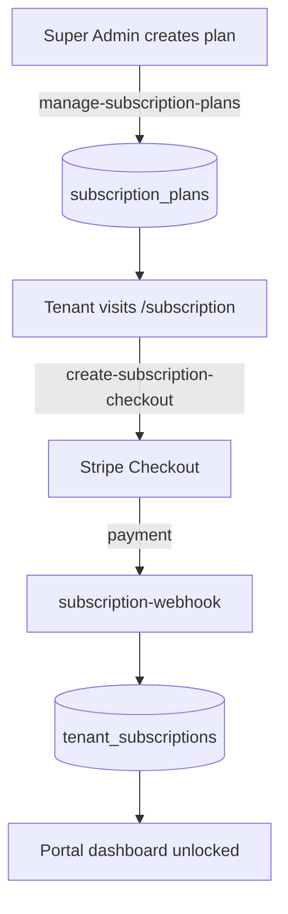

# Subscription Checkout Flow

**Apps involved:** Admin, Portal
**Edge functions:** `manage-subscription-plans`, `create-subscription-checkout`, `subscription-webhook`
**Status:** Stable

## Steps

1. **Super Admin** creates a plan for a tenant in the admin UI
2. **Edge function** `manage-subscription-plans` saves it to `subscription_plans` and creates a Stripe Price
3. **Tenant** sees available plans on `/subscription` in the portal
4. **Edge function** `create-subscription-checkout` creates a Stripe Checkout session
5. **Stripe** processes payment and fires `checkout.session.completed` webhook
6. **Edge function** `subscription-webhook` upserts into `tenant_subscriptions`
7. **Portal** detects active subscription, removes gate, dashboard unlocked
