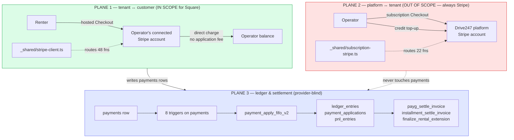
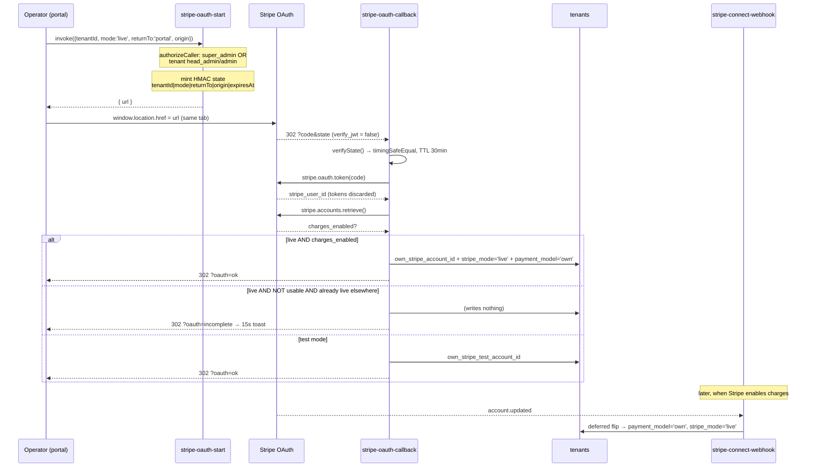
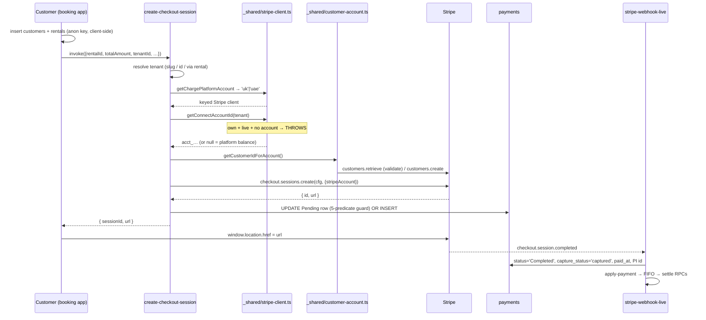
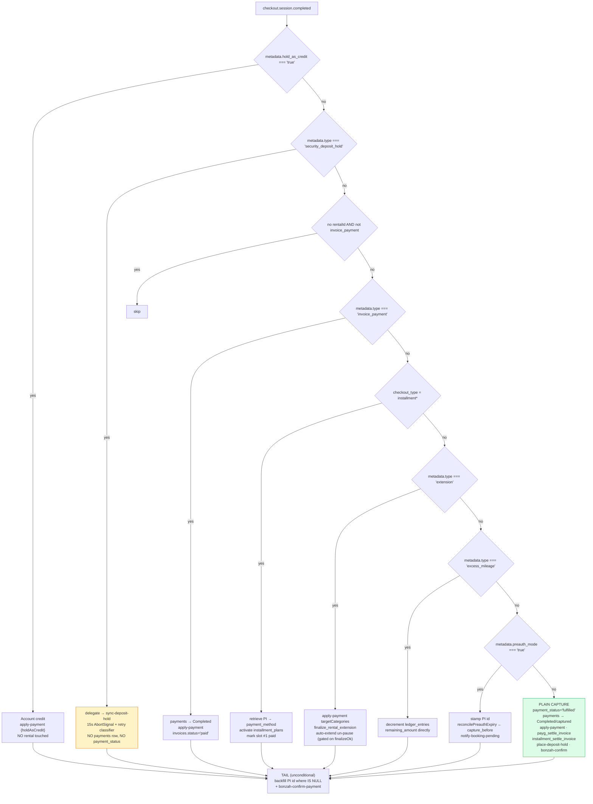
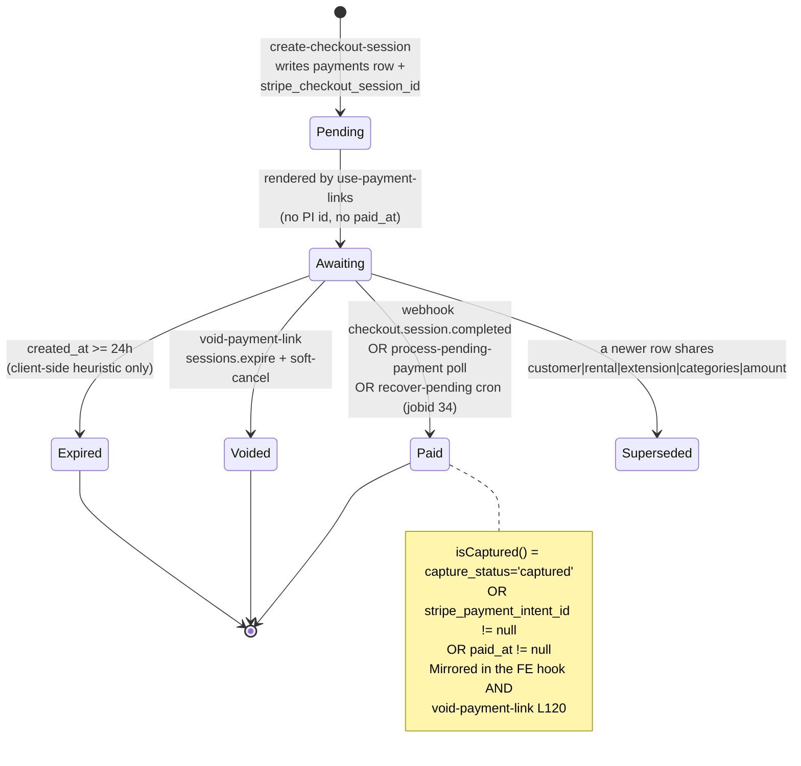
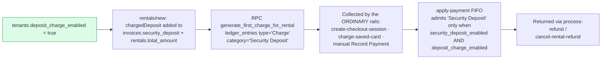
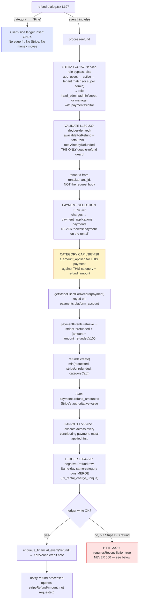

# 01 — The Stripe Surface Map

**How money moves through Drive247 today.** The definitive navigation reference for the Square integration workstream.

Verified against the **live database** (`hviqoaokxvlancmftwuo`) and the repo at branch `feature/square`, 2026-08-25.
Where repo migrations and the live schema disagree, **the live schema wins** and is what is documented here. All file paths are repo-relative and were confirmed to exist.

---

## TL;DR

- **One file decides everything.** `supabase/functions/_shared/stripe-client.ts` (632 lines) is imported by **55 edge functions**. Its three helpers — `getConnectAccountId()` (48 callers), `getStripeClientForAccount()` (30), `getStripeClientForRecord()` (25) — answer *which merchant account*, *which platform keys*, and *which keys for an existing record*. The Square branch belongs **beside** these, never inside them.
- **The platform takes 0%.** A repo-wide grep for `application_fee_amount`, `transfer_data` and `on_behalf_of` returns **zero hits**. Every tenant↔customer charge is a *direct charge* on the operator's connected account via the `{ stripeAccount }` request option. There is no fee to reverse and no transfer to unwind — which makes a Square OAuth merchant a genuinely equivalent target.
- **The portal and booking apps are already provider-agnostic.** Neither contains Stripe SDK code on any payment path. Every payment is `invoke(edge-fn) → read data.url → window.location.href = data.url`. The **only** in-browser Stripe SDK in the entire monorepo is `apps/booking/src/components/customer-portal/UpdatePaymentMethodDialog.tsx` (card-on-file replacement).
- **There is no provider flag yet.** No `payment_provider` column exists on any table. `tenants.payment_model` (`'managed'|'own'`) means *which Stripe account model*, not *which provider* — reusing it is the single most dangerous shortcut available (see [§17.1](#171-the-payment_model-trap)).
- **Scope is narrower than it looks.** Platform subscriptions (17 edge functions, its own `_shared/subscription-stripe.ts`, its own env keys) and the authorization-hold chain (~28 `rentals.deposit_hold_*` columns, 2 crons, a 130 KB shared engine) are **OUT**. They are already structurally isolated; the correct action is to *fence* them, not branch them.
- **A provider-abstraction precedent already exists in this repo.** `supabase/functions/_shared/accounting/{types,factory,oauth-constants}.ts` does Xero-vs-Zoho with a `provider` enum, a factory, a nonce table and a Vault-backed token store. Copy that shape.

---

## Table of contents

| § | Section | Scope |
|---|---|---|
| [0](#0-scope-at-a-glance) | Scope at a glance | — |
| [1](#1-the-three-money-planes) | The three money planes | — |
| [2](#2-the-routing-chokepoint-_sharedstripe-clientts) | The routing chokepoint: `_shared/stripe-client.ts` | **IN** |
| [3](#3-area-a--account-connection--oauth) | Area A — Account connection / OAuth | **IN** |
| [4](#4-area-b--booking-checkout) | Area B — Booking checkout | **IN** |
| [5](#5-area-c--webhook-settlement) | Area C — Webhook settlement | **IN** |
| [6](#6-area-d--payment-links-and-saved-cards) | Area D — Payment links & saved cards | **IN** |
| [7](#7-area-e--deposits) | Area E — Deposits | **charge IN / hold OUT** |
| [8](#8-area-f--refunds-and-partial-refunds) | Area F — Refunds & partial refunds | **IN** |
| [9](#9-adjacent-money-flows-installments-extensions-payg) | Adjacent money flows: installments, extensions, PAYG | **IN (charge side)** |
| [10](#10-cron-and-reconciliation-machinery) | Cron & reconciliation machinery | mixed |
| [11](#11-out-of-scope--platform-subscriptions) | OUT OF SCOPE — platform subscriptions | **OUT** |
| [12](#12-out-of-scope--the-authorization-hold-chain) | OUT OF SCOPE — the authorization-hold chain | **OUT** |
| [13](#13-database-surface) | Database surface | — |
| [14](#14-edge-function-index) | Edge-function index (complete) | — |
| [15](#15-frontend-touchpoint-index) | Frontend touchpoint index | — |
| [16](#16-stripe-api-surface-inventory) | Stripe API surface inventory | — |
| [17](#17-landmines-and-pre-existing-defects) | Landmines & pre-existing defects | — |
| [18](#18-file-path-quick-index) | File-path quick index | — |

---

## 0. Scope at a glance

The lead's narrowing, applied to the real code:

| Area | Square scope | Where the work lands |
|---|---|---|
| Account connection (OAuth) | **IN** | `stripe-oauth-start` / `stripe-oauth-callback` → provider-neutral, plus new token storage |
| Legacy Connect Express onboarding | **OUT** | Square has no platform-creates-account concept. 10 `managed` tenants stay on it, untouched |
| Booking checkout (capture-now) | **IN** | `create-checkout-session` branches internally |
| Booking pre-auth (manual capture) | **OUT** | An authorization hold. Square tenants must be forced onto the capture-now path |
| Payment links | **IN** | Same function — a "link" *is* a `payments` row carrying a checkout-session id |
| Deposits — **charged** (`deposit_charge_enabled = true`) | **IN** | It is an ordinary charge on the ordinary rails; no bespoke function exists |
| Deposits — **authorization hold** | **OUT** | "deposit tak hi raho." ~28 columns, 2 crons, chain machinery — all Stripe-only |
| Refunds + partial refunds | **IN** | 6 separate call sites; `process-refund` is canonical |
| Installments / extensions / PAYG collection | **IN (charge side)** | All funnel through `create-checkout-session` or an off-session PaymentIntent |
| Platform subscriptions (Drive247 bills the tenant) | **OUT** | Separate module, separate Stripe account, separate webhook. Stays Stripe forever |
| Tenant credit wallet top-ups | **OUT** | Tenant→platform money. Settled by `subscription-webhook` |
| Super-admin invoice generation | **OUT** | Unchanged |

**One-time choice.** The provider is picked once, at tenant creation. There are exactly **two** tenant-creation entry points, and neither collects a provider today:

| Path | File | Line |
|---|---|---|
| Admin dialog (raw client-side insert) | `apps/admin/components/admin/CreateTenantDialog.tsx` | ~83 |
| Sales onboarding (edge function) | `supabase/functions/create-sales-onboarding/index.ts` | ~1184 |

Miss the second one and every Sales-onboarded tenant silently becomes a Stripe tenant regardless of what was sold.

---

## 1. The three money planes

Drive247 runs three financially independent planes. They share a database and nothing else.



**The single most useful architectural fact for this workstream:** Plane 3 is completely provider-blind. All 8 triggers on `payments` (`auto_fifo_on_payment_insert`, `auto_fifo_on_payment_completed`, `on_payment_received_notify`, `on_refund_processed_notify`, both `settle_ghost_paid_payg_*`, `payments_rag_trigger`, `payments_set_updated_at`) branch **only** on `status`, `payment_type` and `remaining_amount`. None contains the string `stripe`, `platform_account`, `capture_status` or `booking_source`.

> **Consequence:** a Square payment inserted with the same row shape settles through the identical machinery with **zero** DB trigger work. Square's entire job is to produce a `payments` row with `status='Completed'`, `payment_type='Payment'` and a positive `remaining_amount`.

### Plane separation is real but not total

| Coupling | Where | Why it matters |
|---|---|---|
| `subscription-webhook` writes `tenants.stripe_mode` and `tenants.bonzah_mode` | `resolveGoLive()`, `supabase/functions/subscription-webhook/index.ts` ~L313 | Platform billing is the **only automatic promoter** of the customer-payment path to live mode. A Square tenant never satisfies `connectReady` and is pinned in Setup Mode forever |
| Both planes share the UAE Stripe account | `STRIPE_UAE_{LIVE,TEST}_SECRET_KEY` is read by *both* `stripe-client.ts` and `subscription-stripe.ts` | The two modules look like duplicates. Merging them is the highest-blast-radius mistake available |
| Credit purchases fund customer-path e-signatures | `create-credit-checkout` → `subscription-webhook#handleCreditPurchase` → `add_credits` → `deduct_credits` in `create-boldsign-document` | Breaking the credit chain parks rental agreements at `document_status='credit_failed'` |
| Only 2 functions import **both** client modules | `subscription-webhook`, `check-migration-readiness` | That overlap must **not** be "cleaned up" |

---

## 2. The routing chokepoint: `_shared/stripe-client.ts`

**Path:** `supabase/functions/_shared/stripe-client.ts` — 632 lines, 55 importers.

Everything in Plane 1 passes through here. It answers three separate questions:

| Question | Function | Line | Callers | Returns |
|---|---|---|---|---|
| Which **merchant account** do I charge on? | `getConnectAccountId(tenant)` | 96 | **48** | `acct_…` or `null`, or **throws** |
| Which **platform's keys**? | `getChargePlatformAccount(tenant)` → `getStripeClientForAccount(acct, mode)` | 490 / 503 | 30 | `'uk' \| 'uae'` → a Stripe client |
| Which keys for an **existing record**? | `getStripeClientForRecord(record, mode)` | 588 | **25** | client keyed on `record.platform_account` |
| All of the above at once | `getTenantChargeContext(supabase, tenantId)` | 552 | **2** | `{ tenant, mode, platformAccount, stripe, connectAccountId, stripeOptions }` |

### `getConnectAccountId()` — the decision table

```
1. payment_model='own' && stripe_mode='test'  → own_stripe_test_account_id ?? STRIPE_TEST_CONNECT_ACCOUNT_ID
2. payment_model='own' && live && !own_stripe_account_id → THROW   ← deliberate loud failure
3. payment_model='own' && live                → own_stripe_account_id
4. payment_model='managed' && test            → STRIPE_TEST_CONNECT_ACCOUNT_ID (shared across all tenants)
5. payment_model='managed' && live && stripe_onboarding_complete → stripe_account_id
6. otherwise                                  → null  (= charge lands on the Drive247 PLATFORM balance)
```

Step 2 throws on purpose. Returning `null` there would silently route a live operator's revenue to Drive247's own balance — the customer pays, the operator receives nothing, and nothing errors. The comment block in `stripe-connect-webhook/index.ts` L150-159 calls this outcome *"strictly worse than the 17 Aug outage, which at least failed loudly."*

### Record-anchoring: the pattern Square must extend, not replace

Refunds, captures and hold operations resolve their client from the **record**, never the tenant's current config:

| Column | Table | Purpose |
|---|---|---|
| `platform_account` (`'uk'\|'uae'`, NOT NULL DEFAULT `'uk'`) | `payments` | Which Stripe platform this object was minted on |
| `platform_account` | `rentals` | Same, for rental-scoped objects |
| `deposit_hold_platform_account`, `deposit_hold_connect_account_id`, `deposit_hold_stripe_mode` | `rentals` | Anchors for the hold chain |
| `platform_account`, `connect_account_id`, `stripe_mode` | `deposit_hold_links` | Per-attempt audit anchors |

`getStripeClientForRecord()` implements this as `record.platform_account === 'uae' ? 'uae' : 'uk'` — an **else-fallback, not a match**. Any unrecognised value (including `'square'`) silently resolves to legacy UK Stripe keys.

### The column-list problem

There is a shared constant `TENANT_STRIPE_COLUMNS` (L486), but **only 5 edge functions use it**. The other ~39 hand-roll their own `tenants.select('… own_stripe_account_id …')` string. `create-checkout-session` alone has **three** independent copies (L67, L87, L115 — by slug, by id, via the rental).

> **Design consequence:** a new `tenants.payment_provider` column cannot be assumed visible to callers. It must be resolved **centrally**, through one helper, never read ad hoc at 44 call sites.

### Provider-neutral shared modules (reusable verbatim, zero edits)

| Module | Importers | Why it is already safe |
|---|---|---|
| `supabase/functions/_shared/tenant-auth.ts` | 10 | Pure `app_users` membership check. No Stripe reference |
| `supabase/functions/_shared/deposit-hold-auth.ts` | 5 | Literally zero Stripe code. Four caller tiers: platform secret, service-role, staff RBAC, rental customer |
| `supabase/functions/_shared/deposit-amount.ts` | 1 | Pure DB precedence: `rentals.deposit_amount_override` (a non-NULL **0** wins) → `vehicles.security_deposit` (only for `PER_VEHICLE_DEPOSIT_TENANT_IDS`) → `tenants.global_deposit_amount` |
| `supabase/functions/_shared/subscription-gate.ts` | 1 | Provider-neutral; only real consumer is `generate-review-summary` |

---

## 3. Area A — Account connection / OAuth

**Status: IN SCOPE.** This is the tenant↔customer link. Two mutually-exclusive mechanisms coexist, selected by `tenants.payment_model`.

### Live population (52 tenants)

| Model | Count | Mechanism | Square analogue |
|---|---|---|---|
| `own` (DB **DEFAULT**) | 42 | Stripe OAuth Standard on the UAE platform account | **Square OAuth** — same shape, different storage |
| `managed` (legacy) | 10 | Stripe Connect Express — platform *creates* the account | **None.** Square has no platform-creates-account concept |
| with `own_stripe_account_id` set | 21 | actually connected & live | — |

> The migration file `supabase/migrations/20260629130000_add_own_stripe_uae_migration.sql` says the default is `'managed'`. **The live DB default is `'own'`.** Read defaults from `information_schema`, never from migration files.

### End-to-end trace — OAuth ("own") path

| # | Actor | Component | File | What happens |
|---|---|---|---|---|
| 1 | super admin | frontend | `apps/admin/components/admin/CreateTenantDialog.tsx` | Tenant INSERTed with 6 fields. `payment_model` comes from the DB default `'own'` |
| 2 | super admin | edge fn | `supabase/functions/create-sales-onboarding/index.ts` ~L1184 | Alternate creation path. Sets `modeCols` = `{boldsign_mode, subscription_stripe_mode, subscription_account:'uae'}`; deliberately leaves `stripe_mode`/`bonzah_mode` on `'test'` |
| 3 | tenant staff | frontend | `apps/portal/src/app/(dashboard)/settings/page.tsx` L2917 | Settings → `<TabsContent value="payments">` renders `<StripeConnectSettings />` |
| 4 | — | frontend | `apps/portal/src/components/settings/stripe-connect-settings.tsx` L135 | **THE FORK.** `if (payment_model === 'own' \|\| ownAccountForMode) return <OwnStripeSettings />` |
| 5 | tenant staff | frontend | `apps/portal/src/components/settings/own-stripe-settings.tsx` L98 | `startOAuth()` hardcodes `mode='live'` (operators connect their *real* account; test links come only from the admin panel). Same-tab `window.location.href` to avoid popup blockers |
| 6 | — | edge fn | `supabase/functions/stripe-oauth-start/index.ts` L94-99 | Validates `tenantId`, `mode ∈ {test,live}`, `returnTo ∈ {portal,admin}`, `origin` matches `/^https?:\/\//`, and **rejects any `\|`** (delimiter-injection guard) |
| 7 | — | edge fn | same, `authorizeCaller()` L20-49 | Passes for `is_super_admin` OR (`tenant_id === tenantId` AND role ∈ `{head_admin, admin}`), else 403 |
| 8 | — | edge fn | same, `signState()` | `payload = tenantId\|mode\|returnTo\|origin\|expiresAt`; HMAC-SHA256 keyed on `SUPABASE_SERVICE_ROLE_KEY`; `state = base64url(payload).hex(mac)`. TTL 1800s. **Stateless → not single-use → replayable inside 30 min** |
| 9 | tenant staff | Stripe | `connect.stripe.com/oauth/authorize` | `response_type=code&scope=read_write&redirect_uri=${SUPABASE_URL}/functions/v1/stripe-oauth-callback` |
| 10 | Stripe | edge fn | `supabase/functions/stripe-oauth-callback/index.ts` (`verify_jwt=false`, `supabase/config.toml` L193-196) | `verifyState()` L50-79: split, base64url-decode, recompute HMAC, `timingSafeEqual`, re-validate. Invalid → **HTTP 400 plaintext, never a redirect** |
| 11 | — | Stripe API | `stripe.oauth.token` L123-132 | The **only** field consumed is `stripe_user_id`. `access_token`/`refresh_token` are deliberately discarded |
| 12 | — | Stripe API | `stripe.accounts.retrieve` L156-174 | **CHARGEABILITY PROBE** — added after the 17 Aug 2026 outage. Reads `charges_enabled`, `details_submitted`, `requirements.disabled_reason`. A throw = "not proven usable", never "usable" |
| 13 | — | edge fn | same L206-244 | **CONDITIONAL WRITE.** See table below |
| 14 | — | edge fn | `supabase/functions/_shared/migration-progress.ts` | `onMigrationTaskComplete(…,'stripe')` — grants 100 gift credits, guarded by `.is('migration_reward_granted_at', null)` as the idempotency claim |
| 15 | — | edge fn | callback `redirectBack()` L91-96 | 302 to `${origin}/settings?tab=payments&oauth=ok\|incomplete\|error` (or `/admin/rentals/{tenantId}?tab=payments&…`) |
| 16 | tenant staff | frontend | `own-stripe-settings.tsx` L51 | `incomplete` renders a **15-second** instructional toast: *"One more step in Stripe… payments switch over automatically once it is done"* |
| 17 | Stripe | edge fn | `supabase/functions/stripe-connect-webhook/index.ts` L122-275 | `account.updated` completes the deferred routing switch once `charges_enabled` turns true |

### The conditional write (callback L206-244) — the safety design worth copying

| Condition | What is written |
|---|---|
| `mode='test'` | `own_stripe_test_account_id`, `own_stripe_test_connected_at` |
| `mode='live'` **AND** `charges_enabled` | `own_stripe_account_id`, `own_stripe_connected_at`, `stripe_mode='live'`, `payment_model='own'` — the full flip |
| `mode='live'`, **not** usable, already live on a *different* own account | **Nothing.** Redirect `incomplete`. Refuses to overwrite a working routing account |
| `mode='live'`, **not** usable, otherwise | id + `connected_at` only. Routing untouched |

The UPDATE is `.select('id')`-checked: zero rows updated **throws** rather than reporting success.

### Diagram — account connection



### Edge functions in this area

| Function | Role | Stripe calls | `verify_jwt` |
|---|---|---|---|
| `stripe-oauth-start` | Mints signed state + authorize URL. **The template for Square** | *(none — builds the URL by hand)* | yes |
| `stripe-oauth-callback` | Public redirect target. Exchange → probe → conditional write → 302 | `oauth.token`, `accounts.retrieve` | **no** |
| `stripe-connect-webhook` | `account.updated` + `account.application.deauthorized` | `webhooks.constructEventAsync` | **no** |
| `create-connected-account` | LEGACY Express only. MCC `7512` with a no-MCC retry on 400 | `accounts.create`, `accountLinks.create` | yes |
| `get-connect-onboarding-link` | LEGACY. Hardcoded UK live key → structurally cannot onboard a UAE account | `accountLinks.create` | yes |
| `get-tenant-onboarding-link` | Account-aware replacement via `getTenantChargeContext`. **No frontend caller** | `accountLinks.create` | yes |
| `delete-connected-account` | LEGACY teardown. No OAuth analogue — **no `stripe.oauth.deauthorize` exists anywhere** | `accounts.del` | yes |
| `sync-connect-status` | Cron jobid 61, `40 3 * * *`. Writes 5 health columns | `accounts.retrieve` | yes |
| `sync-stripe-account` / `check-stripe-connection` | Manual repair. Both use the **stale `STRIPE_SECRET_KEY`** env var | `accounts.retrieve` / `accounts.list` | yes |
| `check-migration-readiness` | Go/no-go gate for the `payment_model` flip. Every probe **fails closed** via `safeCount()` | subscriptions/invoices/balance reads | yes |
| `audit-uk-connect-balances` | Ops report on money stranded on the legacy platform | `balance.retrieve`, `payouts.list` | yes |
| `send-stripe-onboarding-email` | SES template. **Zero callers in the repo** | — | yes |

### MCC 7512 — why it matters

`create-connected-account` sets `business_profile.mcc = '7512'` (Automobile Rental Agency). Visa exempts that MCC from the misuse-of-authorization surcharge and permits merchant-initiated re-authorizations — which the chained deposit-hold system depends on. On a `StripeInvalidRequestError`/400 it retries **without** the MCC (safe: no account was created); any other error rethrows to avoid duplicate accounts.

### What Square changes structurally

| Stripe today | Square |
|---|---|
| OAuth returns a **permanent** `stripe_user_id`; no tokens stored anywhere | Returns `access_token` (**expires ~30 days**) + `refresh_token` + `merchant_id` |
| Every later call = platform secret key + `Stripe-Account` header | Every later call = the **merchant's own** access token. No per-request "act as" header |
| `charges_enabled` boolean gates the flip | No equivalent. Nearest is `ListLocations` → an `ACTIVE` location with card-processing capability |
| `account.application.deauthorized` webhook | `oauth.authorization.revoked`, verified with `X-Square-HmacSha256-Signature` — a different scheme that **cannot** reuse `constructEventAsync` |
| `accountLinks.create` hosted onboarding | Concept disappears — Square onboarding happens on Square before OAuth |

> **The storage template Square needs already exists in this repo** as the Xero/Zoho accounting integration: `accounting_oauth_state` (single-use nonce table, reaped hourly by pg_cron jobid 50), `accounting_connections` (Vault secret UUIDs — `access_token_secret_id` / `refresh_token_secret_id` — plus `token_expires_at` and `refresh_failure_count`), the `accounting_store_tokens()` / `accounting_get_tokens()` / `accounting_clear_tokens()` SECURITY DEFINER RPCs, and the `refresh-accounting-tokens` cron (jobid 49, every 10 minutes). Copy that, not the stateless Stripe HMAC.

### Booking app containment — the strongest fact in this area

Grepping `own_stripe`, `payment_model`, `stripe_charges_enabled` and `stripe_account_id` across `apps/booking/src` and `apps/web` returns **nothing outside generated `types.ts`**. The booking site never sees the provider; it only calls edge functions.

---

## 4. Area B — Booking checkout

**Status: IN SCOPE** (capture-now). The manual/pre-auth branch is an authorization hold and is **OUT**.

### End-to-end trace

| # | Actor | File | What happens |
|---|---|---|---|
| 1 | customer | `apps/booking/src/components/BookingCheckoutStep.tsx` ~L805 | `proceedWithPayment()` inserts/looks up the `customers` row and inserts the `rentals` row **client-side via the anon key**, stamping `rentals.payment_mode` |
| 2 | system | `supabase/functions/bonzah-create-quote/index.ts` | Optional. Returns `policy_record_id`, carried as `bonzah_policy_id` in Stripe metadata |
| 3 | system | `apps/booking/src/app/api/esign/route.ts` | Optional BoldSign send. Failure is non-fatal |
| 4 | system | `supabase/functions/get-booking-mode/index.ts` | Reads `tenant_settings.payment_mode` — **that table does not exist**, so the read always fails silently — then falls back to the single-row **global** `org_settings`. Defaults to `'manual'` on any error |
| 5 | customer | `BookingCheckoutStep.tsx` L758-768 (**and again in the eSign-failure catch at L786-798**) | Three-way fan-out: installment → `create-installment-checkout`; `mode==='manual'` → `create-preauth-checkout`; else → `create-checkout-session` |
| 6 | system | `supabase/functions/create-checkout-session/index.ts` L63/87/115 | Tenant resolved three ways (slug from body or `x-tenant-slug`, tenantId, or via `rentals.tenant_id`). Rejects `totalAmount <= 0` |
| 7 | system | same, L137-173 | Deposit disclosure. `rentals.deposit_amount_override` (**incl. an explicit 0**) wins; zeroed for `auto_extend_enabled` rentals or any rental with `rental_extensions` rows. `shouldShowDepositNotice = placeDepositHoldAfter && security_deposit_enabled && !deposit_charge_enabled && amount > 0` |
| 8 | system | `_shared/stripe-client.ts` | `getChargePlatformAccount` → `getStripeClientForAccount` → `getConnectAccountId` |
| 9 | system | `_shared/customer-account.ts` | `getCustomerIdForAccount()` — per-account column → validate live → adopt legacy shared id if it lives here → else mint |
| 10 | Stripe | `stripe.checkout.sessions.create` L329 | `{ stripeAccount }` = **direct charge**. `mode:'payment'`, inline `price_data` (`Math.round(total*100)`), `payment_intent_data.setup_future_usage:'off_session'`, `client_reference_id`, and ~16 metadata keys |
| 11 | system | same L333-420 | Writes the `payments` row keyed by `stripe_checkout_session_id`. Returns `{ sessionId, url }` |
| 12 | customer | `BookingCheckoutStep.tsx` L561 | `window.location.href = data.url`. **No Elements, no client secret, no card data touches the app** |
| 13 | Stripe | `stripe-webhook-live` | `checkout.session.completed` → see [§5](#5-area-c--webhook-settlement) |
| 14 | customer | `apps/booking/src/app/booking-success/page.tsx` | Client-side safety net: sets `payment_status='fulfilled'`, calls `sync-payment-intent` (L353), `apply-payment` (L379), `place-deposit-hold` (L396) |

### The `payments` row write (the contract Square must reproduce)

| Field | Value | Constraint |
|---|---|---|
| `method` | `'Card'` | free text, **no CHECK** (live: `Card` 916, `''` 38, `Cash` 28, `Other` 25, `Zelle` 7, `Other: Stripelink` 5, `Stripe` 1) |
| `payment_type` | `'Payment'` \| `'InitialFee'` | `payments_payment_type_check` — **only these two** |
| `status` | `'Pending'` | `payments_status_check` — 8 values |
| `capture_status` | `'requires_capture'` | `payments_capture_status_check` |
| `verification_status` | `'pending'` \| `'auto_approved'` | — |
| `booking_source` | `source==='portal' ? 'admin' : 'website'` | `payments_booking_source_check` — **only `'admin'`/`'website'`** |
| `platform_account` | `'uk'` \| `'uae'` | `payments_platform_account_check` |
| `stripe_checkout_session_id` | the session id | **no unique index** |

**The UPDATE-vs-INSERT rule** (L337): for non-targeted flows it *updates* an existing row matching `rental_id AND stripe_checkout_session_id IS NULL AND status='Pending' AND target_categories IS NULL AND extension_id IS NULL`. That five-predicate guard exists to stop payments being hijacked across categories/extensions — the documented root cause of *"I paid for Tax but Tax shows Not Paid."* Targeted/extension flows deliberately skip the update and INSERT a dedicated row.

### Diagram — booking checkout



### The auth posture (worth knowing before adding a second surface)

`create-checkout-session`, `create-preauth-checkout`, `capture-booking-payment`, `cancel-booking-preauth`, `process-pending-payment`, `sync-payment-intent` and `fetch-payment-intent` all have `verify_jwt = true` and **no caller authorization beyond that** — satisfied by the public anon key shipped in the booking bundle. `create-hold-checkout` is the only one with a real check (`authorizeDepositHoldRequest`).

### Client-side Stripe SDK — the one place it exists

| File | Usage |
|---|---|
| `apps/booking/src/config/stripe.ts` | 7 lines: `loadStripe(process.env.NEXT_PUBLIC_STRIPE_PUBLISHABLE_KEY \|\| '<hardcoded pk_test_…>')`. One global key, no per-tenant resolution, no Connect scoping |
| `apps/booking/src/components/customer-portal/UpdatePaymentMethodDialog.tsx` | `<Elements>` + `<CardElement>` + `stripe.confirmCardSetup()`. **Saved-card replacement only — never booking checkout** |
| `apps/booking/src/components/MultiStepBookingWidget.tsx` L38 | imports `stripePromise` and **never uses it** — dead import |

> Square's authorize-only flows would *require* client-side tokenization (Web Payments SDK) on a path that currently has none. Since holds are out of scope, the capture-now Square path can stay redirect-only and this file needs no change.

---

## 5. Area C — Webhook settlement

**Status: IN SCOPE**, but Square needs its **own endpoint**. Signature verification is transport, not business logic, and Square's scheme (HMAC-SHA256 over notification-URL + raw body, header `x-square-hmacsha256-signature`) cannot share `constructEventAsync`.

### Four endpoints, all `verify_jwt = false`

| Endpoint | Lines | Purpose | Scope |
|---|---|---|---|
| `supabase/functions/stripe-webhook-live/index.ts` | 1965 | Live tenant↔customer settlement | **IN** |
| `supabase/functions/stripe-webhook-test/index.ts` | 1954 | Byte-for-byte test twin (env names + log prefixes only) | **IN** |
| `supabase/functions/stripe-webhook/index.ts` | 1187 | **LEGACY, still ACTIVE (v160).** Single-mode, single secret, no `platform_account`. Carries a strict *subset* of branches | leave alone |
| `supabase/functions/stripe-connect-webhook/index.ts` | 362 | `account.updated`, `account.application.deauthorized` | **IN** |
| `supabase/functions/subscription-webhook/index.ts` | 1788 | 13 events, platform billing | **OUT** |

### Signature verification is also account selection

```
secretCandidates = [
  STRIPE_LIVE_WEBHOOK_SECRET,          // legacy UK platform
  STRIPE_UAE_LIVE_WEBHOOK_SECRET,      // UAE platform
  STRIPE_LIVE_CONNECT_WEBHOOK_SECRET,  // spread CONDITIONALLY
  STRIPE_UAE_CONNECT_WEBHOOK_SECRET,
].filter(Boolean)
```

Two non-obvious facts, both recorded in the source:

1. **`constructEventAsync` is mandatory.** The synchronous `constructEvent` throws *"SubtleCryptoProvider cannot be used in a synchronous context"* on Deno — it produced **84 consecutive delivery failures** and a pending Stripe endpoint auto-disable, and it *looks like* a wrong-secret problem.
2. **Never write `Deno.env.get(cond ? 'A' : '')`.** `Deno.env.get('')` **throws while the array literal is being built**, before `.filter()` can discard it — 500-ing every event in that mode. Use conditional spread.

**Whichever secret verifies selects the Stripe client and stamps `platform_account`** on inserted rows.

### Fail-closed

Missing `stripe-signature` header → hard **400**. Header present but no secret configured → **500** (so Stripe retries). This branch previously did `event = JSON.parse(body)` and was **confirmed exploitable in production**: an unsigned POST returned 200 and, with the service-role client in scope, could mint account credit, mark invoices paid, or insert a captured payment.

### `checkout.session.completed` — the nine-branch dispatch

Order is load-bearing. Each branch `break`s.



> **Why branch order matters:** the `security_deposit_hold` branch exists *because* such sessions used to fall through to the plain-capture branch, set `rentals.payment_status='fulfilled'`, insert a `Completed`/`captured` payments row for the full **uncaptured** amount, and FIFO-allocate a deposit authorisation against real rent charges. Inserting a provider check *above* these branches re-opens that class of bug for Stripe.

### Other events handled

| Event | Behaviour |
|---|---|
| `payment_intent.succeeded` | Finds by `stripe_payment_intent_id`; sets `Applied`/`captured` when `capture_method !== 'manual'` |
| `payment_intent.amount_capturable_updated` | Purely corrective — re-runs `reconcilePreauthExpiry` (wins the race the checkout event can lose to 3DS) |
| `payment_intent.canceled` | **Guard 1**: classified as a deposit hold via `metadata.type ∈ DEPOSIT_HOLD_PI_TYPES` or by matching `rentals.deposit_hold_payment_intent_id`; a **failed lookup is treated as a hold** (fail-safe). **Guard 2**: only sets `rentals.status='Cancelled'` when still `'Pending'` |
| `payment_intent.payment_failed` | Operator bell only, deduped on `paymentIntent.id`. No money rows written |
| `checkout.session.expired` | Cancels a still-`Pending` rental named by `client_reference_id` |
| `charge.refunded` | `refund_amount = charge.amount_refunded/100` (**Stripe's cumulative total**), status `Refunded`\|`Partial Refund`, bell deduped on `payment.id` |

### Idempotency — the honest picture

The booking webhooks have **no event-id idempotency table**. `processed_stripe_events` (PK = `event_id` **alone**, plus `event_type` and `stripe_account`) holds exactly **1 live row** and is used **only** by `subscription-webhook`'s credit-purchase handler.

Replay safety on the booking path comes entirely from:
- lookups keyed on `stripe_checkout_session_id` / `stripe_payment_intent_id`
- `.is(…, null)` guards (the PI backfill)
- status gates (`'Pending'` only)
- cumulative-supersede semantics inside `installment_settle_invoice`

Square delivers duplicates too. A Square path that inserts a `payments` row without an equivalent unique lookup key double-books revenue **and** double-fires `auto_fifo_on_payment_insert`.

---

## 6. Area D — Payment links and saved cards

**Status: IN SCOPE.**

### There is no payment-links table

A "payment link" is a `payments` row with `status='Pending'` and a non-null `stripe_checkout_session_id`. The webhook later flips it to `Completed`. Everything else is derivation:

| Concern | Where | How |
|---|---|---|
| Listing | `apps/portal/src/hooks/use-payment-links.ts` | Hard filter `.not('stripe_checkout_session_id','is',null)` — **this single predicate defines what a link IS** |
| Status | `derivePaymentLinks()` | Precedence: `deposit_hold` > `paid` > `voided` > `rejected`/`approved` > `superseded` > `expired` > `awaiting` |
| "Paid" | `isCaptured()` L78 | `capture_status==='captured'` OR `stripe_payment_intent_id != null` OR `paid_at != null` OR (`status ∈ Applied/Completed/Partial` AND `capture_status !== 'requires_capture'`) |
| "Expired" | `EXPIRY_MS` L54 | `now - created_at >= 24h` — a **client-side heuristic** justified by the Stripe Checkout session lifetime. There is no server-side expiry job |
| Voiding | `supabase/functions/void-payment-link/index.ts` L187 | Best-effort `checkout.sessions.expire`, then a soft-cancel UPDATE guarded on `stripe_payment_intent_id IS NULL AND paid_at IS NULL`. Zero rows matched → **409**, never a void |

`isCaptured()` in `void-payment-link/index.ts` L120 is a deliberate **byte-mirror** of the frontend heuristic; the comment says so. Branching one side only re-opens the divergence.

### Seven independent link minters

| Function | Trigger | Notes |
|---|---|---|
| `create-checkout-session` | The canonical minter — 12 in-repo call sites | Everything else should delegate here |
| `send-invoice-email` | Invoice email **without** a supplied `paymentUrl` | Mints its **own** session (L280) and its own payments row |
| `send-payg-reminders` | Cron jobid 33 | Expires the prior session first (only when `session.payment_intent` is null), then mints |
| `send-payg-manual-reminder` | Portal "Send reminder now" | Byte-copy of the cron's three helpers. **No `app_users` / role check of its own** |
| `sandbox-send-payg-reminders` | Dev-Panel Time Machine | Third copy of the same helpers |
| `send-excess-mileage-payment-link` | *Nothing* — **zero callers**, 0 rows in prod | Cheapest place to prototype a Square branch |
| `installment-pay-link` | `/pay/[token]` magic link | **DORMANT** — `installment_payment_links` has 0 rows and nothing writes one |

### Diagram — payment-link lifecycle



### Saved cards

There is **no** saved-card column on `payments` or `rentals`. The card exists only because every Checkout Session sets `payment_intent_data.setup_future_usage: 'off_session'`, which attaches the PaymentMethod to a per-platform-account Stripe Customer.

| Column | Table | Role |
|---|---|---|
| `stripe_customer_id_uk`, `stripe_customer_id_uae` | `customers` | Per-platform-account identity — a Stripe Customer belongs to exactly one account **and** one mode |
| `stripe_customer_id` | `customers` | **Legacy shared column, frozen.** Read-only self-heal source |
| `stripe_payment_method_id`, `stripe_customer_id`, `stripe_setup_intent_id` | `installment_plans` | The saved-card contract for recurring installments |

`supabase/functions/_shared/customer-account.ts` (`CUSTOMER_ID_COLUMN` map, 11 importers) validates the stored id **live** via `validateStripeCustomerId()` (`resource_missing` → null) and self-heals by adopting the legacy shared id when it lives on *this* account. This split exists because a UAE charge once **clobbered** the UK customer id and broke "charge saved card" with `no_card_on_file` on live UK rentals.

At charge time, `supabase/functions/charge-saved-card/index.ts` re-resolves the card: `customers.retrieve(expand: ['invoice_settings.default_payment_method'])` → fallback `paymentMethods.list({type:'card', limit:1})`.

### `charge-saved-card` — the three-layer double-charge guard

| Layer | Mechanism |
|---|---|
| 1 | `clientRequestId` is **derived**, not minted — `stableIntentToken(rental\|amount\|purpose)` via `fnv1aHex` in `add-payment-dialog.tsx` L168-186, so a reopen/reload replays instead of double-charging |
| 2 | Stripe `Idempotency-Key` header: `charge-saved-card-${rentalId}-${clientRequestId}` |
| 3 | A 10-minute same-amount duplicate query that **fails CLOSED** (503) when it cannot prove a non-duplicate; a 409 `possible_duplicate` unless `confirmDuplicate === true` |

It also has real RBAC (role ∈ `{head_admin, admin}`, `is_super_admin`, or manager with `manager_permissions.tab_key='payments'` + `access_level='editor'`), currency rules (`THREE_DECIMAL_CURRENCIES` refused; `ZERO_DECIMAL_CURRENCIES` not multiplied by 100), and a `charged_but_not_recorded` outcome that takes over the dialog and never auto-dismisses.

> Square takes its idempotency key **in the request body**, not a header, with different length/charset rules. Keep `stableIntentToken` and the duplicate query provider-independent and above the branch; only the transport changes.

---

## 7. Area E — Deposits

**Status: the CHARGE model is IN SCOPE. The HOLD model is OUT.**

Drive247 has two mutually-exclusive deposit models, selected per tenant by `tenants.deposit_charge_enabled` (NOT NULL DEFAULT `false`).

### Live population — read this before estimating

| Flag | Live count (52 tenants) |
|---|---|
| `deposit_charge_enabled = true` | **1** (`test` / 09926302) |
| …and that tenant also has `security_deposit_enabled` | **false** |
| Tenants effectively running charged deposits in production | **0** |

> **Judgement call:** treat Model A as *new* code, not proven code. Exercise it on a Stripe tenant with both flags true **before** layering Square on top, so a later defect is attributable to the provider branch and not to the untested model beneath it. Tradeoff: one extra verification cycle up front, versus an un-debuggable two-variable failure later.

### Model A (charge) — IN SCOPE

There is **no bespoke deposit edge function** on this path. The deposit is a plain charge and a plain refund:



The RPC itself computes `v_deposit_charging = COALESCE(security_deposit_enabled, true) AND COALESCE(deposit_charge_enabled, false)` and forces it false for terminal rental statuses.

**Amount resolution** — `supabase/functions/_shared/deposit-amount.ts`, `resolveDepositAmount()`, 100 % provider-neutral, never throws:

1. `rentals.deposit_amount_override` — any non-NULL value **including an explicit `0`** (treating 0 as unset once placed a $150 hold on an opted-out rental)
2. `vehicles.security_deposit` — **only** for tenants in the hard-coded `PER_VEHICLE_DEPOSIT_TENANT_IDS` set (today one UUID: `ada84c6f-eb17-43b6-a14d-d16518165349`, globalmotiontransport)
3. `tenants.global_deposit_amount`

> The Square deposit-charge path must call this **same function** so the amount a renter is told and the amount actually taken cannot diverge by provider — the exact bug this module was extracted to fix.

### Model B (authorization hold) — OUT OF SCOPE

Everything below is Stripe-only machinery the lead excluded. It is documented so nobody generalises it by accident.

| Component | Detail |
|---|---|
| Columns | ~28 `rentals.deposit_hold_*` including `_payment_intent_id`, `_stripe_customer_id`, `_payment_method_id`, `_stripe_mode`, `_connect_account_id`, `_platform_account`, `_expiry_source`, `_extended_auth`, `_window_seconds`, `_chain_expires_at`, `_attempt_seq`, `_failure_count`, `_next_retry_at`, `_card_{brand,last4,exp_month,exp_year,funding}` |
| Audit ledger | `deposit_hold_links` — UNIQUE `(rental_id, attempt_seq, action)` |
| Engine | `supabase/functions/_shared/deposit-hold-refresh.ts` (~130 KB) — `refreshOneHold`, `classifyStripeFailure`, `computeRetryAt`, `resolveChainBound`, `findLiveDepositIntent`, `applyDueHoldFilters`, `MAX_HOLD_ATTEMPTS = 8` |
| Crons | jobid **57** `refresh-deposit-holds` `0 3 * * *`; jobid **63** `reconcile-deposit-holds` `0 */6 * * *` |
| Stripe features with **no Square analogue** | `capture_method:'manual'`, `request_extended_authorization`, `request_multicapture`, `capture_before`, `final_capture:false` partial captures, rollover PaymentIntents |

**The two guards that keep the models apart** — and the precise seam a Square branch belongs in:

| File | Line | Behaviour |
|---|---|---|
| `supabase/functions/place-deposit-hold/index.ts` | 209 | `deposit_charge_enabled === true` → `{ success:true, skipped:true, message:'This tenant collects deposits as a charge, not a hold' }` |
| `supabase/functions/create-hold-checkout/index.ts` | 140 | → `{ skipped: 'deposit_charge_enabled' }` |

Both comments explain the refusal lives **server-side** because six callers reach the hold path (both Stripe webhooks' `place_deposit_hold` flag, `charge-saved-card`, key handover, booking-success ×2, the portal buttons) and any one missed would double-secure a live renter. A Square refusal is byte-identical in shape and belongs **after** the existing guard and **before** the atomic claim at L496 — so no `attempt_seq` is burned and no `'processing'` claim can strand.

`apps/portal/src/components/shared/dialogs/add-hold-dialog.tsx` L21 already renders unknown machine skip codes as plain English, so the UI needs one map entry and nothing else.

### `deduct-from-deposit` — spans both models

`supabase/functions/deduct-from-deposit/index.ts` L197-203 refuses a charged-deposit tenant **with no live hold** — because falling through reaches the legacy path at L653, which picks the **newest** payment on the rental with a PI id, **with no category scoping**, and refunds it. That would push rent revenue back to the renter while writing off the excess-mileage charge as collected.

### The agreement text changes with the deposit model

Three files pass `hasDepositClause: deposit_charge_enabled === true` into `injectAgreementClauses`:

- `apps/portal/src/app/api/esign/route.ts` (~L1282)
- `apps/booking/src/app/api/esign/route.ts` (~L452)
- `supabase/functions/create-boldsign-document/index.ts` (~L600)

A Square tenant left on the *hold* clause set signs renters to a pre-authorisation that will never be placed. This is a contract-text consequence, not a cosmetic one.

---

## 8. Area F — Refunds and partial refunds

**Status: IN SCOPE.**

Every refund calls the same primitive on a **direct charge**:

```ts
stripe.refunds.create(
  { payment_intent, amount?, reason: 'requested_by_customer', metadata },
  { stripeAccount }
)
```

Omitting `amount` means "refund the whole remaining balance". Supplying `Math.round(x*100)` makes it partial. **There is no application-fee reversal and no transfer reversal to model** — a refund simply debits the operator's own balance.

### Six issuing paths

| # | Function | Trigger | Selection rule | Enqueues finance event? |
|---|---|---|---|---|
| 1 | `process-refund` | The **only** UI refund button (`refund-dialog.tsx` L197) | Category-scoped; picks the payment whose unrefunded amount covers the request | **Yes** — the only one |
| 2 | `cancel-rental-refund` | `use-cancel-rental.ts` L50 | Refunds only the **NEWEST** payment with a PI (L147); the rest returned as `unrefundedOtherPayments` | No |
| 3 | `reject-rental` | `rejection-dialog.tsx` L304 | **Every** non-terminal payment; `max(0, amount - refund_amount)` | No |
| 4 | `refund-installment-payments` | `rejection-dialog.tsx` L287 | Every `paid` slot + the plan's upfront payment | No |
| 5 | `deduct-from-deposit` | `rentals/[id]/page.tsx` L7228 | Legacy charged-deposit path — the undeducted remainder | No |
| 6 | `auto-extend-rentals` L677 | Cron jobid 54 rollback | **Full** refund (no `amount`), then deletes the payments row | No |

Plus: `process-scheduled-refund` (immediate mode live; **batch mode dormant — no cron dispatches it**) and `schedule-refund` (**zero callers**; its `reminder_events` insert names four columns that do not exist).

### `process-refund` — the canonical engine (884 lines)



**Five independently hard-won clamps** — each traced to a named incident. Treat lines 374-520 and 549-664 as a no-touch zone:

| Clamp | Line | Incident it prevents |
|---|---|---|
| `availableForRefund` (ledger-derived) | 199-203 | double refund |
| `categoryCap` from `payment_applications` | 387-428 | a deposit refund handing back money that paid **Rental** (224 payments settle multiple categories from one PI) |
| three-way `Math.min` | 493 | a $1.50 refund silently clamped to $1.00 |
| `alreadyCountedByStripeBlock` | 601-604 | a $1.22 charge producing a $2.44 `refund_amount` |
| `movedAmount = actualStripeRefunded \|\| requested` | 664 | recording a shortfall as refunded, making it unrefundable |

**The reconciliation split (L725-751) is deliberately inverted.** If the ledger write fails *after* Stripe succeeded it returns **HTTP 200** with `requiresReconciliation: true`. Returning 500 made operators retry, and since `availableForRefund` derives only from the ledger row that just failed, the retry passed validation and issued a **second real Stripe refund**. A ledger-only failure with no Stripe refund still returns a retryable 500.

### Write-back shape

| Column | Behaviour |
|---|---|
| `payments.refund_amount` | Synced to Stripe's cumulative `amount_refunded` |
| `payments.status` | `'Refunded'` if `refund_amount + 0.0001 >= amount`, else `'Partial Refund'` |
| `payments.stripe_refund_id` | **Comma-joined list** across repeated partials (`${existing},${new}`) |
| `payments.capture_status` | **Never written** — its CHECK forbids refund values and the whole UPDATE would throw *after* money moved |
| `ledger_entries` | One negative `Refund` row per category; same-day rows are **merged**, not inserted |

`notify_refund_processed()` (trigger `on_refund_processed_notify`) fires only on the **first** transition into a refunded status and dedupes forever on `metadata->>'dedupe_key' = payment.id`. `process-refund` tracks this as `bellRaisedByTrigger` so `notify-refund-processed` does not double-bell — and so repeat partials are not silent (its bell dedupes on the **Stripe refund id** instead).

### Async echo

`charge.refunded` in all three booking webhooks **overwrites** `refund_status='completed'`, `refund_amount = charge.amount_refunded/100` and the status — keeping the DB honest regardless of which of the six paths issued the refund, including refunds issued directly in the Stripe Dashboard.

> **Square translation hazard:** Square's `RefundPayment` **requires** `amount_money`. There is no implicit-full form. Paths 2 and 6 both rely on omitting `amount`. In `auto-extend-rentals` L692 the payments row is deleted **only** when `refundOk` is true — a Square refund that throws-but-is-caught, or partially refunds, would set `refundOk` against money still captured and delete the only local record of it.

---

## 9. Adjacent money flows: installments, extensions, PAYG

All three collect through the same rails and are **IN SCOPE on the charge side**.

### Installments

| Stage | Function | Key detail |
|---|---|---|
| Create | `create-installment-checkout` | Writes `installment_plans` (`status='pending'`) + N `scheduled_installments` (`status='scheduled'`, `invoice_status='open'`), then a Checkout Session with `setup_future_usage:'off_session'` — **the linchpin** |
| Activate | **THREE racing paths**: `stripe-webhook-{live,test}`, `activate-installment-plan` (browser), `recover-pending-stripe-payments` (cron jobid 34) | All three harvest `payment_method` + `pi.customer` onto `installment_plans` |
| Charge | `process-installment-payment` (cron jobid 6, `0 6 * * *`) | Sums **all** open past-due slots → **ONE** cumulative off-session PaymentIntent → settles only the **highest-numbered** slot; `installment_settle_invoice` supersedes every earlier open slot |
| Platform anchor | same, L116-134 | Reads `payments.platform_account` from the **EARLIEST** payment on the rental — `installment_plans` has no `platform_account` column. **Untouchable** |
| Failure | `handleFailure` L226-266 | `code === 'authentication_required'` → SCA; flips `collection_mode='manual'` after 3, then fires `send-installment-reminders` |
| Refund | `refund-installment-payments` | Partial refund per slot; `charge_already_refunded` treated as success |

**Live usage: 1 plan, 4 slots, 0 plans with a saved card, 0 rows in `installment_payment_links`.**

`installment_settle_invoice(p_payment_id, p_installment_id)` is SECURITY DEFINER and hard-refuses (`check_violation`) when the payment is category-targeted to a list **without `'Rental'`** — because a Tax-only payment once settled an installment slot, flipping `upfront_paid=true` and stamping the wrong `upfront_payment_id` while the Tax ledger entry stayed unpaid. **Do not modify this RPC; it is already provider-agnostic.**

### Extensions

| Stage | File | Key detail |
|---|---|---|
| Create | `create-extension-checkout` L68-125 | Resolves/creates the `rental_extensions` row **first**. After that point **no failure may return non-2xx** — both portal dialogs learn `extension_id` only from this response, and a non-2xx leaves `Extension*` ledger rows with `extension_id NULL` (**$795.48 across 5 rentals is already in that state**) |
| Failure mode | same L328-348 | Stripe throw → `createdButNoCheckout()` → **HTTP 200** with `checkoutUrl:null` + `checkoutError` |
| Invocation | `AdminExtendRentalDialog.tsx` L445, `ExtensionRequestDialog.tsx` L290 | **Raw `fetch()` to `/functions/v1/…`, not `supabase.functions.invoke`** — invisible to an invoke-only grep |
| Settle | webhook `isExtension` branch → `finalize_rental_extension` | Only then clears `auto_extend_pending_extension_id`, un-pauses, and increments `auto_extend_charge_count` |
| Auto-extend | `auto-extend-rentals` (cron jobid 54, `*/15 * * * *`) | `pay_link` mode is the live path (**6/6 rentals**); `auto_charge` is dormant (0/6) |

**Prepaid store credit** is applied by hand in `auto-extend-rentals` L429-492 because the DB trigger `auto_allocate_payments_on_new_charge` guards on `NEW.category='Rental'` — `'Extension Rental'` does not match. Any new early-exit in that loop must copy the four-step ladder verbatim: `reverse_extension_credit` → check its `{error}` (it does **not** throw) → on error **PAUSE** instead of deleting → only then delete `ledger_entries` + `rental_extensions`.

### PAYG

`accrue-payg-charges` (cron, every 5 min) writes day accruals to `ledger_entries` with `reference LIKE 'payg-%'`. Collection is `create-checkout-session` with `targetCategories: ['Rental','Tax','Service Fee']` + `paygAccrualId`, so the webhook calls `payg_settle_invoice` on that exact invoice. `send-payg-reminders` maintains the pay-link, expiring the prior session **only when `session.payment_intent` is null** — killing a session mid-payment would cancel a customer at checkout.

---

## 10. Cron and reconciliation machinery

**26 live pg_cron jobs; 14 touch money.** Scheduling is **pg_cron ONLY** — the repo migrations and `supabase/functions/sim-control/cron-manifest.json` are both drifted maps (the manifest omits six live jobs).

| jobid | Name | Schedule | Auth | Scope |
|---|---|---|---|---|
| **34** | `recover-pending-stripe-payments` | `* * * * *` | inline service-role JWT; **no in-function gate** | **IN** |
| **6** | `process-installment-payments` | `0 6 * * *` | service-role | **IN** |
| **54** | `auto-extend-rentals` | `*/15 * * * *` | `verify_jwt=false` | **IN** |
| **33** | `send-payg-reminders` | daily | `verify_jwt=false` | **IN** |
| **55** | `send-auto-extension-reminders` | `0 14 * * *` | `verify_jwt=false` | **IN** |
| **4** | `mark-overdue-installments` | `0 7 * * *` | RPC | **IN** |
| **61** | `sync-connect-status-daily` | `40 3 * * *` | service-role key or super-admin JWT | **IN** |
| **57** | `refresh-deposit-holds` | `0 3 * * *` | `x-platform-secret` | **OUT** (holds) |
| **63** | `reconcile-deposit-holds` | `0 */6 * * *` | `x-platform-secret` | **OUT** (holds) |
| **62** | `reconcile-subscriptions` | `17 * * * *` | super-admin | **OUT** |
| **67** | `sweep-subscription-links` | `*/5 * * * *` | platform secret | **OUT** |
| **51** | `process-accounting-sync` | `*/2 * * * *` | — | provider-neutral |
| **49** | `refresh-accounting-tokens` | `*/10 * * * *` | — | **the Square token-refresh template** |
| **50** | `accounting-oauth-state-reap` | `0 * * * *` | — | **the Square nonce-reap template** |

### `recover-pending-stripe-payments` — the safety net Square must not disturb

```
PASS 1 (L50): payments WHERE status='Pending'
              AND stripe_checkout_session_id IS NOT NULL
              AND created_at >= now()-24h
              ORDER BY created_at DESC LIMIT 100
  → per row: getStripeClientForRecord(p) keyed on p.platform_account
  → checkout.sessions.retrieve → require payment_status === 'paid'
  → UPDATE payments SET status='Completed', capture_status='captured',
           stripe_payment_intent_id, paid_at
  → fires auto_fifo_on_payment_completed → payment_apply_fifo_v2
  → belt-and-braces rpc('payment_apply_fifo_v2')

PASS 2 (L133): heal captured rows stranded as status='Credit'
               with $0 allocated on rentals that still owe money. No Stripe call.
```

The existing filter `.not('stripe_checkout_session_id','is',null)` means Square rows are **structurally invisible** to it today — Stripe is safe by construction, provided Square ids never land in that column. The 100-row window is the reason: Square rows sharing that column would crowd Stripe rows out, and a Stripe payment older than 24h is then never recovered by anything.

### Reconciliation and repair tools (read-only or manual)

| Function | Purpose | Callers |
|---|---|---|
| `audit-stripe-payment` | Read-only DB↔Stripe comparator: `paymentIntents.retrieve` + `refunds.list`, reports `amount_matches` / `refund_total_matches` / `net_at_stripe`. **Orphan mode** flags money captured with no DB row | manual |
| `process-pending-payment` | Browser-driven poll fallback; `/booking-success` retries it 6× with backoff `[1.5s…12s]` | booking-success, portal |
| `sync-payment-intent` | Stamps a missing PI id from a session id | booking-success L353, portal L1027 |
| `fetch-payment-intent` | Three-method brute force (session → amount+date `paymentIntents.list` → customer email) | **no in-repo callers** |
| `backfill-payment-intent-ids` | One-shot bulk backfill; still builds a legacy client from bare `STRIPE_SECRET_KEY` | **no in-repo callers** |
| `backfill-deposit-holds` | `dryRun` defaults **true**; sweeps cohorts the reconciler never sees | manual, super-admin |

### The staging Time Machine

`sim-control` is **STAGING-ONLY**: Guard 1 hard-refuses unless the `SUPABASE_URL` hostname is `ksmreaadhbirzakkxqrq.supabase.co`; Guard 3 refuses any state change if any tenant has `stripe_mode='live'` or if `STRIPE_LIVE_SECRET_KEY` / `RESEND_API_KEY` / `AWS_ACCESS_KEY_ID` / `TWILIO_AUTH_TOKEN` are set. It fires only jobs marked `simDispatchable`.

**Sandbox forks are a maintenance hazard.** `sandbox-refresh-deposit-holds` correctly imports the shared engine. `sandbox-auto-extend-rentals` (540 lines vs the real 875), `sandbox-process-installment-payment` and `sandbox-send-payg-reminders` are **hand-maintained copies** carrying their own Stripe code. Branching only the production function means staging validates a program production no longer runs.

---

## 11. OUT OF SCOPE — platform subscriptions

**Drive247 bills the tenant. This never moves to Square.** It is listed so nobody generalises it by accident.

### Isolation is real at the module and API layer

| Fact | Evidence |
|---|---|
| No subscription function imports `_shared/stripe-client.ts` | verified by grep |
| Separate client factory | `supabase/functions/_shared/subscription-stripe.ts` (22 importers) + `subscription-link.ts` (7) + `subscription-webhook-events.ts` (1) |
| Separate env keys | `STRIPE_SUBSCRIPTION_*` / `STRIPE_UAE_SUBSCRIPTION_*` |
| Separate mode/account columns | `tenants.subscription_stripe_mode`, `tenants.subscription_account` (`'uk'\|'uae'`, live DEFAULT `'uae'`) — these hold **different values** from `stripe_mode`/`payment_model` for the same tenant |
| Separate webhook | `subscription-webhook`, 13 events |
| Only 2 functions import **both** modules | `subscription-webhook`, `check-migration-readiness` |

### Isolation is NOT total — three real couplings

| # | Coupling | Consequence for a Square tenant |
|---|---|---|
| 1 | `resolveGoLive()` (`subscription-webhook/index.ts` ~L313) writes `tenants.stripe_mode`, `tenants.bonzah_mode`, `tenants.setup_completed_at`. `connectReady = stripe_charges_enabled === true \|\| (own_stripe_account_id && stripe_onboarding_complete)` | All null for Square → **never auto-goes-live**, pinned in Setup Mode forever. Needs one OR'd disjunct — and must **not** repurpose `stripe_charges_enabled`, which `sync-connect-status` and `stripe-connect-webhook` both write from real Stripe data |
| 2 | `getSubscriptionStripeClientForAccount('uae', mode)` reads the **byte-identical** env vars as `getStripeClientForAccount('uae', mode)` | The two modules look like duplicates and invite an extraction. **Merging them silently repoints live platform billing at the wrong account** |
| 3 | Credit purchases (`create-credit-checkout` → `subscription-webhook#handleCreditPurchase` → `add_credits`) fund BoldSign e-signatures on the customer path | Routing credits to Square would sever the e-sign chain and park agreements at `document_status='credit_failed'` |

### Also unique to this plane

- **Exactly-once**: `claimStripeEvent()` → `processed_stripe_events`. A real double-grant happened (globalmotiontransport, 400 live credits for one 200-credit payment, 33 seconds apart). The claim is **released** when the grant fails so Stripe's retry can work — copy both halves or neither.
- `reconcile-subscriptions` invariant #2: it writes **only** `tenant_subscriptions` and **never** `tenants.stripe_mode`/`bonzah_mode`, because replaying history through the go-live path would flip live Connect and live insurance on.
- `mark-invoice-paid` deliberately writes **no** DB status — it calls `invoices.pay({paid_out_of_band:true})` and lets `invoice.paid` converge, because the hourly reconciler would revert a hand-edited row.
- **Metered e-sign billing is dormant**: `report-usage-event` has **zero callers** and 0 of 22 `esign_usage_log` rows carry a `stripe_event_id`. Do not wire it.
- `STRIPE_TOS_CONSENT_ENABLED` is **off**: it 400s the Checkout call until a ToS URL is configured on all four account/mode combos, and a 400 there is a total lockout behind a non-dismissible paywall.

---

## 12. OUT OF SCOPE — the authorization-hold chain

Excluded by *"deposit tak hi raho."* Documented so its Stripe-only concepts are not mistaken for things Square must match.

| Concept | Why Square cannot match it |
|---|---|
| `capture_method: 'manual'` PaymentIntent | Square's `autocomplete:false` exists but is **not available through hosted Payment Links** — it needs Web Payments SDK tokenisation on our own page |
| `request_extended_authorization` / `request_multicapture` (`'if_available'`) | No Square analogue. Extends an auth from ~5-7 days toward ~30 |
| `DEPOSIT_HOLD_CARD_VARIANTS` ladder | 4 rungs (`{ext+mc}` → `{ext}` → `{mc}` → `null`) retried on *"not eligible for the requested card features"*. Idempotency keys are suffixed by **array index** — reordering the ladder changes what index 2 means inside Stripe's 24 h replay window |
| `charge.payment_method_details.card.capture_before` | The **only** authoritative deadline. `deposit_hold_expiry_source` is CHECK-constrained to `('stripe_capture_before','fallback')` — a Stripe API field name baked into an allowed **value** |
| Chained re-authorisation | Cancel the incumbent, re-authorise on the same card before it dies. Visa ceiling 29 d 18 h |
| `final_capture: false` partial capture | Keeps the remainder authorised on the same PI; otherwise a rollover PI is minted |
| Orphan sweep via `paymentIntents.list` | Deliberately **not** `paymentIntents.search` — Stripe's search index lags writes and a lagging index gives the fail-**open** answer |

**Three principles from `reconcile-deposit-holds` worth reading even though the area is out of scope**, because they are the house style for any money reconciler:

1. **Record-anchored** Stripe resolution — never the tenant's current row.
2. **Fail safe, never open** — a `'held'` row is *never* demoted on an inconclusive read (`resource_missing` is INCONCLUSIVE), because five downstream guards key on the literal `'held'`.
3. **Expiry only ever written from a genuine `capture_before`** — a moving `now + N` fallback re-arms the refresh window and kills the chain silently.

Eight portal test suites (`apps/portal/src/__tests__/lib/deposit-hold-*.test.ts`) assert on the **literal source text** of these edge functions via `readEdgeSource()` / `liftDeclaration()`. Any provider branch edited into them will break the tests, and the tempting fix — loosening the assertion — deletes the guard the test encodes.

---

## 13. Database surface

**68 columns** contain `stripe`; ~40 more store Stripe ids or Stripe-derived state under provider-neutral names. **There is no provider enum and no provider column anywhere.**

### `tenants` — account/routing block

| Column | Type / default | Meaning | Square needs |
|---|---|---|---|
| `payment_model` | text NOT NULL, **live DEFAULT `'own'`**, CHECK `('managed','own')` | Which **Stripe** account model | **do not touch** |
| `stripe_mode` | CHECK `('test','live')` | Which Stripe mode | sibling column |
| `own_stripe_account_id` / `own_stripe_test_account_id` | text | OAuth Standard account ids. **No index, no unique constraint** | sibling columns |
| `own_stripe_connected_at` / `own_stripe_test_connected_at` | timestamptz | — | sibling columns |
| `stripe_account_id`, `stripe_onboarding_complete`, `stripe_account_status` | CHECK `('pending','active','restricted','disabled')` | Legacy Express | n/a |
| `stripe_charges_enabled`, `stripe_payouts_enabled`, `stripe_account_disabled_reason`, `stripe_requirements_due` (jsonb `'[]'`), `stripe_status_synced_at` | — | Health mirror written by `sync-connect-status` + connect webhook. **These are ROUTING inputs, not display flags** | own columns |
| `subscription_account` (DEFAULT `'uae'`), `subscription_stripe_mode`, `stripe_subscription_customer_id`, `uae_customer_id` | — | Platform billing | **OUT** |
| `deposit_charge_enabled`, `security_deposit_enabled`, `global_deposit_amount`, `deposit_mode` | — | Deposit model | reused as-is |
| `currency_code` (DEFAULT `'USD'`), `payment_mode` (legacy free text) | — | — | reused as-is |
| **`payment_provider`** | **DOES NOT EXIST** | the single branch key | **ADD: `text NOT NULL DEFAULT 'stripe' CHECK (payment_provider IN ('stripe','square'))`** |

> **Grants gotcha:** `anon` holds **COLUMN-level** SELECT on **236 of 262** `tenants` columns — not a table grant. A new column read on any booking path without `GRANT SELECT (payment_provider) ON public.tenants TO anon, authenticated` **403s the entire query**, and every tenant's booking site falls back to default branding. This has already happened once, with `customer_theme_mode`.

### `payments` — the money spine

| Column | Constraint | Live data / note |
|---|---|---|
| `status` | `payments_status_check` — `Applied, Credit, Partial, Reversed, Pending, Completed, Refunded, Partial Refund` | — |
| `payment_type` | `payments_payment_type_check` — **only** `Payment`, `InitialFee` | `ux_payments_rental_initial_fee` is UNIQUE on `(rental_id, payment_type) WHERE payment_type='InitialFee'` |
| `booking_source` | `payments_booking_source_check` — **only** `admin`, `website` | live 669 / 356. **Known footgun**: `'portal'` and `'auto_extend'` inserts silently fail |
| `platform_account` | NOT NULL DEFAULT `'uk'`, CHECK `('uk','uae')` | **do not overload with a provider** |
| `capture_status` | CHECK `(NULL, requires_capture, captured, cancelled, expired)` | never written by the refund path |
| `method` | **free text, no CHECK** | `Card` 916, `''` 38, `Cash` 28, `Other` 25, `Zelle` 7, `Other: Stripelink` 5, `Stripe` 1 |
| `stripe_checkout_session_id` | **no index, no unique constraint** | 6 code paths look it up, **3 with `.single()`** |
| `stripe_payment_intent_id` | `idx_payments_stripe_payment_intent` (plain btree, **not unique**) | the de-facto "is this electronic?" proxy in 4 places |
| `stripe_refund_id` | — | **comma-joined list** across partials |
| `refund_status` | CHECK `(none, scheduled, processing, completed, failed)` | — |
| `target_categories` (jsonb), `extension_id`, `preauth_expires_at`, `paid_at`, `verification_status`, `remaining_amount` | — | — |

**8 triggers on `payments`** — all provider-blind: `auto_fifo_on_payment_insert`, `auto_fifo_on_payment_completed`, `on_payment_received_notify`, `on_refund_processed_notify`, `settle_ghost_paid_payg_on_payment_insert`, `…_on_payment_update`, `payments_rag_trigger`, `payments_set_updated_at`.

### Other Stripe-bearing tables

| Table | Stripe columns |
|---|---|
| `customers` | `stripe_customer_id` (frozen legacy), `stripe_customer_id_uk`, `stripe_customer_id_uae` |
| `rentals` | `platform_account`, `deposit_hold_*` (~28), `extension_checkout_url` |
| `deposit_hold_links` | `payment_intent_id`, `superseded_pi_id`, `connect_account_id`, `stripe_mode`, `platform_account`, `idempotency_key`, `capture_before`, `extended_auth_status` |
| `installment_plans` | `stripe_customer_id`, `stripe_payment_method_id`, `stripe_setup_intent_id` |
| `scheduled_installments` | `stripe_payment_intent_id`, `stripe_charge_id` |
| `installment_payment_links` | `last_used_session_id` (a Stripe session id under a neutral name). **0 rows** |
| `rental_extensions` | `stripe_checkout_session_id`, `stripe_payment_intent_id`, `checkout_url` |
| `payg_reminder_log` | `stripe_checkout_session_id`, `stripe_session_expired_at` |
| `auto_extension_reminders` | `stripe_checkout_session_id` |
| `rental_card_mandates` | `payment_method_id` (a `pm_` id under a neutral name) |
| `processed_stripe_events` | PK = `event_id` **alone**; `event_type`, `stripe_account`. **1 live row** |
| `owner_payouts` | `payment_method` CHECK includes the literal value **`'stripe'`** |
| Platform billing (**OUT**) | `tenant_subscriptions`, `tenant_subscription_invoices`, `subscription_plans`, `subscription_links`, `credit_transactions`, `tenant_credit_wallets`, `esign_usage_log` |

### RLS reality

| RLS **DISABLED** (policies exist but are dormant) | RLS **ENABLED** |
|---|---|
| `payments` (10 dormant policies, incl. wide-open `allow_all_*` to role `public`), `rentals` (11), `customers` (15), `installment_plans` (7), `scheduled_installments` (7), `processed_stripe_events` (0) | `tenants` (7), `deposit_hold_links` (1), `rental_extensions` (3), `credit_transactions` (2), `tenant_credit_wallets` (2), `subscription_links` (3), `payg_reminder_log` (2), `auto_extension_reminders` (2) |

**Zero policies anywhere reference a `stripe_*`, `platform_account` or `payment_model` column.** No policy rewrite is needed for Square — and **enabling RLS on `payments` would activate the dormant wide-open policies**, making the table world-writable to any anon-key holder. Treat RLS state as out of scope.

### Realtime publication

`supabase_realtime` includes `payments`, `payment_applications`, `rentals`, `rental_extensions`, `installment_plans`, `scheduled_installments`, `payg_accruals`, `payg_reminder_log`, `ledger_entries`, `tenant_subscriptions` — and **deliberately NOT** `tenant_subscription_invoices` (its hosted/PDF URLs are Stripe-tokenised bearer links) or `deposit_hold_links`.

### The provider-abstraction precedent already in this repo

`public.accounting_provider` enum (`'xero','zoho'`) used by `accounting_connections.provider`, `accounting_oauth_state.provider`, `backfill_jobs.provider`, `financial_event_sync_state.provider`, with `_shared/accounting/{types,factory,oauth-constants}.ts`. **That is the shape to copy.**

---

## 14. Edge-function index

Complete inventory of Stripe-touching edge functions, with scope verdicts.

### IN SCOPE — must branch or be branched around

| Function | Role | Key Stripe calls | `verify_jwt` |
|---|---|---|---|
| `create-checkout-session` | The universal capture-now minter. **12 in-repo call sites** | `checkout.sessions.create`, `customers.create/retrieve` | yes |
| `create-upfront-checkout` | Installment upfront leg. Structurally identical | `checkout.sessions.create` | yes |
| `create-installment-checkout` | Plan + schedule + vaulting session | `checkout.sessions.create` | yes |
| `create-extension-checkout` | Extension pay-link. **Must return 200 even on Stripe failure** | `checkout.sessions.create` | yes |
| `send-invoice-email` | Emails a link; **mints its own** when `paymentUrl` absent | `checkout.sessions.create` | yes |
| `send-payg-reminders` / `send-payg-manual-reminder` / `sandbox-send-payg-reminders` | Three copies of the same three helpers | `sessions.retrieve/expire/create` | no / yes / yes |
| `send-excess-mileage-payment-link` | **Zero callers, 0 rows** — the safe prototype site | `checkout.sessions.create` | yes |
| `void-payment-link` | Soft-cancel + best-effort expire | `checkout.sessions.expire` | yes |
| `charge-saved-card` | Off-session charge, 3-layer duplicate guard, real RBAC | `paymentIntents.create`, `customers.retrieve`, `paymentMethods.list` | **no** (own RBAC) |
| `process-refund` | Canonical refund engine | `paymentIntents.retrieve`, `refunds.create` | yes |
| `cancel-rental-refund` / `reject-rental` / `refund-installment-payments` | The other live refund paths | `refunds.create`, `paymentIntents.cancel` | yes |
| `process-installment-payment` | Cron jobid 6 cumulative charge | `paymentIntents.create` | yes |
| `auto-extend-rentals` | Cron jobid 54; charge **and** compensating refund | `paymentIntents.create`, `refunds.create`, `checkout.sessions.create` | no |
| `recover-pending-stripe-payments` | Cron jobid 34 safety net | `checkout.sessions.retrieve` | yes |
| `process-pending-payment` / `sync-payment-intent` | Poll + repair | `checkout.sessions.retrieve` | yes |
| `activate-installment-plan` | Browser-side plan activation | `sessions.retrieve`, `paymentIntents.retrieve` | yes |
| `pay-installment-early` | `?action=pay-single` / `pay-remaining` | `paymentIntents.create` | yes |
| `update-payment-method` | SetupIntent → attach → default PM | `setupIntents.create`, `customers.update` | yes |
| `stripe-oauth-start` / `stripe-oauth-callback` | Account link | OAuth + `accounts.retrieve` | yes / **no** |
| `stripe-connect-webhook` | Deferred routing switch | `constructEventAsync` | **no** |
| `stripe-webhook-live` / `stripe-webhook-test` | Settlement authority | `constructEventAsync`, `paymentIntents.retrieve` | **no** |
| `sync-connect-status` | Cron jobid 61 health mirror | `accounts.retrieve` | yes |
| `apply-payment` | FIFO allocator. **No Stripe call** — its only coupling is the capture guard | — | yes |

### OUT OF SCOPE — declare an explicit no-op

| Function | Why |
|---|---|
| `create-preauth-checkout`, `capture-booking-payment`, `cancel-booking-preauth`, `notify-preauth-expiring` | Booking pre-auth = authorization hold |
| `place-deposit-hold`, `create-hold-checkout`, `capture-deposit-hold`, `release-deposit-hold`, `verify-deposit-hold`, `sync-deposit-hold`, `refresh-deposit-holds`, `reconcile-deposit-holds`, `backfill-deposit-holds`, `sandbox-refresh-deposit-holds` | The hold chain |
| `create-connected-account`, `get-connect-onboarding-link`, `delete-connected-account`, `sync-stripe-account`, `check-stripe-connection`, `check-migration-readiness`, `audit-uk-connect-balances`, `send-stripe-onboarding-email` | Legacy Express + UK→UAE migration tooling. Two are hardcoded to `STRIPE_LIVE_SECRET_KEY` with an `sk_live_` assertion; three use the stale `STRIPE_SECRET_KEY`; one has zero callers |
| All 17 subscription functions + `create-credit-checkout`, `manage-credit-wallet`, `mark-invoice-paid`, `expire-link-session`, `report-usage-event` | Platform billing |
| `stripe-webhook` (legacy, v160, still ACTIVE) | Carries a **strict subset** of branches — no `apply-payment`, no settle RPCs, no `invoice_payment`, no `hold_as_credit`, no extension, no excess-mileage. Routing anything new here settles halfway, silently |

### Dead / dormant surfaces — do not build Square twins

| Function | Evidence |
|---|---|
| `get-stripe-config` | Zero callers in `apps/` or `supabase/functions/`. Still ACTIVE (v107). Also ignores `payment_model`, so it hands a UK key to a UAE tenant |
| `fetch-payment-intent`, `backfill-payment-intent-ids` | No in-repo callers |
| `mark-installment-paid` | Deployed v23, **no caller** — the portal uses `AddPaymentDialog` + a client-side `settleAfterRecord()` instead |
| `installment-pay-link` | `installment_payment_links` has 0 rows and nothing writes one |
| `schedule-refund` + `process-scheduled-refund` batch mode | No cron dispatches it; 0 payments in `refund_status='scheduled'`; `schedule-refund`'s `reminder_events` insert names 4 non-existent columns |
| `report-usage-event` | Zero callers; 0/22 `esign_usage_log` rows reported |
| `send-stripe-onboarding-email` | Zero callers |

---

## 15. Frontend touchpoint index

**Neither the portal nor the booking app contains Stripe SDK code on any payment path.** `apps/portal` has 1,273 `stripe` occurrences across 114 files — and **zero** `@stripe/stripe-js`. Every interaction is `invoke → data.url → redirect`, or a PostgREST read of `stripe_*` columns.

### Portal — the surfaces that matter

| File | Role |
|---|---|
| `apps/portal/src/components/settings/stripe-connect-settings.tsx` | **The provider fork** (L135). Highest-value single insertion point |
| `apps/portal/src/components/settings/own-stripe-settings.tsx` | OAuth panel; hardcodes `mode='live'`; the three `?oauth=` toasts |
| `apps/portal/src/hooks/use-payment-links.ts` | The `.not('stripe_checkout_session_id','is',null)` filter — **the definition of a payment link** for 3 surfaces |
| `apps/portal/src/components/shared/dialogs/add-payment-dialog.tsx` | 78 stripe refs — the densest file. 4 money paths, `stableIntentToken`, the `charged_but_not_recorded` panel |
| `apps/portal/src/app/(dashboard)/rentals/[id]/page.tsx` | 7,916 lines, 89 stripe refs. `processStripePayment()` L996, 2 pollers, 11 invoke sites |
| `apps/portal/src/components/shared/dialogs/refund-dialog.tsx` | The only refund form; `Fine` short-circuits client-side |
| `apps/portal/src/app/(dashboard)/payments/page.tsx` | `canReversePayment` / `isVoidableLink` key on `stripe_payment_intent_id` |
| `apps/portal/src/hooks/use-rental-manual-paid-breakdown.ts` L65 | `if (p.stripe_payment_intent_id) return;` — the **same proxy, inverted** |
| `apps/portal/src/hooks/{use-setup-status,use-platform-status,use-setup-reminder}.ts` + `migration-view.ts` | **Four independent** "is the provider connected?" derivations |
| `apps/portal/src/contexts/TenantContext.tsx` L113 | One flat explicit column select used by every page — a bad column name blanks the portal for all 52 tenants |

**Naming traps — never bulk-rename:** `apps/portal/src/components/rentals/accounting-sync-stripe.tsx` is an accounting sync **strip** (rendered on every rental page at L7909); `apps/portal/src/components/ui/credit-card-icon.tsx` uses `stripeControls`/`stripeSlide` for a card's **magnetic stripe**.

### Booking

| File | Role |
|---|---|
| `apps/booking/src/components/BookingCheckoutStep.tsx` | The whole checkout. Payment router at **L756-770 AND duplicated at L786-798** (the eSign-failure catch) |
| `apps/booking/src/app/booking-success/page.tsx` | The most Stripe-coupled page: `?session_id`/`?type=hold`/`?type=invoice`/`?installment=true`, 6-retry backoff, 7 edge-fn invokes |
| `apps/booking/src/config/stripe.ts` | 7 lines; one global publishable key with a hardcoded `pk_test_` fallback |
| `apps/booking/src/components/customer-portal/UpdatePaymentMethodDialog.tsx` | **The only** Elements/CardElement usage in the monorepo |
| `apps/booking/src/app/booking/checkout/page.tsx` | A **second** live checkout (from `/booking/vehicles`) whose non-installment path takes **no payment at all** — easily missed |
| `apps/booking/src/app/pay/[token]/page.tsx` | Server component; `fetch(..., {redirect:'manual'})` and forwards the `Location` header |
| `apps/booking/src/contexts/TenantContext.tsx` L409 | ~135-field **explicit** anon select. A new column here without an anon grant 403s every booking site |

### Admin

| File | Role |
|---|---|
| `apps/admin/components/admin/CreateTenantDialog.tsx` L81-92 | Raw client-side `tenants.insert` — **provider decision point #1** |
| `apps/admin/components/admin/SalesOnboardingDialog.tsx` | Posts to `create-sales-onboarding`; its `tenantType` toggle + explainer is the natural home for a provider radio |
| `apps/admin/components/admin/tenant-payments-tab.tsx` | `generateOauthLink` L535, `runReadinessCheck` L497, `flipPaymentModel` L551 (writes `tenants` **directly over PostgREST**, nulls `customers.stripe_customer_id` tenant-wide on flip-to-own) |
| `apps/admin/app/admin/(protected)/readiness/page.tsx` | `v_tenant_readiness.stripe_ready` — a Square tenant reads **not-ready forever** |
| `apps/admin/components/ui/card-brand-icon.tsx` | Keyed to Stripe's lowercase brand vocabulary; Square returns `AMERICAN_EXPRESS` etc. |

**apps/web** has no in-scope payment code — only the `/subscribe/[token]` platform flow (OUT) and prose naming Stripe in `constants.ts` L186, `security/page.tsx` L37, `privacy/page.tsx` L27, `legal/platform-tos.ts` L268/279, `interim-platform-terms.tsx` L98. **apps/bonzah** matches `stripe` only in generated `types.ts`.

---

## 16. Stripe API surface inventory

| Feature | Used by | Square analogue |
|---|---|---|
| Checkout Sessions `create` (hosted, `mode:'payment'`, inline `price_data`) | 7 minters, ~19 call sites | Payment Links / Checkout API `quick_pay` or an order-backed link |
| Checkout `success_url` `{CHECKOUT_SESSION_ID}` templating | 9 files hand-build it | **None.** Square appends its own ids — this is the hardest frontend coupling |
| Checkout `client_reference_id` | rental-id fallback in the webhook | Order `reference_id`, not on the link |
| Checkout `metadata` (16+ string keys) | **The entire settlement contract** | Different limits and propagation |
| Checkout `custom_text.submit.message` | deposit-hold disclosure at the moment the card is handed over | needs re-siting |
| Sessions `retrieve` / `expire` | recovery + link revocation | Square links **do not expire** and expose no `open` status |
| `payment_intent_data.setup_future_usage:'off_session'` | **every** session | Cards on File / `store_card_after_transaction` |
| PaymentIntents `create` (off_session + confirm) | `charge-saved-card`, installments, auto-extend | `POST /v2/payments` with `source_id` = stored card id |
| PaymentIntents `retrieve` / `capture` / `cancel` / `list` | 25 / 7 / 10 / 4 sites | mostly hold machinery (**OUT**) |
| Refunds `create` (partial via `amount`) | 6 paths | `RefundPayment` — **`amount_money` is REQUIRED**, no implicit-full form |
| Refunds `list` | `audit-stripe-payment` only | `ListRefunds` |
| Customers `create`/`retrieve`/`update`, PaymentMethods `list`/`retrieve`, SetupIntents `create` | card-on-file | Customers + Cards API. **No SetupIntent / no `client_secret`** |
| `Stripe-Account` header (direct charges) | **every** Plane-1 call | **None.** The merchant access token *is* the scope |
| Accounts `create`/`retrieve`/`del`/`list`, AccountLinks | Connect Express + health | No platform-creates-account concept |
| OAuth authorize + `oauth.token` | account link | `connect.squareup.com/oauth2/authorize` + `ObtainToken` — **but tokens expire and refresh** |
| `webhooks.constructEventAsync` + multi-secret loop | 4 endpoints | HMAC-SHA256 over notification-URL + body, `x-square-hmacsha256-signature` |
| Idempotency-Key **header** | deposit-hold ladder, `charge-saved-card` | Square: `idempotency_key` in the **body**, different charset/length |
| Error codes `authentication_required`, `charge_already_refunded`, `resource_missing`, `payment_intent_unexpected_state`, *"not eligible for the requested card features"* | drive irreversible DB writes | must be mapped explicitly, never by a catch-all |
| Automatic redelivery (~15 attempts / ~3 days) + endpoint auto-disable | the entire 400-vs-500 error design is calibrated to this | Square's retry policy differs and cannot be assumed equivalent |
| Prices / Products / Subscriptions / Invoices / BillingPortal / Coupons / WebhookEndpoints / meter_events | platform billing | **OUT** |
| Stripe.js / Elements / `confirmCardSetup` | one file, saved cards only | Web Payments SDK — per-merchant `applicationId` + `locationId` |

---

## 17. Landmines and pre-existing defects

### 17.1 The `payment_model` trap

`tenants.payment_model` is NOT NULL, CHECK `('managed','own')`, read by ~55 files, and `getConnectAccountId()` branches on it **first**. Adding `'square'` as a third value makes every one of those reads fall through to the managed/UK branch, `getConnectAccountId` returns `null` for a live tenant, `getStripeOptions` produces "no `stripeAccount`", and the Checkout Session is created on the **Drive247 platform balance**. The customer pays, the operator receives nothing, and nothing throws.

**Verdict: add a separate `tenants.payment_provider` column. Assert in review that no diff modifies `tenants_payment_model_check`.**

### 17.2 The four "is it electronic?" proxies

`stripe_payment_intent_id IS NOT NULL` is used as a proxy for "this is a card payment" in four places. Once Square exists it means "this is a **Stripe** card payment":

| File | Line | Consequence for a Square payment |
|---|---|---|
| `supabase/functions/undo-manual-payment/index.ts` | 143 | Classified as manual → **HARD DELETE** of the payments row and its ledger entry |
| `supabase/functions/reverse-payment/index.ts` | 63-71 | Guard passes → reversible → offsetting Adjustment booked against money still in the merchant balance |
| `supabase/functions/process-refund/index.ts` | 456 | Falls through to a **ledger-only** refund: a Refund row recorded, **no money moves**, and `availableForRefund` then permanently blocks the retry |
| `apps/portal/src/hooks/use-rental-manual-paid-breakdown.ts` | 65 | Counted as manually-paid cash in the per-category breakdown |

**Verdict: replace all four with one shared `hasProviderCharge(payment)` helper, landed and deployed as its own commit before any Square row can exist.**

### 17.3 CHECK constraints that reject on write

| Constraint | Allowed | A Square write of… |
|---|---|---|
| `payments_platform_account_check` | `'uk'`, `'uae'` | `'square'` → INSERT rejected. Customer paid, **no payments row**, apply-payment never runs, money invisible. In `create-checkout-session` the insert error is **logged and swallowed** |
| `payments_booking_source_check` | `'admin'`, `'website'` | a provider name → rejected |
| `payments_payment_type_check` | `'Payment'`, `'InitialFee'` | anything else → rejected |
| `rentals_deposit_hold_expiry_source_check` | `'stripe_capture_before'`, `'fallback'` | a Stripe API field name baked into an allowed **value** |
| `owner_payouts_payment_method_chk` | includes literal `'stripe'` | the only place a provider name is enumerated in the schema |

### 17.4 Defects that predate Square — document them so a post-Square incident is not misdiagnosed

| # | Defect | Effect | File |
|---|---|---|---|
| 1 | `payments.notes` does not exist, and `booking_source:'portal'` violates the CHECK | `create-extension-checkout`'s payments INSERT has **never once succeeded**; the webhook then logs *"No extension payment found for session"* | `create-extension-checkout/index.ts` L267-297 |
| 2 | `booking_source:'auto_extend'` violates the CHECK | Same silent failure in `auto-extend-rentals` L633/L811 and `send-auto-extension-reminder` L190. At L634 it is `if (payErr) throw payErr` **after the card was charged**, driving the whole refund-and-rollback ladder | 3 files |
| 3 | `'Extension Add-on'` is in neither `ledger_entries_category_check` nor `payment_apply_fifo_v2`'s `cat_order` | Per-occurrence extras are **unwritable and unsettleable** (`cat_order` is an INNER join — an unlisted category is invisible to allocation forever) | `auto-extend-rentals` L366 |
| 4 | `payment_type:'Excess Mileage'` violates the CHECK; error swallowed | `send-excess-mileage-payment-link` emails a live link with **no payments row behind it**. 0 rows in prod | `send-excess-mileage-payment-link/index.ts` |
| 5 | `tenant_settings` table does not exist | `get-booking-mode` silently falls back to the **single-row global** `org_settings` — auto-vs-manual is effectively platform-wide. **Do not "fix" this**: it would flip live tenants between auto-capture and authorise-only | `get-booking-mode/index.ts` |
| 6 | `charges` table does not exist | `cancel-booking-preauth` step 9 is dead code; error logged only. **Do not repoint it at `ledger_entries`** — that behaviour has never run in production | `cancel-booking-preauth/index.ts` |
| 7 | `installment_plans_status_check` does not allow `'paused'`, yet the portal writes it | Pause is **already broken**; `installment-pay-link` L99 branches on it | `InstallmentSection.tsx` L250 |
| 8 | `handleFailure` reads `(plan as any).failure_count`, never selected | `failure_count` resets to 1 on every failure, so `mark_overdue_installments` (needs `>= 3`) can **never fire** | `process-installment-payment` L235 |
| 9 | `process-pending-payment` calls `paymentIntents.retrieve()` **without `stripeOptions`** | Fails on every connected account; the catch logs "non-fatal". Fix as a separate, attributable commit | `process-pending-payment/index.ts` |
| 10 | `own_stripe_account_id` has **no index and no unique constraint** | `acct_1SqMDfB2eFJBbbzi` is claimed by **both** `delta-force` and `test`. `stripe-connect-webhook`'s `ambiguousOwner` guard suppresses the flip *and* the health write — it is the only defence. `test` is not idle (242 vehicles, live rentals, a public booking site) | `stripe-connect-webhook` L122-275 |
| 11 | `cancel-rental-refund` assigns `unrefundedOtherPayments` at L149 but declares it with `let` at L165 | Temporal dead zone → ReferenceError → 500, **after** the rental may already have been touched | `cancel-rental-refund/index.ts` |
| 12 | `send-payg-manual-reminder` has **no `app_users` / role check** | Any authenticated user (including any booking-site customer, since Drive247 runs ONE auth project) can mint a session and email an arbitrary rental's customer | `send-payg-manual-reminder/index.ts` |
| 13 | `create-connected-account` / `get-connect-onboarding-link` build `return_url` as `?tab=stripe-connect` | That tab does not exist (the portal has 26 `TabsContent` values, none named that). Legacy Express returns land on the wrong tab. **Use the callback's `?tab=payments&oauth=…` convention for anything new** | 2 files |
| 14 | `InstallmentSection.tsx` L224-241 calls `installment_settle_invoice` **from the browser** after re-reading the newest payments row `created_at DESC LIMIT 1` | A genuine race that can settle a slot against the **wrong** payment. RLS is off on all four tables involved | portal |

### 17.5 Refactor hazards ranked

| Risk | Why it is the dangerous one |
|---|---|
| Extracting a "provider-neutral client factory" merging `stripe-client.ts` and `subscription-stripe.ts` | They read the **identical** UAE env vars but resolve mode/account from **different columns** that hold **different values** for the same tenant (39 tenants `subscription_account='uae'` vs 42 `payment_model='own'`; 31 subscription rows still `'uk'`). Merging silently repoints live platform billing at an account where the subscription does not exist — which reads as "no such subscription" and is treated as benign |
| Adding a Square branch inside `stripe-webhook-{live,test}` | Any uncaught throw returns 500 from the **same endpoint Stripe delivers to**, counting against auto-disable. A disabled live endpoint stops settlement, deposit sync and installment settlement for **all live tenants simultaneously** |
| Widening `getConnectAccountId()` | `string \| null` means a Square id compiles silently and flows into `{stripeAccount: 'L4X…'}`. 48 callers |
| Refactoring the 5 clamps in `process-refund` | Each traces to a named money incident |
| Reordering `DEPOSIT_HOLD_CARD_VARIANTS` | Idempotency keys are suffixed by **array index** |
| Editing `applyDueHoldFilters` with an `.or()` | Successive `.or()` calls are **AND-ed** in PostgREST; a provider term added as an `.or()` corrupts the four-term chain-bound disjunction and silently drops live rentals from the refresh batch |
| Generalising the legacy Express repair tools | They are the only recovery path for the 4 managed+live tenants who can least afford to lose it, for zero Square benefit |
| Touching `get-booking-mode` | "Fixing" the `tenant_settings` read flips live tenants between auto-capture and authorise-only. Revenue appears to vanish |

---

## 18. File-path quick index

### Shared modules

```
supabase/functions/_shared/stripe-client.ts          ← THE chokepoint (632 lines, 55 importers)
supabase/functions/_shared/customer-account.ts       ← per-account Stripe Customer (11 importers)
supabase/functions/_shared/deposit-amount.ts         ← provider-neutral, reuse verbatim
supabase/functions/_shared/deposit-hold-auth.ts      ← provider-neutral, zero Stripe code
supabase/functions/_shared/tenant-auth.ts            ← provider-neutral membership check
supabase/functions/_shared/deposit-hold-refresh.ts   ← ~130KB hold engine (OUT OF SCOPE)
supabase/functions/_shared/migration-progress.ts     ← UK→UAE reward hook
supabase/functions/_shared/subscription-stripe.ts    ← OUT OF SCOPE — DO NOT MERGE
supabase/functions/_shared/subscription-link.ts      ← OUT OF SCOPE
supabase/functions/_shared/accounting/               ← THE PROVIDER-ABSTRACTION PRECEDENT
supabase/config.toml                                 ← verify_jwt=false declarations
```

### The seven highest-value insertion points

| # | File | Location | Difficulty |
|---|---|---|---|
| 1 | `apps/admin/components/admin/CreateTenantDialog.tsx` | the `tenants.insert` ~L83 | trivial |
| 2 | `supabase/functions/create-sales-onboarding/index.ts` | `modeCols` ~L1141 + insert ~L1184 | trivial |
| 3 | `apps/portal/src/components/settings/stripe-connect-settings.tsx` | prepend a third arm **before** the L135 fork | trivial |
| 4 | `supabase/functions/create-checkout-session/index.ts` | early return **after** `req.json()`, before the tenant fetch | moderate |
| 5 | `supabase/functions/_shared/stripe-client.ts` | a **new sibling** module + `payment_provider` appended to `TENANT_STRIPE_COLUMNS` | moderate |
| 6 | `supabase/functions/process-refund/index.ts` | branch on the **payment record's** provider, not the tenant's | hard |
| 7 | new `square-webhook` function | its own endpoint, own HMAC scheme, `verify_jwt = false` in `config.toml` | hard |

### Explicit no-op decisions (write these down in the PR)

```
create-connected-account, get-connect-onboarding-link, delete-connected-account,
sync-stripe-account, check-stripe-connection, check-migration-readiness,
audit-uk-connect-balances, send-stripe-onboarding-email          ← legacy Express / migration
stripe-webhook (legacy v160)                                     ← subset of branches, settles halfway
_shared/subscription-*.ts + all 17 subscription functions        ← platform billing, always Stripe
create-credit-checkout, manage-credit-wallet                     ← tenant→platform money
_shared/deposit-hold-refresh.ts + the 10 hold functions          ← authorization holds
apps/portal/src/hooks/migration-view.ts                          ← set migration_blocker='off' at
                                                                   Square tenant creation instead
apps/portal/.../accounting-sync-stripe.tsx, ui/credit-card-icon.tsx ← naming traps, not Stripe
```

---

*End of 01 — The Stripe Surface Map. Continues in `02-STRIPE-TO-SQUARE-MAPPING.md`.*
