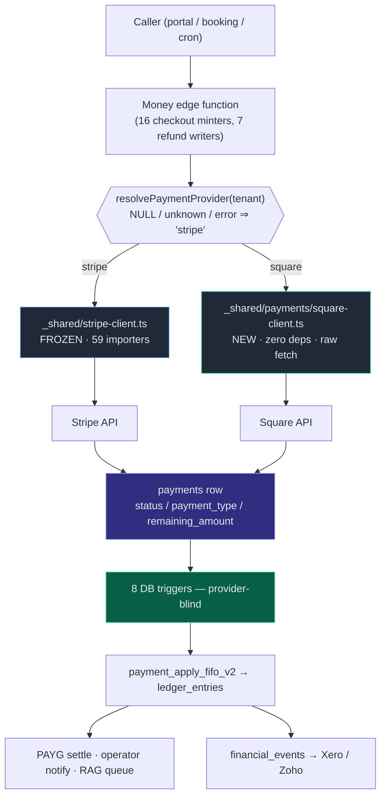
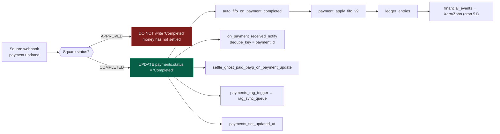
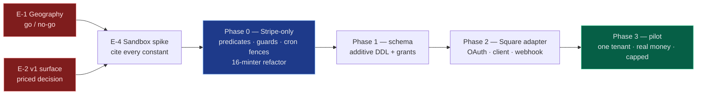

# 02 — Stripe → Square: Capability Mapping, Overlaps and Divergences

> **Status:** Normative reference for the Square workstream. Read after [01 — Stripe Surface Map](./01-STRIPE-SURFACE-MAP.md), before [03 — Stripe Safety](./03-STRIPE-SAFETY-AND-EDGE-CASES.md) and [04 — Implementation Plan](./04-IMPLEMENTATION-PLAN.md).
> **Branch:** `feature/square` · **Supabase project:** `hviqoaokxvlancmftwuo` · **Verified:** 2026-08-25
> **Audience:** the two engineers building this, plus the lead scanning §2.3, §3.4 and §6.
> Where repo migrations and the live schema disagree, **the live schema wins** and is what is documented here.

---

## TL;DR

- **An unported Stripe path does not fail for a Square tenant — it silently succeeds.** `getConnectAccountId` returns the *shared platform test Connect account* for `payment_model='own'` + `stripe_mode='test'`, which are the DB defaults a new tenant is born with. A Square tenant reaching any of the 16 unbranched checkout functions gets a real, payable Stripe checkout, the webhook marks the rental paid, FIFO allocates the money, and **nothing moves**. This inverts the usual risk model: the danger is not an error, it is a convincing fake payment.
- **This is not "one function branches."** Verified by grep: **16** in-scope functions call `checkout.sessions.create` and **7** call `refunds.create`. Branching only `create-checkout-session` leaves a Square tenant able to take a first booking payment and then silently fail on every extension, installment, PAYG reminder, invoice and auto-extend — i.e. all the recurring revenue.
- **Settlement is genuinely free.** All **8** triggers on `payments` branch only on `status` / `payment_type` / `remaining_amount`; `payment_apply_fifo_v2` never reads a Stripe column. Square inherits FIFO allocation, PAYG settlement, operator notifications and the Xero/Zoho fan-out with **zero DB changes** — and inherits the failure modes too, so `status='Completed'` must never be written for a Square payment that is only `APPROVED`.
- **The two columns that will bite are `platform_account` and `payment_provider`'s absence.** `payments.platform_account` is `NOT NULL DEFAULT 'uk'`, so every Square row is *stamped* `'uk'`, and `getStripeClientForRecord` coerces anything that is not `'uae'` to a live UK Stripe client with no error — across **25** call sites. That is the guaranteed steady state, not a mistake someone might make.
- **Three things Square cannot do that this platform assumes everywhere:** hosted-checkout card vaulting (`setup_future_usage: 'off_session'` is set **unconditionally** on every checkout), `{CHECKOUT_SESSION_ID}` templating (**45** files build a success URL around it), and a permanent OAuth credential (Square tokens expire; a refresh cron is a launch blocker, not a nicety).
- **Two code paths Square would be the FIRST to execute.** Live DB: **0** rentals on `auto_extend_charge_mode='auto_charge'` and **0** payments at `refund_status='scheduled'` with **no cron** dispatching `process-scheduled-refund`. A defect there will present as "Square is broken" while actually being long-dormant Stripe code detonating under a new customer.

---

### Confidence legend

Every claim below carries a marker. **Do not build against a ⚠️ without confirming it first** — several drive schema decisions.

| Marker | Meaning |
|---|---|
| ✅ | Verified this session against the live DB (`hviqoaokxvlancmftwuo`) or source on `feature/square`. Line numbers are real. |
| 📄 | From Square's published documentation, captured in the research pass. Re-check the version/date before it becomes a constant in code. |
| ⚠️ | **Asserted, not verified.** Load-bearing for a design decision. Must be confirmed in the Square sandbox spike before it hardens into schema or a cron interval. |

---

## Table of contents

| § | Section |
|---|---|
| [0](#0-the-estate-as-it-actually-is) | The estate, as it actually is |
| [1](#1-master-capability-mapping) | **Master capability mapping** — every Stripe capability → Square equivalent → fidelity |
| [2](#2-overlaps--where-the-code-tears) | **OVERLAPS** — every shared surface where the two paths meet, and how to handle each |
| [3](#3-divergences) | **DIVERGENCES** — Stripe-only, Square-only, and same-concept-different-numbers |
| [4](#4-required-db-schema-changes--consolidated-additive-only) | Required DB schema changes (one consolidated additive-only list) |
| [5](#5-the-square-api-surface-we-will-actually-consume) | The Square API surface we will actually consume |
| [6](#6-open-decisions-and-escalations) | Open decisions and escalations |

---

## 0. The estate, as it actually is

Every number below was queried live on 2026-08-25. They are the denominators for every risk statement in this document.

| Metric | Value | Why it matters here |
|---|---|---|
| Tenants | **52** ✅ | Blast radius of any shared-module change. |
| `payment_model = 'own'` | **42** ✅ | The majority path. A Square tenant inherits `'own'` from the DB default. |
| `payment_model = 'managed'` | **10** ✅ | Legacy Express. Not dead code — do not delete the branch. |
| `own_stripe_account_id` set | **21** ✅ | Tenants actually charging on their own account today. |
| `stripe_mode = 'live'` | **26** ✅ | |
| `deposit_charge_enabled = true` | **1** ✅ | The charged-deposit model Square is supposed to use has ~zero production mileage. |
| `security_deposit_enabled = true` | **51** ✅ | Deposits are the default product; the *hold* is how they are taken today. |
| `payments` rows | **1,025** ✅ | |
| … with `stripe_checkout_session_id` | **907** ✅ | |
| … with `stripe_payment_intent_id` | **514** ✅ | |
| … with **neither** | **114** ✅ | Cash / Zelle / manual. Any tenant-level provider check breaks these. |
| `rentals` with a live deposit hold | **29** ✅ | |
| `deposit_hold_links` rows | **75** ✅ | |
| `rentals` on `auto_charge` | **0** ✅ | **The auto-charge branch has never run in production.** |
| `payments` at `refund_status='scheduled'` | **0** ✅ | **The scheduled-refund pipeline is dead** — and no cron dispatches it. |
| Distinct `tenants.currency_code` | **1** (USD) ✅ | Currency divergence is latent, not live. |
| Active `pg_cron` jobs | **28** ✅ | Repo migration files are an inaccurate map — always check `cron.job`. |
| `tenants` columns / anon column grants | **262 / 236** ✅ | `anon` has **no table-level SELECT** on `tenants`. |
| `payments` RLS / anon table SELECT | **disabled / TRUE** ✅ | New `payments` columns are world-readable with no grant needed. |
| `tenants.payment_provider`, `.country`, `.square_*` | **do not exist** ✅ | |

---

## 1. Master capability mapping

Fidelity vocabulary: **exact** (drop-in), **close** (rename/reshape only), **partial** (works, but a constraint or semantic differs), **none** (no equivalent — must be redesigned or scoped out).

### 1.1 Account connection / OAuth

| Stripe today | Square equivalent | Fidelity | Notes |
|---|---|---|---|
| `GET connect.stripe.com/oauth/authorize?…&scope=read_write` | `GET connect.squareup.com/oauth2/authorize?client_id&scope&state&session=false` 📄 | close | Same hand-built URL, same `state`. Square `scope` is a **space-separated permission list**, not `read_write`; webhook *delivery* is gated per-event by granted scope. `session=false` is production-only ⚠️ — so the sandbox rehearsal cannot exercise the production account-picker. |
| `stripe.oauth.token({grant_type:'authorization_code'})` → **only** `stripe_user_id` consumed; access/refresh tokens discarded ✅ | `POST /oauth2/token` → `{access_token, refresh_token, merchant_id, expires_at}` 📄 | partial | **The structural divergence.** Stripe hands back a permanent identifier and no secret. Square hands back a *credential* with an expiry. Three of four returned fields have nowhere to live in the current schema. |
| `stripe.accounts.retrieve()` → `charges_enabled` gate before flipping the tenant live ✅ | No single field. Composite: `GET /v2/merchants/{id}` + `GET /v2/locations` filtered to `status='ACTIVE'` **and** `capabilities ∋ CREDIT_CARD_PROCESSING` 📄 | partial | Must be reimplemented, never skipped. Never activate a tenant on the strength of a token alone. |
| `stripe.accounts.create({type:'express'})` + AccountLinks | **NONE** 📄 | none | No API creates a Square seller. The operator signs up at squareup.com out-of-band, *then* authorizes. Onboarding gains human latency — and the 30-minute signed-state TTL in [`stripe-oauth-start`](../../supabase/functions/stripe-oauth-start/index.ts) will routinely expire on that path. |
| `{ stripeAccount }` request option (`Stripe-Account` header) | **NONE** — the seller's bearer token *is* the merchant scope 📄 | none | Inverts credential resolution from *pure function over env vars* → *DB read + decrypt + refresh-if-near-expiry*. This is why `_shared/stripe-client.ts` must not be generalised. |
| `account.application.deauthorized` webhook | `oauth.authorization.revoked` webhook 📄 | exact | Same purpose, same handling: match on `merchant_id`, mark disconnected, purge tokens. |
| Token lifetime: permanent ✅ | Access token expires in **30 days**; refresh every **≤7 days** regardless of activity 📄 | none | Refresh cron is a **launch blocker**. Use the **code flow** (refresh tokens do not expire), never PKCE ⚠️ (single-use rotation is a data-loss hazard in a serverless function). |
| No location concept | `location_id` — required on `CreatePaymentLink.quick_pay`, defaults to `main` on `CreatePayment` ⚠️ | none | Brand-new concept. Carries its own `currency`, `status` and `capabilities`. The seller can deactivate the stored location out from under us. |

### 1.2 Checkout and payment links

| Stripe today | Square equivalent | Fidelity | Notes |
|---|---|---|---|
| `checkout.sessions.create({mode:'payment'})` — **16 in-scope call sites** ✅ | `POST /v2/online-checkout/payment-links` in **`order` mode** 📄 | close | Both return a hosted URL, so the `{ url }` contract every frontend reads survives. `quick_pay` mode is **unusable for us** — it accepts only `{name, price_money, location_id}` and has nowhere to put a rental id ⚠️. |
| `session.url` → `window.location.href` | `payment_link.url` (short) + `long_url` | exact | The one genuinely free part of the port. |
| `client_reference_id` (200 chars) ✅ | `order.reference_id` (**40 chars**) ⚠️ | partial | A bare UUID is 36 and fits; `rental_<uuid>` at 43 does **not**. The entire correlation design rests on this number — confirm it first. |
| `metadata` — **6 base + up to 9 optional = 15 keys** ([`create-checkout-session/index.ts:296-318`](../../supabase/functions/create-checkout-session/index.ts)) ✅ | `order.metadata` — 10 entries, keys ≤60 chars `[a-zA-Z0-9_-]`, values ≤255 ⚠️ | partial | **Every** in-scope minter overflows. `target_categories` is `JSON.stringify`'d and can exceed 255 alone. Do not port the contract — persist it locally (§2.3, O-12). |
| `success_url` with `{CHECKOUT_SESSION_ID}` — **45 files** ✅ (15 edge fns, 30 app files) | `checkout_options.redirect_url`, **no template substitution** ⚠️ | none | Sandbox appends nothing; even in production only `orderId` is confirmed ⚠️. Bake our own identifiers into the URL at creation and treat provider-appended params as untrusted. |
| `cancel_url` — set on every session ✅ | **NONE** — success-only redirect ⚠️ | none | Abandonment becomes invisible. On Stripe, `checkout.session.expired` *cancels the rental and frees the vehicle*; on Square nothing does. |
| Session self-expires ~24h + `checkout.session.expired` ✅ | **NONE** — links never self-expire; `DeletePaymentLink` is the only invalidation ⚠️ | none | Net-new expiry cron. Also breaks [`void-payment-link`](../../supabase/functions/void-payment-link/index.ts), which requires `stripe_checkout_session_id` to exist. |
| `payment_intent_data.setup_future_usage:'off_session'` — **unconditional** ([`:280`](../../supabase/functions/create-checkout-session/index.ts)) ✅ | **NONE** on hosted links; `POST /v2/cards` from a ≤24h-old payment id, excluding wallet payers ⚠️ | none | Every checkout vaults a card for free today. Losing it removes the card behind auto-extend, installments, PAYG top-ups, excess-mileage and deposit holds — not just installments. |
| `custom_text.submit.message` — deposit disclosure next to the Pay button ✅ | **NONE** 📄 | none | This is a **consent surface**, not decoration. Must move to an interstitial page we own — which is also the `cancel_url` substitute. |

### 1.3 Payments and deposits

| Stripe today | Square equivalent | Fidelity | Notes |
|---|---|---|---|
| `paymentIntents.create({off_session, confirm})` — installments, auto-extend ✅ | `POST /v2/payments` with `source_id='ccof:…'`, `customer_id` (required), `customer_details.customer_initiated=false` 📄 | partial | Square's SCA docs explicitly bless seller-initiated recurring charges. **But there is nowhere to store a Square customer or card** — `customers` has only `stripe_customer_id{,_uk,_uae}` ✅. Blocked on schema. |
| `capture_method:'manual'` + the whole `deposit_hold_*` machine (29 live holds) ✅ | `autocomplete:false` exists but is **deliberately unused** | none | Scoped out by the lead — *"deposit tak hi raho."* `autocomplete` defaults to `true`, so the safe behaviour is to never send the parameter. Square's online hold ceiling is 7 days and cannot be extended ⚠️, so the chain-refresh architecture could not be rebuilt anyway. |
| Deposit as an immediate charge (`deposit_charge_enabled`) ✅ | `CreatePayment` with `autocomplete:true` | exact | "Essentially just a payment." Reuse [`_shared/deposit-amount.ts`](../../supabase/functions/_shared/deposit-amount.ts) **verbatim** — 1 importer, 100% provider-neutral ✅. |
| `paymentIntents.retrieve` → `amount_refunded` headroom read ✅ | `GET /v2/payments/{id}` → `total_money`, `refunded_money`, `refund_ids[]` 📄 | close | Square additionally offers `payment_version_token` optimistic concurrency — see §3.2. |
| `PaymentIntent` status machine incl. `requires_action` ✅ | Flat: `APPROVED / PENDING / COMPLETED / CANCELED / FAILED` 📄 | partial | No resumable `next_action`; SCA is resolved client-side before the API is called. Existing `requires_action` branches collapse into ordinary error handling. |
| — | `CancelPaymentByIdempotencyKey` 📄 | none (Square-only) | Voids a payment whose id was lost to a timeout. Genuinely useful for edge-function timeouts. |

### 1.4 Refunds

| Stripe today | Square equivalent | Fidelity | Notes |
|---|---|---|---|
| `refunds.create({payment_intent, amount})` — **7 in-scope call sites** ✅ | `POST /v2/refunds` `{idempotency_key, payment_id, amount_money, reason}` 📄 | close | The mapping is clean; the **scope** is the problem. See §2.3, O-4. |
| Omitting `amount` = refund the full remainder ✅ (`cancel-rental-refund`, `auto-extend-rentals`) | `amount_money` is **required** 📄 | partial | The Square branch must compute the remaining balance itself, which re-opens a read-then-write race that Stripe's omit-amount form avoided. |
| No idempotency key on **any** refund call site ✅ | `idempotency_key` **required**, ≤45 chars ⚠️ | none | The concept must be invented for refunds. Existing repo key schemes are 61–91 chars and all overflow. |
| `metadata {category, rental_id, refund_reason}` ✅ | **No metadata on a refund**; `reason` is free text ≤192 chars ⚠️ | none | The reconciliation breadcrumb must live in `ledger_entries` / `payments` columns instead. |
| Refund usually settles inline (`succeeded`) ✅ | `PENDING → COMPLETED \| FAILED \| REJECTED`, PENDING up to **14 days** ⚠️ | partial | `REJECTED` = seller balance *and* linked bank both came up short — an operator-billing problem, not a card problem. It has nowhere to land in `payments_refund_status_check` ✅. |
| No universal age limit for card refunds | **1-year hard window** → `PAYMENT_NOT_REFUNDABLE` ⚠️ | none | Dated, not hypothetical: deposits are captured at rental start and monthly rentals auto-extend indefinitely. |
| Unlimited partials | **20 refunds per payment id** ⚠️; only one pending refund at a time ⚠️ | partial | `process-refund` refunds *per category* against what is routinely one shared payment. The one-pending rule is **unverified** — design defensively, do not cite it as fact. |
| Cancel/undo a refund | **NONE** — the Refunds API is 3 endpoints 📄 | none | Any "undo refund" affordance must be hard-disabled for Square, and `schedule-refund`'s cancel window must close *before* the provider call. |
| `reverse_transfer` / `refund_application_fee` | `app_fee_money` — **moot** | none | ✅ Repo-wide grep for `application_fee`, `transfer_data`, `on_behalf_of` returns **zero hits**. The platform takes no cut. Do not request `PAYMENTS_WRITE_ADDITIONAL_RECIPIENTS`. |

### 1.5 Webhooks and settlement

| Stripe today | Square equivalent | Fidelity | Notes |
|---|---|---|---|
| `Stripe-Signature`: HMAC over `timestamp + "." + rawBody`, 300s replay tolerance ✅ | `x-square-hmacsha256-signature`: HMAC-SHA256 over **`notification_url + rawBody`**, base64, **no timestamp** 📄 | none | Three consequences: the URL must come from config (never `req.url` — Supabase sits behind a proxy); there is **no replay window**, so `event_id` dedupe is the only defence; the key is used as a **raw UTF-8 string, not base64-decoded** ⚠️ (the common forum advice is for the deprecated SHA-1 scheme and produces 100% failure). |
| `checkout.session.completed` — one ordered event carrying all routing metadata ✅ | **NONE.** `payment.created` + `payment.updated` + `order.updated`, unordered, 2–4 per link ⚠️ | none | The single largest behavioural divergence. Events fire for *every* payment on that seller's account (POS, invoices, other apps), so the handler must self-filter on recognised order ids. |
| Per-endpoint secret; endpoint auto-disable is scoped to that endpoint ✅ | **One application-level subscription** for all merchants, one signature key, one auto-disable counter 📄 | none | Concentrated blast radius. Rotation is an instant cutover with no dual-key grace ⚠️ — accept a *list* of candidate keys from day one. |
| Retries ~3 days ✅ | 11 attempts over 24h, then discarded; no manual resend ⚠️ | partial | Weaker than Stripe — and see O-6: Square has **no** recovery cron either. |
| ~30s response budget ✅ | ~10s; a slow ack causes a **duplicate**, not just a retry ⚠️ | partial | [`stripe-webhook-live`](../../supabase/functions/stripe-webhook-live/index.ts) deliberately blocks up to 15s (`HOLD_SYNC_TIMEOUT_MS`). That pattern cannot be copied. |
| Settlement: `payments.status` → 8 DB triggers → `payment_apply_fifo_v2` ✅ | **IDENTICAL — reuse verbatim** ✅ | exact | The best news in the whole integration. See §2.4. |

### 1.6 Cards on file and off-session charges

| Stripe today | Square equivalent | Fidelity | Notes |
|---|---|---|---|
| `SetupIntent` (two-phase, `client_secret`, resumable) ✅ | `POST /v2/cards` — single synchronous call, `$0` verification 📄 | partial | No intent object, no resumable state. SCA is fully resolved client-side by `Card.tokenize()` before the server is touched. |
| Vault free at checkout via `setup_future_usage` ✅ | Separate `CreateCard` call within **24h** of an `AUTHORIZED`/`CAPTURED` payment ⚠️ | none | Fails silently for Apple Pay / Google Pay / Cash App / existing card-on-file payers ⚠️ — exactly the customers most likely to use a hosted page. |
| `customer.invoice_settings.default_payment_method` ✅ | **NONE** — no default-PM field; `Customer.cards` retired ⚠️ | none | `ListCards(customer_id)` and persist the choice ourselves. Our DB becomes the authority on "which card", which it is not today. |
| Detach a PaymentMethod (reversible) | `DisableCard` — **irreversible** ⚠️ | partial | Any "remove card" UI needs a confirm step Stripe never warranted. |
| `Mandate` object (recorded MIT authorization) | **NONE** 📄 | none | `customer_initiated:false` is an assertion we make per request with no server-side proof. Chargeback evidence must be retained by us. |

### 1.7 Environment and mode model

| Stripe today | Square equivalent | Fidelity | Notes |
|---|---|---|---|
| `tenants.stripe_mode` `'test'\|'live'` on one account; shared `STRIPE_TEST_CONNECT_ACCOUNT_ID` ✅ | Sandbox is a **separate host, application id, secret, token, webhook subscription and signature key** 📄 | none | A real Square seller has **no test mode**. `square_mode='sandbox'` can only ever mean "a platform-owned Square Sandbox seller". |
| Mode is invisible to the browser (one `js.stripe.com`) ✅ | Web Payments SDK **script URL differs by mode** ⚠️ | none | Mode leaks into the client. A hardcoded `<script src>` silently gives sandbox tenants the production SDK or vice versa. |
| Payment links share one domain | `sandbox.square.link` vs `square.link` ⚠️ | partial | Helpfully, a stale sandbox link is visibly identifiable in the wild. |
| 46+ countries | **8**: AU, CA, FR, IE, JP, ES, UK, US 📄 | none | The UAE is not among them. See §6 — this is a go/no-go, not an implementation detail. |
| Multi-currency per account | **One currency, fixed by `Location.currency`** ⚠️ | none | ✅ [`create-checkout-session:56`](../../supabase/functions/create-checkout-session/index.ts) defaults `currencyCode='gbp'` and **lowercases** it; Square requires uppercase ISO and rejects a mismatch. All 52 tenants are USD ✅, so this is latent but certain for the first non-US seller. |

### 1.8 Transport: money, idempotency, errors

| Stripe today | Square equivalent | Fidelity | Notes |
|---|---|---|---|
| `amount` (int) + `currency` (lowercase) ✅ | `Money { amount: int64, currency: UPPERCASE ISO }` 📄 | close | Same minor-unit convention, same zero-decimal JPY handling. Boxed, and case-inverted. |
| `Idempotency-Key` **header**, 255 chars ✅ | `idempotency_key` **body field**, ≤45 (192 on payment links) ⚠️ | partial | Verified repo keys: `charge-saved-card-<uuid>-<uuid>` = 91, deposit-rollover ≈ 78, deposit-refresh ≈ 61. All overflow. Stripe documents 24h key retention; **Square documents none** ⚠️ — treat keys as permanently unique. |
| Single `error` object: `type` / `code` / `decline_code` / `message` / `param` ✅ | `errors[]` **array** of `{category, code, detail, field}`; HTTP status matches the **first** error 📄 | partial | Never read `errors[0]` alone. Never surface `detail` to a renter — Square documents it as developer-facing. Branch on the error **code**, never the HTTP status (`PAYMENT_NOT_REFUNDABLE_DUE_TO_DISPUTE` reportedly returns 404 ⚠️). |
| `Stripe-Version` pinned in code (`apiVersion:'2023-10-16'`) ✅ | `Square-Version` header; **omitting it defers to a Developer Console setting** 📄 | close | A dashboard toggle any teammate can change would alter live payment behaviour with no deploy and no audit trail. Pin it as a code-reviewed constant. |
| `esm.sh/stripe@14.21.0?target=deno` ✅ | **Raw `fetch` — no SDK** | — | Square's Node SDK types money as `bigint` ⚠️; [`_shared/cors.ts::jsonResponse`](../../supabase/functions/_shared/cors.ts) is a bare `JSON.stringify` ✅, so a BigInt throws **after** the money moved. The stronger argument is architectural: a dependency-free client keeps the Stripe module graph provably unchanged. |

---

## 2. OVERLAPS — where the code tears

This is the section the lead asked for: *jahan par code phat jayega*.

### 2.1 The branch architecture

The rule that makes the rest of this section tractable: **resolve the provider high, branch once, and let the shared settlement rails do the rest.**



Three properties make this safe, and each is a rule:

1. **The branch is an early `return`, never an inline `if`.** Square code is only ever reachable *above* untouched Stripe code.
2. **NULL means Stripe.** `provider === 'square' ? 'square' : 'stripe'` — a positive test, never a negative one. A dropped column, a partial deploy or a transient DB error all resolve to the path 52 tenants are on.
3. **Below the `payments` row, there is no branch at all.** That is not a design choice; it is a verified property of the schema (§2.4).

### 2.2 Overlap register

Every shared surface, ranked by what happens if it is handled carelessly.

| # | Surface | Kind | Failure if mishandled | Severity |
|---|---|---|---|---|
| **O-1** | [`getConnectAccountId`](../../supabase/functions/_shared/stripe-client.ts) — 48 files ✅ | shared module | Square tenant gets a **working Stripe checkout on the shared platform test account**. Fake payment, marked paid. | 🔴 critical |
| **O-2** | `payments.platform_account` + `getStripeClientForRecord` — 25 files ✅ | column + module | Square row stamped `'uk'` → live UK Stripe keys, silently, as the *normal* case. | 🔴 critical |
| **O-3** | The **16** `checkout.sessions.create` sites ✅ | edge functions | Square tenant takes the first booking payment, then silently fails on all recurring revenue. | 🔴 critical |
| **O-4** | The **7** `refunds.create` sites ✅ | edge functions | Refund *recorded* in the ledger, customer notified, money never returned. | 🔴 critical |
| **O-5** | 8 triggers on `payments`; `status` is the settlement key ✅ | table | Writing `Completed` for an `APPROVED` Square payment allocates money that has not settled. | 🔴 critical |
| **O-6** | [`recover-pending-stripe-payments`](../../supabase/functions/recover-pending-stripe-payments/index.ts) — cron 34, **every minute**, `.limit(100)` ✅ | cron | Square rows in the shared column **starve Stripe recovery**; Square gets no safety net at all. | 🔴 critical |
| **O-7** | `stripe_payment_intent_id` as the "is this electronic money?" predicate — 35 edge fns + 20 app files ✅ | column semantics | Operator is *offered* Reverse/Undo on real Square money; rental breakdown double-counts it. | 🔴 critical |
| **O-8** | `tenants` column grants (236/262, no table grant) + `payments` RLS **off** with anon SELECT ✅ | grants | One ungranted column 403s every booking site; new `payments.square_*` columns are world-readable by default. | 🔴 critical |
| **O-9** | [`_shared/migration-progress.ts:46`](../../supabase/functions/_shared/migration-progress.ts) + 5 readiness derivations ✅ | module + UI | Square tenant permanently "not migrated": blocker never clears, reward never granted, wrong email sent. | 🟠 high |
| **O-10** | `PlatformAccount` union + [`_shared/customer-account.ts`](../../supabase/functions/_shared/customer-account.ts) — 10 importers ✅ | type + module | Widening the union opens a path from Square code straight into a Stripe secret-key lookup. | 🟠 high |
| **O-11** | `verifyState()` in [`stripe-oauth-callback`](../../supabase/functions/stripe-oauth-callback/index.ts) ✅ | module | Hard-validates `mode ∈ {test,live}` — a verbatim lift **rejects every Square state**. | 🟠 high |
| **O-12** | Metadata + `{CHECKOUT_SESSION_ID}` return contract — 45 files ✅ | contract | Dropped keys mean a paid extension that never applies; un-substituted token strands the customer. | 🟠 high |
| **O-13** | `_shared/subscription-stripe.ts` (21 importers) + credit wallet ✅ | module | Merging the two client factories moves Drive247's own SaaS revenue onto an operator's till. | 🟠 high |
| **O-14** | `_shared/deposit-hold-auth.ts` `allowUnidentifiedAutomation` — 6 importers ✅ | module | A bounded hole for a *reversible* hold becomes an unauthenticated mover of *irreversible* money. | 🟠 high |
| **O-15** | 4 hand-copied `types.ts` files (portal, booking, admin, **bonzah**) ✅ | generated types | `admin` runs `strict:true` without `ignoreBuildErrors` — a stale copy breaks an unrelated app's build. | 🟡 medium |

### 2.3 The tears that will actually happen

---

#### O-1 — `getConnectAccountId` fails **open**, not closed

**Verified source** ([`_shared/stripe-client.ts`](../../supabase/functions/_shared/stripe-client.ts)):

```ts
if (tenant.payment_model === 'own') {
  if (tenant.stripe_mode === 'test') {
    // Setup phase: … let their TEST bookings run on the shared test Connect account
    return tenant.own_stripe_test_account_id
        || Deno.env.get('STRIPE_TEST_CONNECT_ACCOUNT_ID')
        || null;
  }
  if (!tenant.own_stripe_account_id) { throw new Error(/* fail loud */); }
  return tenant.own_stripe_account_id;
}
```

`tenants.payment_model` is `NOT NULL DEFAULT 'own'` and `tenants.stripe_mode` is `NOT NULL DEFAULT 'test'` ✅. **A Square tenant is born into the first branch.** So the failure mode is not an exception — it is a real, payable Stripe test-mode checkout on Drive247's shared test seller, settled by `stripe-webhook-test`, FIFO-allocated, with the rental marked paid and a car handed over for nothing.

The mirror case is worse in a different way: if that tenant's `stripe_mode` is ever flipped to `'live'`, the same function **throws** — inside 11 multi-tenant cron sweeps that also process real Stripe tenants.

**Graceful handling.** Three layers, all required:

1. **Fail closed at the choke point.** One guard as the first statement of `getConnectAccountId`: throw a named `ProviderNotStripeError` when `payment_provider === 'square'`. Because `payment_provider` is deliberately **not** added to `TENANT_STRIPE_COLUMNS`, and 44 of the 48 callers hand-roll their own select ✅, the field arrives `undefined` at every existing call site — the guard is a **provable no-op** for all 52 tenants. Pin that with a golden test over the six real tenant shapes.
2. **Defend at the query, not only the helper.** Because most callers never select the column, the guard cannot fire where it matters most. Every tenant-sweeping cron and tenant-scoped minter gets `.eq('payment_provider','stripe')`. With the column `NOT NULL DEFAULT 'stripe'`, that filter is verifiably a no-op against all 52 tenants and all 907 session-bearing rows today.
3. **Sequence the launch.** No tenant may carry `payment_provider='square'` until the money paths are branched. The provider option ships behind a flag, dark by default.

> **Do not** "fix" this by returning `null` instead of throwing. At essentially every call site the value feeds `connectAccountId ? { stripeAccount } : undefined` — so `null` does not skip the Stripe call, it **redirects it to the Drive247 platform balance**. [`_shared/deposit-hold-refresh.ts`](../../supabase/functions/_shared/deposit-hold-refresh.ts) also *catches* this throw and converts it to `untouched('config_unavailable')`; removing it deletes a safety net.

---

#### O-2 — `platform_account` is `NOT NULL DEFAULT 'uk'`, so Square rows are *stamped* Stripe

```ts
// _shared/stripe-client.ts — verified verbatim
const account: PlatformAccount = record.platform_account === 'uae' ? 'uae' : 'uk';
```

There is **no default case and no NULL escape** ✅. Every Square `payments` row will carry `'uk'`, and all 25 `getStripeClientForRecord` callers will be handed a live legacy-UK Stripe client for Square money — as the **guaranteed steady state**, not as a mistake. Reporting that groups by `platform_account` will also count Square revenue as legacy-UK Stripe revenue.

**Graceful handling.**
- **Do not widen** `payments_platform_account_check` ✅ (`CHECK (platform_account = ANY (ARRAY['uk','uae']))`). Adding `'square'` *legalises* a value the router silently coerces — the opposite of the intended loud failure.
- Add `payments.payment_provider` as a **separate** column and let Square rows keep the inert `'uk'` stamp.
- Add one guard inside `getStripeClientForRecord`: throw when `record.payment_provider === 'square'`. Unreachable for all 1,025 existing rows ✅, therefore provably behaviour-identical, and it converts a wrong-keys charge into a loud error.
- Split revenue reporting by `payment_provider` so the meaningless `'uk'` stamp never becomes a wrong number in a dashboard.

---

#### O-3 — There is no single checkout chokepoint. There are sixteen.

Verified by grep ✅ — `checkout.sessions.create` appears in 19 files; removing the 3 platform-billing ones leaves **16 in scope**:

| Function | Trigger | Notes |
|---|---|---|
| `create-checkout-session` | booking + portal | The one the plan usually branches. |
| `create-extension-checkout` | portal | Persists `rental_extensions.checkout_url` + session id. |
| `create-installment-checkout` | booking | |
| `create-upfront-checkout` | booking | |
| `create-preauth-checkout` | booking | Hold model — out of scope, must **refuse** for Square. |
| `create-hold-checkout` | portal | Same. |
| `create-credit-checkout` | portal | Reached from `collect-payment-dialog`. |
| `installment-pay-link` | magic link | 0 live rows — candidate for retirement. |
| `send-invoice-email` | portal | Self-minting fallback branch is live. |
| `send-excess-mileage-payment-link` | portal | |
| `send-payg-reminders` | **cron 33, daily** | |
| `send-payg-manual-reminder` | portal | Also has **zero authorization** ✅. |
| `send-auto-extension-reminder` | **cron 55, daily** | |
| `auto-extend-rentals` | **cron 54, every 15 min** | Also creates PaymentIntents *and* refunds. |
| `sandbox-send-payg-reminders` | staging fork | Hand-maintained copy. |
| `sandbox-auto-extend-rentals` | staging fork | Hand-maintained copy. |

Four are **cron-driven with no human in the loop**. Combined with O-1, a Square tenant with PAYG enabled (the default for all 52 tenants) receives a cron-generated *Stripe* pay-link emailed to their customer, nightly, on the platform's shared test account.

**Graceful handling.** Do not branch sixteen times.

1. Extract `_shared/payments/payment-link.ts` owning provider resolution, the five-predicate `persistPaymentRow` guard, and the provider call.
2. Migrate the 16 call sites **one per deploy, Stripe-only, byte-identical, with no Square code present**, each verified in production before the next.
3. Only when all 16 route through the shared module does the Square arm get added — **in one place**.
4. Until then, O-1's guard makes an unmigrated path fail loudly rather than transact.
5. In every batch loop, a Square tenant must be **skipped with a counted log**, never thrown past — a throw that escapes the loop kills that night's run for the Stripe tenants queued behind it. *That* is the concrete Stripe-regression mechanism.

---

#### O-4 — Refunds are in scope, and the else-branch is worse than a failure

Seven in-scope `refunds.create` sites ✅: `process-refund`, `process-scheduled-refund`, `cancel-rental-refund`, `refund-installment-payments`, `deduct-from-deposit`, `reject-rental`, `auto-extend-rentals`.

Each guards on `payment.stripe_payment_intent_id`. For a Square payment that is `NULL`, so control falls to an *else* branch that, in several functions, **records the refund anyway**:

- `process-refund` logs *"No Stripe payment found, recording as manual refund"*, writes negative `Refund` ledger entries, flips `payments.status`, and fires `on_refund_processed_notify` — which **emails the customer that their refund was processed**. No money leaves Square.
- `cancel-rental-refund` and `deduct-from-deposit` have the same shape; `deduct-from-deposit` even re-implements the comma-joined `stripe_refund_id` accumulator independently.
- `reject-rental` writes `refund_status:'pending_manual'` and `status:'Cancelled'` — **neither value is permitted** by the live CHECKs ✅ — with no error check, so the write silently fails, no ledger row is created, and the rejection reports success while freeing the vehicle over unrefunded money.

**Graceful handling.**
- **First deliverable is refusal, not implementation.** Every one of the seven must *fail closed* for `payment_provider='square'` before any Square payment can exist. Never silently record a refund that did not happen.
- Route all seven through one `_shared/payments` refund adapter selected by the **payment record's** provider, never the tenant's current provider.
- Do **not** write `payments.status='Refunded'` on a Square `200` — that fires `notify_refund_processed`, which dedupes one-shot on payment id, so a later `REJECTED` can never be communicated. Use `refund_status='processing'` plus a raw provider-state column and wait for the webhook.
- File `reject-rental`'s two constraint violations as a **separate pre-existing bug**. Do not fix a money path inside a provider migration.

---

#### O-5 — Settlement is driven by `payments.status`, and Square inherits the failure modes with it

The 8 triggers ✅: `auto_fifo_on_payment_insert`, `auto_fifo_on_payment_completed`, `on_payment_received_notify`, `on_refund_processed_notify`, `settle_ghost_paid_payg_on_payment_insert`, `settle_ghost_paid_payg_on_payment_update`, `payments_rag_trigger`, `payments_set_updated_at`.



Two hazards follow directly:

- An **INSERT** additionally fires `auto_fifo_on_payment_insert` and `settle_ghost_paid_payg_on_payment_insert`, so a Square recovery path that inserts instead of updating **double-allocates**.
- `notify_refund_processed` dedupes one-shot on payment id, so it **structurally cannot** emit a correction when a PENDING Square refund later flips to REJECTED.

**Graceful handling.** Modify **no** trigger — they are load-bearing for 1,025 live rows. Constrain what the Square path *writes*: ratify a Square-status → `payments.status` mapping table before the webhook is written; mirror the terminal UPDATE shape byte-for-byte; and emit refund rejection through a **new** notification type with its own emitter.

---

#### O-6 — The recovery cron is a shared bounded queue

[`recover-pending-stripe-payments`](../../supabase/functions/recover-pending-stripe-payments/index.ts) runs **every minute** (cron 34 ✅) with two passes, both `.limit(100)` and both filtered on `stripe_checkout_session_id IS NOT NULL` ✅. It is the only webhook-miss safety net in the system.

Two directions of harm:

- **Square gets nothing.** Square rows are invisible to it — while Square's delivery guarantee is *weaker* (24h, 11 attempts, no manual resend ⚠️). A missed Square webhook is unrecoverable.
- **Stripe can be starved.** If anyone stores a Square link id in `stripe_checkout_session_id` — the tempting shortcut — unresolvable Square rows occupy that 100-row window every minute and genuine Stripe recoveries stop happening, silently, exactly when the webhook has already failed.

**Graceful handling.** Separate columns (`square_order_id`, `square_payment_link_id`) so both passes self-exclude with **zero cron change**; add `.eq('payment_provider','stripe')` anyway as intent documentation; enforce with a DB `CHECK (payment_provider <> 'square' OR stripe_checkout_session_id IS NULL)`; and build a Square Events-API reconciler as a **launch blocker**, not a phase-2 item.

> Incidentally: all 332 `Pending` rows carry a session id, and 325 of them are already outside the 24h window ✅ — recovered by nothing. Note it; do not widen the window inside this workstream.

---

#### O-7 — "Is this electronic money?" is answered by a Stripe column name

The predicate `stripe_payment_intent_id != null` is the de-facto definition of *real card money* across the product. Verified sites:

| Layer | Sites |
|---|---|
| Edge functions | `undo-manual-payment` (hard DELETE), `reverse-payment`, `void-payment-link` (×2), `apply-payment` capture guard, `process-refund` (×3), `cancel-rental-refund` (×2), `deduct-from-deposit` (×2), `process-scheduled-refund`, `process-installment-payment`, `refund-installment-payments` (×2), `backfill-payment-intent-ids`, `audit-stripe-payment`, `fetch-payment-intent`, both booking webhooks — **35 files** ✅ |
| Portal / booking | `use-payment-links.ts`, `use-rental-manual-paid-breakdown.ts`, `payments/page.tsx` (×4 incl. the JSX render gate), `use-payments-data.ts`, `use-pending-bookings.ts`, `rejection-dialog.tsx`, `customers/[id]/page.tsx`, `rentals/[id]/page.tsx` (×2), `booking-success/page.tsx` — **20 files** ✅ |

For a Square payment every one of these returns "manual/cash". The operator is **offered** Reverse and Undo on real money; `use-rental-manual-paid-breakdown` counts it as manually paid and double-counts the rental total.

**Graceful handling.** One shared predicate exported on **both** sides (`_shared/payments/predicates.ts` and `apps/portal/src/lib/payment-predicates.ts`), shipped in **one commit** — [`void-payment-link`](../../supabase/functions/void-payment-link/index.ts) carries a source comment saying it mirrors `use-payment-links.isCaptured()` *exactly* so UI and server agree, so they are a matched pair. Widen only in the safe direction: adding a disjunct to an *exclusion* can only classify **fewer** rows as reversible. Hide the destructive affordances for Square rather than refusing them after a click — an offered-then-refused button trains staff to retry.

> Two corrections worth carrying: `void-payment-link`'s `isCaptured` is a **composite** (`capture_status`/`paid_at`/status clause), not a bare null-check — preserve the other terms. And `apply-payment`'s capture guard also requires `stripe_checkout_session_id` to be *set*, so it does not misfire for Square — it simply **never fires**, leaving Square with no capture guard at all. That needs its own Square-shaped condition.

---

#### O-8 — Grants: one ungranted column takes down every booking site

Two asymmetric facts, both verified ✅:

| Table | RLS | `anon` access |
|---|---|---|
| `tenants` | **enabled** | **No table SELECT.** Column-level SELECT on **236 of 262** columns. |
| `payments` | **disabled** | **Table-level SELECT, INSERT, UPDATE, DELETE.** |

- On `tenants`, PostgREST fails the **entire** query if one requested column lacks a grant. `apps/booking`'s `TenantContext` selects ~135 columns in one statement, so a new ungranted column drops **all 52 booking sites** to default branding. This has already happened once (`customer_theme_mode`).
- On `payments`, the inverse: a new column is **immediately world-readable** with no grant required. Storing a Square payment-link URL there would publish a bearer link to pay an invoice.

**Graceful handling.** In the *same* migration as every `ADD COLUMN`:
- `GRANT SELECT (payment_provider, square_mode, country) ON public.tenants TO anon, authenticated;`
- `REVOKE SELECT (square_payment_id, square_order_id, square_payment_link_id, square_refund_id) ON public.payments FROM anon;`
- **Never** put a Square credential on `tenants` — it goes in `square_connections` with RLS **enabled**, mirroring `accounting_connections` ✅.
- Verify by executing the literal anon select before any frontend change ships. Also neutralise [`apps/booking/src/lib/tenantQueries.ts`](../../apps/booking/src/lib/tenantQueries.ts)'s `.select('*')` on `tenants` — currently zero callers, but it would 403 today and the failure will be blamed on whatever column was added last.

---

#### O-9 — Readiness and migration state are derived from `own_stripe_account_id`

```ts
// _shared/migration-progress.ts — verified verbatim
export function isStripeConnected(t: Partial<TenantProgressRow>): boolean {
  return !!t.own_stripe_account_id;
}
```

It **ignores the task key**. Calling `onMigrationTaskComplete(supabase, tenantId, 'stripe')` from a Square callback therefore never completes: `migration_blocker` is never cleared, the 100 reward credits are never granted, and the admin receives an email captioned *"Stripe connected"* for a Square connection.

The same predicate shape recurs across **five** surfaces ✅ — `use-migration-blocker.ts`, `use-migration-status.ts`, `migration-view.ts`, `use-setup-status.ts`, and the admin rentals list — plus `v_tenant_readiness`, whose `stripe_ready` is `AND`-ed into `overall_ready`. A Square tenant therefore reads *permanently not ready*, is nagged forever, and — since 8 of 52 tenants already carry `migration_blocker='hard'` ✅ — one super-admin click could lock a Square operator out of their own dashboard with an instruction they cannot satisfy.

**Graceful handling.** Make `isStripeConnected` provider-aware (a strictly dead branch for all 52 existing tenants, so a provably no-op Stripe-only commit) and keep the `'stripe'` task **key** so progress denominators are unchanged. One shared provider-aware readiness predicate consumed by all five surfaces, rendering **not-applicable** rather than `false`. Extend `v_tenant_readiness` **additively** — `CREATE OR REPLACE VIEW` can only append columns, so `square_ready` / `payments_ready` go at the end and `stripe_ready` stays byte-identical. Never backfill `own_stripe_account_id` with a Square merchant id: that value feeds `getConnectAccountId` in 48 places.

---

#### O-10 — The `PlatformAccount` union is a trapdoor into Stripe secrets

```ts
export type PlatformAccount = 'uk' | 'uae';
export const CUSTOMER_ID_COLUMN: Record<PlatformAccount, 'stripe_customer_id_uk' | 'stripe_customer_id_uae'>;
```

The tempting move — "extend `CUSTOMER_ID_COLUMN` with a Square sibling" — requires widening `PlatformAccount`. That same type feeds `getSecretKeyForAccount`, `getStripeClientForAccount`, `getPublishableKeyForAccount`, `getTenantChargeContext` and `getStripeClientForRecord` ✅. A `'square'` value entering it reaches a **Stripe secret-key lookup** with no guard.

`_shared/customer-account.ts` also carries a docstring recording a real incident: the shared column let a UAE charge clobber a live UK customer id and broke `charge-saved-card` with `no_card_on_file` on live rentals.

**Graceful handling.** Freeze `PlatformAccount` at two values **forever**; add a review assertion that its definition is byte-unchanged. Add `customers.square_customer_id` and a **separate** resolver keyed on `payment_provider` in the Square adapter. Keep the provider axis strictly orthogonal to the account axis.

---

#### O-11 — The OAuth state verifier is not free to share

`verifyState()` in [`stripe-oauth-callback`](../../supabase/functions/stripe-oauth-callback/index.ts) HMACs `tenantId|mode|returnTo|origin|expiresAt` and **hard-validates** `mode ∈ {'test','live'}` and `returnTo ∈ {'portal','admin'}` ✅. Square's mode axis is `sandbox|production`, so a verbatim lift **rejects every Square state** — and relaxing it is a behavioural edit to a function on the live Stripe OAuth path, where any throw becomes a silent `?oauth=error` redirect.

Worse, the natural fix — adding a sixth `provider` field to the signed payload — is a breaking two-function change: deployed out of order, **every** OAuth link dies for all 52 tenants with *"Invalid or expired OAuth state"*.

**Graceful handling.** Lift only the **primitives** (`base64urlDecode`, `toHex`, `timingSafeEqual`, the HMAC sign/compare). Leave `verifyState`'s Stripe-specific payload schema where it is. Give Square its own ~15-line verifier over its own payload, backed by a single-use nonce table modelled on `accounting_oauth_state` ✅ (which is strictly stronger than the current replayable-for-30-minutes HMAC). **Do not rename `stripe-oauth-callback`** — its redirect URI is a registered external contract on two live Stripe OAuth apps, and the rollback for a mismatch is a human editing the Stripe dashboard under outage pressure.

---

#### O-12 — The metadata and return-URL contract cannot be ported

| Contract | Stripe today ✅ | Square ⚠️ |
|---|---|---|
| Routing metadata | up to **15** keys on the session | 10 entries, keys ≤60 `[a-zA-Z0-9_-]`, values ≤255 |
| Correlation id | `client_reference_id`, 200 chars | `order.reference_id`, 40 chars |
| Return leg | `{CHECKOUT_SESSION_ID}` substituted by Stripe | no substitution; sandbox appends nothing |
| Completion event | one `checkout.session.completed` | 2–4 unordered `payment.*` / `order.*` |

The three webhook files read **18 distinct metadata keys** between them. `target_categories` is `JSON.stringify`'d and can exceed 255 chars on its own. And [`create-checkout-session:290-295`](../../supabase/functions/create-checkout-session/index.ts) uses the literal as its **own default `success_url`** ✅ — so a Square call that merely omits `successUrl` still sends the customer to `/booking-success?session_id={CHECKOUT_SESSION_ID}` with the braces intact.

**Graceful handling.** Stop carrying the contract remotely. Persist the routing spec on the `payments` row at creation, put **one bare UUID** in `reference_id` (36 of 40 chars — no prefix), and resolve everything else from Postgres. Land it as a **Stripe-only** refactor first (webhooks read the row, falling back to metadata) so the contract change is proven under real Stripe traffic. Add an assertion that the Square branch's `success_url` never contains the literal, and treat provider-appended params as untrusted.

---

#### O-13 / O-14 — The two surfaces to fence rather than branch

- **Platform billing.** ✅ Exactly **2** files import both `stripe-client.ts` and `subscription-stripe.ts` (`check-migration-readiness`, `subscription-webhook`). Better still: `create-credit-checkout` and `manage-credit-wallet` already route through `subscription-stripe.ts`, so tenant **credit purchases need zero Square work**. Seal all of it with a header comment and a bidirectional CI import check — and write the credit-wallet finding down so nobody "ports credits to Square".
- **`allowUnidentifiedAutomation`.** Its docstring bounds the hole to *"authorise the tenant-configured deposit on the rental's own saved card"* — a **reversible authorisation**. A Square deposit is an **irreversible charge**. Pass `false` at every Square site and assert-and-throw in the adapter if it is ever `true`. Zero edits to the module (6 importers ✅).

### 2.4 What needs no work at all

The most valuable finding in this document is how much is already provider-blind. Verified, not assumed:

| Surface | Evidence | Verdict |
|---|---|---|
| 8 triggers on `payments` | All branch only on `status` / `payment_type` / `remaining_amount`; `queue_for_rag` writes only `(tenant_id, table, id, op)` ✅ | **Zero DB change.** |
| `payment_apply_fifo_v2` → `ledger_entries` | Never reads a Stripe column ✅ | Reuse. |
| `enqueue_financial_event` → Xero/Zoho (cron 51) | Zero Stripe references in the trigger fn or `_shared/accounting/*` ✅ | Square inherits correct accounting **for free** — but test it, don't assume it. |
| [`_shared/deposit-amount.ts`](../../supabase/functions/_shared/deposit-amount.ts) | 1 importer, pure ✅ | Call it verbatim so quoted and charged amounts cannot diverge. |
| [`_shared/tenant-auth.ts`](../../supabase/functions/_shared/tenant-auth.ts) | 10 importers, zero Stripe references ✅ | Reuse verbatim. |
| `_shared/deposit-hold-auth.ts` | 6 importers ✅ | Reuse verbatim; only the **argument** changes. |
| Frontend payment contract | Every path is `invoke → data.url → redirect` ✅ | No frontend change for checkout itself. |
| Platform fees | Zero hits for `application_fee` / `transfer_data` / `on_behalf_of` ✅ | Square's `app_fee_money` constraints are entirely moot. |

---

## 3. DIVERGENCES

### 3.1 Stripe has it, Square does not

| Capability | Consequence here | Recommendation |
|---|---|---|
| **Connect** (create account, hosted onboarding, `Stripe-Account` header, `transfer_data`) 📄 | `create-connected-account` / `get-connect-onboarding-link` have no counterpart; credential resolution inverts to a DB read + decrypt. | Model Square as *Connect Standard + direct charges* — which is semantically what `payment_model='own'` already is. Build **no** account-creation affordance; the copy must say "You need a Square account first". |
| **Permanent OAuth token** ✅ | 30-day expiry ⚠️ means every Square tenant goes dark simultaneously with no row change and no webhook — a pure clock event. | Refresh cron modelled on `refresh-accounting-tokens` (cron 49, `*/10` ✅). **Alert on `token_expires_at` proximity, never on refresh failure** — a cron that never runs produces zero failures. Verify the job in the live `cron.job` table; repo migrations are an inaccurate map. |
| **Hosted-checkout card vaulting** ✅ | Removes the card behind `charge-saved-card`, `place-deposit-hold`, installments (cron 6), auto-extend (cron 54), excess-mileage. Fails **silently and days later**. | Scope card-on-file **out** for Square v1, explicitly and in writing. Make each dependent function **throw** for Square rather than no-op, and emit a counted skip metric — silence is the failure mode. |
| **`cancel_url`** ✅ | Abandonment is invisible; the rental and a `Pending` row already exist. | An interstitial page we own before the redirect — which must also host the deposit disclosure. Plus a sweep to close abandoned Square `Pending` rows. |
| **Session self-expiry + `checkout.session.expired`** ✅ | Not just a stale link: on Stripe that event **cancels the rental and frees the vehicle**. On Square the vehicle stays committed indefinitely. | The Square expiry cron must do **both**: `DeletePaymentLink` *and* run the same rental-cancel path (extract it from the webhook handler as a pure refactor first). Also branch `void-payment-link`, or staff "void" a Square link and it stays payable. |
| **`{CHECKOUT_SESSION_ID}` templating** ✅ | 45 files; two functions use it as their own default. | One shared redirect contract consumed by portal, booking and the edge functions. Assert the Square `success_url` never contains the literal. |
| **`custom_text` deposit disclosure** ✅ | A consent surface disappears. | Move to the owned interstitial; keep writing `rentals.disclosed_hold_amount` / `disclosed_hold_version` as the provider-neutral audit record. |
| **Timestamped webhook signature (replay window)** ✅ | A captured Square request replays forever — for `oauth.authorization.revoked` that is an unlimited-shelf-life denial-of-payments primitive. | `event_id` dedupe in a persisted table, from the first line of the handler. Not optional. |
| **Per-endpoint webhook isolation** ✅ | One subscription, one key, one auto-disable counter for **all** Square tenants. | Always `2xx` for unroutable events; candidate key list from day one; alert on sustained non-2xx. |
| **Multi-currency per account** ✅ | `currency_code` is caller-chosen today and lowercased. | Read currency from the connected Location, persist it, and **refuse to activate** on mismatch with `tenants.currency_code`. Never let a caller pass currency into the Square path. |
| **46-country coverage** ✅ | Square: 8 countries, no UAE 📄. Provider choice is once-and-permanent. | Add `tenants.country`; hard-gate the Square option in **both** creation paths. Escalate first (§6). |

### 3.2 Square has it, Stripe does not

| Capability | Value here | Recommendation |
|---|---|---|
| `payment_version_token` — optimistic concurrency on refunds 📄 | `process-refund` currently hand-rolls this by re-reading `amount_refunded` live before every refund because the local value drifts. Square can close the race properly. | Adopt on the Square branch. **Never** retrofit onto Stripe. Worth flagging to the lead as the one place Square is strictly better. |
| `CancelPaymentByIdempotencyKey` 📄 | Voids a payment whose id was lost to a timeout — a real failure mode for Supabase edge functions. | Adopt in the Square error path. Only works if the key is deterministic — same helper. |
| `card.automatically_updated` + `issuer_alert` (`ISSUER_ALERT_CARD_CLOSED`) 📄 | Richer than Stripe's account-updater surface; ~80% of alerted cards decline ⚠️. | Optimisation only, and Mastercard-beta ⚠️. Never the primary decline signal. |
| Refund to a different destination (gift card, cash, external); unlinked refunds 📄 | Stripe explicitly cannot do this. | Not needed for parity. Record it — it is a real future option for rental credits. |
| `delay_action: 'COMPLETE'` (auto-capture at the deadline) 📄 | Stripe's equivalent is private preview. | Irrelevant — holds are out of scope. Recorded so nobody re-researches it. |

### 3.3 Same concept, different numbers

Every row here is a constant that will end up in code. **The ⚠️ rows must be confirmed in the sandbox spike before they harden.**

| Constant | Stripe ✅ | Square | Bite |
|---|---|---|---|
| Idempotency key | header, 255 chars | **body field, 45** (192 on links) ⚠️ | Every existing repo key (61–91 chars) overflows — and fails exactly when money should move. |
| Idempotency retention | 24h documented | **undocumented** ⚠️ | Cannot reason about safe reuse. Treat keys as permanently unique. |
| Correlation id | `client_reference_id` 200 | `reference_id` **40** ⚠️ | `rental_<uuid>` = 43. Bare UUID = 36. |
| Metadata | 50 keys × 500 chars | **10 × 255**, keys ≤60 `[a-zA-Z0-9_-]` ⚠️ | ~15 keys written today. Every minter overflows. |
| Refund window | none for cards | **1 year** ⚠️ | Oldest prod payment is 207 days ✅ — nothing has crossed yet, but a 13-month rental will. |
| Refunds per payment | unlimited | **20** ⚠️ | Max today is 3 per rental ✅. Low risk, cheap pre-flight check. |
| Refund settlement | usually inline | **PENDING up to 14 days** ⚠️ | A `200` is not a refund. |
| Webhook retries | ~3 days | **24h / 11 attempts**, no resend ⚠️ | Combined with O-6, Square has weaker delivery *and* no recovery. |
| Ack budget | ~30s | **~10s**; slow ack ⇒ duplicate ⚠️ | `stripe-webhook-live` blocks 15s by design. |
| Hold window | 7 days CNP (extendable) | **7 days CNP / 36h CP**, `delay_duration` can only *shorten* ⚠️ | Moot — holds are out. |
| Currency case | lowercase | **UPPERCASE**, fixed by Location ⚠️ | `create-checkout-session:56` lowercases a `'gbp'` default ✅. |
| Countries | 46+ | **8** 📄 | Go/no-go. |

### 3.4 The dormant-code inversion — a risk the plan must own

Two of the paths Square would use **have never executed in production**:

| Path | Live evidence ✅ | Consequence |
|---|---|---|
| `auto-extend-rentals` auto-charge branch | **0** rentals on `auto_extend_charge_mode='auto_charge'` (all 192 are `pay_link`); **0** payments with `booking_source='auto_extend'` — and `payments_booking_source_check` permits only `('admin','website')`, so that insert has always failed | Square tenants would be the **first ever** users of a compensating-refund rollback that has never run. |
| Scheduled refunds | **0** rows at `refund_status='scheduled'`; **no cron** dispatches `process-scheduled-refund`; `get_refunds_due_today()` hard-filters `stripe_payment_intent_id IS NOT NULL` | The portal's "schedule a refund" feature silently never executes — **for Stripe today**. Square would inherit a dead end. |

**Why this matters:** a defect in either will present as *"Square is broken"* while actually being long-dormant Stripe code detonating under a new customer. That inverts the lead's risk posture, because the bug gets attributed to the wrong system and fixed in the wrong place.

**Recommendation.** Launch Square auto-extend in **`pay_link` mode only**. Do not enable `auto_charge` for any Square tenant until the Stripe auto-charge path has been exercised end-to-end. Do not build Square scheduled refunds on a path that has never run — raise the dormancy as its own finding instead. Fix the `booking_source` constraint violation as an isolated commit, but describe it accurately as a **latent** defect, not ongoing money loss, or it will be reviewed against the wrong risk.

---

## 4. Required DB schema changes — consolidated, additive only

One list. Every entry is `ADD COLUMN` / `ADD CONSTRAINT` / `CREATE TABLE` / `GRANT` / `REVOKE`. **No `DROP`, no `ALTER COLUMN TYPE`, no removed or reordered CHECK value, no renamed `stripe_*` column.** Apply via `mcp__supabase__apply_migration` per project convention.

### 4.1 `tenants` — the branch key and non-secret identifiers

```sql
ALTER TABLE public.tenants
  ADD COLUMN payment_provider text NOT NULL DEFAULT 'stripe',
  ADD CONSTRAINT tenants_payment_provider_check
    CHECK (payment_provider IN ('stripe','square')),
  ADD COLUMN square_mode text NOT NULL DEFAULT 'sandbox',
  ADD CONSTRAINT tenants_square_mode_check
    CHECK (square_mode IN ('sandbox','production')),
  ADD COLUMN square_merchant_id  text,
  ADD COLUMN square_location_id  text,
  ADD COLUMN square_currency     text,
  ADD COLUMN square_connected_at timestamptz,
  ADD COLUMN square_status       text,
  ADD COLUMN square_status_synced_at timestamptz,
  ADD COLUMN country             text;   -- ISO-3166-1 alpha-2, nullable

-- MANDATORY, SAME MIGRATION — anon has NO table grant on tenants (236/262 columns)
GRANT SELECT (payment_provider, square_mode, country)
  ON public.tenants TO anon, authenticated;

CREATE UNIQUE INDEX CONCURRENTLY idx_tenants_square_merchant_id
  ON public.tenants (square_merchant_id) WHERE square_merchant_id IS NOT NULL;

COMMENT ON COLUMN public.tenants.payment_provider IS
  'Which provider moves tenant<->customer money. Chosen once at creation; immutable. '
  'NOT payment_model (managed|own = Stripe account-linking) and NOT payment_mode (automated|manual booking flow).';
```

- `NOT NULL DEFAULT 'stripe'` ⇒ all 52 tenants correct with **zero backfill** ✅.
- `square_mode` is a **sibling**, never a reuse of `stripe_mode` — that column is read by `getConnectAccountId` for 26 live tenants ✅. Sibling mode columns are the house idiom (`boldsign_mode`, `bonzah_mode`, `inshur_mode`, `subscription_stripe_mode`) ✅.
- **Unique index on `square_merchant_id`** because it is the *only* routing key the single application-level webhook gives us — and because `own_stripe_account_id` has no such index today and one account id is already claimed by two tenants ✅.
- `country` has nowhere to come from today: `tenants` has only free-text `address` and `timezone` ✅. Backfill from `timezone` (all 52 are `America/*`) rather than asking an operator to type it.
- **No token, ever, on this table.** See §4.4.

### 4.2 `payments` — provider identity and parallel handles

```sql
ALTER TABLE public.payments
  ADD COLUMN payment_provider text NOT NULL DEFAULT 'stripe',
  ADD CONSTRAINT payments_payment_provider_check
    CHECK (payment_provider IN ('stripe','square')),
  ADD COLUMN square_payment_id       text,
  ADD COLUMN square_order_id         text,
  ADD COLUMN square_payment_link_id  text,
  ADD COLUMN square_refund_id        text,   -- comma-joined, matching stripe_refund_id
  ADD COLUMN square_refund_state     text,   -- RAW provider state; do not overload refund_status
  ADD COLUMN provider_metadata_id    uuid;   -- FK to the side table, see 4.4

-- Square rows must never carry a Stripe handle. Free for all 1,025 existing rows.
ALTER TABLE public.payments
  ADD CONSTRAINT payments_square_no_stripe_handles CHECK (
    payment_provider <> 'square'
    OR (stripe_checkout_session_id IS NULL
        AND stripe_payment_intent_id IS NULL
        AND stripe_refund_id IS NULL)
  );

-- payments RLS is DISABLED and anon holds table-level SELECT — revoke explicitly
REVOKE SELECT (square_payment_id, square_order_id, square_payment_link_id,
               square_refund_id, square_refund_state)
  ON public.payments FROM anon;
```

- `payment_provider` on the **record**, not resolved from the tenant: a refund is an operation on an existing money object, and `getStripeClientForRecord` already exists precisely because objects cannot move between accounts ✅.
- The `CHECK` replaces the unenforceable claim that the two row sets are "mutually exclusive by construction". They are not — `stripe_checkout_session_id` is written from six places including **client-side browser code** (`booking-success/page.tsx`) on an RLS-off table ✅.
- **Do not** widen `payments_platform_account_check`; Square rows keep the inert `'uk'` default (O-2).

### 4.3 The other handle-bearing tables

Easy to miss — `payments` is not the only place a link id lives ✅:

```sql
ALTER TABLE public.payg_reminder_log
  ADD COLUMN square_payment_link_id text,
  ADD COLUMN square_order_id        text,
  ADD COLUMN square_link_deleted_at timestamptz;  -- analogue of stripe_session_expired_at

ALTER TABLE public.auto_extension_reminders
  ADD COLUMN square_payment_link_id text,
  ADD COLUMN square_order_id        text;

ALTER TABLE public.rental_extensions
  ADD COLUMN square_payment_link_id text,
  ADD COLUMN square_order_id        text,
  ADD COLUMN square_payment_id      text;

ALTER TABLE public.rentals
  ADD COLUMN square_extension_checkout_url text;

ALTER TABLE public.scheduled_installments
  ADD COLUMN square_payment_id text;

ALTER TABLE public.customers
  ADD COLUMN square_customer_id text;

ALTER TABLE public.installment_plans
  ADD COLUMN square_customer_id text,
  ADD COLUMN square_card_id     text;
```

- Without these, the pay-link crons have **nowhere to write** and the implementer will overload `stripe_checkout_session_id` under deadline pressure — defeating the exclusivity the whole design rests on.
- `customers.square_customer_id` and `installment_plans.square_card_id` are **blocking** for any card-on-file work: Square's card charge requires a Square `customer_id`, and `installment_plans.stripe_payment_method_id` has **11 readers** including three Stripe webhooks ✅ — writing a `ccof:` token there hands a Square token to Stripe.

### 4.4 New tables

```sql
-- Credentials. Modelled on accounting_connections (RLS ENABLED, verified live).
CREATE TABLE public.square_connections (
  id uuid PRIMARY KEY DEFAULT gen_random_uuid(),
  tenant_id uuid NOT NULL UNIQUE REFERENCES public.tenants(id),
  merchant_id text, location_id text, location_currency text, merchant_country text,
  access_token_secret_id  uuid,   -- Supabase Vault
  refresh_token_secret_id uuid,   -- Supabase Vault
  token_expires_at timestamptz,
  scopes text[],
  status text NOT NULL DEFAULT 'pending',
  refresh_failure_count int NOT NULL DEFAULT 0,
  last_error text, last_location_check_at timestamptz,
  connected_by uuid, connected_at timestamptz NOT NULL DEFAULT now(),
  disconnected_at timestamptz,
  created_at timestamptz NOT NULL DEFAULT now(),
  updated_at timestamptz NOT NULL DEFAULT now()
);
ALTER TABLE public.square_connections ENABLE ROW LEVEL SECURITY;  -- service_role only

-- Single-use OAuth nonce + reaper, mirroring accounting_oauth_state (cron 50).
CREATE TABLE public.square_oauth_state (
  nonce uuid PRIMARY KEY DEFAULT gen_random_uuid(),
  tenant_id uuid NOT NULL,
  metadata jsonb NOT NULL DEFAULT '{}',
  redirect_back text,
  expires_at timestamptz NOT NULL DEFAULT now() + interval '30 minutes',
  initiated_by uuid,
  created_at timestamptz NOT NULL DEFAULT now()
);
ALTER TABLE public.square_oauth_state ENABLE ROW LEVEL SECURITY;

-- Webhook idempotency + durable raw record. NOT a provider column on processed_stripe_events.
CREATE TABLE public.square_webhook_events (
  event_id text PRIMARY KEY,
  merchant_id text, event_type text,
  raw_body jsonb,
  received_at timestamptz NOT NULL DEFAULT now(),
  processed_at timestamptz,
  outcome text
);
ALTER TABLE public.square_webhook_events ENABLE ROW LEVEL SECURITY;

-- Routing spec, off the realtime-published payments table.
CREATE TABLE public.payment_provider_metadata (
  payment_id uuid PRIMARY KEY REFERENCES public.payments(id) ON DELETE CASCADE,
  provider text NOT NULL,
  order_id text, payment_link_id text, reference_id text, idempotency_key text,
  provider_version bigint,
  routing jsonb,
  created_at timestamptz NOT NULL DEFAULT now()
);
ALTER TABLE public.payment_provider_metadata ENABLE ROW LEVEL SECURITY;
```

Rationale for each:

- **`square_connections`** — `tenants` is the wrong home for a rotating payment credential twice over: `anon` holds column-level SELECT on 236 columns, **and** four call sites do `.select('*')` on `tenants` including one that loads every tenant row into a super-admin browser ✅. Grants do not protect against a super-admin session; a separate RLS-enabled table does.
- **`square_webhook_events`** — Square's signature carries **no timestamp** ⚠️, so `event_id` dedupe is the *only* replay defence. `processed_stripe_events` is the wrong table to reuse: verified columns are `(event_id, event_type, stripe_account, processed_at)` with **no raw-body column** ✅, so even adding a provider column would leave Square without the durable record it needs (Square's own logs and Events API cap at 28 days ⚠️).
- **`payment_provider_metadata`** — `payments` is in the `supabase_realtime` publication and has RLS **disabled** ✅. Putting the 15-key routing contract in a jsonb column there would broadcast `tenant_id`, `customer_id`, invoice and installment ids to any holder of the public anon key — the same reasoning that correctly kept `tenant_subscription_invoices` out of that publication.

### 4.5 The only two constraint changes

```sql
-- 1. Square REJECTED (seller balance short) is semantically distinct from FAILED.
ALTER TABLE public.payments DROP CONSTRAINT payments_refund_status_check;
ALTER TABLE public.payments ADD CONSTRAINT payments_refund_status_check
  CHECK (refund_status IN ('none','scheduled','processing','completed','failed','rejected'));

-- 2. The only place a provider NAME is an enumerated value.
ALTER TABLE public.owner_payouts DROP CONSTRAINT owner_payouts_payment_method_chk;
ALTER TABLE public.owner_payouts ADD CONSTRAINT owner_payouts_payment_method_chk
  CHECK (payment_method IS NULL OR payment_method IN
    ('bank_transfer','cash','cheque','stripe','square','other'));
```

Both are strictly additive — a widened CHECK cannot invalidate an existing row (live: 1,022 `none` + 3 `completed` ✅). **Before shipping the refund widening**, audit every reader of `refund_status` in `apps/portal` and `apps/booking` for an exhaustive `switch` that would render blank on a new value.

> ⚠️ **Open question for the widening:** `reject-rental` already writes `refund_status:'pending_manual'` and `status:'Cancelled'` ✅ — neither permitted, both failing silently today. Decide explicitly whether `'pending_manual'` is admitted, or fix `reject-rental` separately. Do not leave a known-broken constraint unaddressed while touching it.

### 4.6 Indexes

```sql
CREATE INDEX idx_payments_square_order_id
  ON public.payments (square_order_id) WHERE square_order_id IS NOT NULL;
CREATE INDEX idx_payments_square_payment_id
  ON public.payments (square_payment_id) WHERE square_payment_id IS NOT NULL;
CREATE INDEX idx_payments_square_pending
  ON public.payments (tenant_id, status)
  WHERE payment_provider = 'square' AND status = 'Pending';
```

`square_order_id` is the webhook's hot-path lookup. All partial, so they cost nothing against today's 100%-Stripe population.

> Two index notes. **Do not** use `CREATE INDEX CONCURRENTLY` inside `apply_migration` — DDL runs in a transaction and `CONCURRENTLY` is illegal there; at 1,025 rows a plain index build is milliseconds. And **do not** add an index to `stripe_checkout_session_id` in this workstream: there is none today ✅ and adding one bundles an unrelated live query-plan change into the Square merge.

### 4.7 Deliberately NOT changed

Record these explicitly so nobody "generalises" them later. Each has a verified reason.

| Object | Why frozen |
|---|---|
| `payments_platform_account_check` `('uk','uae')` | Widening legalises a value `getStripeClientForRecord` silently coerces to live UK keys, across 25 call sites ✅. |
| `tenants_payment_model_check` `('managed','own')` | `getConnectAccountId` branches on it *first*; 10 tenants are still `managed` ✅ — the legacy branch is live code. |
| `tenants_stripe_mode_check` `('test','live')` | Read by `getTenantStripeMode` and `getConnectAccountId` for 26 live tenants ✅. |
| `payments_booking_source_check` `('admin','website')` | This repo has already been bitten twice by inventing a value. Square rows reuse `'website'`/`'admin'`. |
| `payments_status_check` (8 values) | No Square-specific status. Provider identity lives in `payment_provider`. |
| `payments_capture_status_check` | Note it **permits NULL** ✅ — 511 rows use it. Square reuses the existing vocabulary. |
| `payments.method` (free text) | The portal hard-codes a `'Card'` filter option ✅; writing `'Square'` would drop Square revenue out of the operator's own filter UI. |
| All 8 `payments` triggers | Load-bearing for 1,025 rows; verified provider-blind ✅. Snapshot `pg_get_triggerdef` and fail CI on any diff. |
| `payment_apply_fifo_v2`, `payg_settle_invoice`, `installment_settle_invoice`, `finalize_rental_extension` | Provider-agnostic. Any change is its own separately-proven PR. |
| `processed_stripe_events` | 1 live row, subscription-only, no raw-body column ✅. Square gets its own table. |
| `rentals.deposit_hold_*` (29 cols) + its 3 CHECKs | Holds are out of scope. `'stripe_capture_before'` is baked in as an allowed **value**, so there is no Square-compatible option. |
| `stripe_*` columns and indexes | 35 edge fns + 20 app files reference them ✅. Never rename, never overload. |

### 4.8 Grant / revoke checklist

| Step | Verify before merge |
|---|---|
| `GRANT SELECT (payment_provider, square_mode, country) … TO anon, authenticated` | Run booking's literal `TenantContext` select as `anon` → expect **200**. |
| `REVOKE SELECT (square_*) ON payments FROM anon` | Run an `anon` select of `payments.square_payment_id` → expect **denied**. |
| `square_connections` / `square_oauth_state` / `square_webhook_events` | `relrowsecurity = true`, service_role only. |
| Regenerate types | Copy to **all four** apps — `portal`, `booking`, `admin`, **`bonzah`** ✅ (CLAUDE.md's `cp` list names only three). Build `apps/admin` as an acceptance step: it runs `strict: true` without `ignoreBuildErrors`. |

---

## 5. The Square API surface we will actually consume

### 5.1 Endpoints

| Purpose | Endpoint | Notes |
|---|---|---|
| Authorize | `GET connect.squareup.com/oauth2/authorize` | `session=false` in **production only** ⚠️. Auth codes are single-use, ~5 min TTL 📄 — exchange inline, no queue-and-retry. |
| Token exchange / refresh | `POST /oauth2/token` | `grant_type=authorization_code` then `refresh_token`. **Code flow, not PKCE.** |
| Token health | `POST /oauth2/token/status` | The only way to learn which scopes were actually granted — which determines webhook delivery. |
| Revoke | `POST /oauth2/revoke` | Auth header is `Authorization: Client <APPLICATION_SECRET>`, **not** Bearer 📄. |
| Merchant | `GET /v2/merchants/{merchant_id}` | `country`, `currency`, `status`, `main_location_id`. Gate on these. |
| Locations | `GET /v2/locations` | Require `status='ACTIVE'` **and** `capabilities ∋ CREDIT_CARD_PROCESSING` before storing. |
| Create payment link | `POST /v2/online-checkout/payment-links` | **`order` mode only.** `quick_pay` has nowhere for a rental id. |
| Delete payment link | `DELETE /v2/online-checkout/payment-links/{id}` | The only invalidation mechanism ⚠️. |
| Charge / deposit | `POST /v2/payments` | `autocomplete` defaults to `true` — **never send it**. |
| Read payment | `GET /v2/payments/{id}` | Refund headroom: `total_money`, `refunded_money`, `refund_ids[]`. |
| Cancel by key | `POST /v2/payments/cancel` | For lost responses. No Stripe equivalent. |
| Refund | `POST /v2/refunds` | `idempotency_key` required; `amount_money` required. |
| Read refund | `GET /v2/refunds/{refund_id}` | Poll when a webhook is late. |
| Card on file | `POST /v2/cards` · `GET /v2/cards` · `POST /v2/cards/{id}/disable` | v2 scope only. `DisableCard` is **irreversible** ⚠️. |
| Reconciliation | `POST /v2/events` (SearchEvents) | 28-day window ⚠️. **The only recovery path** — Square has no manual resend. |

**Deliberately not consumed:** `CreateCheckout` (deprecated), `RenewToken` (deprecated), Subscriptions API (seller→their customers — a naming trap, not our platform billing), Invoices API, Terminal, Disputes.

### 5.2 OAuth scopes to request at first authorization

```
MERCHANT_PROFILE_READ  PAYMENTS_WRITE  PAYMENTS_READ
ORDERS_WRITE  ORDERS_READ  CUSTOMERS_READ  CUSTOMERS_WRITE
```

- **Deliberately excluded:** `PAYMENTS_WRITE_ADDITIONAL_RECIPIENTS`. The platform takes no cut ✅, and asking for it costs trust for nothing.
- **Request `CUSTOMERS_*` even though card-on-file is out of v1** — adding a scope later forces **every** connected seller to re-consent.
- Webhook *delivery* is gated per-event by granted scope 📄. Record the granted set via `RetrieveTokenStatus` and surface a mismatch in the portal, or missing events will look like a bug and actually be a consent gap.

### 5.3 Transport constants

| Constant | Value | Note |
|---|---|---|
| Base URL (prod / sandbox) | `connect.squareup.com` / `connect.squareupsandbox.com` | Mode is the **host**, not a key. |
| `Square-Version` | pinned date string, code-reviewed | Omitting it defers to a mutable Developer Console default 📄. |
| Idempotency key | SHA-256(seed) truncated; cap **parameterised**, not hardcoded | 45 on payments/refunds, 192 on links ⚠️. Never truncate the raw seed (prefix collisions); never re-randomise per attempt. |
| Retry policy | exponential backoff + jitter on **429/5xx only** | Same key every attempt. Never blind-retry `POST /v2/payments`. No published rate limits ⚠️ — instrument 429s. |
| Webhook signature | base64(HMAC-SHA256(key, `notification_url` + rawBody)) | Key used as **raw UTF-8**, not base64-decoded ⚠️. Read the raw body **before** parsing. Constant-time compare. |
| Error handling | iterate `errors[]`; branch on `code`, never HTTP status | Never surface `detail` to a renter. |

### 5.4 New environment variables

```
SQUARE_PRODUCTION_APPLICATION_ID / _SECRET
SQUARE_SANDBOX_APPLICATION_ID    / _SECRET
SQUARE_WEBHOOK_SIGNATURE_KEY  (+ _PREVIOUS, for rotation with no grace window)
SQUARE_WEBHOOK_NOTIFICATION_URL          # signed into the HMAC — never derive from req.url
SQUARE_API_VERSION
SQUARE_ENABLED                           # kill switch: degrade the Square branch without a deploy
```

Never rename or reuse a `STRIPE_*` variable. Webhook **subscription management** requires the application's personal access token, not an OAuth token 📄 — treat it with the same care as `STRIPE_LIVE_SECRET_KEY` and never expose it to tenant-scoped code.

### 5.5 New functions vs branched functions

| Kind | Functions | Why |
|---|---|---|
| **New** (justified exceptions to "no parallel functions") | `square-oauth-start` *(or a branch inside a renamed `payment-oauth-start`)*, `square-oauth-callback`, `square-webhook`, `refresh-square-tokens`, `reconcile-square-payments`, `expire-square-payment-links` | These are **transport and lifecycle**, not duplicated business logic. Square's HMAC scheme cannot share `constructEventAsync`; its callback URL is a registered external contract; its token expiry and link expiry have no Stripe counterpart. All need `verify_jwt = false` entries — note Square **probes the notification URL for reachability at subscription-create time** ⚠️, so a 401 fails the subscription. |
| **Branched internally** | the 16 checkout minters (via one shared `payment-link` module), the 7 refund writers, `process-pending-payment`, `apply-payment` (capture guard only), `sync-connect-status`, `void-payment-link`, `audit-stripe-payment` | Same business flow, one provider decision at the top. |
| **Frozen — zero diff** | `stripe-webhook`, `stripe-webhook-live`, `stripe-webhook-test`, `stripe-connect-webhook`, `_shared/subscription-*`, `create-credit-checkout`, `manage-credit-wallet`, `create-connected-account`, `get-connect-onboarding-link`, `_shared/customer-account.ts`, `_shared/deposit-hold-refresh.ts` | Enforce with a CI diff check. Note there are **three** Stripe webhook functions, not two ✅ — a checklist written for two leaves a live unauthenticated endpoint unguarded. |

---

## 6. Open decisions and escalations

Four items need a decision **before** build, not during it.

| # | Decision | Why it cannot wait |
|---|---|---|
| **E-1** | **Geography.** Square serves 8 countries and not the UAE 📄. `tenants` has **no country column** ✅, 42 of 52 tenants sit on the UAE platform account ✅, and a UK→UAE Stripe migration is in flight. The provider choice is **once-and-permanent**. | If the growth market is UAE/GCC, Square cannot serve it and this workstream is aimed at the wrong geography. A wrong pick per tenant is unrecoverable without recreating the tenant. |
| **E-2** | **Product surface for v1.** Square cannot vault a card from a hosted link ⚠️, and `setup_future_usage` is set **unconditionally** today ✅. That removes auto-extend rebilling, installment plans, PAYG top-ups, excess-mileage charges and deposit holds — and approval/enquiry booking, which routes to `create-preauth-checkout`. | This is a materially smaller product. It must be a priced decision, not an engineering discovery in week three. |
| **E-3** | **The Square webhook is a new function.** Stripe verifies an HMAC over the raw body against a Stripe-registered endpoint; Square posts to its own URL with its own scheme. Branching inside `stripe-webhook-live` would mean weakening signature verification on the authoritative Stripe settlement path — whose own comment records that repeated 500s exhaust an endpoint auto-disable budget that would stop settlement **for all tenants**. | Record it as a deliberate, approved exception to the no-duplicate-functions rule. The rule targets duplicated *business logic*; this is a transport boundary. |
| **E-4** | **Verify the Square constants.** ~20 quantitative claims in this document are marked ⚠️. At least three drive schema or code: the 45-char idempotency cap (the whole double-charge defence), the 40-char `reference_id` cap (the whole correlation design), and the 8-country list (a permanent, unrecoverable tenant decision). | A sandbox spike producing a cited evidence table costs a day. Building on an unverified constant costs a rewrite — or worse, a failure at the moment money moves. |

### Sequencing the answer



**Phase 0 is the surprise, and it is the point.** Most of the risk-reducing work in this integration is *Stripe-only* and ships before a single line of Square code exists: the shared predicate, the fail-closed guards, the cron fences, and the 16-minter refactor. Every one of those is provably behaviour-identical today — `payment_provider` defaults to `'stripe'`, `square_*` is NULL for all 1,025 rows — which means each can be verified against Stripe alone, in production, before Square can affect anything.

---

### One-line summary for the lead

> The settlement engine ports for free, but the checkout and refund fan-out is 23 call sites rather than two, and the single most dangerous property of the codebase is that an unported Stripe path does not error for a Square tenant — it silently succeeds on our own shared test account. Fix that first, in Stripe-only commits, before any Square code exists.
