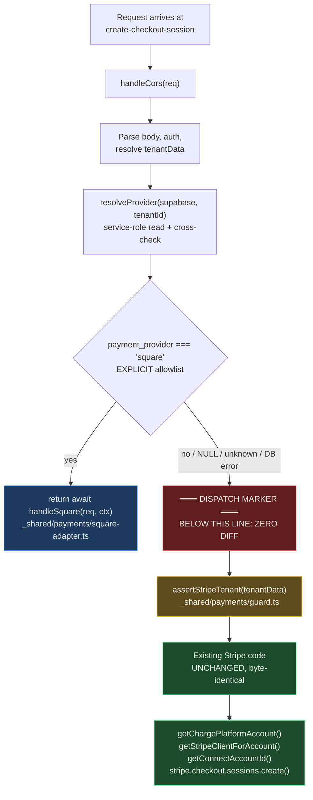
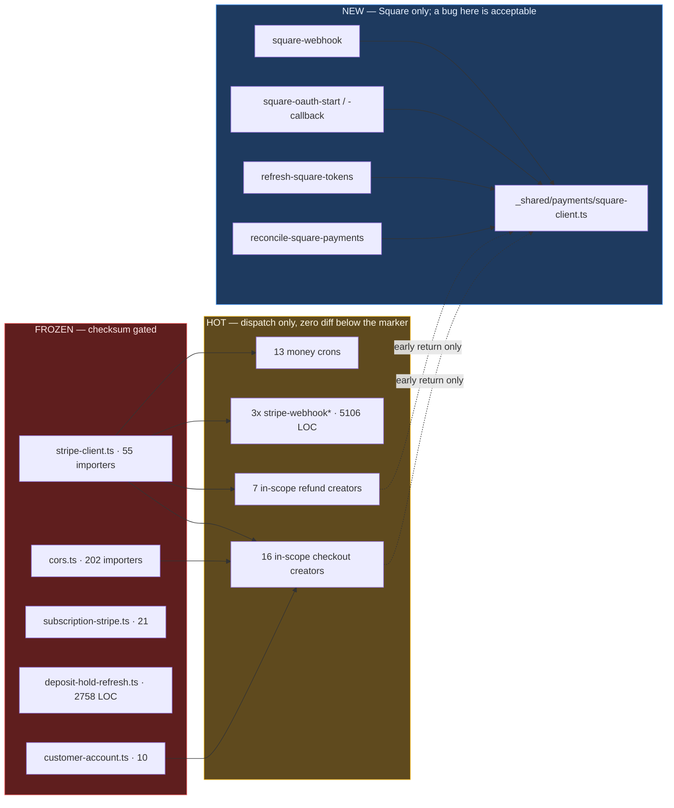
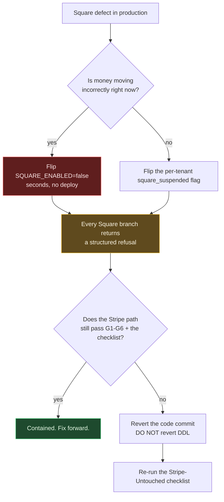

# 03 — Stripe-Safety Architecture and the Full Edge-Case Register

> **Status:** Normative. This document defines the rules the Square workstream must obey and the failures it must survive. Where it contradicts an area plan, this document wins.
> **Revision:** 2 — supersedes rev 1. Two directives are **reversed** (§0). `04-IMPLEMENTATION-PLAN.md` references PD-* by number; the numbering is stable, the content of PD-4 and PD-12 changed.
> **Branch:** `feature/square` · **Supabase project:** `hviqoaokxvlancmftwuo` · all DB and source facts re-queried live **2026-08-25**.
> **Audience:** the two engineers building this, plus the lead scanning for go/no-go items.

---

## TL;DR

- **`_shared/stripe-client.ts` is frozen at zero bytes.** Rev 1 permitted one guard hunk inside `getConnectAccountId`; five area plans then each authorised a *different* single hunk, which would break each other's CI gate. The guard moves to `_shared/payments/guard.ts::assertStripeTenant()`, applied at callers. *Tradeoff: ~20 call sites instead of 1, bought back by a checksum gate the lead can verify in one command.*
- **The provider column is `NOT NULL DEFAULT 'stripe'`, not nullable.** Five areas specified nullable. Under nullable, `.eq('payment_provider','stripe')` — the fence eight tasks add to the every-minute recovery cron — matches **zero of 1,025 legacy rows** and silently stops recovering real Stripe payments. This is the single highest-consequence unreconciled decision in the plan.
- **A Square tenant on the DB defaults does not fail — it silently succeeds on Drive247's shared test Connect account.** Verified: `payment_model='own'` (42/52 tenants, the default) + `stripe_mode='test'` (the default) returns `STRIPE_TEST_CONNECT_ACCOUNT_ID`. Customer pays, `stripe-webhook-test` settles it, FIFO allocates, operator hands over a car, **no money ever existed**. The launch flag must gate the column being *settable*, not the code being deployed.
- **The "one function branches internally" premise is false.** There are **19** `checkout.sessions.create` call sites (16 in scope) and **8** `refunds.create` sites (7 in scope). Only **6** files import `TENANT_STRIPE_COLUMNS`; the other ~44 hand-roll tenant selects and will never see the flag. The un-branched minters must **throw**, not fall through.
- **Three blockers are outside the money path entirely.** 22 of 107 `agreement_templates` rows hardcode *"its payment processor, Stripe"* into e-signed contracts across **16 tenants**; `loadPaymentAccountMapping` has no payment-provider dimension so Square receipts post to the tenant's Stripe clearing account in live Xero/Zoho; and there is **no edge-function test runner** (`supabase/functions/deno.json` has no `tasks` block) although eight tasks depend on one.
- **"Stripe did not change" must be an artifact, not an assertion.** A SHA-256 checksum gate on four files, golden-fixture byte-identical request bodies, and `cron_runs.rows_considered` parity are the only evidence that satisfies the lead's non-negotiable.

---

## Table of Contents

| § | Section |
|---|---|
| [0](#0--what-changed-in-this-revision) | What changed in this revision — two reversals and three settlements |
| [1](#1--the-prime-directive) | The Prime Directive — thirteen rules, the dispatch pattern, the frozen list |
| [2](#2--stripe-regression-risk-register) | Stripe-regression risk register — S0 → S4, with mitigation and proof |
| [3](#3--the-full-edge-case-register) | The full edge-case register — deduped, severity-sorted |
| [4](#4--testing-and-verification-strategy) | Testing and verification — gates, contract tests, sandbox plan, observability |
| [5](#5--rollback-plan) | Rollback plan — the kill switch *is* the rollback |
| [A](#appendix-a--verified-facts-live-2026-08-25) | Appendix A — verified facts |
| [B](#appendix-b--escalation-queue-for-the-lead) | Appendix B — escalation queue for the lead |

---

# 0 — What changed in this revision

Rev 1 was written before the eleven area plans existed. Those plans surfaced facts that reverse two of its directives and settle three contradictions it did not anticipate. **Read this section before acting on any area plan.**

| Change | Rev 1 said | Rev 2 says | Why |
|---|---|---|---|
| **REVERSAL — guard placement** | Ship a fail-closed `throw` **inside** `getConnectAccountId` as "the one permitted exception" to the freeze. | `stripe-client.ts` is **zero-diff**. The guard is `_shared/payments/guard.ts::assertStripeTenant(tenant)`, called by ~20 sites. | Five areas each authorised a *different* single hunk to the same file (SQ-OAUTH-27, SQ-CHK-04, SQ-DEP-01b, SQ-DB-03, SQ-SHARED-09). Whichever lands first sets the CI allowlist and fails the rest. Separately the in-helper guard is **inert at ~42 of 48 call sites** — only 6 files import `TENANT_STRIPE_COLUMNS`, so `payment_provider` is `undefined` at the rest and `undefined === 'square'` is false. It was never the control it was described as. |
| **REVERSAL — PD-4 is now "one named exception"** | Never widen any CHECK constraint. | Never widen `payment_model`, `platform_account` (×3 tables), or `stripe_mode`. **`payments_refund_status_check` is widened additively to add `'rejected'`** — and nothing else is. | Square's `REJECTED` refund terminal state (seller balance short) has no landing zone in `('none','scheduled','processing','completed','failed')`. Widening is additive, cannot invalidate any of the 1,025 existing rows, and no Stripe path writes the new value. Blanket "never widen" would have forced a worse workaround. |
| **SETTLEMENT — nullability** | Not addressed. | `tenants.payment_provider` and `payments.payment_provider` are both `text NOT NULL DEFAULT 'stripe'` with a CHECK, backfilled at DDL time. | Five areas specified `TEXT NULL`. See **R-01**: under nullable, every `.eq('payment_provider','stripe')` fence is a no-op that silently disables Stripe recovery. |
| **SETTLEMENT — anchor columns** | Sibling `square_*` columns. | Confirmed: sibling `square_*` columns. **No** neutral `provider_*` columns, and **no** `GENERATED … STORED` columns. | Six areas proposed `provider_*`; PD-9 bans inferring provider from which id is populated, and 114 payments rows have *neither* Stripe id. The `GENERATED` variant additionally breaks: on PG 17.6 stored generated columns are **not** emitted by logical replication, and `payments` is in the `supabase_realtime` publication. |
| **SETTLEMENT — webhook architecture** | Separate `square-webhook`. | Confirmed, and extended: **no settler extraction in v1**. All **three** `stripe-webhook*` functions get a zero-diff glob gate. | Three areas each scheduled a *different* extraction from the same ~5,106 lines. `square-webhook` calls the same downstream helpers (`apply-payment`, `notify-*`) the Stripe receivers call, which gives single-sourced money logic with a zero-line diff. |

---

# 1 — The Prime Directive

> **A Square bug is acceptable. A Stripe regression is not.**
> Every rule below exists because a specific *verified* property of this codebase makes the obvious alternative dangerous.

## 1.1 The thirteen rules

| # | Rule | Why (verified fact) |
|---|---|---|
| **PD-1** | **Additive DDL only.** `ADD COLUMN … NOT NULL DEFAULT 'stripe'`, `ADD CONSTRAINT`, `CREATE TABLE`. Never `DROP`, never `ALTER COLUMN TYPE`, never rename a `stripe_*` column. | `stripe_payment_intent_id` has **176** reference sites, `stripe_checkout_session_id` **151**, `stripe_refund_id` **21** — 348 across `supabase/functions/` + `apps/*/src/`. |
| **PD-2** | **NULL / unknown / DB-error ⇒ Stripe.** Dispatch is an explicit allowlist: `provider === 'square' ? square : stripe`. Never `!== 'stripe'`. | A partially-deployed state, a column dropped from a select list, or a transient DB error must land on the path 52 live tenants are on. |
| **PD-3** | **Never edit inside an existing Stripe branch.** Square is reachable only via an early `return await handleSquare(...)` above untouched code. | `create-checkout-session/index.ts` is 485 lines; an inline `if (isSquare)` puts a Square variable in scope for every future Stripe edit. |
| **PD-4** | **New columns, never widened enums — with exactly one named exception.** Do **not** widen `tenants_payment_model_check`, `payments_platform_account_check`, `rentals_platform_account_check`, `rentals_deposit_hold_platform_account_check`, `tenants_stripe_mode_check`. **Permitted:** `payments_refund_status_check` gains `'rejected'`. | `getStripeClientForRecord` is literally `record.platform_account === 'uae' ? 'uae' : 'uk'` — no default case, no throw. A third value silently resolves to **live UK Stripe keys** at 25 call sites. Widening it does the *opposite* of surfacing an error. |
| **PD-5** | **No signature change to any shared module.** No `provider` parameter on any exported symbol in `stripe-client.ts`, `cors.ts`, `subscription-stripe.ts`, `deposit-hold-refresh.ts`. Genuinely shared concepts go in a **new** module Stripe code does not import. | **55** files import `stripe-client.ts`, including all three live webhooks and three other shared modules that fan out further. |
| **PD-6** | **Credentials live off `tenants`.** Square tokens, `merchant_id`, `location_id` go in `square_connections` (Vault secret ids, RLS **on**), modelled on `accounting_connections`. Only `payment_provider`, `square_mode` and `country` go on `tenants`, each with `GRANT SELECT (col) … TO anon, authenticated` **in the same migration**. | `tenants` has **262 columns**, **236 anon column grants**, and `has_table_privilege('anon','tenants','SELECT')` is **false** — there is no table grant. One ungranted column 403s the whole ~134-column booking query and every booking site falls back to default branding. This already happened once (`customer_theme_mode`). |
| **PD-7** | **Webhooks are separate functions.** `square-webhook` is new, on its own URL, with its own signature keys and `verify_jwt = false` entry. Zero lines change in **`stripe-webhook`, `stripe-webhook-test`, `stripe-webhook-live`, `stripe-connect-webhook`** — note there are **three** `stripe-webhook*` functions, not two. | Square signs `notification_url + rawBody`; Stripe signs `timestamp.rawBody`. `stripe-webhook`'s own header records that repeated 500s burn an endpoint auto-disable budget whose exhaustion *"stops `checkout.session.completed`, `invoice.paid` and installment settlement for ALL tenants."* |
| **PD-8** | **No Square SDK.** Raw `fetch` only. CI greps for `npm:square` / `esm.sh/square` under `supabase/functions/` and fails. | Square's Node SDK types `Money.amount` as `bigint`; `_shared/cors.ts::jsonResponse` is a bare `JSON.stringify` with **202 importers**. `return jsonResponse(await squarePayments.create(...))` charges the customer, then 500s on the way out — and the "fix" someone reaches for is patching the shared serialiser for all 202 functions. |
| **PD-9** | **Provider identity is never inferred.** No code sniffs which id column is non-null. `payments.payment_provider` is `NOT NULL DEFAULT 'stripe'`, backfilled for all 1,025 rows in the same migration. | **114** payments rows have *both* Stripe id columns NULL (cash, Zelle, manual). Sniffing breaks on them silently. |
| **PD-10** | **Every unconverted Stripe path must throw, not proceed, for a Square tenant.** | A new tenant is born `payment_model='own'` + `stripe_mode='test'`, so a mis-dispatched Square tenant **silently succeeds** on the shared test Connect account rather than erroring. Silent success is the worst outcome available. |
| **PD-11** | **No provider-name conditionals outside `_shared/payments/`.** Callers branch on a capability manifest (`caps.supportsCardVaulting`), never on `providerId === 'square'`. CI fails on `=== 'square'` / `=== 'stripe'` elsewhere. | This repo already shows the failure mode: 12+ sites hand-synthesise `payment_model: platform_account === 'uae' ? 'own' : 'managed'`, which is precisely why `payment_model` is now unusable as a branch key. |
| **PD-11a** | **One select-list constant.** The list containing `payment_provider` is defined once and exported. No call site hand-types it. | An omitted `payment_provider` resolves to Stripe (safe direction) but makes Square tenants mysteriously non-functional — expensive to debug, cheap to prevent. |
| **PD-12** | **`payment_provider` is a routing hint, not a security boundary.** Resolve from the **tenant** row via service-role, cross-check against the record column, and treat disagreement as *unresolvable — change nothing*. Never "proceed". | Verified: `relrowsecurity = false` on `payments` **and** `rentals`, and `anon` holds table-level **UPDATE** on both. Any holder of the public anon key shipped in the booking bundle can flip the flag. `apps/booking/.../booking-success/page.tsx` already writes `stripe_checkout_session_id` from the browser for exactly this reason. |
| **PD-13** | **Square tenants are never the first executors of never-run Stripe code.** | Verified live: **0** rentals in `auto_extend_charge_mode='auto_charge'`; **0** payments with `refund_status='scheduled'` and no cron dispatching that batch; **1 of 52** tenants with `deposit_charge_enabled=true`. A defect in any of these presents as "Square is broken" while actually being a years-old Stripe defect detonating under a new customer — which inverts the lead's whole risk posture. |

**Judgement call — sibling columns, not neutral renames.** `payments` gets `payment_provider` + `square_payment_link_id` + `square_order_id` + `square_payment_id` + `square_refund_id`. *Tradeoff:* reporting queries branch on `payment_provider` rather than reading one neutral column — a cost paid in ~6 read sites, versus dual-write which would require editing the write path feeding all 348 Stripe reference sites.

**Judgement call — the column is named `payment_provider`.** It sits alongside the pre-existing `payment_model` and `payment_mode`, which differ from each other by two characters, and `provider` already means the *accounting* provider (`xero|zoho`) across `_shared/accounting/` and the finance-sync tables. *Tradeoff:* the confusion risk is real and is bought off by PD-11a plus `COMMENT ON COLUMN` on all three, not by an uglier name.

## 1.2 The dispatch-at-the-top pattern

This is the only sanctioned shape. Anything else is a rejected PR.



**Where the branch actually goes.** Two area plans instruct "branch immediately after the `req.json()` destructure at line 24." That is **not implementable**: `create-checkout-session` resolves the tenant three ways — by slug (line 66), by id (line 86), and via the rental (line 114) — so a rental-only caller has no tenant id at line 24. The branch goes **after `tenantData` resolves (~line 130)**, and `payment_provider` is appended to the three select lists at 66/86/114. Honest acceptance criteria: *lines 1–130 gain three identical column appends plus one inserted block; lines 131+ are byte-identical.* Claiming "zero changed lines" would be false.

**The diff gate enforces this literally.** Every provider-neutral function carries the exact line:

```ts
// ═══════════════ SQUARE DISPATCH MARKER — DO NOT EDIT BELOW THIS LINE ═══════════════
```

CI runs `git diff origin/main...HEAD -- <protected paths>` and fails if any changed line falls below that marker's line number in the base revision. A reviewer's eyes are not the control; the merge button is.

## 1.3 The frozen file list

| File | LOC | Importers | Why frozen |
|---|---:|---:|---|
| `supabase/functions/_shared/stripe-client.ts` | 632 | **55** | Carries `DEPOSIT_HOLD_CARD_VARIANTS` (a 4-rung ladder whose idempotency keys are suffixed by variant **index** — inserting a rung shifts what index 2 means inside Stripe's 24h replay window), `HOLD_EXPIRY_FALLBACK_DAYS` (tuned down because Visa's card-absent window is 4d18h and over-estimating *"costs the deposit"*), `getWebhookSecretCandidates` (in-file comment records that a ternary here took down **every TEST-mode webhook with a 500**, because `Deno.env.get('')` throws while the array literal is built), and the UK→UAE dual-platform routing. |
| `supabase/functions/_shared/cors.ts` | 43 | **202** | `jsonResponse` is `new Response(JSON.stringify(data), …)` with no replacer. Any serialisation change changes the response of 202 functions including every Stripe money path. |
| `supabase/functions/_shared/subscription-stripe.ts` | 134 | 21 | Platform subscriptions are **out of scope** and already structurally isolated. The risk is not coupling — it is someone "tidying" the two Stripe helpers into one during Square work. Note the credit wallet (`create-credit-checkout`, `manage-credit-wallet`) also imports *this*, not `stripe-client.ts`, so tenant credits are already correctly out of scope and need **zero** Square work. |
| `supabase/functions/_shared/deposit-hold-refresh.ts` | 2758 | — | Auth holds are out of scope; this is the largest and most incident-shaped file in the estate. Its `applyDueHoldFilters` feeds three query sites and ten pinned test suites. |
| `supabase/functions/_shared/customer-account.ts` | — | 10 | Its header documents a real incident: a UAE charge clobbering a live UK customer id. `CUSTOMER_ID_COLUMN` is keyed by `PlatformAccount`, and that union type also feeds `getSecretKeyForAccount` — widening it to admit `'square'` opens a path from Square code to a **Stripe secret key**. |

**CI gate:** `sha256sum` of all five compared against a committed baseline. Build fails on mismatch. The baseline may only change in a PR that touches nothing else.

**Also diff-reviewed in isolation:** `supabase/config.toml` — currently **65** `verify_jwt = false` entries including four Stripe webhook surfaces. The `[functions.square-webhook]` and `[functions.square-oauth-callback]` blocks are appended at the end, in a commit that changes nothing else in that file. (CLAUDE.md claims 10 such entries; it is stale by 55.)

## 1.4 The guard — where it goes, and why not where rev 1 put it

`getConnectAccountId` fails **open** in the one shape that matters. Verified in source:

```ts
if (tenant.payment_model === 'own') {          // 42 of 52 tenants — and the DB DEFAULT
  if (tenant.stripe_mode === 'test') {         // also the DB DEFAULT
    return tenant.own_stripe_test_account_id
        || Deno.env.get('STRIPE_TEST_CONNECT_ACCOUNT_ID')   // ← the shared platform test seller
        || null;
  }
  if (!tenant.own_stripe_account_id) throw new Error(/* live + unconnected — fails LOUD */);
  return tenant.own_stripe_account_id;
}
```

So a Square tenant born on the defaults does **not** throw. It returns a working Stripe test Connect account, and the whole settlement chain runs to completion on money that does not exist.

**The ruling:** the guard is `_shared/payments/guard.ts::assertStripeTenant(tenant)`, called by the ~20 sites that already resolve a tenant, and `stripe-client.ts` stays byte-frozen.

| Option | Cost | Why rejected / chosen |
|---|---|---|
| Guard inside `getConnectAccountId` (rev 1) | 1 call site | **Rejected.** Inert at ~42 of 48 callers (they hand-roll selects without `payment_provider`); five areas want five different hunks in the same file; and it destroys the absolute checksum gate. |
| Append `payment_provider` to `TENANT_STRIPE_COLUMNS` | 1 line | **Rejected.** Only 6 files import that constant and **all six are deposit-hold paths** — it reaches none of the money paths, while adding a deploy-ordering hazard where a function shipped ahead of the migration 400s its whole tenant select. |
| Guard in `_shared/payments/guard.ts`, applied at callers | ~20 call sites | **Chosen.** *Tradeoff: twenty mechanical, greppable insertions instead of one — bought back by a checksum gate the lead can verify in one command, and by a CI set-difference assertion (below).* |

**The mechanical control that replaces the tripwire.** The guard is a backstop; the actual defence is at the query layer:

```bash
# CI: every file that can reach a Stripe client must carry a provider fence.
comm -23 \
  <(grep -rl 'getConnectAccountId\|getStripeClientForAccount' supabase/functions --include=index.ts | sort) \
  <(grep -rl "assertStripeTenant\|payment_provider'\s*,\s*'stripe'" supabase/functions --include=index.ts | sort)
# must be empty
```

---

# 2 — Stripe-Regression Risk Register

Severity: **S0** money misrouted or all tenants down · **S1** a whole tenant class broken · **S2** a flow broken for some tenants · **S3** degraded UX / ops burden · **S4** hygiene.

## 2.1 Blast-radius map



## 2.2 S0 — catastrophic

### R-01 · A nullable `payment_provider` silently disables the every-minute Stripe recovery cron

| | |
|---|---|
| **Severity** | **S0** |
| **Mechanism** | Five area plans specify `payment_provider TEXT NULL` with no default, justified as *"the migration writes zero rows."* Eight other tasks then fence Stripe-only sweeps with `.eq('payment_provider','stripe')` and call it *"a verified no-op for all 1,025 existing rows."* That is true **only** under `NOT NULL DEFAULT 'stripe'`. Under nullable, every legacy row is NULL, the predicate matches **zero rows**, and `recover-pending-stripe-payments` (pg_cron jobid 34, `* * * * *`) — the only webhook-miss recovery in the system — stops recovering anything. |
| **Blast radius** | Silent, every minute, for all 52 tenants. Real Stripe payments stay `Pending` forever, precisely when the webhook has already been missed. A Stripe money regression manufactured entirely by two areas not reconciling their DDL. |
| **Mitigation** | `tenants.payment_provider` and `payments.payment_provider` are both `text NOT NULL DEFAULT 'stripe'` + CHECK, backfilled at DDL time (metadata-only in PG11+, no rewrite). Delete the nullable variant from the refunds, deposits, links, portal-FE and booking-FE area schemas. |
| **Verify** | `SELECT count(*) FROM payments WHERE payment_provider IS NULL` → **0**; `SELECT count(*) FROM tenants WHERE payment_provider IS NULL` → **0**; plus a standing CI/DB assertion that no column named `payment_provider` is nullable, so the variant cannot reappear in a later migration. |
| **Owner** | Engineer A · Milestone 1 |

### R-02 · A Square tenant on the DB defaults silently succeeds on the shared test Connect account

| | |
|---|---|
| **Severity** | **S0** |
| **Mechanism** | Verified: `tenants.payment_model` is `NOT NULL DEFAULT 'own'` (42/52 tenants) and `stripe_mode` is `NOT NULL DEFAULT 'test'`. `create-sales-onboarding/index.ts:1182-1200` sets neither. `getConnectAccountId` therefore returns `STRIPE_TEST_CONNECT_ACCOUNT_ID` — it does **not** throw and does **not** return null. Any of 48 call sites or 13 money crons can mint a genuine Stripe TEST Checkout for a Square tenant. |
| **Blast radius** | `stripe-webhook-test` settles it; the 8 `payments` triggers run FIFO allocation; the rental is marked paid; the operator hands over a car. **No money ever moved.** Indistinguishable from success on every screen. |
| **Mitigation** | Three layers, all required. (1) `assertStripeTenant()` at ~20 callers. (2) Query-level provider fences on all 13 money crons and both passes of jobid 34. (3) A **launch flag, default OFF**, gating whether `payment_provider` can be *set* to `'square'` at all — the column being settable is the gate, not the code being deployed. |
| **Verify** | Standing monitor: `SELECT count(*) FROM payments p JOIN tenants t ON t.id=p.tenant_id WHERE t.payment_provider='square' AND (p.stripe_checkout_session_id IS NOT NULL OR p.stripe_payment_intent_id IS NOT NULL)` → **0**. Any hit is a P0 incident, not a bug. |
| **Owner** | Engineer A · Milestone 1 (must precede any settable column) |

### R-03 · Widening `payments_platform_account_check` hands Square records live UK Stripe keys

| | |
|---|---|
| **Severity** | **S0** |
| **Mechanism** | One area proposes widening the CHECK to `'square'` *"to turn a silent mis-route into an explicit unknown-provider error."* The code does the opposite: `getStripeClientForRecord` is `record.platform_account === 'uae' ? 'uae' : 'uk'` — no default, no throw. A third value silently resolves to **legacy UK Stripe keys** across 25 call sites. |
| **Blast radius** | Refunds, captures and deposit operations executed against the wrong Stripe account. Compounding: the column is `NOT NULL DEFAULT 'uk'` with no NULL escape, so Square rows are **stamped `'uk'` as the normal case**, and any revenue report grouped by `platform_account` counts Square money as legacy-UK Stripe money. |
| **Mitigation** | Never widen (PD-4). Square rows inherit the inert `'uk'` default. Add the loud failure where the coercion happens — an `assertStripeTenant`-style throw at `getStripeClientForRecord`'s **callers**, not in the CHECK. Add a provider dimension to any revenue reporting grouped by `platform_account` before the first Square payment. |
| **Verify** | `pg_get_constraintdef` on all four `*_platform_account_check` constraints byte-identical pre/post — asserted in the DDL gate. |
| **Owner** | Engineer A · Milestone 1 |

### R-04 · The Square webhook writes `status='Completed'` for an uncaptured payment and FIFO allocates money that does not exist

| | |
|---|---|
| **Severity** | **S0** |
| **Mechanism** | Verified: `payments` carries **8** triggers, and settlement is driven **entirely** by `payments.status`, never by any provider id. `auto_fifo_on_payment_insert` / `auto_fifo_on_payment_completed` fire `payment_apply_fifo_v2` the moment status becomes `'Completed'`. Square's `APPROVED` (authorised, not captured) has no Stripe analogue; mapping it to `Completed` allocates unsettled money **in the database**, bypassing `apply-payment`'s edge-function capture guard entirely. |
| **Blast radius** | Inflated Collected, masked Balance Due, phantom `payment_applications` requiring hand-reversal — plus a customer notification and a `rag_sync_queue` row, since `on_payment_received_notify` and `payments_rag_trigger` fire on the same write. |
| **Mitigation** | Ratify a written Square-status → `payments.status` map **before** the webhook is coded (`_shared/payments/status-map.ts`). Hard invariant: `status='Completed'` means *money has irrevocably moved*. Never map `payment.created`, never map `APPROVED`. Modify **no** trigger — they are load-bearing for 1,025 live rows. |
| **Verify** | Integration test: a Square-shaped `payments` row inserted with `status='Pending'` produces **zero** `payment_applications` until `apply-payment` runs; and a Square row reaching `Completed` produces exactly one `financial_events` row of the right type and amount. |
| **Owner** | Engineer B · Milestone 3 |

### R-05 · A Square exception inside `stripe-webhook-live` burns the auto-disable budget for all 26 live Stripe tenants

| | |
|---|---|
| **Severity** | **S0** |
| **Mechanism** | One area schedules inserting a Square resolver call inside `stripe-webhook-live` and `stripe-webhook-test`. `stripe-webhook`'s own header records that repeated 500s book against Stripe's per-endpoint auto-disable budget, and that a disabled endpoint *"stops `checkout.session.completed`, `invoice.paid` and installment settlement for ALL tenants."* Square's ack budget is also tighter than `HOLD_SYNC_TIMEOUT_MS = 15_000`, which that file spends synchronously. |
| **Blast radius** | Platform-wide settlement outage; re-enabling is a manual Stripe dashboard action under incident pressure. |
| **Mitigation** | PD-7. Separate `square-webhook` on its own URL. Zero diff on all **three** `stripe-webhook*` files plus `stripe-connect-webhook`, enforced by a glob gate. Square's receiver calls the same downstream helpers (`apply-payment`, `notify-*`) the Stripe receivers call, so money logic stays single-sourced without touching them. |
| **Verify** | `git diff origin/main...HEAD -- 'supabase/functions/stripe-webhook*' 'supabase/functions/stripe-connect-webhook'` → empty. Asserted in CI. |
| **Owner** | Engineer B · Milestone 3 |

### R-06 · Square link ids in `stripe_checkout_session_id` starve the Stripe recovery queue

| | |
|---|---|
| **Severity** | **S0** |
| **Mechanism** | `recover-pending-stripe-payments` runs `* * * * *`. Pass 1 selects `status='Pending' AND stripe_checkout_session_id IS NOT NULL … LIMIT 100`; pass 2 repeats for stranded `Credit` rows. Verified: there is **no index** on that column (0 matching `pg_indexes` rows) while 907 of 1,025 payments carry a value. Six writers touch it — including **client-side browser code** at `apps/booking/src/app/booking-success/page.tsx:323`, possible because `payments` has RLS off and `anon` holds UPDATE. |
| **Blast radius** | Unresolvable Square rows occupy the shared 100-row window every minute; genuine Stripe recoveries silently stop. Per-row `try/catch` at :83 prevents an abort but not starvation. |
| **Mitigation** | Separate `square_*` columns (never share). `.eq('payment_provider','stripe')` on **both** passes as a standalone Stripe-only commit. A DB CHECK making the shortcut impossible rather than discouraged: `CHECK (payment_provider <> 'square' OR stripe_checkout_session_id IS NULL)`. Add the missing partial index in the same migration — stating honestly that this is an improvement over a seq scan, **not** plan parity. |
| **Verify** | `EXPLAIN` both recovery selects pre/post; `cron_runs.rows_considered` for jobid 34 unchanged across the fence commit. |
| **Owner** | Engineer A · Milestone 1 |

## 2.3 S1 — critical

### R-07 · Nothing in ~200 tasks ever sets `payment_provider='square'` — the epic ships inert

| | |
|---|---|
| **Severity** | **S1** |
| **Mechanism** | Verified: `create-sales-onboarding/index.ts:1182-1200` is the provisioning INSERT and does not set the column; `apps/admin/components/admin/CreateTenantDialog.tsx` is a raw client-side `tenants.insert` of six fields with **no server validation at all**. With `NOT NULL DEFAULT 'stripe'`, every task could ship and every tenant would remain on Stripe. |
| **Blast radius** | Worse than inertness: whoever discovers this under deadline pressure sets the flag by hand in SQL, bypassing both the country gate and the launch flag — and the provider choice is **permanent**. |
| **Mitigation** | One task in Milestone 4 (not earlier — the flag stays dark until the money paths are branched): capture the provider in **both** creation paths; gate the Square option on `tenants.country`; force the Square invariants (`deposit_charge_enabled=true`, `installments_enabled=false`, `auto_extend_enabled=false`, `payg_auto_reminders_enabled=false`, `migration_blocker='off'`); and add a `BEFORE UPDATE` trigger making `payment_provider` immutable once set. |
| **Verify** | Integration test asserting both creation paths produce a non-null `payment_provider`; and that an authenticated UPDATE changing it is rejected while an ordinary settings save is unaffected. |
| **Owner** | Engineer B · Milestone 4 |

### R-08 · `payment_provider` is publicly writable — the dispatch flag is not a boundary

| | |
|---|---|
| **Severity** | **S1** |
| **Mechanism** | Verified: `relrowsecurity = false` on `payments` and `rentals`; `has_table_privilege('anon','payments','UPDATE')` is **true**; and the `tenants` RLS policy is `is_super_admin() OR id = get_user_tenant_id()` for role PUBLIC with `authenticated` holding UPDATE on all 262 columns. Six area plans build default-deny guards on `record.payment_provider` and one states it is *"trustworthy at the guard point."* |
| **Blast radius** | Flip a Stripe rental to `'square'` → the refresh and reconcile crons skip it forever and the deposit chain dies silently (the GMT incident shape). Flip a Square row to `'stripe'` → it walks toward `cancelIntent`. |
| **Mitigation** | PD-12: resolve from the tenant row via service-role, cross-check the record, treat disagreement as *change nothing*. Add the immutability trigger. **Do not enable RLS on `payments` inside this workstream** — activating ten untested dormant policies is itself a Stripe-regression event; raise it as separate pre-existing security debt. |
| **Verify** | Unit test: resolver returns `unresolvable` (not a provider) when tenant and record disagree. Trigger test: UPDATE changing a set `payment_provider` raises. |
| **Owner** | Engineer B · Milestone 1 |

### R-09 · Adding `.eq()` to `applyDueHoldFilters` changes the live hold driver query and TypeErrors 10 pinned suites

| | |
|---|---|
| **Severity** | **S1** |
| **Mechanism** | Two areas propose `.eq('payment_provider','stripe')` inside `_shared/deposit-hold-refresh.ts::applyDueHoldFilters`. Verified: that function is a chain of `.or()` calls whose final one carries a comment explaining that *successive `.or()` calls are AND-ed* and that splitting it made an extended rental's chain *"die silently."* Verified the consumer test declares `type Q = { or: (expr: string) => Q }` and stubs only `.or` — so the change throws `q.eq is not a function` and fails all **10** deposit-hold suites in a way that reads as a broken harness. |
| **Blast radius** | Alters the driver query for the **29 rentals** currently carrying a non-null `deposit_hold_status`, in order to exclude rows that cannot exist until a Square tenant is created. The cost lands entirely on Stripe; the benefit is zero until the flag flips. |
| **Mitigation** | **Do not touch `applyDueHoldFilters`.** Square rentals are excluded from the hold engine **by data** — they never acquire a non-null `deposit_hold_status`, because the Square path refuses at `place-deposit-hold` and `create-hold-checkout`. That is a stronger guarantee than a predicate and costs nothing. If a filter is ever proven necessary, add it to the two call-site queries in `refresh-deposit-holds/index.ts` instead. |
| **Verify** | `cd apps/portal && npm run test` green with the `.or()` array byte-identical to the pre-change snapshot. |
| **Owner** | Engineer A · Milestone 1 (as a *do-not-do* recorded in the register) |

### R-10 · A Square column on `tenants` 403s the whole booking query and takes every site to default branding

| | |
|---|---|
| **Severity** | **S1** |
| **Mechanism** | Verified: `anon` has **no table-level SELECT** on `tenants` and column-level SELECT on **236 of 262** columns. `apps/booking/src/contexts/TenantContext.tsx` selects ~134 columns explicitly. PostgREST fails the **entire** query when the role lacks SELECT on any named column. |
| **Blast radius** | Every booking site for all 52 tenants — Stripe tenants included — loses branding, pricing config, deposit settings and SEO simultaneously. This has already shipped once (`customer_theme_mode`). |
| **Mitigation** | `GRANT SELECT (payment_provider, square_mode, country) ON public.tenants TO anon, authenticated` **in the same migration** as the ADD COLUMN. Grant nothing on `square_merchant_id`, `square_location_id` or any token column to `anon`. **Inverse hazard:** `payments` has RLS off *and* an anon table grant, so new `payments.square_*` columns are world-readable by default — issue an explicit `REVOKE SELECT (square_*) … FROM anon` in the same statement, and never store a Square payment-link URL there (it is a bearer link on a realtime-published table). |
| **Verify** | Post-migration, run booking's exact select list as `anon` → expects **200**; run an `anon` select of the new `payments.square_*` columns → expects **denied**. Both in the DDL gate. |
| **Owner** | Engineer A · Milestone 1 |

### R-11 · 16 tenants' e-signed contracts name Stripe as the processor

| | |
|---|---|
| **Severity** | **S1** |
| **Mechanism** | Verified live: **22 of 107** `agreement_templates` rows contain `stripe` — **21 `installment` + 1 `standard`**, spanning **16 distinct tenants**. Sampled text: *"you expressly authorise the Operator (and its payment processor, Stripe) to debit the saved payment method … without further consent or notification."* This is the renter's legally binding authorisation for merchant-initiated debits, captured by BoldSign. The string `agreement_templates` appears in **no** area plan. |
| **Blast radius** | A Square tenant's renter signs a contract naming a processor that will never touch their card. Compounding: every area independently concludes installments cannot work on Square, yet nothing prevents a Square tenant creating an installment plan — the only gate proposed is a portal toggle, which is not a boundary. |
| **Mitigation** | Replace the literal with a `{{payment_processor}}` placeholder resolved from `tenants.payment_provider` at generation time in `create-boldsign-document` and both `esign` routes. Add a DB-level guard (CHECK or `BEFORE INSERT` trigger on `installment_plans`) so a Square tenant cannot create an installment plan at all. **Escalate:** changing signed-contract wording is a legal review item, not an engineering one. |
| **Verify** | Generate a **real** PDF for a Stripe tenant and diff against a pre-change sample — the 22 rows are per-tenant customisations, so a naive UPDATE risks rewriting operator edits. |
| **Owner** | Lead (legal) + Engineer B · Milestone 4 |

### R-12 · Square receipts post into the tenant's Stripe clearing account in live Xero/Zoho

| | |
|---|---|
| **Severity** | **S1** |
| **Mechanism** | `process-accounting-sync/index.ts:600` `loadPaymentAccountMapping` filters `accounting_account_mappings` on `(tenant_id, provider, is_payment_account_sentinel)` — and `provider` there is the **accounting** provider enum (`xero|zoho`). There is no payment-provider dimension. `financial_events` already holds 7,471 rows and is drained every 2 minutes by pg_cron jobid 51. |
| **Blast radius** | A tax-filing error, not a UI bug, and silent until an accountant reconciles. The naming collision is itself a hazard: `provider` means Xero/Zoho in ~15 call sites one join away from `payments`. |
| **Mitigation** | Add a payment-provider dimension to `accounting_account_mappings` (a nullable column participating in the sentinel lookup, falling back to the existing row when NULL so all current tenants are byte-identical). Carry `payment_provider` into the financial-event payload. **Gate the launch flag on this.** |
| **Verify** | A Square payment settling produces exactly **one** `financial_events` row, of the right type and amount, mapped to a Square-specific clearing account. |
| **Owner** | Engineer B + finance-sync owner · Milestone 4 |

### R-13 · Square OAuth tokens expire; without a *verified* refresh cron every Square tenant goes dark at once

| | |
|---|---|
| **Severity** | **S1** |
| **Mechanism** | Square OAuth returns an expiring `access_token` + `refresh_token`; Stripe returns a permanent account id and stores no secret, so nothing in this codebase has ever needed refresh. Expiry is a **pure clock event** — no row changes, no webhook fires, nothing data-driven can detect it. |
| **Blast radius** | Every Square tenant stops taking money simultaneously, ~30 days after onboarding, with a 401 that reads as a credentials bug. |
| **Mitigation** | Clone the working precedent: `refresh-accounting-tokens` (pg_cron jobid 49, `*/10 * * * *`) with Vault-backed storage, `refresh_failure_count`, and a `cron_runs` dead-man heartbeat. Use the **code flow** with `client_secret`, never PKCE — a crash between "refresh succeeded" and "row written" must be recoverable. **Alert on `token_expires_at` PROXIMITY, never on refresh failure** — a cron that never runs produces zero failures. |
| **Verify** | The job exists in the **live `cron.job` table** (28 active jobs today) — repo migration files are a known-inaccurate map, and this project already has a refresh cron that may never have been scheduled. Plus one successful refresh with a persisted timestamp. |
| **Owner** | Engineer B · Milestone 3 (launch blocker) |

### R-14 · Square launches with no webhook-miss recovery at all

| | |
|---|---|
| **Severity** | **S1** |
| **Mechanism** | `recover-pending-stripe-payments` filters on `stripe_checkout_session_id IS NOT NULL`, so Square rows are structurally invisible to the only recovery mechanism in the system — while Square's delivery guarantee is weaker than Stripe's and offers no manual resend. |
| **Blast radius** | A missed Square event is unrecoverable money. The portal UI implies a safety net exists (it polls `process-pending-payment`), which only runs while a browser is open. |
| **Mitigation** | Build `reconcile-square-payments` as a **separate** function against the Square Events API, keyed on the persisted `square_order_id`, deduped against `processed_square_events`. Never widen the Stripe queue. Treat it as a launch blocker, not a phase-2 nicety. |
| **Verify** | Kill a Square webhook delivery deliberately in sandbox; assert the reconciler settles the row within one interval and produces exactly one set of ledger effects. |
| **Owner** | Engineer B · Milestone 3 (launch blocker) |

### R-15 · Regenerating `types.ts` breaks `apps/admin` — and the documented workflow misses an app

| | |
|---|---|
| **Severity** | **S1** |
| **Mechanism** | Verified **four** generated `types.ts` files exist: portal, booking, admin, **bonzah**. `CLAUDE.md` lines 37-38 contain only two `cp` commands, covering three apps and omitting bonzah entirely. `apps/admin` runs `strict: true` and does **not** set `ignoreBuildErrors`; booking and portal do, so drift there is silent until a runtime `undefined` on a money path. Area plans disagree: some say three apps, some four. |
| **Mitigation** | Fold into whichever DDL task lands first: regenerate once, copy to all **four**, build `apps/admin` as an explicit acceptance step, and fix the `CLAUDE.md` `cp` block in the same commit. |
| **Verify** | CI assertion that the four `types.ts` files are byte-identical — a two-line guard that permanently removes this class of drift. |
| **Owner** | Engineer A · Milestone 1 |

## 2.4 S2 — high

### R-16 · Eight tasks require edge-function tests; there is no edge-function test runner

| | |
|---|---|
| **Severity** | **S2** |
| **Mechanism** | Verified: `supabase/functions/deno.json` contains only `compilerOptions` and `imports` — **no `tasks` block**, so `deno task test` does not exist. Root `package.json` has **no test script**. Exactly **one** edge-function test file exists (`ghl-strategy-call-webhook/core.test.ts`), wired into nothing. Against that, eight tasks name edge-function assertions, and the golden-log replay harness is the stated merge gate for a ~5,106-line refactor. |
| **Mitigation** | Stand up the harness **first**: add a `tasks` block, a root npm script, and a CI hook; retro-fit the existing colocated `core.ts` / `core.test.ts` split as the reference pattern. Prove it by landing one test against **untouched Stripe code** — the `getConnectAccountId` golden test over the six real tenant shapes is the natural first, since it is pure and has no I/O. |
| **Verify** | `npm run test:functions` green in CI with ≥1 assertion, before any task that depends on it is scheduled. |
| **Owner** | Engineer A · Milestone 1 |

### R-17 · 24 of 28 live crons have no heartbeat — including every cron the plan modifies

| | |
|---|---|
| **Severity** | **S2** |
| **Mechanism** | Verified: `cron.job` has **28** active jobs; `cron_runs` contains exactly **4** distinct `job_name` values, all from the deposit-hold family. Every other scheduled job is unobserved. The plan's central Stripe-safety mechanism is to add provider filters to those very jobs — and if a filter narrows a predicate too far, the symptom is **silence**: a cron that runs and finds nothing looks identical to a healthy one. |
| **Mitigation** | Write a `cron_runs` heartbeat (`job_name`, `started_at`, `finished_at`, `rows_considered`, `rows_acted`) into each of the money crons the plan touches, as a **standalone Stripe-only commit with no provider logic in it**. Capture two weeks of baseline `rows_considered`. Then land the filters and assert the number is unchanged. |
| **Verify** | `rows_considered` per job identical across the fence commit — the cheapest possible proof that a Square-motivated filter did not starve a Stripe sweep. Plus an alert on any job going >2 intervals without a `finished_at`. |
| **Owner** | Engineer A · Milestone 1 |

### R-18 · There is no environment in which the Square webhook can be developed

| | |
|---|---|
| **Severity** | **S2** |
| **Mechanism** | Square's HMAC covers `notification_url + rawBody`, so the URL must byte-match what is registered. `npx supabase functions serve` yields a localhost URL that cannot be a production notification URL and requires re-registering on every tunnel restart. Stripe's equivalent problem is solved by `stripe listen`; Square ships no CLI forwarding. Staging is not an alternative: it shares prod's Stripe test account and its webhooks fire into **prod**. |
| **Mitigation** | Define and document the environment before the first webhook task: a stable named tunnel or a dedicated always-on preview Supabase project whose URL is registered once as the Sandbox notification URL and never changes; a second Sandbox subscription for CI with its own signature key; and a written statement that staging is unusable for Square. |
| **Verify** | A developer can receive, verify and dedupe a sandbox event end-to-end without touching production. |
| **Owner** | Engineer B · Milestone 0 |

### R-19 · `resolveGoLive` — two areas prescribe contradictory patches, one of which arms R-02

| | |
|---|---|
| **Severity** | **S2** |
| **Mechanism** | Verified `subscription-webhook/index.ts:319-331`: `connectReady` gates **both** `patch.stripe_mode = "live"` and the `setup_completed_at` stamp. One area says extend `connectReady` with a Square disjunct; another says leave the mode write byte-identical and add a separate `squareReady` term. Extending `connectReady` writes `stripe_mode='live'` onto a tenant with `payment_model='own'` and no connected account — which makes `getConnectAccountId` throw across 48 files. Separately, `hasBeenLive` (:524-529) is five Stripe-shaped disjuncts whose else-branch writes `bonzah_mode='test'` — silently reverting a Square tenant's insurance to **sandbox cover**. |
| **Mitigation** | Adopt the `squareReady` shape: a separate term feeding **only** the completion condition; leave `patch.stripe_mode = 'live'` byte-identical; extend `hasBeenLive` with the same disjunct and add `payment_provider, square_connection_status` to the select at :520. |
| **Verify** | Golden test over the real tenant row shapes asserting **identical patch output** for all 52 existing tenants, plus a case asserting the patch contains **no** `stripe_mode` key for `provider='square'`. |
| **Owner** | Engineer B · Milestone 3 |

### R-20 · Two unconditioned triggers on `tenants` are second writers of the state the plan gates on

| | |
|---|---|
| **Severity** | **S2** |
| **Mechanism** | `trg_stamp_setup_completed_at` is `BEFORE UPDATE OF stripe_account_status, stripe_mode … WHEN (new.stripe_mode='live' AND new.stripe_account_status='active' AND new.setup_completed_at IS NULL)` — so the **database** independently stamps `setup_completed_at`, defeating `resolveGoLive`'s `connectReady && bonzahReady` rule. Because it is column-scoped, a WHEN-only edit produces a trigger that *reads* as provider-aware and can never fire. `trg_auto_resolve_go_live_requests` is `AFTER UPDATE … FOR EACH ROW` with **no** column list, so it fires on every `tenants` write including every token refresh. |
| **Mitigation** | Add both to the no-change register with verbatim definitions. Keep Square token state in `square_connections` so the high-frequency refresh path never fires a `tenants` trigger. If the stamp trigger must ever change, recreate it in one transaction outside a go-live window and verify by **executing a real UPDATE per provider** — never by reading DDL. |
| **Verify** | `pg_get_triggerdef` for both, byte-identical pre/post, asserted in the DDL gate. |
| **Owner** | Engineer A · Milestone 1 |

### R-21 · Metadata compaction is a hard prerequisite touching 16 checkout functions and three webhooks

| | |
|---|---|
| **Severity** | **S2** |
| **Mechanism** | The three webhook files read **18** distinct metadata keys; `create-checkout-session` writes up to **15**, `installment-pay-link` 12, `create-extension-checkout` 11. Square's Order metadata budget is materially smaller, and `target_categories` is `JSON.stringify`'d and routinely exceeds a 255-char value cap. The webhook's dispatch keys off these — a dropped `extension_id` is a paid extension that never applies. |
| **Mitigation** | Move the settlement contract onto the `payments` row (several correlators already exist as columns) and put **one bare UUID** in `reference_id`. Land it as a **Stripe-only** refactor first — webhooks read the row, falling back to metadata — so the contract change is proven under real Stripe traffic before Square depends on it. |
| **Verify** | Golden-log replay: all seven metadata sub-branches produce byte-identical row states pre/post. |
| **Owner** | Engineer A · Milestone 2 |

### R-22 · Portal and admin readiness hardwire Stripe columns — Square tenants render permanently broken

| | |
|---|---|
| **Severity** | **S2** |
| **Mechanism** | At least five surfaces derive connectedness from `own_stripe_account_id`: `use-migration-blocker.ts`, `use-migration-status.ts`, `migration-view.ts`, `use-setup-status.ts`, plus admin `rentals/page.tsx` and `operator-prompt-card.tsx`. `v_tenant_readiness` computes `stripe_ready` and ANDs it into `overall_ready`, so a Square tenant is `overall_ready = false` with `issue_count ≥ 1` **forever**. Worse: `deriveMigrationView` computes `stripeConnected = !!own_stripe_account_id`, and **8 of 52 tenants already carry `migration_blocker='hard'`** — one super-admin click hard-blocks a Square operator out of their own dashboard with an instruction they cannot satisfy. |
| **Mitigation** | One shared provider-aware predicate consumed by all five, rendering **not-applicable** rather than false. Gate the migration-blocker **writer** (`operator-prompt-card.tsx`), not the deriver. Append `square_ready` / `payments_ready` to `v_tenant_readiness` via `CREATE OR REPLACE` (which may only append), redefining `issue_count` / `overall_ready` in place — and state plainly in the PR that those two columns change meaning. |
| **Verify** | A staging Square tenant renders no migration blocker, no permanent 0% Setup Hub, and no "Stripe Connect" checklist item — verified again after a super admin deliberately tries to set `'hard'`. |
| **Owner** | Engineer B · Milestone 5 |

### R-23 · Refund idempotency must be invented — this repo passes no key on **any** Stripe refund

| | |
|---|---|
| **Severity** | **S2** |
| **Mechanism** | Verified: none of the 8 `refunds.create` call sites passes an idempotency key; retry safety comes from ledger-derived `availableForRefund`. Square requires one as a **body field** with a tight length cap, and every existing composite key in this repo (e.g. `charge-saved-card-<uuid>-<uuid>` at 91 chars) overflows it. |
| **Mitigation** | A deterministic `SHA-256(seed)`-truncated helper parameterised by cap. **Never** truncate the raw seed (collides across rentals sharing a prefix); **never** mint a fresh UUID per attempt (destroys retry safety). The helper must not disturb the existing deposit-hold ladder's `-cf${i}` suffixing. |
| **Verify** | Unit test: same seed → same key across attempts; different rentals sharing a prefix → different keys. |
| **Owner** | Engineer B · Milestone 3 |

### R-24 · Square would be the first-ever executor of three never-run Stripe paths

| | |
|---|---|
| **Severity** | **S2** |
| **Mechanism** | Verified live: **0** rentals in `auto_extend_charge_mode='auto_charge'` (all 192 are `pay_link`), so the auto-charge + compensating-refund branch has never executed; **0** payments at `refund_status='scheduled'` and **no cron** dispatching that batch, so the scheduled-refund pipeline is dead; **1 of 52** tenants with `deposit_charge_enabled=true` against 51 with `security_deposit_enabled=true`, so the in-scope charged-deposit model has effectively zero production mileage. |
| **Blast radius** | A defect there presents as *"Square is broken"* while actually being a years-old Stripe defect detonating under a new customer — fixed in the wrong place, and inverting the lead's risk posture. |
| **Mitigation** | PD-13. Launch Square auto-extend in `pay_link` mode **only**; do not enable `auto_charge` until the Stripe path is exercised end-to-end in staging; do not schedule the refund batch. Exercise the charged-deposit model on a **Stripe** tenant with both flags on before any Square deposit code merges, recording which allocator actually ran. |
| **Verify** | A written statement of which paths Square would be first to execute, signed off by the lead. |
| **Owner** | Lead + Engineer A · Milestone 2 |

## 2.5 S3 / S4 — medium and low

| # | Risk | Mitigation | Verify |
|---|---|---|---|
| **R-25** | **No provider dimension in P&L.** `pnl_entries` has 12 columns and no provider/method field; it drives `/pl-dashboard`, `/reports/vehicle-profitability` and `get-vehicle-profitability`. Square revenue is unsplittable. | Add `pnl_entries.payment_provider` and stamp it from the payments row in the four functions that already write P&L. | Dashboard renders a provider facet; Stripe totals unchanged. |
| **R-26** | **Analytics groups revenue by `payments.method`**, and Square must write `method='Card'` (a Square-specific value would drop it out of the operator's own filter UI). Square renders as an indistinguishable slice. | Add a provider facet to `payments/analytics` reading `payment_provider`, leaving `method` untouched. | Donut splits by provider; existing buckets unchanged. |
| **R-27** | **Naming the sub-processor trips the platform-ToS re-consent gate.** `platform-tos.ts` carries an in-file instruction to bump `PLATFORM_TOS_VERSION`, and `2026-08-01` is already staged as pending; `tenants` carries five consent columns and there is a live portal hook. | Fold the Square mention into the already-staged pending version (one re-consent event, not two), **or** word the clause generically — `:268` already says *"including Stripe and its affiliates"*, so a generic form is legally available. Update the consent test in the same commit. | Lead sign-off recorded next to `PLATFORM_TOS_PENDING_VERSION`. |
| **R-28** | **325 payments are already stranded** outside the 24h recovery window (332 Pending with a session id; only 7 inside 24h). Areas describe this cron as "the safety net"; it is not, for those rows. | File as a **separate** ticket for the payments owner. Do **not** widen the window inside the Square change — it would sweep 325 aged rows through the FIFO / notification / RAG trigger chain in one minute. | Backlog reconciled before any window change. |
| **R-29** | **Four module names, seven function names** for one resolver (`payment-provider.ts`, `payment-rail.ts`, `payment-identity.ts`, `payments/provider.ts`), and two paths for the Square client. Two engineers will build it twice. | Fix names on day 0: directory `_shared/payments/` with `resolve.ts`, `registry.ts`, `capabilities.ts`, `guard.ts`, `types.ts`, `checkout.ts`, `refund.ts`, `stripe-adapter.ts`, `square-adapter.ts`, `square-client.ts` — mirroring `_shared/accounting/`. | CI: no file named `payment-provider.ts` / `payment-rail.ts` / `payment-identity.ts` exists outside that directory. |
| **R-30** | **~30 hand-written capability gates** across a dozen files re-derive the same product decision (Square v1 is single-shot only), several disagreeing on whether the control is hidden, disabled, or 500s. | Build `_shared/payments/capabilities.ts` in the first PR and rewrite every gate as `if (!caps.supportsInstallments)`. Enforce with the PD-11 grep. | CI grep clean; provider #3 requires zero caller edits. |
| **R-31** | **`send-payg-manual-reminder` has zero authorization** — `verify_jwt` is the only gate, so any authenticated user of any tenant can email an arbitrary rental's customer a payment link. | Fix as a **separate Stripe-only commit** mirroring `void-payment-link`'s tenant-isolation block. Verify both known callers plus super-admin impersonation and manager-role users before merging — adding authz to a previously-open function can lock out legitimate callers. | Both call sites still work; a cross-tenant call is refused. |
| **R-32** | **Two live CHECK violations already fail silently** (`booking_source:'auto_extend'`, `refund_status:'pending_manual'`, `status:'Cancelled'`), none of which destructure the error. Verified 0 rows carry any of them. | Fix as separate, attributable Stripe-only commits. Note the `'Excess Mileage'` fix makes a payments row exist **for the first time ever**, which then becomes visible to the every-minute cron — re-rate it medium and verify end-to-end. | Row appears, allocates to the right category, no double-commit. |

---

# 3 — The Full Edge-Case Register

Deduped across all eleven area analyses and sorted by severity. Every row was verified against live source or the live database.

## 3.1 S0 — money misrouted or platform down

| # | Sev | Scenario | Stripe behaviour | Square behaviour | Required handling |
|---|---|---|---|---|---|
| **E-01** | **S0** | A Square tenant reaches any un-branched Stripe path | N/A | **Silently succeeds** on `STRIPE_TEST_CONNECT_ACCOUNT_ID` — customer pays, webhook settles, FIFO allocates, car handed over, no money moved | `assertStripeTenant()` at ~20 callers **+** query-level fences on 13 crons **+** launch flag gating the column being settable. All three. |
| **E-02** | **S0** | `payment_provider` shipped nullable, then crons fenced with `.eq(…,'stripe')` | Recovery cron sweeps 100 Pending rows/min | Predicate matches **0 of 1,025** rows; Stripe recovery silently stops | `NOT NULL DEFAULT 'stripe'`, backfilled. CI assertion that no `payment_provider` column is nullable. |
| **E-03** | **S0** | A Square id is written into `stripe_checkout_session_id` | Cron retrieves the session and commits it | Unresolvable rows occupy the shared 100-row window every minute; genuine Stripe recoveries starve | Separate `square_*` columns + DB CHECK forbidding it + CI grep. Never share the column. |
| **E-04** | **S0** | Square webhook maps `APPROVED` → `payments.status='Completed'` | Safe by convention: Stripe writers set Completed strictly after capture | DB triggers run `payment_apply_fifo_v2` immediately; ledger allocates money that has not settled, bypassing the edge-function capture guard | Written status-map; `Completed` means *money irrevocably moved*; never map `payment.created`. |
| **E-05** | **S0** | A provider branch is added inside `stripe-webhook-live` and throws | 500s book against the endpoint auto-disable budget | Same — and a disabled endpoint stops settlement for **all** tenants | PD-7: separate `square-webhook`. Zero-diff glob gate on all three `stripe-webhook*` files. |
| **E-06** | **S0** | `payments_platform_account_check` widened to `'square'` | `platform_account` correctly names the Stripe platform | `getStripeClientForRecord` coerces anything ≠ `'uae'` to **live UK keys** at 25 sites — no throw | Never widen. Square rows keep the inert `'uk'` default; add the throw at callers instead. |
| **E-07** | **S0** | An attacker or buggy client flips `rentals.payment_provider` via the anon key | N/A | RLS off + anon UPDATE ⇒ flag is forgeable. Flip to `'square'` → hold chain dies silently; flip to `'stripe'` → row walks toward `cancelIntent` | PD-12 cross-check + immutability trigger. Never treat the flag as a boundary. |
| **E-08** | **S0** | A new `tenants` column is read by booking before its anon grant lands | 200 with ~134 columns | PostgREST 403s the **entire** query; all 52 booking sites fall back to default branding | GRANT in the same migration; post-migration anon smoke test as a merge gate. |
| **E-09** | **S0** | The Square SDK is used and its response returned via `jsonResponse` | Stripe amounts are plain numbers | `Money.amount` is `bigint`; `JSON.stringify` throws **after** the charge succeeded; client retries | PD-8: raw fetch only, CI-enforced. Never patch the shared serialiser. |
| **E-10** | **S0** | Any of the 15 un-branched checkout minters runs for a Square tenant | Normal operation | Mints a Stripe link on the shared test account and **emails it to that operator's customer** — four of these are cron-driven with no human in the loop | Provider-scope the cron queries; structured refusal (throw) in the operator-driven ones. Silence is the unacceptable outcome. |

## 3.2 S1 — a whole tenant class broken

| # | Sev | Scenario | Stripe behaviour | Square behaviour | Required handling |
|---|---|---|---|---|---|
| **E-11** | **S1** | The workstream ships and no tenant is ever set to Square | Unaffected | Feature is inert; whoever notices sets the flag by hand in SQL, bypassing the country gate and launch flag — and the choice is **permanent** | Capture the provider in both creation paths + immutability trigger + country gate, in Milestone 4. |
| **E-12** | **S1** | `.eq()` added to `applyDueHoldFilters` | Driver query returns the 29 hold-bearing rentals | Throws `q.eq is not a function`, failing all **10** deposit-hold suites; and alters the live driver query to exclude rows that cannot exist | **Do not touch it.** Square is excluded from the hold engine by data, not predicate. |
| **E-13** | **S1** | An operator clicks Reverse / Undo on a settled Square payment | Refused at 4 server sites; the menu item never renders | `stripe_payment_intent_id` is NULL ⇒ classified as **manual cash**; the UI *offers* the hard-delete and the server accepts it | Widen the predicate at **all ~10 sites (server + portal) in one commit**, EXCLUSIONS only. Extract one shared predicate; `void-payment-link` says in-source that it mirrors the client "EXACTLY". |
| **E-14** | **S1** | A Square rental is rejected after payment was captured | Refund issued, `stripe_refund_id` stamped | `reject-rental` matches the `!paymentIntentId` branch → marks `pending_manual`, **frees the vehicle**, completes the rejection; the write violates a CHECK and fails silently | Explicit Square arm that refunds or **hard-blocks** the rejection. A rejection must never complete over unrefunded captured money. |
| **E-15** | **S1** | Staff void a Square payment link | Session expired at Stripe; the link dies | `void-payment-link` requires `stripe_checkout_session_id` and bails; the link stays **payable** — and Square links never self-expire | Branch it: probe live payment state, refuse if COMPLETED, then `DeletePaymentLink`, then mark voided. Voiding without deleting is decorative. |
| **E-16** | **S1** | A Square refund is requested through any of the 6 unported paths | 7 in-scope `refunds.create` sites all work | `if (payment?.stripe_payment_intent_id)` is false ⇒ several record a **manual refund**, flip status, and email the customer *"refund processed"* — with no money returned | Every refund path consults the shared predicate and **fails closed** with an explicit "not supported for this provider" until implemented. |
| **E-17** | **S1** | A Square tenant's contract is generated | Names Stripe, correctly | Names Stripe, **incorrectly** — in a legally binding e-signed authorisation, for 16 tenants | `{{payment_processor}}` placeholder + DB guard preventing Square installment plans. Legal review, not engineering sign-off. |
| **E-18** | **S1** | A Square receipt syncs to Xero/Zoho | Posts to the mapped clearing account | Posts to the **Stripe** clearing account — mapping has no payment-provider dimension | Add the dimension with a NULL-fallback so existing tenants are byte-identical. Gate the launch flag on it. |
| **E-19** | **S1** | The Square token-refresh cron is never scheduled, or scheduled against a wrong constant | Impossible — Stripe tokens never expire | All Square tenants stop taking money simultaneously; **no row changes**, so nothing data-driven detects it | Clone `refresh-accounting-tokens`; alert on expiry **proximity**; verify the job in the **live `cron.job` table**, not a migration file. |
| **E-20** | **S1** | A Square webhook is missed | Every-minute cron recovers it | Nothing does. Square offers no manual resend | `reconcile-square-payments` against the Events API — a launch blocker, not a follow-up. |
| **E-21** | **S1** | A Square event id is written into `processed_stripe_events` | PK on `event_id`; Stripe ids are prefixed and unique | Silently swallowed as already-processed — and that table has **no raw-body column**, so Square would lack the durable record its short event retention requires | Separate `processed_square_events` with the raw body persisted and RLS **on**. |
| **E-22** | **S1** | A regenerated `types.ts` is copied to three apps, not four | N/A | `apps/bonzah` drifts silently; `apps/admin` (strict, no `ignoreBuildErrors`) **breaks the build** | Copy to all four; build admin as an acceptance step; CI asserts the four files are byte-identical. |

## 3.3 S2 — a flow broken for some tenants

| # | Sev | Scenario | Stripe behaviour | Square behaviour | Required handling |
|---|---|---|---|---|---|
| **E-23** | **S2** | A Square tenant inherits the default deposit configuration | 51/52 tenants run `security_deposit_enabled=true` + `deposit_charge_enabled=false` — the hold model | Square cannot hold or vault, so the checkout renders a **promise that cannot be honoured** as the card is handed over | Force `deposit_charge_enabled=true` as a creation invariant **and** suppress the hold disclosure in the Square branch. Two independent guards. |
| **E-24** | **S2** | A Square customer needs a card on file | Every checkout vaults one free via `setup_future_usage` | No hosted-link vaulting; five subsystems silently find nothing — three of them unattended crons | Scope card-on-file **out** for v1 and make the affected functions **throw**, not no-op. Escalate as one decision covering all five dependents. |
| **E-25** | **S2** | A Square tenant enables installments in Settings | Plan created, card vaulted, cron charges each installment | Plan renders as real; cron 6 never charges it. The operator watches a schedule that will never collect | Disable the toggle (visibly, with an explanation) and force it off at creation. Fix the rejection-dialog filter that silently under-refunds. |
| **E-26** | **S2** | `resolveGoLive` fires for a Square tenant | `stripe_mode='live'` + `setup_completed_at` stamped | Naive disjunct writes `stripe_mode='live'` on a tenant with no connected account ⇒ `getConnectAccountId` throws across 48 files; the guard against that then makes `hasBeenLive` false forever, reverting **Bonzah to sandbox cover** | Separate `squareReady` term feeding only the completion condition; mode write byte-identical; extend `hasBeenLive` too. |
| **E-27** | **S2** | The Square notification URL drifts (rename, custom domain, trailing slash, proxy) | Irrelevant — Stripe signs timestamp + body | 100% signature failure with a generic mismatch; all Square settlement stops | URL from an explicit env var, never `req.url`. Read the raw body **before** parsing. Treat a URL change as a coordinated two-sided update. |
| **E-28** | **S2** | The Square signature key is rotated | Stripe allows an overlap window | Instant cutover, no grace period; a mistimed deploy drops every Square event | Accept a **list** of candidate keys from day one — and copy the conditional-spread shape from `getWebhookSecretCandidates`, whose own comment records that a ternary falling back to `''` took down every TEST webhook with a 500. |
| **E-29** | **S2** | A Square refund returns PENDING, then lands REJECTED days later | Stripe usually settles inline | The customer was already told *"refunded"* on the 200; a REJECTED outcome means the **seller's balance was short** — and `notify_refund_processed` dedupes one-shot on payment id, so it structurally cannot correct itself | Write `refund_status='processing'` on the 200; drive terminal state from the webhook; emit rejection via a **new** notification type. Defer the ledger write. |
| **E-30** | **S2** | Two refunds are issued against one Square payment | Concurrent partials against one charge are fine | Likely refused while one is pending; `process-refund` returns HTTP 400 and **aborts**, so the operator sees a hard failure rather than "try again" | Serialise per `payment_id` with backoff, reusing the existing `refund_status='processing'` as the mutex. Add a multi-day "refund in flight" UI state. |
| **E-31** | **S2** | An idempotency key is built with this repo's conventions | Header, generous cap; the deposit ladder suffixes `-cf${i}` | Body field with a tight cap; every existing composite overflows — and it fails *exactly* when money should move, so retries read as a systemic outage | Deterministic `SHA-256`-truncate helper, parameterised per endpoint. Never truncate the seed; never re-randomise. |
| **E-32** | **S2** | A Square Location's currency differs from `tenants.currency_code` | Currency is a per-charge choice | Currency is fixed by the Location; every payment link 400s. Note `create-checkout-session` also **lowercases** the code, and Square requires uppercase | Assert equality at the OAuth callback and refuse to activate on mismatch. **Never** silently rewrite `currency_code` — it is anon-granted and drives customer-facing prices. |
| **E-33** | **S2** | A Square tenant is swept into a bulk `migration_blocker='hard'` update | Operator clears it by connecting Stripe | `stripeConnected` is false forever ⇒ **permanently locked out** of their own dashboard, told to do something they cannot and should not do. 8 tenants already carry `'hard'` | Gate the **writer** (`operator-prompt-card.tsx`), and return `state='off'` for Square in `deriveMigrationView`. The default is a starting value, not a guarantee. |
| **E-34** | **S2** | A Square operator clicks "Request go live" | Auto-approved when `stripe_mode` changes | Files a request labelled *Stripe Connect* that can never auto-resolve; sits in the super-admin queue forever | Add a `square_connect` integration type and branch the id→type mapping. **Do not** widen the trigger — it fires on every Stripe tenant update. |
| **E-35** | **S2** | A Square tenant appears in the super-admin migration list | `payUae = payment_model === 'own'` | Renders as **"🇦🇪 UAE, ready"** — the dashboard reports Square tenants as successfully migrated Stripe tenants | Return a distinct `n/a` state for `provider='square'` and add a provider badge. This is a reporting lie someone will act on. |

## 3.4 S3 / S4 — degraded UX, ops burden, hygiene

| # | Sev | Scenario | Stripe behaviour | Square behaviour | Required handling |
|---|---|---|---|---|---|
| **E-36** | **S3** | A customer abandons a Square hosted checkout | `cancel_url` returns them; the session self-expires in 24h and cancels the rental, freeing the vehicle | No cancel destination and no self-expiry: the rental stays open, the **vehicle stays committed**, the link stays payable | Own the expiry with a cron that also runs the rental-cancel path. This is an inventory problem, not a stale-link cosmetic. |
| **E-37** | **S3** | A Square payment link is paid but settlement has not landed, and staff void it | Narrow, self-healing window | Unbounded window; the operator voids in our DB while the money is already taken | Probe live state before voiding; refuse on any COMPLETED payment. |
| **E-38** | **S3** | `sync-connect-status` (jobid 61) runs after the guard lands | Refreshes `stripe_charges_enabled` etc. | Throws for every Square tenant nightly, polluting the onboarding digest with noise | Filter Square out of the sweep selector explicitly rather than relying on the throw. |
| **E-39** | **S3** | A CI fence greps case-insensitively for `square` | N/A | 13 portal files legitimately use `aspect-square` and lucide `Square*` icons — the build fails on day one | Fence pattern must be `payment_provider` + `square_` + `'square'`. |
| **E-40** | **S3** | A repo-wide find/replace of "stripe" is run | 1,273 occurrences across 114 portal files | `accounting-sync-stripe.tsx` is an accounting *strip*; `credit-card-icon.tsx` is a magnetic *stripe*; `types.ts` is generated | Protect all three by name in CI. |
| **E-41** | **S3** | Seeded or fixture amounts collide with Square Sandbox reserved values | Amounts carry no behavioural meaning | Certain amounts force risk outcomes and dispute reasons — flaky, unreproducible test results blamed on the integration | Confirm the reserved list in the evidence spike, then audit seed scripts and document it. |
| **E-42** | **S3** | A Square payment is written with no `method` value | Stripe payments carry `method='Card'` | Falls into the empty-string bucket (38 rows already do), dropping out of the operator's filter UI | Write `method='Card'`; carry provider identity in `payment_provider` only. |

---

# 4 — Testing and Verification Strategy

> "Stripe did not change" is a claim. The four gates below are the artifacts that make it checkable.

## 4.1 The four mechanical gates — ship these first

| Gate | Command | Fails when |
|---|---|---|
| **G1 · Checksum freeze** | `sha256sum -c docs/square-integration/BASELINE.sha256` | Any byte changes in `stripe-client.ts`, `cors.ts`, `subscription-stripe.ts`, `deposit-hold-refresh.ts`, `customer-account.ts`. |
| **G2 · Webhook zero-diff** | `git diff --quiet origin/main...HEAD -- 'supabase/functions/stripe-webhook*' 'supabase/functions/stripe-connect-webhook'` | Any diff in the three `stripe-webhook*` files or the Connect webhook. |
| **G3 · Provider-name grep** | `! grep -rn "=== *'square'\|=== *'stripe'" supabase/functions apps --include='*.ts' --include='*.tsx' \| grep -v '_shared/payments/\|/lib/payment-'` | A provider-name conditional leaks outside the adapter (PD-11). |
| **G4 · No Square SDK** | `! grep -rn "npm:square\|esm.sh/square" supabase/functions` | Anyone imports the SDK (PD-8). |

Two further assertions that are cheap and catch the two settled contradictions:

```bash
# G5 — nullability (R-01). Must return zero rows.
psql -c "select column_name, table_name from information_schema.columns
         where column_name='payment_provider' and is_nullable='YES'"

# G6 — guard coverage. Must be empty.
comm -23 <(grep -rl 'getConnectAccountId\|getStripeClientForAccount' supabase/functions --include=index.ts | sort) \
         <(grep -rl "assertStripeTenant" supabase/functions --include=index.ts | sort)
```

## 4.2 Golden-fixture contract tests

The only evidence that satisfies the lead's requirement. For every branched function, capture the **outbound Stripe request body** for a Stripe tenant before and after, and assert byte-equality.

| Fixture | Asserts |
|---|---|
| `create-checkout-session` × 7 metadata sub-branches | `sessions.create` payload byte-identical; `payment_intent_data.setup_future_usage: 'off_session'` still present at **every** minter that emits it today. |
| `getConnectAccountId` × 6 real tenant shapes | Byte-identical return for managed+test, managed+live, own+test, own+live+account, own+live+no-account (throws), undefined-provider. |
| `resolveGoLive` + `hasBeenLive` × 52 tenant row shapes | Identical patch output; **no `stripe_mode` key** in the patch when `provider='square'`. |
| Refund fan-out | `refund_amount` and per-category ledger rows identical for a Stripe row pre/post predicate widening. |
| Payment-link derivation | `derivePaymentLinks()` output byte-identical over anonymised real Stripe rows. |

**The replay harness is a merge gate, not a nicety.** Any settlement-code extraction requires: capture N real `checkout.session.completed` payloads from test mode → replay against pre- and post-refactor deployments → diff the resulting `payments` / `ledger_entries` / `payment_applications` / `rentals` row states **and** the emitted log lines. Byte-identical or no merge. Without it, do not do the extraction — give `square-webhook` its own settlement implementation and accept the duplication, which is the smaller risk.

## 4.3 Unit tests — pure functions only

| Target | Cases |
|---|---|
| `resolveProvider` | `undefined`, `null`, `''`, `'stripe'`, `'square'`, `'SQUARE'`, `' square'`, `'sqaure'` → only the exact string selects Square. |
| `assertStripeTenant` | Throws for `'square'`; passes for every other value including `undefined`. |
| `providerIdempotencyKey(seed, max)` | Deterministic; two rentals sharing a prefix produce different keys. |
| `isElectronicPayment` | The 114 rows with neither id stay classified as manual; a Square row does not. |
| Status map | `APPROVED` never maps to `Completed`; PENDING refund never maps to `Refunded`. |

## 4.4 The Stripe-Untouched regression checklist

Run before each merge to `main`. Every line is a fact about Stripe, not about Square.

- [ ] **G1–G6 green.**
- [ ] `pg_get_constraintdef` byte-identical for `tenants_payment_model_check`, all four `*_platform_account_check`, `tenants_stripe_mode_check`, `payments_status_check`, `payments_booking_source_check`, `payments_capture_status_check`.
- [ ] `pg_get_triggerdef` byte-identical for all **8** `payments` triggers, `trg_stamp_setup_completed_at`, `trg_auto_resolve_go_live_requests`.
- [ ] `pg_get_functiondef` byte-identical for `payment_apply_fifo_v2`, `payg_settle_invoice`, `installment_settle_invoice`, `finalize_rental_extension`.
- [ ] `SELECT count(*) FROM payments WHERE payment_provider IS NULL` → **0**; same for `tenants`.
- [ ] Anon smoke: booking's exact `TenantContext` select list → **200**. Portal payments tab loads.
- [ ] Anon smoke: select of `payments.square_*` → **denied**.
- [ ] `cron_runs.rows_considered` unchanged for every fenced job across the fence commit.
- [ ] `cd apps/portal && npm run test` → 33 suites green, including all 10 deposit-hold suites.
- [ ] `apps/admin` builds clean (`strict: true`, no `ignoreBuildErrors`).
- [ ] Golden fixtures byte-identical.
- [ ] Provider-integrity monitor returns **0** rows.

## 4.5 Square sandbox test plan — and its limits

Sandbox **cannot** prove three things, so plan around them rather than trusting a green run:

| Cannot be tested in sandbox | Consequence | Compensating control |
|---|---|---|
| Production-only account-selection on the authorize URL | The wrong merchant can be silently bound to a tenant | A **production smoke test with a real seller** before the first tenant. Mandatory, not optional. |
| Production redirect-parameter behaviour | The return leg may carry different params | Bake our own identifiers into `redirect_url` at creation; treat provider-appended params as untrusted. |
| Real-seller failure modes (balance-short REJECTED refunds, location deactivation) | The operator-billing path is unexercised | One controlled low-value **production** payment **and** refund on the pilot tenant, with expected outcomes written down in advance. |

**Sequenced sandbox suite:**

1. OAuth round-trip → token stored in Vault → `square_connections` row with an ACTIVE, card-processing Location.
2. Currency assertion: a Location whose currency differs from `tenants.currency_code` **refuses** to activate.
3. Checkout → payment link → pay → webhook → `payments` row → FIFO → ledger → exactly one `financial_events` row.
4. Duplicate webhook delivery → **zero** additional ledger rows, **zero** additional notifications.
5. Deliberately dropped webhook → the reconciler settles it within one interval.
6. Refund full → PENDING → COMPLETED; refund partial ×2 → serialised, not 400.
7. Refund → REJECTED → ledger reversed, `refund_status` corrected, a **new** notification type emitted.
8. Token expiry simulated → refresh cron renews; proximity alert fires; a stale token surfaces as a distinct error, never as a decline.
9. Kill switch flipped → every Square branch refuses cleanly; the Stripe path is provably untouched.

## 4.6 Observability and alerting

Every failure mode in this document is **silent**. Instrument accordingly.

| Signal | Alert when | Why it is not optional |
|---|---|---|
| Provider-integrity monitor | Any `payments` row joins a Square tenant to a non-null `stripe_*` id (or the mirror) | The single canary for the exclusivity model the whole design rests on. |
| `cron_runs` freshness + `rows_considered` | Any fenced job misses 2 intervals, or its baseline count shifts | The only proof a Square-motivated filter did not starve a Stripe sweep. |
| `square_connections.token_expires_at` | < 10 days | Expiry is a clock event; refresh failure produces no row change. |
| Square Pending age | Any Square payment Pending > 1 hour | Square has no equivalent of the every-minute Stripe recovery. |
| Square refunds non-terminal | `refund_status='processing'` > 24h | A REJECTED refund can arrive days late and cannot self-correct. |
| `square-webhook` non-2xx rate | Sustained | One shared subscription serves every Square tenant. |
| Approved-extension-without-payment-row | Above baseline | This is how 186 extensions reached an orphaned state unnoticed. |

Structured log prefixes (`[square-oauth-callback]`, `[square-webhook]`, `[refresh-square-tokens]`) matching the existing convention so `mcp__supabase__query_logs` can find them.

---

# 5 — Rollback Plan

## 5.1 The kill switch *is* the rollback

The provider choice is **permanent by design**, so "switch the tenant back to Stripe" does not exist — and falling back to Stripe would be *worse*, because a Square tenant sits on `payment_model='own'` + `stripe_mode='test'` and would route to the shared test Connect account, taking a fake payment (**R-02**). State this to Sales in writing before the first Square onboarding, not during an incident.



**The refusal must never fall through to Stripe.** A suspended Square tenant is a tenant that cannot take payments and says so — not one that quietly bills through the wrong processor.

## 5.2 Rollback by artifact type

| Artifact | Rollback | Note |
|---|---|---|
| **DDL** | **Never reverted.** All additions are additive with a `'stripe'` default and are inert. | Dropping a column a deployed function selects 400s every query naming it. Rollback order is **code first, schema never**. |
| **Anon GRANT** | Named `REVOKE` statement, written in advance. | One of only two non-purely-additive changes. |
| **`payments_refund_status_check`** | Named revert statement, written in advance. | The other one. Requires asserting no row carries `'rejected'` first. |
| **Square edge functions** | Undeploy; they are unreachable with the flag off. | No Stripe path imports them. |
| **Stripe-only commits** (predicate widening, cron fences, minter extraction) | Standard `git revert`, then re-run the checklist. | These are the ones that *can* regress Stripe, which is why they ship separately and early. |
| **Settlement extraction** | **Cannot be flag-rolled-back.** | Which is why it ships alone, gated on the replay harness — or not at all. |

## 5.3 What rollback cannot undo

- **A Square tenant that has taken money.** Their payments are provider-anchored; recovery is recreating the tenant. Sales must know this up front.
- **A mis-booked accounting entry.** `financial_events` drains to a real Xero/Zoho ledger every 2 minutes. Fix R-12 before the flag flips.
- **A signed contract naming the wrong processor.** Fix R-11 before the flag flips.
- **A customer told "refunded" for a refund later REJECTED.** Which is why the Square branch must not write terminal refund state on a 200.

---

# Appendices

## Appendix A — Verified facts (live, 2026-08-25)

| Fact | Value | Source |
|---|---:|---|
| Tenants | 52 | `select count(*) from tenants` |
| Tenants `payment_model='own'` (the DEFAULT) | 42 | live |
| Tenants `deposit_charge_enabled=true` | **1** | live |
| Tenants `migration_blocker='hard'` | **8** | live |
| `payments` rows | 1,025 | live |
| … with a checkout session id | 907 | live |
| … Pending with a session id | 332 | live |
| … of those, older than 24h (**unrecoverable**) | **325** | live |
| Rentals in `auto_extend_charge_mode='auto_charge'` | **0** | live |
| Payments at `refund_status='scheduled'` | **0** | live |
| `agreement_templates` total / containing "stripe" | 107 / **22** | live |
| … split | 21 `installment` + 1 `standard`, **16 tenants** | live |
| `tenants` columns / anon column grants / anon table SELECT | 262 / **236** / **false** | `information_schema` |
| RLS on `payments` / `rentals` | **false** / **false** | `pg_class.relrowsecurity` |
| `anon` has UPDATE on `payments` | **true** | `has_table_privilege` |
| Triggers on `payments` | **8** | `pg_trigger` |
| Index on `payments.stripe_checkout_session_id` | **none** | `pg_indexes` |
| Active pg_cron jobs / distinct `cron_runs` job names | 28 / **4** | live |
| `checkout.sessions.create` call sites | **19** (16 in scope) | grep |
| `refunds.create` call sites | **8** (7 in scope) | grep |
| Files importing `stripe-client.ts` / referencing `getConnectAccountId` | 55 / **48** | grep |
| Files importing `TENANT_STRIPE_COLUMNS` | **6** (all deposit-hold) | grep |
| `stripe-webhook*` functions | **3** | `ls` |
| `verify_jwt = false` entries in `config.toml` | **65** | grep (CLAUDE.md says 10 — stale) |
| Generated `types.ts` copies | **4** (incl. `apps/bonzah`) | `ls` |
| Edge-function test files / runner | **1** / **none** | `find`, `deno.json` |
| Portal test suites | 33 | `find` |

## Appendix B — Escalation queue for the lead

Answer these before engineering starts. Each is a decision, not a discussion.

| # | Question | Why it blocks | Cost of getting it wrong |
|---|---|---|---|
| **Q1** | **Which countries will Square tenants be in?** Square's footprint excludes the UAE, while 42/52 tenants run the UAE platform model and a UK→UAE Stripe migration is in flight. `tenants` has **no country column** to gate on. | Gates the entire epic's business case | The choice is permanent per tenant; a wrong pick is unrecoverable without recreating the tenant. |
| **Q2** | **Is card-on-file in scope for v1?** Square hosted links cannot vault. Out of scope ⇒ Square v1 is checkout + deposit + refund. In scope ⇒ add a Web Payments SDK client integration, a vaulting webhook path, and new customer/card schema. | Determines the size of the epic | Discovering it when the installment cron finds no card. |
| **Q3** | **Do we accept the guard-placement reversal (§0)?** `stripe-client.ts` frozen at zero bytes; guard at ~20 callers. | Sets the CI allowlist five areas depend on | Five conflicting single-hunk edits to the highest-blast-radius file in the repo. |
| **Q4** | **Sign off on the "never-run path" ruling (PD-13).** Square launches `pay_link`-only; no scheduled-refund batch; charged-deposit model exercised on Stripe first. | Prevents misattributed incidents | A years-old Stripe defect is reported and fixed as a Square bug. |
| **Q5** | **Legal review of the 22 contract templates** naming Stripe across 16 tenants. | Signed-document wording | Renters authorise debits by a processor that will never touch their card. |
| **Q6** | **ToS re-consent (R-27):** fold the Square sub-processor mention into the staged pending version, or word it generically? | Either 52 tenants re-consent, or the published list is silently wrong | A consent system that documents text nobody saw. |
