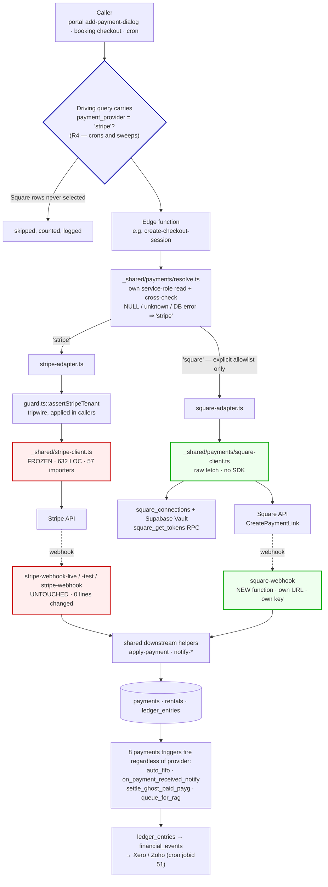
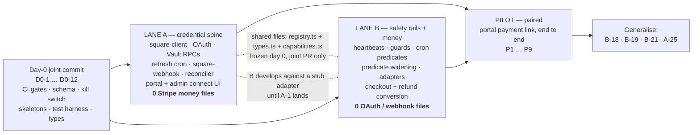

# Square Integration — Implementation Plan

**Branch:** `feature/square` · **Baseline commit:** `f7f17f2681006b3cf9f42707774ce9f91640756d` · **Revised:** 2026-08-25 (v2 — post adversarial review)
**Audience:** two engineers (Lane A / Lane B) + team lead
**Supabase project:** `hviqoaokxvlancmftwuo`

This revision supersedes v1. Every change from v1 is listed in [Appendix D](#appendix-d--what-changed-in-v2-and-why).

---

## TL;DR

- **The seam is not "one function branches".** There are **19** `checkout.sessions.create` sites and **8** `refunds.create` sites, and only **6** files import `TENANT_STRIPE_COLUMNS` — the other ~44 Stripe-reading functions hand-roll their tenant `select`. So a guard inside `getConnectAccountId` is a *tripwire*, not a control. The real control is a neutral operation layer at [`supabase/functions/_shared/payments/`](../../supabase/functions/_shared/payments/) plus **query-level provider scoping**. Per-function `if (square)` blocks are banned.
- **`_shared/stripe-client.ts` is FROZEN byte-identical** (632 LOC, 57 importers). Its sha256 is a required CI gate — the single strongest artifact proving the lead's non-negotiable was met. Same for `cors.ts`, `subscription-stripe.ts`, `deposit-hold-refresh.ts`.
- **`payment_provider` is `NOT NULL DEFAULT 'stripe'` everywhere.** A nullable variant silently breaks every `.eq('payment_provider','stripe')` fence — including the every-minute Stripe recovery cron. This is settled, not negotiable, and CI-asserted.
- **The guard and the kill switch ship *before* the column is settable.** `getConnectAccountId` does **not** fail closed today: for `payment_model='own'` + `stripe_mode='test'` (the live defaults on 42 of 52 tenants) it returns `STRIPE_TEST_CONNECT_ACCOUNT_ID` and mints a *real* Stripe TEST checkout that `stripe-webhook-test` settles as paid while no money moves.
- **Square v1 = single-shot payments only.** All 17 `setup_future_usage` sites vault a card; Square's hosted link cannot. Installments, auto-extend, PAYG, credit wallet and deposit *holds* are hard-gated OFF by a capability manifest, not left to fail at money time.
- **Four gaps v1 missed entirely, all now P0/P1:** 22 signed `agreement_templates` hardcode *"its payment processor, Stripe"*; the finance stack (`accounting_account_mappings`, `pnl_entries`) has no provider dimension so Square money books into Stripe accounts; there is **no edge-function test runner** in this repo; and 24 of 28 cron jobs have **no heartbeat** to prove a new provider filter did not starve them.

---

## Table of contents

1. [Verified baseline](#1-verified-baseline)
2. [Target architecture — the provider abstraction seam](#2-target-architecture--the-provider-abstraction-seam)
3. [The pilot path](#3-the-pilot-path)
4. [Task register — two parallel lanes](#4-task-register--two-parallel-lanes)
5. [Milestones and definitions of done](#5-milestones-and-definitions-of-done)
6. [External prerequisites and blockers](#6-external-prerequisites-and-blockers)
7. [Out of scope](#7-out-of-scope)
- [Appendix A — decision log](#appendix-a--decision-log)
- [Appendix B — frozen-file baseline and DDL checklist](#appendix-b--frozen-file-baseline-and-ddl-checklist)
- [Appendix C — no-change register](#appendix-c--no-change-register)
- [Appendix D — what changed in v2, and why](#appendix-d--what-changed-in-v2-and-why)

---

## 1. Verified baseline

Every number below was measured on this branch or queried against prod on **2026-08-25**. Estimate from these, not from the "4–5 match points" figure in the briefing.

### 1.1 Code surface

| Fact | Value | How verified |
|---|---|---|
| Square code on `feature/square` today | **zero** | grep across `supabase/functions/` + `apps/*/src` |
| `checkout.sessions.create` call sites | **19** — 3 platform-subscription + 3 sandbox out of scope ⇒ **13 in scope** | `grep -rl` |
| `refunds.create` call sites | **8** (`subscription-webhook` out) ⇒ **7 in scope** | `grep -rl` |
| `paymentIntents.create` call sites | **11** (all saved-card / hold ⇒ out of scope for v1) | `grep -rl` |
| `setup_future_usage: 'off_session'` sites | **17** | `grep -rn` |
| Files importing `_shared/stripe-client.ts` | **57** (+ the module) | `grep -rl` |
| Files referencing `getConnectAccountId` | **48** | `grep -rl` |
| Files importing **`TENANT_STRIPE_COLUMNS`** | **6** — all deposit-hold paths | `grep -rl` |
| Files importing `_shared/cors.ts` | **202** | `grep -rl` |
| `stripe_payment_intent_id` / `stripe_checkout_session_id` / `stripe_refund_id` references | **176 / 151 / 21** | `grep -rn` |
| `stripe-webhook-live` / `-test` / `stripe-webhook` | **1,965 / 1,954 / 1,187 LOC** — three receivers, all `verify_jwt=false` | `wc -l`, `config.toml` |
| `_shared/stripe-client.ts` / `create-checkout-session/index.ts` | **632 / 485 LOC** | `wc -l` |
| Apps carrying a generated `types.ts` | **4** — portal, booking, admin (22,064 lines each), **bonzah (18,777 — already stale)**. `apps/web` has none. CLAUDE.md documents 3. | `ls`, `wc -l` |
| Only app with `ignoreBuildErrors: false` + `strict: true` | **`apps/admin`** | `next.config.mjs`, `tsconfig.json` |
| Edge-function test files in the repo | **1** — [`supabase/functions/ghl-strategy-call-webhook/core.test.ts`](../../supabase/functions/ghl-strategy-call-webhook/core.test.ts) | `find` |
| Edge-function test **runner** | **does not exist** — `supabase/functions/deno.json` has no `tasks` block; root `package.json` has no `test` script | `cat` |

### 1.2 Database and infrastructure

| Fact | Value | How verified |
|---|---|---|
| Tenants | **52** · **42** `payment_model='own'` · **26** `stripe_mode='live'` | prod SQL |
| `payments` rows | **1,025** · **332** `Pending` with a session id · **325 of those older than 24h** | prod SQL |
| `tenants` columns / `anon` **column-level** SELECT grants | **262 / 236** — zero table-level grant, **RLS ON** | `information_schema.column_privileges`, `pg_class` |
| `payments` `anon` grants / RLS | **36 of 36 columns**, table-level SELECT+UPDATE, **RLS OFF** | as above |
| `rentals` RLS | **OFF** | `pg_class` |
| `tenants.country` | **does not exist** | `information_schema.columns` |
| `tenants.currency_code` | `'USD'` across all 52 | prod SQL |
| `deposit_charge_enabled` / `security_deposit_enabled` | **1 / 51** tenants | prod SQL |
| `agreement_templates` naming "Stripe" | **22 of 107 rows**, **16 tenants**, categories `installment` **and `standard`** | prod SQL |
| `pnl_entries` columns | **12** — `id, vehicle_id, entry_date, side, category, amount, source_ref, payment_id, rental_id, customer_id, reference, tenant_id`. **No provider dimension.** | `information_schema` |
| `accounting_account_mappings` key | `(tenant_id, provider, event_type)` where `provider` = `xero`\|`zoho`. **No payment-provider dimension.** | `information_schema` |
| Active pg_cron jobs / distinct `cron_runs.job_name` | **28 / 4** — 24 jobs have **no heartbeat** | `cron.job`, `cron_runs` |
| Rentals in `auto_extend_charge_mode='auto_charge'` | **0** — that branch has **never executed** | prod SQL |
| Payments with `refund_status='scheduled'` | **0**, and no cron dispatches `process-scheduled-refund` | prod SQL, `cron.job` |
| `payments_platform_account_check` | `IN ('uk','uae')`, `NOT NULL DEFAULT 'uk'` | `pg_constraint` |
| `payments_refund_status_check` | `IN ('none','scheduled','processing','completed','failed')` — no `rejected` | `pg_constraint` |
| `tenants_payment_model_check` | `IN ('managed','own')`, `NOT NULL DEFAULT 'own'` | `pg_constraint` |
| OAuth template available | `accounting_connections` (18 cols, Vault secret ids, `refresh_failure_count`) + `accounting_get_tokens` / `_store_tokens` / `_clear_tokens` RPCs | prod SQL |
| Refresh cron template | **jobid 49** `refresh-accounting-tokens`, `*/10 * * * *`, active | `cron.job` |
| Two-provider adapter already shipped | [`supabase/functions/_shared/accounting/`](../../supabase/functions/_shared/accounting/) — `factory.ts` + neutral `types.ts` + `xero-client.ts` / `zoho-client.ts` | `ls` |

### 1.3 Five prod facts that change the shape of the work

1. **`getConnectAccountId` fails *open*, not closed.** [`_shared/stripe-client.ts:107-130`](../../supabase/functions/_shared/stripe-client.ts): for `payment_model='own'` + `stripe_mode='test'` — the exact defaults every new tenant is born with — it returns `own_stripe_test_account_id || STRIPE_TEST_CONNECT_ACCOUNT_ID`. It does **not** throw. So the first Square tenant reachable by unbranched Stripe code mints a genuine Stripe TEST checkout on the platform's shared test seller, `stripe-webhook-test` settles it, the 8 `payments` triggers run FIFO allocation, the rental is marked paid, and no money ever existed.
2. **The guard cannot reach the money paths.** Only 6 files import `TENANT_STRIPE_COLUMNS`, and all 6 are deposit-hold functions. [`process-installment-payment/index.ts:137`](../../supabase/functions/process-installment-payment/index.ts), [`auto-extend-rentals/index.ts:67`](../../supabase/functions/auto-extend-rentals/index.ts) and [`send-payg-reminders/index.ts:41`](../../supabase/functions/send-payg-reminders/index.ts) each spread a hand-rolled tenant object, so `payment_provider` arrives `undefined` and any in-helper guard silently no-ops.
3. **`payment_provider` is not a security boundary.** `payments` and `rentals` have RLS **off** and `anon` holds table-level UPDATE. The public anon key ships in the booking bundle, and [`apps/booking/src/app/booking-success/page.tsx`](../../apps/booking/src/app/booking-success/page.tsx) already writes `stripe_checkout_session_id` into `payments` from the browser for exactly this reason.
4. **Three Stripe code paths have never run in production** — the `auto_charge` branch of `auto-extend-rentals` (0 rentals), the scheduled-refund batch (0 rows, no cron), and the charged-deposit model itself (`deposit_charge_enabled` on 1 of 52). A defect there, first exercised by a Square tenant, will be *reported* as a Square bug and *fixed* in the wrong place.
5. **The OAuth pattern Square needs already runs in production** for Xero/Zoho. Square's "biggest unknown" is a clone, not a greenfield build.

---

## 2. Target architecture — the provider abstraction seam

### 2.1 The four rules

| # | Rule | Why |
|---|---|---|
| **R1** | **Frozen files.** `_shared/stripe-client.ts`, `_shared/cors.ts`, `_shared/subscription-stripe.ts`, `_shared/deposit-hold-refresh.ts` change by **zero bytes**. sha256 CI gate. | 57 + 202 importers. `stripe-client.ts` is incident scar tissue: `DEPOSIT_HOLD_CARD_VARIANTS` (idempotency keys suffixed by rung *index*), `getWebhookSecretCandidates` (a ternary there once 500'd every TEST webhook). `deposit-hold-refresh.ts::applyDueHoldFilters` is five chained `.or()` calls with a 60-line comment explaining why the fourth must stay one disjunction — and its consumer test stubs a `{ or }` object only, so adding `.eq()` there TypeErrors 10 pinned suites *and* changes the driver query for 29 live hold-bearing rentals to filter rows that cannot yet exist. |
| **R2** | **Dispatch at the top, never inline.** In-scope functions resolve the provider in their first ~30 lines and `return await handleSquare(...)`. Below that marker, not one character of existing Stripe code changes. | An inline `if (square)` scattered through a 485-line body means every future Stripe edit reasons about a Square variable in scope. |
| **R3** | **No `=== 'square'` outside `_shared/payments/`.** Callers branch on a **capability manifest**, never on a provider name. CI grep. | This is what makes a third provider one directory + one registry line. The repo already shows the failure mode: 12 hand-synthesised `payment_model: platform_account === 'uae' ? 'own' : 'managed'` sites are exactly this anti-pattern, and they are why `payment_model` is now unusable as a branch key. |
| **R4** | **The provider filter lives in the QUERY, not only in a helper.** Every tenant-sweeping cron and every tenant-scoped minter carries `payment_provider = 'stripe'` in its driving predicate; the adapter layer re-reads `tenants.payment_provider` with the service-role client. `assertStripeTenant` is a tripwire behind both. | Verified: the in-helper guard is inert for ~43 of 49 callers, and the column is anon-writable on RLS-off tables. Neither is a control on its own. |

### 2.2 Module layout

```
supabase/functions/_shared/payments/
├── types.ts            # PaymentProviderId, CheckoutSpec, RefundSpec, ProviderResult.
│                       #   NO metadata map. NO Stripe types imported.
├── resolve.ts          # resolveProvider(supabase, tenantId) -> { providerId, tenant }
│                       #   Own narrow service-role read, cached per invocation.
│                       #   NEVER accepts a caller-supplied row. Explicit allowlist.
├── registry.ts         # const ADAPTERS = { stripe: stripeAdapter, square: squareAdapter }
├── capabilities.ts     # Per-provider manifest — the ONLY sanctioned way to vary
│                       #   behaviour outside an adapter.
├── guard.ts            # assertStripeTenant(tenant) — loud throw. Applied in CALLERS.
├── predicates.ts       # isElectronicPayment() etc. Mirrored in apps/portal.
├── checkout.ts         # createHostedCheckout()  <- the only fn the 13 creators call
├── refund.ts           # createRefund()          <- the only fn the 7 refunders call
├── stripe-adapter.ts   # imports _shared/stripe-client.ts UNCHANGED; adapts its output
├── square-adapter.ts   # implements the same interfaces over square-client.ts
└── square-client.ts    # dependency-free raw fetch. Square-Version pinned.
                        #   Deterministic <=45-char idempotency keys. Retry/backoff.
```

Structurally this is [`_shared/accounting/`](../../supabase/functions/_shared/accounting/) — the two-provider adapter this repo already ships and runs under cron jobid 51. Copy that shape; do not invent a new one.

**Naming is settled.** One directory, one resolver, one export surface. `payment-provider.ts`, `payment-rail.ts` and `payment-identity.ts` are all **banned** by CI — the accounting-`provider` collision (`ProviderName = 'xero' | 'zoho'` threads through ~15 sites in the same money pipeline) is resolved by *import path*, not by coining new vocabulary.

Four **narrow** interfaces, not one god-interface. A union interface would force every Square method to accept-and-ignore `cancel_url`, `setup_future_usage`, `stripeAccount` and partial-capture params — which is precisely how a Square bug becomes a silent Stripe-shaped assumption.

```ts
// _shared/payments/types.ts  (shape, not final code)

export type PaymentProviderId = 'stripe' | 'square';

export interface CheckoutSpec {
  amountMinor: number;
  currency: string;            // ISO-4217, UPPERCASE. Never the caller's lowercased value.
  description: string;
  customerEmail?: string;
  successUrl: string;
  cancelUrl?: string;          // Stripe honours it; Square adapter ignores (see caps)
  correlationRef: string;      // bare UUID = the payments row id. <=36 chars.
  vaultCard: boolean;          // Stripe: setup_future_usage. Square: must be false.
}

export interface RefundSpec {
  amountMinor: number;
  currency: string;
  reason?: string;
  idempotencyKey: string;      // <=45 ASCII, deterministic
  correlationRef: string;
}

export interface ProviderCapabilities {
  supportsCancelUrl: boolean;
  supportsLinkSelfExpiry: boolean;
  supportsCardVaulting: boolean;
  supportsAuthHold: boolean;
  supportsPartialCapture: boolean;
  supportsInstallments: boolean;
  maxMetadataKeys: number;
  referenceIdMaxLen: number;
  idempotencyKeyMaxLen: number;
  countryAllowlist: string[] | null;
}

export interface HostedCheckoutProvider { createHostedCheckout(...): Promise<ProviderResult>; }
export interface RefundProvider         { createRefund(...): Promise<ProviderResult>; }
export interface AccountLinkProvider    { start(...); callback(...); refresh(...); status(...); }
export interface WebhookVerifier        { verify(rawBody: string, headers: Headers): boolean; }
```

**Capability manifest, v1 — this is the product spec, not a hint:**

| Capability | `stripe` | `square` |
|---|---|---|
| `supportsCancelUrl` | true | **false** — Square has one redirect, success only |
| `supportsLinkSelfExpiry` | true | **false** — no `expires_at`; `DeletePaymentLink` is the only invalidation |
| `supportsCardVaulting` | true | **false** — hosted link cannot vault |
| `supportsAuthHold` | true | **false** — out of scope by lead ("deposit tak hi raho") |
| `supportsPartialCapture` | true | false |
| `supportsInstallments` | true | **false** — depends on vaulting |
| `maxMetadataKeys` | 50 | 10 |
| `referenceIdMaxLen` | 200 | 40 |
| `idempotencyKeyMaxLen` | 255 | 45 |
| `countryAllowlist` | null | `['AU','CA','FR','IE','JP','ES','GB','US']` |

Every Square constant in the right-hand column is **provisional until [X-8](#61-human-latency-items--start-on-day-0) returns a citation.** They live in exactly one file so a wrong number is one edit, not twelve.

The ~30 feature gates the area plans scattered across a dozen files (installments toggle, PAYG toggle, auto-extend, deposit-hold UI, saved-card button, pre-auth refusal) all become `if (!caps.supportsInstallments) …`. Enforced by R3's CI grep.

### 2.3 Data model

All migrations strictly additive, applied via `mcp__supabase__apply_migration` (project convention — do not write files into `supabase/migrations/`).

| Object | Definition | Note |
|---|---|---|
| `tenants.country` | `text` ISO-3166-1 alpha-2, nullable, backfilled from `location` with manual review of 52 rows | Required in onboarding going forward. The 8-country gate has nothing to read today |
| `tenants.payment_provider` | **`text NOT NULL DEFAULT 'stripe'`** + `CHECK IN ('stripe','square')`, all 52 backfilled | **Never widen `payment_model`.** `BEFORE UPDATE` trigger raises if it changes once set ⇒ enforces "decided once", and is the only enforcement available given RLS is off on `payments`/`rentals` |
| `tenants.square_mode` | `text NOT NULL DEFAULT 'test'` + `CHECK IN ('test','live')` | Sibling column, idiomatic with `boldsign_mode` / `bonzah_mode` / `inshur_mode`. **Never overload `stripe_mode`** (load-bearing for 26 live tenants) |
| `payments.payment_provider` | **`text NOT NULL DEFAULT 'stripe'`**, 1,025 rows backfilled | Manual/cash payments have both id columns NULL, so provider can never be *inferred*. Nullable would silently break every `.eq('payment_provider','stripe')` fence |
| `payments.square_payment_link_id`<br>`payments.square_order_id` (indexed)<br>`payments.square_payment_id`<br>`payments.square_refund_id`<br>`payments.square_refund_state` | nullable `text` | **Sibling columns.** Never rename or neutralise `stripe_*` (348 sites). `square_refund_state` carries Square's raw lifecycle so `payments.status` keeps Stripe semantics |
| `payments` exclusivity CHECK | `payment_provider <> 'square' OR (stripe_checkout_session_id IS NULL AND stripe_payment_intent_id IS NULL AND stripe_refund_id IS NULL)` | Free on all 1,025 rows. Turns "mutual exclusivity by convention" into a constraint — see [§2.8](#28-the-shared-bounded-queue) |
| `payments` anon **REVOKE** | `REVOKE SELECT (square_*) ON public.payments FROM anon` | `payments` has RLS **off** and `anon` holds table-level SELECT, so new columns are world-readable by default and broadcast over `supabase_realtime` |
| `payments_refund_status_check` | append **`'rejected'`** | Square `REJECTED` ≠ `FAILED`: the seller's Square balance *and* linked bank came up short, up to 14 days later. An operator-billing signal, not a card signal |
| `square_connections` | Structural clone of `accounting_connections`: `tenant_id, status, access_token_secret_id, refresh_token_secret_id, token_expires_at, merchant_id, square_location_id, square_location_currency, scopes[], refresh_failure_count, last_error, connected_by, connected_at, disconnected_at`. **RLS ON.** | Tokens in **Supabase Vault**, never raw. Keeps Square state **off `tenants`** — see the anon-grant trap below |
| `square_connections_public` | Secret-free view for the frontend | Mirrors `accounting_connections_public` |
| `square_oauth_state` | Clone of `accounting_oauth_state` + hourly reaper | Mirrors cron jobid 50 |
| `processed_square_events` | `event_id PK, event_type, merchant_id, square_environment, raw_body jsonb, processed_at`. **RLS ON.** | Square's signature has **no timestamp** ⇒ `event_id` dedupe is the *only* replay defence. Persist the raw body: Square's logs and Events API both expire at 28 days with no resend. Do **not** reuse `processed_stripe_events` — it has no body column and RLS off |
| `pnl_entries.payment_provider` | nullable `text`, stamped from the payments row | Otherwise no operator or super admin can ever split revenue by processor — [§2.9](#29-money-leaves-the-payments-table) |
| `accounting_account_mappings` | add a payment-provider dimension to the sentinel lookup, defaulting to the existing row when null | Otherwise Square receipts post to the tenant's **Stripe clearing account** in their real Xero/Zoho ledger |

**Three `ADD COLUMN` traps, all confirmed live:**

- **`tenants` anon grants.** 262 columns, 236 `anon` **column-level** SELECT grants, **zero** table-level grant. [`apps/booking/src/contexts/TenantContext.tsx`](../../apps/booking/src/contexts/TenantContext.tsx) selects ~134 columns in one PostgREST statement; one ungranted column 403s the whole query and **every booking site on every tenant** falls back to default branding. This has happened before (`customer_theme_mode`). Any new `tenants` column the booking site reads gets `GRANT SELECT (col) ON public.tenants TO anon;` **in the same migration**, verified with a real anon-key query before merge.
- **`payments` is the mirror image.** RLS off, table-level `anon` SELECT, and a member of `supabase_realtime`. New columns need no grant to become public — they need a **REVOKE**. Never store a Square payment-link URL there: it is a bearer link to pay an invoice.
- **Never put `'square'` in `payment_model`, `platform_account` or `stripe_mode`.** [`getStripeClientForRecord`](../../supabase/functions/_shared/stripe-client.ts) line 592 is `record.platform_account === 'uae' ? 'uae' : 'uk'` — no default case, no throw — so `'square'` silently resolves to a live **UK Stripe** client across 25 call sites. And because `platform_account` is `NOT NULL DEFAULT 'uk'`, Square rows are *stamped* `'uk'` as the normal case: orthogonality alone is not protection, which is why [B-4](#42-lane-b--stripe-safety-rails-and-money-flows) adds a throw at the top of `getStripeClientForRecord`'s **callers** and [B-21](#42-lane-b--stripe-safety-rails-and-money-flows) adds a provider dimension to revenue reporting.

**Two things that are NOT in the data model, deliberately:**

- **No `payments.provider`** — the bare name collides with the accounting provider (`financial_event_sync_state.provider`, `backfill_jobs.provider`), one join away in the same pipeline.
- **No `GENERATED … STORED` neutral columns.** On PostgreSQL 17.6 stored generated columns are **not emitted by logical replication**, and `payments` is in the `supabase_realtime` publication — so a `COALESCE(stripe_*, square_*)` generated column would be permanently invisible to every realtime subscriber and unusable in a channel filter. That is a trap installed for a convenience the adapter already provides.

### 2.4 Dispatch



Red = frozen, zero diff. Green = new code only. Blue = the query-level fence that is the actual control.

### 2.5 The webhook carve-out (get this signed by the lead)

`square-webhook` is a **new function**. This is the one deliberate exception to "no parallel duplicate functions", and the justification is one sentence: *the rule exists to stop two implementations of the same logic drifting; Stripe and Square share no signature scheme, no payload shape, no event vocabulary, no timeout budget and no failure-accounting pool, so there is nothing to drift.*

| Axis | Stripe | Square | Consequence |
|---|---|---|---|
| Signature | HMAC over `timestamp.rawBody` | HMAC-SHA256 over **`notification_url` + rawBody** | Square's signature only verifies against the exact registered URL; sharing `/stripe-webhook-live` makes a Stripe-branded path load-bearing config for Square crypto |
| Ack budget | 15s synchronous work is deliberate (`HOLD_SYNC_TIMEOUT_MS = 15_000`) | **10s total**, and a slow ack causes a **duplicate delivery** | Incompatible in one handler |
| Auto-disable | Endpoint "has already been one notice away from disabled" (in-file comment); disabled kills `checkout.session.completed` for **all** tenants | Shared pool | A Square exception escaping to 500 burns Stripe's budget for **26 live tenants** — the exact forbidden outcome |
| Events | 7-type `switch` | `payment.created/updated`, `refund.created/updated`, thin `order.updated` — state-diffing, not type-switching | No shared dispatch |
| Routing | Per-mode secret candidates | One application-wide subscription, routed by `merchant_id` | No analogue |
| Cost of the edit | — | — | **5,106 LOC** across three ~90%-duplicated files |

`square-webhook` stays **thin**: verify → dedupe on `event_id` → persist raw → return 2xx → hand off to the **same** downstream helpers the Stripe path already calls (`apply-payment`, `notify-*`). Money logic stays single-sourced; only transport is duplicated. **No shared-settler extraction is performed** — see [§7](#7-out-of-scope).

**One hard invariant on the Square handler:** settlement in this system is driven entirely by `payments.status` through 8 DB triggers, none of which reads a provider column. So the Square handler may write `status='Completed'` **only** for a Square payment whose Square status is `COMPLETED`, never for `APPROVED`. Mapping an approved-but-uncaptured payment to `Completed` allocates money that does not exist, in the database, with no edge-function guard consulted. Likewise never write `status='Refunded'` for a `PENDING` Square refund: `notify_refund_processed` dedupes one-shot on payment id and can never emit a correction when the refund later lands `REJECTED`.

### 2.6 Correlation — DB lookup, not metadata

[`create-checkout-session:299-322`](../../supabase/functions/create-checkout-session/index.ts) writes up to 15 metadata keys; `stripe-webhook-live` reads 18 distinct ones. Square's `Order.metadata` caps at ~10 keys / 255-char values, and `Payment` has no metadata map at all.

**Decision: do not compact Stripe's metadata bag.** The Square path never depends on provider metadata:

1. Write the `payments` row **before** calling Square, carrying every context value in real Postgres columns. **This write failure is fatal** — never log-and-return a live payment URL, which is what the Stripe path does today at `:378 / :424 / :456`. On Square that row id *is* the correlation key, so a missing row is unrecoverable money.
2. Pass its bare UUID as Square's `reference_id` (36 chars, fits the 40-char cap).
3. Persist `square_payment_link_id` and `square_order_id` on that row at creation time.
4. `square-webhook` resolves everything by indexed lookup on `square_order_id` — zero metadata reads, zero `RetrieveOrder` round-trip.

The correlation *architecture* is already right on the Stripe side: `stripe-webhook-live` correlates at lines 384/580/659/913/1052/1105 via `.eq('stripe_checkout_session_id', session.id)` — a pre-planted DB lookup, exactly the Square pattern.

**The redirect contract is shared across two apps and 13 edge functions.** `{CHECKOUT_SESSION_ID}` appears at 4 portal sites, 5 booking sites and 13 edge functions — **including `create-checkout-session:290-295` and `create-hold-checkout:304` as their own defaults**. So a Square call that omits `successUrl` still gets a Stripe-templated redirect and the customer lands on `/booking-success?session_id={CHECKOUT_SESSION_ID}` with the braces intact. The Square branch constructs its own default and asserts its `success_url` never contains the literal.

### 2.7 Square client rules

| Rule | Reason |
|---|---|
| **Raw `fetch` only. The `square` npm/esm SDK is banned**, CI-enforced on `npm:square` / `esm.sh/square`. | The SDK types `Money.amount` as `bigint`; `_shared/cors.ts::jsonResponse` is a bare `JSON.stringify` with 202 importers and throws on BigInt — **after** the money has moved. The natural "fix" is patching shared `jsonResponse`, a behaviour change to every Stripe money path. Raw fetch also keeps the Stripe module graph provably unchanged. |
| Pin `Square-Version` explicitly on every request. | An unpinned client defers to a mutable Developer Console default that any teammate can change with no deploy and no audit trail. |
| Deterministic idempotency keys: SHA-256 of `(entity, id, amount, attempt)` truncated to the cap, persisted on the row. | Square **requires** `idempotency_key` on `RefundPayment`. Every existing key seed in this repo overflows a 45-char cap (`charge-saved-card-<uuid>-<uuid>` = 91). Never truncate the raw seed (collides across rentals sharing a prefix); never mint a fresh UUID per attempt (turns one timed-out request into two real refunds, and Square has no `CancelRefund`). |
| Signature verifier accepts a **list** of candidate keys. | Square's key rotation has no dual-key grace window. Mirror `getWebhookSecretCandidates` — and copy its *conditional-spread* shape, not a ternary: its own comment records that a ternary falling back to `''` took down every TEST webhook, because `Deno.env.get('')` throws while the array literal is being built. |
| `SQUARE_WEBHOOK_NOTIFICATION_URL` is an env var, never reconstructed from `req.url`. | Supabase sits behind a proxy; the URL is inside the signed payload and one trailing slash flips verification to false for 100% of events. |
| Parse `errors[]` as an **array**; branch on the Square error `code`, never the HTTP status; never surface `detail` to a customer. | Square documents `detail` as developer-facing, and dispute-blocked refunds are reported with a misleading status. |
| Shape every response through an explicit serializer. | A raw provider error object handed to `jsonResponse` leaks merchant detail regardless of whether the SDK is used. |

### 2.8 The shared bounded queue

[`recover-pending-stripe-payments`](../../supabase/functions/recover-pending-stripe-payments/index.ts) (pg_cron **jobid 34**, `* * * * *`) is the only webhook-miss recovery in the system. Both of its passes select `status='Pending' AND stripe_checkout_session_id IS NOT NULL … .limit(100)` across **all** tenants, and there is **no index on that column** (verified: `idx_payments_stripe_payment_intent` exists for the sibling; nothing for the session id).

Two consequences:

- If any Square identifier is ever written into `stripe_checkout_session_id`, unresolvable Square rows occupy the 100-row window **every minute** and genuine Stripe recoveries silently stop — precisely when the webhook has already been missed. Six writers touch that column, one of them client-side browser code.
- Square gets **no** recovery net at all, against a delivery guarantee weaker than Stripe's.

Mitigation is three parts, all in [B-4](#42-lane-b--stripe-safety-rails-and-money-flows): the `.eq('payment_provider','stripe')` fence on **both** passes (a proven no-op today), the exclusivity CHECK from §2.3, and the missing partial index. Say honestly in the PR that the index is an *improvement over a seq scan*, not plan parity. A separate Square reconciler ([A-19](#41-lane-a--credential-spine-and-transport)) is a **launch blocker**, not a follow-up.

> Separately: **325 of the 332 `Pending`-with-session rows are already older than 24h** and are recovered by nothing. That backlog is pre-existing Stripe debt — file it, do not widen the window inside this workstream, and do not let a Square reconciler inherit a 24-hour blind spot by imitation.

### 2.9 Money leaves the `payments` table

The settlement engine fans out further than the area plans modelled. `payment_apply_fifo_v2` writes `ledger_entries`, which fires `enqueue_financial_event_on_ledger_insert` → `financial_events`, drained **every 2 minutes** by pg_cron jobid 51 into tenants' **real** Xero/Zoho ledgers (7,471 rows already queued, 1 live connection).

That chain is provider-agnostic, which is good — Square inherits correct accounting for free. But two things are not:

- `loadPaymentAccountMapping` ([`process-accounting-sync/index.ts:600`](../../supabase/functions/process-accounting-sync/index.ts)) is keyed on `(tenant_id, xero|zoho, event_type)` with **no payment-provider dimension**, so Square receipts post to the tenant's Stripe clearing account. That is a tax-filing error, silent until an accountant reconciles.
- `pnl_entries` has **no provider column**, so `/pl-dashboard`, `/reports/vehicle-profitability` and `get-vehicle-profitability` can never split revenue by processor. `payments/analytics` groups by `method`, and Square rows are mandated `method='Card'` (correctly — writing `'Square'` would drop them out of the operator's own filter UI).

Both are [B-21](#42-lane-b--stripe-safety-rails-and-money-flows), and the accounting half **gates the launch flag**.

---

## 3. The pilot path

**Pilot: the portal operator raises a payment link against an existing rental.**

[`apps/portal/src/components/shared/dialogs/add-payment-dialog.tsx`](../../apps/portal/src/components/shared/dialogs/add-payment-dialog.tsx) + [`apps/portal/src/hooks/use-payment-links.ts`](../../apps/portal/src/hooks/use-payment-links.ts) → [`create-checkout-session`](../../supabase/functions/create-checkout-session/index.ts) → Square `CreatePaymentLink` (order mode) → `square-webhook` → `apply-payment` → `process-refund`.

**Why not the booking flow**, the obvious candidate:

| Reason | Detail |
|---|---|
| Highest-traffic Stripe path | A regression there is the most expensive one available, across 52 tenants |
| Deepest vaulting dependency | `setup_future_usage` on that same session feeds `place-deposit-hold` — the one thing Square cannot do |
| No human in the loop | A Square defect reaches a paying customer with no operator check |

The portal link path traverses **every** seam that must be proven — provider read → Vault credential fetch → adapter → `CreatePaymentLink` → `payments` row with `square_order_id` → webhook resolution by order id → `apply-payment` allocation → `process-refund` reversal — and it already has an invalidation path in `void-payment-link`, so the `DeletePaymentLink` gap gets **exercised** rather than discovered in production. If the link fails, the operator sees it and collects another way.

*Counter-argument, and the answer:* the booking-deposit loop is what 100% of Square tenants use on day one, so it must also be proven — but as the **M4 go-live gate**, not as the first thing built. Proving a new provider on the highest-traffic path with no operator in the loop inverts the lead's risk posture.

**Optional throwaway spike:** [`send-excess-mileage-payment-link`](../../supabase/functions/send-excess-mileage-payment-link/index.ts) has zero callers and is unregistered — a free place to prove the Square *link mechanics* (order mode, `location_id`, `reference_id` length, redirect params, idempotency cap) before touching a live minter. It proves **nothing** about settlement: `'Excess Mileage'` is absent from `payment_apply_fifo_v2`'s `cat_order`, so that flow decrements the ledger directly rather than allocating. Use it, then throw it away.

### Pilot definition of done

On **one** sandbox Square tenant, all of the following, demoed in one sitting:

| # | Assertion |
|---|---|
| P1 | Operator raises a link from `add-payment-dialog`; a `payments` row exists with `payment_provider='square'`, `square_payment_link_id`, `square_order_id`, status `Pending`, **before** the Square call returns. A failed pre-insert **aborts** — it does not return a live URL |
| P2 | Buyer pays in the Square sandbox; `square-webhook` verifies the signature, dedupes on `event_id`, and moves the row `Pending → Completed` **resolving only by `square_order_id`** — zero metadata reads |
| P3 | `apply-payment` allocates it byte-identically to the Stripe equivalent; a `financial_events` row is written **exactly once**; the FIFO trigger fires; a customer notification is emitted **exactly once** |
| P4 | A duplicate webhook delivery (replay the same `event_id`) is a no-op |
| P5 | `void-payment-link` on an unpaid sibling link calls `DeletePaymentLink` and the link is genuinely dead |
| P6 | `process-refund` issues a **partial** refund; the row lands `PENDING` and completes on `refund.updated`; a second concurrent refund on the same payment returns "refund in flight", not a 500 |
| P7 | `git diff --stat supabase/functions/_shared/stripe-client.ts` = **empty**; the sha256 gate is green |
| P8 | Golden contract test: `create-checkout-session` invoked with a **Stripe** tenant produces a byte-identical outbound Stripe request body vs the committed baseline |
| P9 | The provider-integrity monitor returns **zero** rows: no `payments` row joins a Square-provider tenant to a non-null `stripe_*` id, and none the other way |

Only after P1–P9 are green does the team generalise to the remaining 12 checkout creators.

---

## 4. Task register — two parallel lanes

**Effort:** S ≤ 0.5d · M 1–2d · L 3–5d · XL > 5d
**Stripe risk:** None (new files only) · Low (additive DDL / caller-side guard) · Med (edits a live Stripe function) · High (edits a frozen or webhook file — **none of these exist in this plan by design**)

Every ID below is the **canonical** one. The ~250 area IDs (`SQ-OAUTH-*`, `SQ-CHK-*`, `SQ-DEP-*`, …) collapse into these; the mapping is in [Appendix D](#appendix-d--what-changed-in-v2-and-why).

### 4.0 Day-0 joint commit — both engineers, one authors, one reviews

Nothing forks until these land. If both engineers start in parallel first, each invents a `CheckoutSpec` and each applies overlapping DDL to the same live project, and the merge is a rewrite.

**Ordering inside D0 is load-bearing: the guard, the fence and the kill switch must be deployed before `payment_provider` is *settable*, not before Square code exists.**

| ID | Title | Pri | Eff | Depends | Stripe risk | Lane | Files |
|---|---|---|---|---|---|---|---|
| D0-1 | **CI gates, all four, as required status checks.** (a) sha256 frozen-file baseline; (b) keyword gate — fail if `square` appears in any `stripe*` path or a frozen file; (c) SDK ban — `npm:square` / `esm.sh/square`; (d) provider-name gate — `=== 'square'` / `=== 'stripe'` outside `_shared/payments/`. Plus a DB assertion that **no `payment_provider` column is nullable** and a grep that bans `payment-provider.ts` / `payment-rail.ts` / `payment-identity.ts`. | P0 | M | — | None | Joint | CI config, `docs/square-integration/` |
| D0-2 | Migration: `tenants.payment_provider` `NOT NULL DEFAULT 'stripe'` + CHECK + backfill 52 + **immutability trigger** + `GRANT SELECT (payment_provider) TO anon, authenticated` | P0 | S | — | Low | Joint | `mcp__supabase__apply_migration` |
| D0-3 | Migration: `tenants.country` (ISO-2, backfilled from `location` with manual review) + `tenants.square_mode` + CHECK + anon grants. **Do not touch `stripe_mode`.** | P0 | S | — | Low | Joint | as above |
| D0-4 | Migration: `payments.payment_provider` `NOT NULL DEFAULT 'stripe'` (1,025 backfilled) + `square_payment_link_id` / `square_order_id` (indexed) / `square_payment_id` / `square_refund_id` / `square_refund_state`; **`REVOKE SELECT (square_*) FROM anon`**; exclusivity CHECK; **partial index on `stripe_checkout_session_id`**; `BEFORE UPDATE` immutability trigger on `payments.payment_provider` | P0 | M | — | Low | Joint | as above |
| D0-5 | Migration: `payments_refund_status_check` append `'rejected'`, with a pre-flight `count(*) WHERE refund_status NOT IN (<new list>)` = 0 proof | P0 | S | D0-4 | Low | Joint | as above |
| D0-6 | Migration: `square_connections` + `square_connections_public` + `square_oauth_state` + `processed_square_events`, cloned from `accounting_connections`. **RLS ON on all of them.** | P0 | M | — | None | Joint | as above |
| D0-7 | RPCs `square_get_tokens` / `square_store_tokens` / `square_clear_tokens` (SECURITY DEFINER, Vault-backed), cloned from the `accounting_*` trio | P0 | M | D0-6 | None | Joint | as above |
| D0-8 | **`SQUARE_ENABLED` kill switch + launch flag, default OFF.** Both tenant-creation paths refuse to write `'square'` while dark. Every Square branch returns a structured refusal — **never** falls through to Stripe. | P0 | S | D0-2 | None | Joint | `_shared/payments/`, `create-sales-onboarding`, `CreateTenantDialog.tsx` |
| D0-9 | Skeletons: `types.ts`, `registry.ts`, `capabilities.ts`, `resolve.ts`, `guard.ts`, `predicates.ts` — no provider logic. **Frozen after this commit; changed only by joint PR.** | P0 | M | — | None | Joint | `supabase/functions/_shared/payments/` |
| D0-10 | **Edge-function test harness.** Add a `tasks` block to `supabase/functions/deno.json`, a root `npm` script, and CI wiring; retro-fit the one existing test (`ghl-strategy-call-webhook/core.test.ts`) as the reference pattern. Prove it with one test against untouched Stripe code. | P0 | M | — | None | Joint | `supabase/functions/deno.json`, `package.json`, CI config |
| D0-11 | Regenerate `types.ts` → copy to the **four** apps that have one (portal, booking, admin, **bonzah**); `cd apps/admin && npx tsc --noEmit && npm run build` as a required check. Decide explicitly whether `apps/web` needs one. | P0 | S | D0-2..6 | Med (admin is the only strict app) | Joint | `apps/*/src/integrations/supabase/types.ts` |
| D0-12 | Post-migration verification: 52/52 tenants and 1025/1025 payments carry non-null `payment_provider`; an **anon-key** SELECT of booking's exact `TenantContext` column list returns 200; an anon SELECT of the new `payments.square_*` columns is **denied**; one portal payments-tab loads | P0 | S | D0-2,3,4 | **Low, total blast radius** | Joint | — |

> **D0-11 tradeoff:** regenerating types pushes a 22k-line file into `apps/admin`, the only app with `ignoreBuildErrors: false` + `strict: true`. Ship DDL and types as **two independently revertable PRs**. `apps/bonzah` is at 18,777 lines vs the others' 22,064 — already stale; include it and eat the one-time diff.

### 4.1 Lane A — credential spine and transport

Engineer A owns everything Square-side that never touches a Stripe money file. **Zero edits to any `stripe*` path.**

| ID | Title | Pri | Eff | Depends | Stripe risk | Lane | Files |
|---|---|---|---|---|---|---|---|
| A-1 | `square-client.ts`: raw fetch, `Square-Version` pinned, retry/backoff, deterministic idempotency-key helper (cap parameterised, not hardcoded), `errors[]` array normalizer, explicit response serializer | P0 | L | D0-9, X-8 | None | A | [`_shared/payments/square-client.ts`](../../supabase/functions/_shared/payments/) |
| A-2 | Sandbox smoke: `ListLocations` + `CreatePaymentLink` against the console-minted test-seller token | P0 | S | A-1, X-4 | None | A | — |
| A-3 | `square-oauth-start` — clone the authz check + HMAC state from `stripe-oauth-start` (139 LOC, ~60% provider-neutral); use `square_oauth_state` (single-use nonce). **Do not extend the Stripe state payload** — its `verifyState` hard-validates `mode ∈ test\|live`, so a shared verifier rejects every Square state | P0 | M | D0-6, A-1 | None | A | `supabase/functions/square-oauth-start/` |
| A-4 | `square-oauth-callback` — **code flow, never PKCE**; tokens → Vault via `square_store_tokens`; capture `merchant_id`. **New function; `stripe-oauth-callback` keeps its name, its registered `redirect_uri` and a zero diff** | P0 | L | A-3, D0-7 | None | A | `supabase/functions/square-oauth-callback/` |
| A-5 | Readiness probe + currency/country gate: `RetrieveMerchant` + `ListLocations`, accept only `status='ACTIVE'` **and** `capabilities` containing `CREDIT_CARD_PROCESSING`; assert `Location.currency === tenants.currency_code` and refuse to activate on mismatch; store `square_location_id` + `square_location_currency`. Preserve the three-outcome redirect (`ok`\|`incomplete`\|`error`) | P0 | M | A-4 | None | A | `square-oauth-callback` |
| A-6 | `refresh-square-tokens` — copy [`refresh-accounting-tokens`](../../supabase/functions/refresh-accounting-tokens/index.ts) (326 LOC) verbatim in shape: refresh window ≤7 days, `MAX_CONSECUTIVE_FAILURES = 3` → status `expired` → portal reminder row. Memoised token getter safe to call **inside** a loop | P0 | M | A-4, X-8 | None | A | `supabase/functions/refresh-square-tokens/` |
| A-7 | Schedule A-6 in pg_cron **and verify it appears in the live `cron.job` table** — repo migration files are a known-inaccurate map, and this repo has a refresh cron that may never have been scheduled. Add a `cron_runs` dead-man heartbeat | P0 | S | A-6, B-5 | None | A | `cron.job`, `cron_runs` |
| A-8 | Alert on `square_connections.token_expires_at < now() + 7 days` **and** `refresh_failure_count > 0`. Alert on **proximity**, never on refresh failure — a cron that stops scheduling produces no failures | P0 | S | A-6 | None | A | `health_alert_outbox` |
| A-9 | `[functions.square-webhook] verify_jwt = false` and `[functions.square-oauth-callback] verify_jwt = false` — **appended at the end of `config.toml`, in a commit that changes nothing else in that file**. (The file already carries ~65 such entries; CLAUDE.md's "10" is stale) | P0 | S | — | Low | A | [`supabase/config.toml`](../../supabase/config.toml) |
| A-10 | `square-webhook` envelope: read the raw body **before** parsing; HMAC-SHA256 over (`SQUARE_WEBHOOK_NOTIFICATION_URL` + rawBody) via WebCrypto; constant-time compare; **candidate-key list** built with a conditional spread, never a ternary; `event_id` dedupe into `processed_square_events`; persist raw body; **2xx for unknown `merchant_id`**; return fast and defer | P0 | L | D0-6, A-9 | None | A | `supabase/functions/square-webhook/` |
| A-11 | `square-webhook` handlers: `payment.created/updated` → resolve by `square_order_id` → hand to `apply-payment`. `refund.created/updated`. `oauth.authorization.revoked` → mark disconnected (duplicate the ~10 lines of column clearing; **do not extract** from `stripe-connect-webhook`). Enforce the §2.5 status invariant | P0 | L | A-10, B-12 | None | A | `supabase/functions/square-webhook/` |
| A-12 | `check-square-connection` via `RetrieveTokenStatus` — records the **granted** scopes, which is what actually gates webhook delivery | P1 | S | A-4 | None | A | `supabase/functions/check-square-connection/` |
| A-13 | Portal `<SquareConnectSettings />` — a **sibling** component chosen by provider, **prepended** to the existing early-return chain in `stripe-connect-settings.tsx` (verified a plain early return, so prepending is provably non-disruptive). Persistent `incomplete` banner with a re-check action — nothing will ever push a "now it works" signal | P1 | M | A-4, A-12 | Low | A | `apps/portal/src/components/settings/` |
| A-14 | `use-setup-status.ts` + `use-platform-status.ts`: provider check at the **top**, returning a Square readiness object. Treat Stripe readiness columns as **not-applicable**, never `false`. Both hooks — `use-platform-status` is the bigger consumer and builds the Command Center checklist | P1 | M | A-5 | **Med — gates 26 live Stripe tenants' go-live** | A | `apps/portal/src/hooks/` |
| A-15 | `use-setup-reminder.ts` Square branch + `command-center.tsx` / `requests/page.tsx` `square_connect` integration type — otherwise a Square operator files a go-live request labelled "Stripe Connect" that can never auto-resolve | P1 | M | A-14 | Low | A | `apps/portal/src/hooks/`, `apps/portal/src/components/dashboard/`, `apps/admin/app/admin/(protected)/requests/page.tsx` |
| A-16 | `v_tenant_readiness`: **append** `square_ready`, `payments_ready`, `payment_provider` (CREATE OR REPLACE can only append) and redefine `issue_count` / `overall_ready` in place; keep the `stripe_ready` expression byte-identical. State plainly in the PR that those two columns change meaning. Note the view already filters `tenant_type IS DISTINCT FROM 'test'` | P1 | M | D0-2, A-5 | Low | A | `v_tenant_readiness`, `apps/admin/.../readiness/page.tsx` |
| A-17 | Admin onboarding: `country` becomes a required `<Select>`; Square radio gated on the allowlist **and** on `SQUARE_ENABLED`; persist provider + country in **both** creation paths ([`create-sales-onboarding`](../../supabase/functions/create-sales-onboarding/index.ts) and the raw client-side insert in `CreateTenantDialog.tsx`). Force the Square invariants: `deposit_charge_enabled=true`, `installments_enabled=false`, `auto_extend_enabled=false`, `payg_auto_reminders_enabled=false`, `migration_blocker='off'` | P0 | M | D0-2,3,8 | Low | A | `apps/admin/components/admin/SalesOnboardingDialog.tsx`, `CreateTenantDialog.tsx`, `create-sales-onboarding/index.ts` |
| A-18 | Admin surfaces: `tenant-payments-tab.tsx` Square panel; **hide** (not disable) the `payment_model` flip and the readiness runner for Square; gate `operator-prompt-card.tsx` (the only writer of `migration_blocker`, and 8 of 52 tenants already carry `'hard'`); return a distinct `n/a` state in `rentals/page.tsx`'s migration derivation | P1 | M | D0-2 | Med | A | `apps/admin/components/admin/`, `apps/admin/app/admin/(protected)/rentals/page.tsx` |
| A-19 | **`recover-pending-square-payments`** on the Events API — explicit `begin_time` + cursor pagination; distinguishes "missed" from "already processed" via `processed_square_events`. **Launch blocker** — Square has no equivalent of jobid 34 | P0 | M | A-10 | None | A | `supabase/functions/recover-pending-square-payments/` |
| A-20 | `sweep-square-payment-links` (Square links never self-expire) + schedule both A-19 and this in pg_cron; verify against `cron.job`; `cron_runs` heartbeats | P1 | M | A-19, B-17 | None | A | new fn, `cron.job` |
| A-21 | Alert on sustained non-2xx from `square-webhook` — one application-wide subscription means one auto-disable counter for **every** Square tenant | P1 | S | A-10 | None | A | `health_alert_outbox` |
| A-22 | Plumb `payment_provider` + `square_mode` + `square_location_id` through booking `TenantContext` — **only after D0-12's anon grant is verified**. Never plumb a credential | P2 | M | D0-12 | Low | A | [`apps/booking/src/contexts/TenantContext.tsx`](../../apps/booking/src/contexts/TenantContext.tsx) |
| A-23 | Square unit tests: signature (good sig true; tampered body / wrong URL / **trailing-slash URL** / missing header all false); idempotency key (deterministic, stable, ≤cap); error normalizer (multi-element `errors[]`; a dispute-blocked refund must **not** read as not-found) | P1 | S | A-1, A-10, D0-10 | None | A | `supabase/functions/_shared/payments/__tests__/` |
| A-24 | **Square dev-environment doc.** A stable named tunnel or a dedicated always-on preview Supabase project whose URL is registered once as the Sandbox notification URL; a second Sandbox subscription for CI with its own key; an explicit statement that **staging is unusable** (it shares prod's Stripe test account and its webhooks fire into prod) | P0 | M | X-3 | None | A | `docs/square-integration/DEV-ENVIRONMENT.md` |
| A-25 | **Operations runbook**: connect flow + exact portal copy; support decision tree for a 14-day `PENDING` refund, a `REJECTED` refund and an expired token; how Square tenants are identified across admin surfaces; a one-page "what Square tenants cannot do in v1" list so support is not diagnosing designed-out behaviour as bugs | P1 | M | A-13, B-16 | None | A | `docs/square-integration/OPERATIONS.md` |

### 4.2 Lane B — Stripe safety rails and money flows

Engineer B starts on work that **contains no Square code at all** and ships independently, then takes the adapters. Lane B never touches an OAuth or webhook file.

| ID | Title | Pri | Eff | Depends | Stripe risk | Lane | Files |
|---|---|---|---|---|---|---|---|
| B-1 | `guard.ts::assertStripeTenant(tenant)` — typed, loud throw. Applied in **callers**, so `stripe-client.ts` stays byte-identical. Documented as a **tripwire**, not the control | P0 | S | D0-9 | None | B | `_shared/payments/guard.ts` |
| B-2 | Apply `assertStripeTenant` + a `{skipped:'square_tenant'}` early return (same shape as `place-deposit-hold:211`) to the **8 hold functions** and to `charge-saved-card` / `create-preauth-checkout` / `create-hold-checkout`. **Do not touch `applyDueHoldFilters`** — Square is excluded from the hold engine by *data* (it never acquires a non-null `deposit_hold_status`), which is stronger than a predicate | P0 | M | B-1 | Low | B | `supabase/functions/*-deposit-hold*/`, `charge-saved-card`, `create-preauth-checkout`, `create-hold-checkout` |
| B-3 | Add `payment_provider = 'stripe'` to the driving query of the fan-out crons so Square tenants are **skipped, counted and logged — never processed and never thrown out of the loop**: jobid 4, 6, 32, 33, 34, 54, 55, 57, 61, 63. *(Correction: `accrue-payg-charges` (32) does **not** call `getConnectAccountId`; it gets the predicate for row-scoping only. Per-item `try/catch` is already present in `auto-extend-rentals:859`, `send-payg-reminders:714`, `process-installment-payment:204` and `deposit-hold-refresh:1351` — record that evidence in the PR rather than re-auditing it as a P0.)* | P0 | M | D0-2, B-5 | Low | B | the ten functions above |
| B-4 | Fence the Stripe-only sweepers: `.eq('payment_provider','stripe')` on **both passes** of `recover-pending-stripe-payments`, plus `backfill-payment-intent-ids`, `sync-payment-intent`, `fetch-payment-intent`, `audit-stripe-payment`, `sync-connect-status`. Add the exclusivity CHECK and the missing partial index from §2.8. Add a null-guard throw at the top of `getStripeClientForRecord`'s **callers** | P0 | M | D0-4 | Low | B | those six functions, `_shared/payments/guard.ts` |
| B-5 | **`cron_runs` heartbeats on the ten crons B-3 touches**, shipped **before** any predicate narrows, with two weeks of baseline `rows_considered`. Assert `rows_considered` is unchanged after B-3 — that single number is the cheapest possible proof a Square-motivated filter did not starve a Stripe sweep. Alert on >2 missed intervals | P0 | M | — | None | B | those ten functions, `cron_runs` |
| B-6 | **Predicate widening — one commit, both sides of the wire.** Replace `stripe_payment_intent_id IS NOT NULL` as the definition of "real electronic money" at all sites: server — `undo-manual-payment:143`, `reverse-payment:63`, `void-payment-link:122` **and** `:217`, `reject-rental:213`, `apply-payment:53`; portal — `use-rental-manual-paid-breakdown.ts:65`, `payments/page.tsx:153` (`isVoidableLink`), `:223`, `:299-301` (`canReversePayment`) **and `:596` (the JSX render gate)**. Extract one shared predicate in `_shared/payments/predicates.ts` + a mirror in `apps/portal/src/lib/`. `void-payment-link:122` is a **four-term composite**, not a null check — preserve the other three terms. **Ship in M1 while every row is `'stripe'`, so classification is provably byte-identical for all 1,025 rows** | P0 | L | D0-4, D0-10 | **Med** | B | those ten sites |
| B-7 | `provider-router.test.ts` — assert `null` / `''` / `'SQUARE'` / `' square'` / unknown / DB-error **all** route to Stripe; only the exact string `'square'` selects Square | P0 | S | D0-9, D0-10 | None | B | `apps/portal/src/__tests__/lib/` |
| B-8 | **Golden contract tests.** For `create-checkout-session`, `process-refund`, `capture-booking-payment`: run a Stripe-tenant fixture with the HTTP client stubbed and assert the outbound URL + body match a committed baseline **byte-for-byte**. The only artifact that positively proves no Stripe behaviour change | P0 | L | D0-9, D0-10 | None | B | `apps/portal/src/__tests__/` |
| B-9 | `capabilities.ts` populated per §2.2 + `useProviderCapabilities()` hook + server-side guard, so installments / auto-extend / PAYG / credit-wallet / holds render **disabled with an explanation** for Square instead of 500-ing at money time. Replaces ~30 hand-written gates | P0 | M | D0-9 | Low | B | `_shared/payments/capabilities.ts`, `apps/portal/src/hooks/` |
| B-10 | **`subscription-webhook` — three additive edits, and `stripe_mode` is never written for Square.** Introduce a separate `squareReady` term feeding **only** the `setup_completed_at` condition; leave `if (connectReady) patch.stripe_mode='live'` (line ~325) **byte-identical**; extend `hasBeenLive` (lines 524-529) with the same disjunct and add `payment_provider`, `square_connection_status` to its select at ~520. *(Writing `stripe_mode='live'` on a Square tenant — born `payment_model='own'` with no connected account — makes `getConnectAccountId` throw across 48 files. Omitting the `hasBeenLive` edit silently reverts that tenant's `bonzah_mode` to sandbox — fake insurance cover — on every trial event.)* Pin with a golden test over the 52 real tenant shapes | P0 | M | D0-2, B-8 | **Med** | B | [`supabase/functions/subscription-webhook/index.ts`](../../supabase/functions/subscription-webhook/index.ts) |
| B-11 | `stripe-adapter.ts` — imports `stripe-client.ts` unchanged, adapts to `HostedCheckoutProvider` + `RefundProvider`. A pure delegating shim; **no logic leaves `stripe-client.ts`** | P0 | M | D0-9 | None | B | `_shared/payments/stripe-adapter.ts` |
| B-12 | `checkout.ts::createHostedCheckout()` + `refund.ts::createRefund()` — the only functions the 13 creators and 7 refunders call. Owns provider resolution, the five-predicate `persistPaymentRow` guard, and the provider call | P0 | M | B-11 | None | B | `_shared/payments/` |
| B-13 | `square-adapter.ts` checkout: `CreatePaymentLink` in **order** mode (`quick_pay` carries no identifiers), `reference_id` = payments-row UUID, `square_location_id` from `square_connections`, currency UPPERCASE from the location (never the caller's lowercased value — `create-checkout-session:56` defaults to `'gbp'` and lowercases). Suppress **both** deposit-disclosure emissions (`:262` product description and `:281` `custom_text`) | P0 | L | B-12, A-1 | None | B | `_shared/payments/square-adapter.ts` |
| B-14 | **Convert `create-checkout-session`** to the neutral call. Append `payment_provider` to the three tenant selects at `:67 / :87 / :115`; insert the dispatch **after `tenantData` resolves (~:130)** and after the amount guard — *not* at `:24`, where rental-only callers have no tenant id yet. Zero characters changed below the marker. Explicitly **400** on `installmentId` / `paygAccrualId` / `extensionId` / `holdAsCredit` / `targetCategories` for Square rather than half-implementing them | P0 | L | B-13, B-8 | **Med — 10 frontend invocations, live booking flow** | B | [`create-checkout-session/index.ts`](../../supabase/functions/create-checkout-session/index.ts) |
| B-15 | `square-adapter.ts` refunds: `RefundPayment` with the deterministic key, persisted alongside `square_refund_id`; per-payment serialisation + backoff; write `refund_status='processing'` on a 200 and defer the terminal write **and the ledger rows** until `refund.updated` reports `COMPLETED` | P0 | L | B-12, A-1 | None | B | `_shared/payments/square-adapter.ts` |
| B-16 | **Convert `process-refund`**; route Square `REJECTED` to the existing `ledgerOnlyFallbackReason` manual path; stop returning HTTP 400-and-abort on the first provider error in a multi-category refund. Widen the **selection** queries at `:317` and `:353`, not only the branch at `:456` — otherwise `payment` is never selected and control still falls to the manual-refund else | P0 | L | B-15, D0-5 | **Med** | B | [`process-refund/index.ts`](../../supabase/functions/process-refund/index.ts) |
| B-17 | `void-payment-link` Square branch → live payment probe, then `DeletePaymentLink`, then mark voided. Its stated guarantee ("a still-live link can no longer be paid") is **silently false** for Square otherwise, and `:102` refuses any row without a `stripe_checkout_session_id`, so B-6's UI widening would surface a button that always errors | P0 | M | B-6, A-1 | Med | B | [`void-payment-link/index.ts`](../../supabase/functions/void-payment-link/index.ts) |
| B-18 | Convert the remaining in-scope creators through the same neutral call, **one deploy at a time**, each verified in prod: `create-upfront-checkout`, `installment-pay-link`, `send-invoice-email` (+ `mark-invoice-paid`, `send-installment-receipt`), `send-excess-mileage-payment-link`, `create-extension-checkout`. Any not yet converted must **throw** for Square — a silent Stripe call on behalf of a Square tenant is the worst outcome | P1 | L | B-14 | Med | B | those functions |
| B-19 | Convert the remaining refunders: `process-scheduled-refund`, `cancel-rental-refund`, `refund-installment-payments`, `reject-rental`, `deduct-from-deposit`. Same throw-if-unported rule | P2 | M | B-16 | Med | B | those five |
| B-20 | **`agreement_templates`** — 22 of 107 rows across **16 tenants** and **two categories** (`installment` *and* `standard`) hardcode *"its payment processor, Stripe"* into the renter's e-signed debit authorisation. Replace with a `{{payment_processor}}` placeholder resolved at generation time in `create-boldsign-document` and both `esign` routes; verify against a **real generated PDF** for a Stripe tenant (the 22 rows are per-tenant customisations — a naive UPDATE rewrites operator edits). Add a **DB-level** guard so a Square tenant cannot create an installment plan at all. **Escalate: changing signed-contract wording is a legal review item** | P0 | M | D0-2 | Low | B | `agreement_templates`, `create-boldsign-document`, `apps/portal/src/app/api/esign/route.ts`, `apps/booking/src/app/api/esign/route.ts` |
| B-21 | **Finance and reporting provider dimension.** (a) add a payment-provider dimension to `accounting_account_mappings`' sentinel lookup, falling back to the existing row when null — **gates the launch flag**; (b) `pnl_entries.payment_provider`, stamped by `apply-payment` / `reverse-payment` / `undo-manual-payment` / `reject-rental`; (c) a provider facet on `payments/analytics` and `pl-dashboard` reading `payment_provider`, keeping `method='Card'` untouched | P1 | L | D0-4 | Low | B | [`process-accounting-sync/index.ts`](../../supabase/functions/process-accounting-sync/index.ts), `pnl_entries`, `apps/portal/src/app/(dashboard)/pl-dashboard/`, `payments/analytics/` |
| B-22 | **Platform ToS decision.** Naming Square in the sub-processor clause trips a live re-consent gate — `platform-tos.ts:16-17` instructs bumping `PLATFORM_TOS_VERSION`, `:61` already stages `PLATFORM_TOS_PENDING_VERSION = "2026-08-01"`, and `tenants` carries five consent columns. Either fold the mention into that staged version (one re-consent event) or word the clause generically (`:268` already says "including Stripe and its affiliates"). Update `platform-tos.test.ts` in the same commit and record the decision beside the constant | P1 | S | — | Low | B | [`apps/web/src/lib/legal/platform-tos.ts`](../../apps/web/src/lib/legal/platform-tos.ts), `_shared/platform-tos.ts`, `apps/portal/src/__tests__/lib/platform-tos.test.ts` |
| B-23 | Square abandonment interstitial — an owned page that holds the back button before redirecting to `square.link`, since Square has one redirect and it fires on success only. Doubles as the only place the deposit disclosure can live for a Square tenant (see B-13) | P2 | M | B-14 | Low | B | `apps/booking/src/app/` |
| B-24 | Sandbox fixture denylist for Square's magic amounts — existing fixtures use realistic figures and will produce "flaky" behaviour nobody can reproduce. Confirm the values in X-8 first | P2 | S | X-8 | None | B | `supabase/functions/sandbox-fixture-setup/`, `scripts/seed-vehicles.mjs` |
| B-25 | **Pre-existing Stripe defect track — separate, attributable commits, each landing BEFORE its Square counterpart.** (1) `auto-extend-rentals:628` writes `booking_source:'auto_extend'` against a CHECK of `('admin','website')` with no error binding, and `send-auto-extension-reminder:190` repeats it — **186 approved extensions currently hold a checkout session and no `payments` row**; reconcile those 186 *before* changing the INSERT, or the paid-but-unsettled and unpaid-and-stale populations become indistinguishable. (2) `reject-rental` writes `refund_status='pending_manual'` and `status='Cancelled'`, neither permitted, both unchecked. (3) `cancel-rental-refund` temporal-dead-zone `ReferenceError` on the multi-payment branch. (4) `send-payg-manual-reminder` has **zero authorization** — verify the two known callers, super-admin impersonation and manager-role users before adding it. (5) `send-excess-mileage-payment-link` inserts `payment_type:'Excess Mileage'` against a CHECK that forbids it — **re-rate this Med, not Low: fixing it creates a `payments` row where none has ever existed, which the every-minute jobid 34 will then settle and FIFO-allocate** | P1 | L | B-5 | **Med** | B | those five functions |
| B-26 | **Exercise the never-run paths on Stripe first.** Walk the charged-deposit model end to end on a Stripe tenant with both flags true (verified 1 of 52 has `deposit_charge_enabled`, so this has effectively zero production mileage), recording which allocator actually ran. Launch Square auto-extend in `pay_link` mode only until the Stripe `auto_charge` branch (0 rentals, never executed) is exercised in staging. Do **not** schedule the scheduled-refund batch | P1 | M | B-5 | Low | B | `create-checkout-session`, `apply-payment`, `process-refund`, `auto-extend-rentals` |
| B-27 | **Third-provider proof.** `null-adapter.ts` — an all-false capability manifest whose methods throw — registered behind a test-only export, with a CI assertion that registering it requires exactly **one adapter file, one `registry.ts` line, one `capabilities.ts` row and one CHECK value**, and **zero** caller edits. One hour, and it turns the lead's "make a third provider cheap" from an assertion into a CI assertion | P2 | S | B-9 | None | B | `_shared/payments/null-adapter.ts`, CI |
| B-28 | Docs + knowledge graph: CLAUDE.md edge-function catalogue, the type-regen recipe (**four** apps, not three), the stale `verify_jwt=false` count (~65, not 10), `docs/DATABASE_SCHEMA.md`, and `./bin/kg update` (graph state is already dirty on this branch) | P2 | S | all | None | B | `CLAUDE.md`, `docs/DATABASE_SCHEMA.md`, `knowledge-graph/` |

### 4.3 Lane collision map



The only files both lanes touch are `registry.ts` (one line each) and the day-0 skeletons, which are frozen. Lane B develops `square-adapter.ts` against a stubbed client until A-1 lands — and X-4's console-minted sandbox token means Lane A can call real Square on day 1, before the OAuth flow exists.

---

## 5. Milestones and definitions of done

| Milestone | Duration | Owner | Definition of done |
|---|---|---|---|
| **M0 — Decisions & accounts** (no feature code) | 2 days | Lead + both | Vaulting go/no-go answered **in writing** (BL-1); country / market direction answered (BL-2, BL-3); webhook carve-out signed (BL-4); dev environment named (BL-5); **X-8 Square-constants evidence table checked in with citations**; both Square applications registered; sandbox test seller created; `square-webhook` URL reserved and A-9 merged; **D0-1 CI gates green and required**; D0-2…D0-12 applied and verified (52/52 tenants, 1025/1025 payments, anon smoke both directions) |
| **M1 — Safety rails + credential spine** | 5 days | A ∥ B | **B:** heartbeats live with baseline (B-5); guard applied to the hold family + the 11 fenced functions (B-1…B-4); **predicate widening merged across all ten sites with byte-identical classification for 1,025 rows** (B-6); router + golden contract tests green (B-7, B-8); capability manifest live (B-9); `subscription-webhook` three-edit patch merged with its golden test (B-10). **A:** `square-client.ts` calls the sandbox seller with `Square-Version` pinned and a deterministic key (A-1, A-2). **Both:** `git diff --stat` on all four frozen files is **empty** and the checksum gate is green. **Zero Square rows exist; `SQUARE_ENABLED` is off** |
| **M2 — Connect a tenant** | 5 days | A | Operator completes `square-oauth-start` → callback → tokens in Vault → `merchant_id` + an ACTIVE `CREDIT_CARD_PROCESSING` location + currency reconciled (A-3…A-5); portal shows Connected / Expiring / Broken (A-12, A-13); `refresh-square-tokens` scheduled **and confirmed present in the live `cron.job` table** with one successful refresh (A-6, A-7); expiry-**proximity** alert fires (A-8); `oauth.authorization.revoked` marks the tenant disconnected; Setup Hub, go-live requests and `v_tenant_readiness` show a Square tenant as **ready**, not permanently red (A-14…A-16); onboarding gates Square on country and writes the invariants (A-17, A-18) |
| **M3 — Pilot** | 5 days | A + B **paired** | **P1–P9** in §3 green on one sandbox Square tenant. This is the one place two people on one path is correct — it is the first time real money moves. `agreement_templates` placeholder verified against a real generated PDF (B-20) |
| **M4 — Generalise + production smoke** | 5 days | A ∥ B | Remaining creators and refunders route through the same adapter with **no new provider logic** (B-18, B-19); link expiry sweep and Square reconciler scheduled and verified (A-19, A-20); webhook non-2xx alerting live (A-21); **accounting mapping provider dimension merged (B-21a) — this gates the flag**; the **booking-deposit loop** proven end to end on the pilot tenant; one **real** Square seller takes and refunds one low-value real payment; runbook and docs published (A-25, B-28) |

**Rollback and rollout — mandatory on every deploy from M1 onward:**

1. The provider resolver is an **early return above untouched Stripe code** and fail-safes to Stripe on `null` / unknown / DB error.
2. `SQUARE_ENABLED` is a secret flip, not a deploy. **It IS the rollback** — because the provider choice is deliberately immutable, "switch the tenant back to Stripe" does not exist, and falling back to Stripe would route a Square tenant to `STRIPE_TEST_CONNECT_ACCOUNT_ID` and take a fake payment. A Square tenant onboarded in error can only be recovered by **recreating the tenant**; tell Sales this in writing before the first onboarding, not during an incident.
3. **DDL is never reverted.** All additions are additive with a `'stripe'` default; dropping a column a deployed function selects 400s every query naming it. Only the anon `GRANT` and the `refund_status` CHECK widening need named revert statements. Rollback order is **code first, schema never**.
4. Deploy **one function at a time** with `supabase functions deploy <name>`. **Never** `scripts/deploy-functions.sh` (bulk) during this workstream. Record the previous deploy's commit sha per function.
5. After each deploy, run the Stripe regression checklist on a canary tenant: one test-mode checkout, one refund, one webhook receipt — plus `rows_considered` parity on any cron touched.
6. **Standing monitors:** any `payments` row joining a Square-provider tenant to a non-null `stripe_*` id (and the mirror) is a **P0 incident**, not a bug; any `assertStripeTenant` throw is an alert; Square `Pending` older than an hour; `token_expires_at` within 7 days; refunds stuck non-terminal past 24h; daily Square-tenant count so the blast radius of any Square defect is always known.

---

## 6. External prerequisites and blockers

### 6.1 Human-latency items — start on day 0

| # | Item | Owner | Blocks | Note |
|---|---|---|---|---|
| X-1 | Square **developer account** in a supported country | Lead | Everything | Cannot even be chosen today: `tenants.country` does not exist and the only currency signal is `USD` across all 52 tenants |
| X-2 | **Two** application registrations — Sandbox and Production are separate universes | Lead | A-1 | Separate app ids (`sandbox-sq0idb-` vs `sq0idp-`), secrets, base hosts, webhook subscriptions and signature keys. If platform fees are ever wanted, one Square account **and one application per country** |
| X-3 | Reserve the `square-webhook` function URL | A | A-10, A-24 | Baked into `SQUARE_WEBHOOK_NOTIFICATION_URL` before any signature code; changing it later breaks every signature |
| X-4 | **Sandbox test seller** via the Developer Console "Authorize test account" panel | A | A-2 — **the day-1 unblock** | Mints an OAuth token **without** the browser flow, so adapter work starts before OAuth exists |
| X-5 | Sandbox **webhook subscription** — created only **after** A-9 (`verify_jwt=false`) is merged and deployed | A | A-10 | Square probes the URL for reachability at create time; a function defaulting to `verify_jwt=true` answers 401 → `UNREACHABLE_URL`. The probe does **not** come from the published delivery IPs, so IP-allowlisting can itself break the create. Subscription creation needs the application's **personal access token**, not a tenant OAuth token. **This is a repo-change-before-vendor-action ordering dependency — sequence it explicitly** |
| X-6 | Production webhook subscription, on a **distinct** URL | A | M4 | Two subscriptions cannot share one endpoint: each has its own key and the URL is inside the signed string |
| X-7 | A **real Square seller** for the production smoke test | Lead | M4 | `session=false` on the authorize URL is **production-only** — Square documents that it is not supported in Sandbox — so the sandbox rehearsal provably cannot exercise the account-selection path. Sandbox also appends nothing to `redirect_url`, so bake identifiers into the query string from the first line of code rather than trusting Square's params. **Sandbox evidence is not go-live evidence** |
| X-8 | **Square-constants evidence table** — one spike, one artifact, checked in | A | A-1, A-6, B-9, B-24 | ~20 quantitative claims are load-bearing and currently uncited: idempotency-key cap, `reference_id` cap, `Order.metadata` budget, token lifetime and refresh cadence, refund window / per-payment cap / pending-concurrency rule, the country list, webhook retry budget and Events-API retention, sandbox magic amounts. Produce claim → source → date-checked, record each citation **beside the constant in `capabilities.ts`**, and add startup assertions on the length caps so a wrong number fails in staging rather than at the moment money moves. **Anything unconfirmed is marked provisional in the doc — do not let verified repo facts lend it credibility** |

### 6.2 Secrets to provision

Set via `supabase secrets set`. Also fix [`.env.example`](../../.env.example) — 138 lines documenting only three Stripe entries, already stale versus the `STRIPE_LIVE_SECRET_KEY` / `STRIPE_UAE_*` / webhook secrets the code actually reads. Produce **one** canonical table; four area plans invented four different naming schemes and four differently-named kill switches for the same job.

| Env var | Scope | Note |
|---|---|---|
| `SQUARE_ENVIRONMENT` | per-deploy | `sandbox` \| `production` |
| `SQUARE_SANDBOX_APPLICATION_ID` / `_SECRET` | platform | `sandbox-sq0idb-…` |
| `SQUARE_PRODUCTION_APPLICATION_ID` / `_SECRET` | platform | `sq0idp-…` |
| `SQUARE_WEBHOOK_SIGNATURE_KEY` | platform | Verifier accepts a **list** — rotation has no dual-key grace window |
| `SQUARE_WEBHOOK_SIGNATURE_KEY_PREVIOUS` | platform | Enables deploy → rotate → remove instead of a timed cutover |
| `SQUARE_WEBHOOK_NOTIFICATION_URL` | platform | Must **byte-match** the registered URL, trailing slash included, or every signature fails |
| `SQUARE_PLATFORM_ACCESS_TOKEN` | platform | PAT for the Webhook Subscriptions and Events APIs. **Same sensitivity as the Stripe secret keys — never reachable from tenant-scoped code** |
| `SQUARE_SANDBOX_SELLER_TOKEN` | dev only | The X-4 console token; also backs `square_mode='test'` |
| `SQUARE_API_VERSION` | platform | Pinned `Square-Version` header |
| `SQUARE_ENABLED` | platform | **The** global kill switch. One name, one variable |

### 6.3 Blockers that must be cleared by a human, not an engineer

| # | Blocker | Decision from | Consequence if unresolved |
|---|---|---|---|
| BL-1 | **Card vaulting.** All 17 `setup_future_usage` sites vault a card. Square's hosted link cannot; its only vaulting route (`CreateCard` from a ≤24h-old payment) silently fails for wallet payers — exactly the buyers a hosted page attracts. There is also **no `square_customer_id` column anywhere**, so the installment and auto-extend crons are literally unbuildable without new schema. | **Lead, in M0** | The team builds a checkout that works once and a tenant that cannot be billed twice. **Recommended call: Square v1 is single-shot payments only**, hard-gated in `capabilities.ts` and enforced *server-side* in each owning function, with the Web Payments SDK path as an explicit Phase 2. Write it into the onboarding copy so a salesperson cannot promise installments to a Square tenant |
| BL-2 | **Country data.** No `tenants.country`; the 8-country gate is unimplementable as assumed; the provider choice is permanent. | **Lead + ops, in M0** | An ineligible Square tenant can never take a payment and can only be fixed by recreating it |
| BL-3 | **Market direction.** 42 of 52 tenants are `payment_model='own'` and the platform is mid-UK→UAE migration. Square operates in **neither** the UAE nor any migration target. | **Lead, in M0 — escalate with the numbers** | If the new-tenant pipeline is UAE-first, Square serves **zero** of it and the whole workstream is misdirected |
| BL-4 | **Webhook carve-out sign-off.** `square-webhook` as a separate function is a deliberate exception to "no parallel duplicate functions". | **Lead, in M0, in writing** | Branching inside `stripe-webhook-live`/`-test`/`stripe-webhook` means editing **5,106 LOC** of the most fragile code on the platform for a provider whose event model does not fit |
| BL-5 | **Local dev environment.** `npx supabase functions serve` cannot meaningfully receive Square webhooks (the URL is inside the signature; every tunnel restart needs re-registration via the platform PAT against a ~3-subscription cap). Staging shares prod's Stripe test account, with its webhooks firing into **prod**. | **A + lead, in M0** | Name explicitly which Supabase project hosts the Square sandbox webhook, with its own Square sandbox application, notification URL and signature key — and confirm it does **not** share the production Square application (A-24) |
| BL-6 | **Signed-contract wording.** 22 `agreement_templates` rows across 16 tenants and two categories name Stripe inside the renter's e-signed debit authorisation. | **Lead + whoever owns legal, in M0** | Either a Square renter signs a contract naming a processor that never touches their card, or 22 per-tenant customised templates get rewritten without review |

---

## 7. Out of scope

| Item | Reason |
|---|---|
| **Platform subscriptions** — `create-subscription-checkout`, `subscription-webhook`\*, `manage-subscription-plans`, `reconcile-subscriptions`, `sweep-subscription-links`, `report-usage-event`, `subscription-link`, `create-uae-subscription-capture` and the other importers of `_shared/subscription-stripe.ts` | Lead's explicit narrowing. Drive247 always bills tenants via Stripe. Structurally already isolated — `subscription-webhook` imports `subscription-stripe.ts`, **not** `stripe-client.ts`. `subscription-stripe.ts` is on the frozen-file gate. `check-migration-readiness` is the one file that sees both helpers and needs a named reviewer on any diff. **Never conflate `payment_provider` with `subscription_stripe_mode` or `subscription_account`.** \*B-10 is the single sanctioned exception: three additive edits to `resolveGoLive` / `hasBeenLive`, none of which writes `stripe_mode` for a Square tenant |
| **The tenant credit wallet** — `create-credit-checkout`, `manage-credit-wallet`, `_shared/credit-*.ts` | Verified: both already route through `subscription-stripe.ts`, so tenant credit purchases are correctly on the platform Stripe side and need **zero** Square work. CI-fenced so nobody "ports credits to Square". Note `on_tenant_created_init_wallet` already seeds every new tenant 1,000 test credits regardless of provider — nothing needs backfilling |
| **Super-admin invoice generation** (`tenant_subscription_invoices`, `subscription_plans`, `tenant_subscriptions`) | Lead's narrowing. Platform→tenant money. A *different* system from the tenant→customer `invoices` table, which **is** in scope (B-18) |
| **Authorization holds** — the 8 `*-deposit-hold*` functions, `_shared/deposit-hold-*.ts`, `create-hold-checkout`, `create-preauth-checkout` | Lead: "deposit tak hi raho". **Hard-gated for Square (B-2), not merely unimplemented** — jobids 57 and 63 sweep rentals platform-wide. Square is excluded from the hold *engine* by data, never by editing `applyDueHoldFilters` |
| **"Deposits" as a distinct workstream** | With holds out, a Square deposit is arithmetically identical to any other charge. `create-hold-checkout:142` and `place-deposit-hold:209` already return `{skipped:'deposit_charge_enabled'}`. **Incremental Square work: zero** — the effort goes to B-2 and A-17's `deposit_charge_enabled=true` invariant instead |
| **Card vaulting / saved cards for Square** — `charge-saved-card`, `process-installment-payment`, `pay-installment-early`, `update-payment-method`, `UpdatePaymentMethodDialog.tsx` | BL-1. Square has no SetupIntent and cannot save a card from a hosted link. Phase 2 (Web Payments SDK, `intent:'STORE'` + `CreateCard`) with its own estimate and its own `square_customer_id` schema |
| **Installments, auto-extension, PAYG for Square tenants** | All depend on a saved card. Gated OFF in `capabilities.ts` (B-9), forced off at creation (A-17), and visibly disabled in the UI — not left to 500 at money time |
| **Extracting a shared settler from the Stripe webhooks** | Three area plans each proposed a different extraction from the same 5,106 LOC across three `verify_jwt=false` receivers, in a repo with no edge-function test harness. `square-webhook` calls the **same downstream helpers** the Stripe receivers call, which single-sources the money logic with a **zero-line diff** on all three. If a shared settler is ever wanted, it is its own project with its own harness, sequenced *after* Square ships |
| **Metadata compaction on the Stripe path** | Would touch both 1,950-line webhook files (18 metadata readers) for zero Square benefit. Square correlates by DB lookup (§2.6), so Stripe's 15-key bag stays byte-identical — which is the point |
| **Neutralising `payments.stripe_*` columns** | 348 reference sites. Sibling `square_*` columns instead. *Tradeoff:* reporting branches on `payment_provider` (B-21) rather than reading one neutral column — cheap, and it keeps every live Stripe path untouched |
| **`GENERATED … STORED` neutral id columns** | Not replicated by logical replication on PG 17.6, and `payments` is in `supabase_realtime` — permanently invisible on the socket and unusable in a channel filter |
| **Widening `payments_platform_account_check`** | `getStripeClientForRecord` coerces any non-`'uae'` value to `'uk'` with no default case, so widening *legalises* a silent misroute rather than producing the claimed error. Square rows keep the inert `'uk'` default; the loud failure goes in the callers (B-4) |
| **Any edit to the four frozen files** | R1 — including the tempting fail-closed guard inside `getConnectAccountId`. It goes in `guard.ts` and is applied by callers. *Tradeoff:* ~20 applications instead of one, but the checksum gate is the artifact the lead can verify in one command |
| **Any edit to `stripe-webhook-live` / `-test` / `stripe-webhook` / `stripe-connect-webhook`** | §2.5. Note `supabase/functions/stripe-webhook/` is a **real directory** with a live `config.toml` entry — a third Stripe webhook surface. Confirm which are registered in the Stripe dashboards before anyone "cleans it up" |
| **Renaming `stripe-oauth-callback`** | Its `redirect_uri` is a registered external contract on the UAE TEST **and** LIVE Stripe apps; the rollback for a mismatch is a human editing the Stripe dashboard under outage pressure. Below the state check the two providers share nothing. `payment-oauth-start` (invoke-only, no registered URL) is where the provider-neutral entry point belongs |
| **`get-square-config` endpoint** | `get-stripe-config` has **zero callers** in `apps/` — dead code, and already wrong for UAE tenants. Do not build a twin; do not fix the UAE bug inside this workstream |
| **Multi-currency per Square tenant** | Square fixes currency at the location. Captured at connect time (A-5) and reconciled against `tenants.currency_code`; a mismatch **blocks go-live** rather than being handled |
| **Square Terminal / in-person / Cash App standalone / gift cards / disputes API** | Not part of the tenant↔customer web flow. Note there is no dispute handling for Stripe either, so any Square dispute work would be net-new |
| **Migrating any existing tenant from Stripe to Square** | Lead: existing tenants stay on Stripe. Enforced by the D0-2 immutability trigger |
| **Enabling RLS on `payments` / `rentals`** | Verified off, with 10 and 11 dormant policies. Activating untested policies on the money tables is itself a Stripe-regression event. Raise as separate pre-existing security debt |
| **The 325 stranded `Pending` payments** | Pre-existing Stripe debt, and widening jobid 34's window would sweep them all through the FIFO / notification / RAG trigger chain in one minute. File it; do not smuggle it in |

---

## Appendix A — decision log

One recommendation per decision. Tradeoff in one line where a real judgement call exists.

| # | Decision | Rejected alternative | Tradeoff |
|---|---|---|---|
| A1 | Branch key = new `tenants.payment_provider`, `NOT NULL DEFAULT 'stripe'` | Widening `payment_model`; or a nullable column with no default | Fifth similarly-named payments column on `tenants` — mitigate with `COMMENT ON COLUMN` on all of `payment_provider` / `payment_model` / `payment_mode` (which has **no CHECK**, so the comment is its only documentation) and a PR-checklist line naming which one a new read refers to |
| A2 | Seam at operation level in `_shared/payments/` | Per-function top-of-file branch in 13 files | One more indirection layer; buys a one-line-shaped diff at each call site instead of 13 hand-written dispatch blocks, and makes provider #3 one directory |
| A3 | `stripe-client.ts` frozen byte-identical; guard lives in callers and the **real** control is query-level | Fail-closed guard inside `getConnectAccountId` as *the* mechanism | ~20 guard applications instead of 1 — and the guard is honestly labelled a tripwire, since it is inert for ~43 of 49 callers |
| A4 | `square-webhook` is a separate function calling the same downstream helpers | Branching inside the three Stripe receivers; or extracting a shared settler | Duplicated transport code; zero duplicated money logic; zero-line diff on 5,106 LOC of the most fragile code on the platform |
| A5 | Credentials in `square_connections` + Vault (RLS on), not on `tenants` | Columns on `tenants` | One more table; avoids the 262-column / 236-anon-grant landmine, and avoids the four `select('*')` call sites that would return a credential to a super-admin browser regardless of grants |
| A6 | Sibling `square_*` columns on `payments` + an explicit `payment_provider` | Neutral `provider_*` columns; or `GENERATED` COALESCE columns | Reporting branches on `payment_provider` (B-21); avoids inferring provider from which id is populated, which breaks silently on the 114 rows carrying neither |
| A7 | No Stripe metadata compaction; Square correlates by DB lookup | Compacting to ≤10 keys across 13 creators + 3 webhooks | Stripe keeps a 15-key bag; it stays byte-identical, which is the requirement |
| A8 | Raw `fetch`, SDK banned | `npm:square` | Hand-written request shapes; avoids a BigInt throw in shared `jsonResponse` *after* the money moved, and keeps the Stripe module graph provably unchanged |
| A9 | OAuth **code flow**, never PKCE | PKCE | Requires a server-held client secret; code-flow refresh tokens are non-rotating, so a crash between "refresh succeeded" and "row written" is survivable — PKCE's single-use rotating token would permanently orphan the tenant |
| A10 | Square v1 = single-shot payments only | Building Web Payments SDK vaulting now | Square tenants get no installments / auto-extend / PAYG in v1; roughly halves scope and removes the entire saved-card surface from the critical path |
| A11 | Pilot = portal payment link; booking-deposit loop is the **M4 gate** | Booking checkout as the pilot | Lower-traffic proof first; but it crosses every seam, keeps an operator in the loop, and degrades safely — and the high-traffic path is still proven before GA |
| A12 | `square_mode='test'` = a platform-owned sandbox **seller**; `square-oauth-start` in test mode is an admin rehearsal | Per-tenant Square sandbox, mirroring `stripe_mode` | A Square tenant has no test-runway equivalent to Stripe's shared test Connect account. Sandbox tokens can never be swapped for production ones |
| A13 | Split the lanes by **risk surface**, not by match point | One engineer per match point (OAuth / checkout / links / deposits / refunds) | All five match points sit downstream of the same foundation and converge on the same four files; a match-point split deadlocks both engineers in week one on `_shared/` and `create-checkout-session` |
| A14 | `SQUARE_ENABLED` is the rollback | A per-tenant provider revert | The provider choice is immutable by design, so recovery for a mis-provisioned tenant is *recreate the tenant* — stated up front rather than discovered in an incident |
| A15 | `agreement_templates` gets a `{{payment_processor}}` placeholder | Leaving the 22 rows, or bulk-UPDATE-ing them | 22 per-tenant customised rows need individual review; the alternative is a renter signing a debit authorisation naming the wrong processor |

---

## Appendix B — frozen-file baseline and DDL checklist

Committed as the CI gate's baseline. `sha256sum`, taken at commit `f7f17f2681006b3cf9f42707774ce9f91640756d`.

```
f1c38aed701799691d1bc27cc408577d5e442e05a09ce938a4815b8e271701bc  supabase/functions/_shared/stripe-client.ts
0c2f3c7be2d998703ea91e5ea4d57042e7b71be44ba0fe5ebc10be28d2fddc18  supabase/functions/_shared/cors.ts
33332131ff6a7475c250545e23d07ab2f94434580289dfca3abab6e9d841be04  supabase/functions/_shared/subscription-stripe.ts
989dfdfc76ce79a071e75e016ecf6895012926fff3db9b0e68404f5f64281f59  supabase/functions/_shared/deposit-hold-refresh.ts
```

Additionally frozen by **glob**, no checksum needed: `supabase/functions/stripe-webhook*/` (all three) and `stripe-connect-webhook/`.

**DDL reviewer checklist — every migration in this series:**

- [ ] Pure `ADD COLUMN … DEFAULT` / `ADD CONSTRAINT` / `CREATE TABLE`
- [ ] No `DROP`, no `ALTER COLUMN TYPE`, no CHECK value removed or reordered — append only
- [ ] Pre-flight `SELECT count(*) … WHERE col NOT IN (<new list>)` = 0 attached for every CHECK widening
- [ ] Every `payment_provider` column is `NOT NULL DEFAULT 'stripe'` — **nullable fails CI**
- [ ] `GRANT SELECT (col) ON public.tenants TO anon, authenticated;` present for any new `tenants` column the booking site reads, verified with a real anon-key query
- [ ] `REVOKE SELECT (col) ON public.payments FROM anon;` present for every new `payments.square_*` column
- [ ] No change to any column read by the six `TENANT_STRIPE_COLUMNS` sites
- [ ] Applied via `mcp__supabase__apply_migration`, not by writing a file into `supabase/migrations/`
- [ ] Lock cost noted: `payments` 1,025 rows · `rentals` 192 · `tenants` 52 — `ADD COLUMN … DEFAULT` is metadata-only in PG11+, so no maintenance window is needed
- [ ] `CREATE INDEX` **without** `CONCURRENTLY` — it is illegal inside `apply_migration`'s transaction, and at 1,025 rows a plain build is milliseconds

---

## Appendix C — no-change register

Surfaces that **look** provider-shaped and are verifiably not. Recorded so a thorough "make everything provider-aware" sweep does not manufacture the regression the lead forbade.

| Surface | Verified finding | Instruction |
|---|---|---|
| The **8 triggers on `payments`** — `auto_fifo_on_payment_insert` / `_completed`, `on_payment_received_notify`, `on_refund_processed_notify`, `settle_ghost_paid_payg_on_payment_insert` / `_update`, `payments_rag_trigger`, `payments_set_updated_at` | All branch only on `status` / `payment_type` / `remaining_amount` / `rental_id` / `tenant_id`. None reads a Stripe column | **Do not edit.** Square inherits FIFO, PAYG settlement, notifications and RAG queueing for free. Safety comes from the §2.5 status-write invariant. Note a status UPDATE fires **five** of them, and `payments_rag_trigger` fires on every write — so never stamp provider columns in a follow-up UPDATE |
| `ledger_entries` → `enqueue_financial_event_on_ledger_insert` → `financial_events` → cron jobid 51 | Provider-agnostic; zero Stripe references | **Do not edit** — but B-21 must give it a provider dimension at the *mapping* layer, and the pilot must prove exactly one `financial_events` row per settlement |
| `_shared/deposit-hold-refresh.ts::applyDueHoldFilters` | Five chained `.or()` calls with a 60-line comment; its consumer test stubs `{ or }` only; 29 live hold-bearing rentals | **Do not add `.eq()`.** Square is excluded by data, not predicate |
| `get_due_installments()` / `get_installments_for_retry()` / `mark_overdue_installments()` | Their `stripe_payment_method_id IS NOT NULL` gates self-exclude Square from cron jobid 6 | **Do not widen** — that gate is load-bearing safety, not a Stripe assumption |
| `get_refunds_due_today()` | Filters `stripe_payment_intent_id IS NOT NULL`; **0 scheduled refunds and no cron dispatches `process-scheduled-refund`** | **Leave alone.** The path is already dormant for Stripe. Raise the dormancy as a separate finding — the portal's "schedule a refund" silently never executes |
| `trg_stamp_setup_completed_at` (`BEFORE UPDATE OF stripe_account_status, stripe_mode`) | A **second, database-level** writer of `setup_completed_at`, independent of `resolveGoLive` | **Do not edit.** Column-scoped, so a `WHEN`-only edit reads as provider-aware and can never fire. Document it — `setup_completed_at` has two writers |
| `trg_auto_resolve_go_live_requests` (`AFTER UPDATE ON tenants`, no column list, SECURITY DEFINER) | Fires on **every** `tenants` write and auto-approves `go_live_requests` | **Do not edit.** A further reason to keep Square token state in `square_connections`, so the high-frequency refresh path never fires it |
| `v_tenant_onboarding_status` + the admin Onboarding page | Grades on branding / subscription / bonzah only. **Zero Stripe dependency** | Checked and provider-agnostic — **do not edit.** It sits next to `v_tenant_readiness`, which *is* Stripe-gated |
| `health_score_settings` + `evaluate-health-scores` | 14 columns, none matching `stripe%` or `payment%` | Checked and provider-agnostic — **do not edit** |
| `processed_stripe_events` | `(event_id, event_type, stripe_account, processed_at)`, RLS off, 1 live row, used only by `subscription-webhook`. **No raw-body column** | **Do not widen.** Square gets its own table with the body persisted and RLS on |
| `payments.method` | Free text, no CHECK; 10 live values including `'Stripe'` and two spellings of `'Stripelink'`; `payment-filters.tsx:109` hardcodes a `'Card'` option | Square writes `method='Card'`. **Do not add a CHECK**, and do not invent an eleventh spelling |
| `payments_booking_source_check` `('admin','website')` | Already broke two flows (`'auto_extend'`, `'portal'`) | Square reuses `'admin'` / `'website'`. **Never invent a provider value** |
| `_shared/customer-account.ts` + `PlatformAccount = 'uk'\|'uae'` | The type feeds `getSecretKeyForAccount`, `getStripeClientForAccount` and `getTenantChargeContext` | **Do not widen the union** — a `'square'` value would reach a Stripe secret-key lookup. Square customer ids go in a new `customers.square_customer_id` with a separate resolver |
| `_shared/deposit-amount.ts::resolveDepositAmount` | 1 importer, 100% provider-neutral | Call it **unchanged** from the Square path; the risk here is drift, not breakage |
| `apps/portal/src/lib/payment-status.ts` | Branches only on `status` / `capture_status` / `amount` / `refund_amount`; its header documents two real revenue-misreporting incidents | **Do not thread a provider through it.** CI-fenced |
| `apps/booking/src/lib/tenantQueries.ts:64::getTenantSettings` | `.select('*')` on `tenants` as `anon` — cannot succeed today (236 of 262 grants) and has **zero callers** | Delete it or convert to an explicit list in the D0-2 PR. A loaded gun a Square-shaped 403 would be blamed on |

---

## Appendix D — what changed in v2, and why

v1 was reviewed by eleven per-area adversarial passes and four cross-cutting critiques. Everything below is a correction, not a preference.

### D.1 Corrections to v1

| Area | v1 said | v2 says | Evidence |
|---|---|---|---|
| The guard | The `getConnectAccountId` guard is the mechanism | It is a **tripwire**; the control is query-level (R4) + a service-role re-read in the adapter | Only **6** files import `TENANT_STRIPE_COLUMNS`; `process-installment-payment:137`, `auto-extend-rentals:67`, `send-payg-reminders:41` spread hand-rolled selects |
| Column nullability | Implicit | **`NOT NULL DEFAULT 'stripe'` is settled and CI-asserted** | Five area plans specified `TEXT NULL`, under which every `.eq('payment_provider','stripe')` fence matches zero of 1,025 rows and jobid 34 silently stops recovering |
| Cron audit | "Eleven sweeps may abort" as a P0 audit | Per-item `try/catch` **already verified** in the four that matter; `accrue-payg-charges` does not call the helper at all. Downgraded to a documentation line in B-3 | `auto-extend-rentals:859`, `send-payg-reminders:714`, `process-installment-payment:204`, `deposit-hold-refresh:1351` |
| Stripe-client edits | Five area plans each authorised a different "one permitted hunk" | **Zero bytes.** One owner, one checksum, one gate | Whichever gate landed first would have failed the other four areas' PRs |
| Apps needing types | Five | **Four** — `apps/web` has no `types.ts`; `apps/bonzah` does (18,777 lines, stale) | `ls`, `wc -l` |
| Frozen webhooks | Two named | **Three** — `stripe-webhook/` is a real directory with a live `config.toml` entry | `ls`, `config.toml` |
| Pilot | Portal link only | Portal link **plus** the booking-deposit loop as the M4 gate | The booking loop is what 100% of Square tenants use day one |

### D.2 Added in v2 — absent from v1 entirely

| ID | Gap | Why it matters |
|---|---|---|
| B-20 | **`agreement_templates`** — 22 of 107 rows, 16 tenants, categories `installment` **and `standard`**, hardcoding *"its payment processor, Stripe"* into the e-signed debit authorisation | A Square renter signs a contract naming a processor that will never touch their card |
| B-21 | **Finance/reporting provider dimension** — `accounting_account_mappings` keyed on `(tenant_id, xero\|zoho, event_type)`; `pnl_entries` has 12 columns and no provider | Square receipts book into the tenant's **Stripe clearing account** in their real Xero/Zoho ledger — a tax-filing error, silent until reconciliation |
| D0-10 | **Edge-function test harness** — `deno.json` has no `tasks` block, root `package.json` has no `test` script, exactly **1** test file exists | Eight area plans required edge-function tests; the runner they assume does not exist |
| B-5 | **`cron_runs` heartbeats** — 4 job_names against 28 active jobs | The ten crons B-3 modifies have no baseline; a filter narrowed too far looks identical to a healthy run |
| B-10 | **`subscription-webhook` `resolveGoLive`** — two area plans gave contradictory patches to the same three lines | One writes `stripe_mode='live'` onto a Square tenant, making `getConnectAccountId` throw across 48 files; omitting the `hasBeenLive` half silently reverts `bonzah_mode` to sandbox (fake insurance cover) |
| B-22 | **Platform ToS re-consent gate** — naming Square trips `PLATFORM_TOS_VERSION`, with `2026-08-01` already staged | Either 52 tenants are consented to text they never saw, or every portal is gated behind a re-acceptance dialog |
| D0-8 | **Kill switch on the critical path**, not as a footnote | The provider choice is immutable; `SQUARE_ENABLED` **is** the rollback |
| A-19 | **Square recovery sweep as a launch blocker** | jobid 34 filters on `stripe_checkout_session_id`, so Square launches with a weaker delivery guarantee **and** no recovery |
| A-24, A-25 | **Dev environment + operations runbook** | The webhook URL is inside the signature, so there is currently no environment in which it can be developed; and support has no decision tree for a 14-day pending refund |
| B-26 | **Never-run Stripe paths** — `auto_charge` (0 rentals), scheduled refunds (0 rows, no cron), charged deposits (1 of 52) | A defect there, first exercised by Square, is reported as a Square bug and fixed in the wrong place |
| B-27 | **Third-provider CI proof** (`null-adapter.ts`) | Turns "make provider three cheap" from an assertion into an assertion CI can fail |
| X-8 | **One Square-constants evidence spike**, replacing four duplicates | ~20 uncited constants gate XL tasks and one permanent, unrecoverable tenant decision |
| §2.3 | **`payments` REVOKE**, exclusivity CHECK, immutability triggers, no-`GENERATED` rule | `payments` has RLS off with table-level `anon` SELECT+UPDATE and is realtime-published — the mirror image of the `tenants` grant trap |
| Appendix C | **No-change register** | Three surfaces verified provider-agnostic, recorded so a sweep does not edit them |

### D.3 Area-ID → canonical-task mapping

The ~250 area IDs collapse as follows. Where areas disagreed, the adjudication is named.

| Canonical | Absorbs |
|---|---|
| D0-1 | `SQ-CHK-*` CI notes, `SQ-EXT-03`, `SQ-CRON-04`, `SQ-SHARED-22` (B-1…B-4), `SQ-REFUND` fences |
| D0-2 / D0-4 | `SQ-OAUTH-01/03`, `SQ-CHK-01/02`, `SQ-EXT-02`, `SQ-INST-01`, `SQ-DEP-01`, `SQ-REFUND-01`, `SQ-LINKS-01`, `SQ-PORTAL-01`, `SQ-FE-01`, `SQ-DB-01…04`, `SQ-CRON-01`, `SQ-SHARED-01`, `SQ-WH-01` — **fourteen IDs for two migrations.** Adjudicated `NOT NULL DEFAULT 'stripe'` |
| D0-6 / D0-7 | `SQ-OAUTH-02`, `SQ-INST-01`, `SQ-DB-05`, `SQ-SHARED-11`, `SQ-CRON-01` |
| D0-8 | `SQ-OAUTH-28/33`, `SQ-CHK-23`, `SQ-EXT-21`, `SQ-DEP-24`, `SQ-PORTAL-31`, `SQ-CRON-31` — **four differently-named kill switches, now one** |
| D0-9 | `SQ-OAUTH-04`, `SQ-CHK-03`, `SQ-EXT-03`, `SQ-DEP-01c`, `SQ-CRON-02`, `SQ-SHARED-03/04/07`, `SQ-INST-02` — **three module names, adjudicated to `_shared/payments/`** |
| A-1 | `SQ-OAUTH-05`, `SQ-CHK-07`, `SQ-EXT-04`, `SQ-INST-02`, `SQ-DEP-06`, `SQ-CRON-03`, `SQ-SHARED-05`, `SQ-LINKS-08` — **nine specs for one client** |
| A-4 / A-5 | `SQ-OAUTH-08/09/25`, `SQ-INST-17`, `SQ-DEP-23`. Adjudicated: **new function, `stripe-oauth-callback` unrenamed** |
| A-6 / A-7 / A-8 | `SQ-OAUTH-12`, `SQ-INST-17`, `SQ-CRON-09`, `SQ-DEP-23`, `SQ-SHARED-12` — **four token-refresh crons, now one** |
| A-10 / A-11 | `SQ-OAUTH-10`, `SQ-CHK-10`, `SQ-EXT-08`, `SQ-INST-08`, `SQ-DEP-20`, `SQ-WH-*`, `SQ-SHARED-16`. Adjudicated: **separate function; no settler extraction** |
| B-3 / B-4 | `SQ-CHK-06/06b`, `SQ-CRON-08C`, `SQ-DB-22`, `SQ-PORTAL-28`, `SQ-FE-35`, `SQ-LINKS-33` |
| B-6 | `SQ-CHK-05`, `SQ-LINKS-08/31`, `SQ-REFUND-02`, `SQ-DEP-07`, `SQ-PORTAL-12`, `SQ-SHARED-08` — **counts ranged 3 to 20; resolved to 10 sites, both sides of the wire, one commit, in M1** |
| B-9 | `SQ-PORTAL-29`, `SQ-DEP-01c`, `SQ-CHK-12`, `SQ-INST-05/15`, `SQ-CRON-33`, `SQ-FE-17`, `SQ-LINKS-33`, `SQ-EXT-12`, `SQ-REFUND-15`, `SQ-DB-22` — **~30 hand-written gates, now one manifest** |
| B-14 | `SQ-CHK-08`, `SQ-DEP-05`, `SQ-LINKS-09`, `SQ-DB-20`, `SQ-SHARED-13`, `SQ-WH-06`, `SQ-EXT-06b` — **six incompatible restructurings of one 485-line file; adjudicated to one extraction, dispatch after `tenantData` (~:130)** |
| B-16 / B-19 | `SQ-REFUND-06…08`, `SQ-CHK-*`, `SQ-DEP-08`, `SQ-INST-07`, `SQ-EXT-20` — **7 in-scope refunders, not 3** |
| X-8 | `SQ-CHK-00`, `SQ-EXT-00`, `SQ-INST-00`, `SQ-DB-19`, `SQ-SHARED-19` — **five duplicate spikes, now one** |
