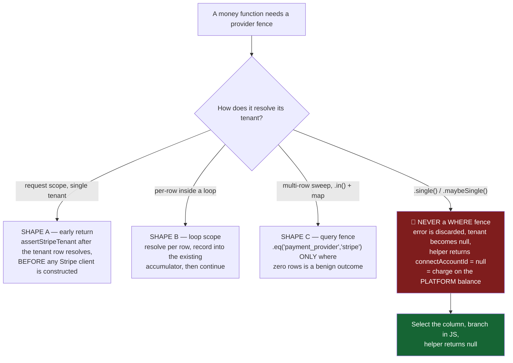
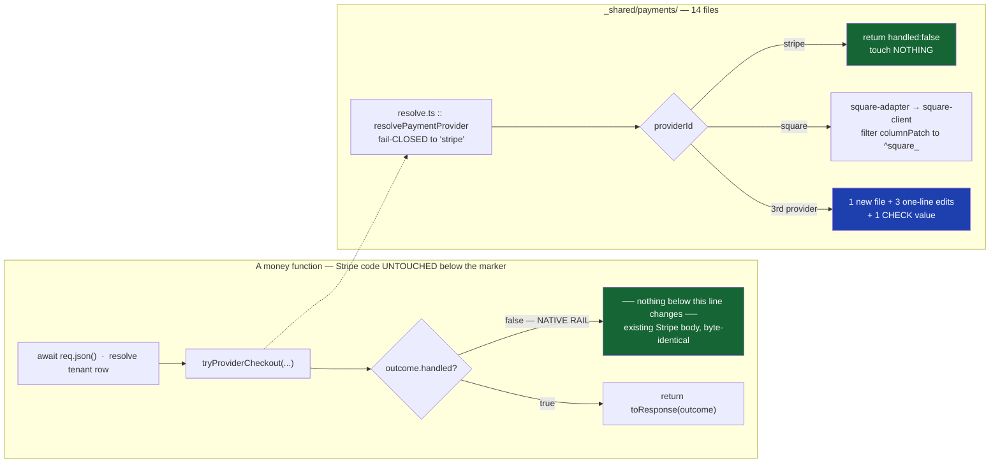
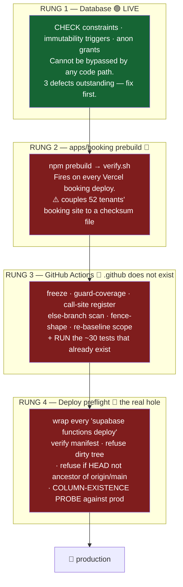

# 05 — Binding Decisions

**The arguments that are now closed.**

| | |
|---|---|
| **Branch** | `feature/square` |
| **Status** | **BINDING.** These six rulings are settled. |
| **Supersedes** | Anything contradictory in [`02-STRIPE-TO-SQUARE-MAPPING.md`](02-STRIPE-TO-SQUARE-MAPPING.md), [`03-STRIPE-SAFETY-AND-EDGE-CASES.md`](03-STRIPE-SAFETY-AND-EDGE-CASES.md), [`04-IMPLEMENTATION-PLAN.md`](04-IMPLEMENTATION-PLAN.md). See [§8 Supersession map](#8-supersession-map). |
| **Subordinate to** | [`00-BRIEFING-TRANSCRIPT.md`](00-BRIEFING-TRANSCRIPT.md) only. The lead's scope wins over everything here. |
| **Audience** | Two engineers who must act; one lead who scans. |

> ### ⚠️ PRECEDENCE
> Where documents 02, 03 or 04 say something different from this file, **this file wins and the other document is wrong.** Do not reconcile by judgement; do not average the two. Fix the older document ([§8](#8-supersession-map) lists every edit) or leave it and cite this one. The older docs are research; this is the ruling.

> ### 🔴 PRIME DIRECTIVE (unchanged, governs all six)
> *"Square agar phat raha hai, theek hai... **Stripe kisi bhi soorat mein risk par nahi aana chahiye.**"*
> A Square bug is acceptable. A Stripe regression is not, under any circumstance. Every decision below was chosen because it minimises Stripe blast radius, **not** because it is the most elegant Square design.

---

## TL;DR — six questions, six answers

| # | Question | The answer | Status |
|---|---|---|---|
| **D1** | Where does the provider guard live, given the `TENANT_STRIPE_COLUMNS` guard is inert on most call sites? | In a **new** `_shared/payments/guard.ts`, called **at the point the tenant row resolves** — never inside `stripe-client.ts`. **24 functions** get a diff; **33 call sites** are frozen. Fences have **three shapes**, not one. | 🟡 Partly built |
| **D2** | Exact DDL — nullability, default, CHECK, which tables, and the country gate? | `payment_provider text NOT NULL DEFAULT 'stripe'` on **exactly two tables** (`tenants`, `payments`). `country` nullable, no default, gated to Square's 8 countries. **`payment_provider` goes in the SELECT list, never the WHERE clause.** | 🟢 **APPLIED** — with 2 defects + 1 deadlock |
| **D3** | One authoritative module layout for the seam? | `_shared/payments/`, **14 files**, structural clone of `_shared/accounting/`. Branch at the **operation** level via `tryProviderCheckout()` / `tryProviderRefund()`. **Stripe is a passthrough, never a delegate.** All difference lives in one `capabilities.ts`. | 🟡 13/14 built |
| **D4** | May `_shared/stripe-client.ts` be edited at all? | **No. Zero bytes, for the entire workstream.** sha256 stays `f1c38aed…701701bc`. All five authorised hunks are withdrawn. Manifest covers **9 files**, at a **provider-neutral path**. | 🟡 7/9 frozen, wrong path |
| **D5** | What does a Square tenant actually GET in v1? | **Link-only.** Two primitives: a hosted Square Payment Link, and refunds incl. partial. **Never vault a card, never charge off-session, never call `CreateCard`.** Deposit-as-charge forced ON. | 🔴 Guards not applied |
| **D6** | *(the sixth argument — implicit in the other five)* What enforces any of this, given **this repo has no CI**? | A **four-rung ladder**, in dependency order: DB constraints → `apps/booking` prebuild → GitHub Actions → deploy preflight. **Rung 1 is the only one live today.** Nothing above rung 1 may be cited as "enforced" until it is observed failing a bad PR. | 🔴 Rungs 2–4 absent |

**The one-line version:** *Freeze Stripe absolutely, branch once at the operation seam, put the guard where the tenant resolves, keep the provider in the SELECT list, ship Square as links-and-refunds only — and build the enforcement ladder before trusting a single word of the above.*

---

## Table of contents

- [0. Live status — what is actually true right now](#0-live-status--what-is-actually-true-right-now)
- [1. D1 — Where the provider guard lives](#1-d1--where-the-provider-guard-lives)
- [2. D2 — The exact DDL](#2-d2--the-exact-ddl)
- [3. D3 — The module seam](#3-d3--the-module-seam)
- [4. D4 — The `stripe-client.ts` freeze](#4-d4--the-stripe-clientts-freeze)
- [5. D5 — What a Square tenant gets in v1](#5-d5--what-a-square-tenant-gets-in-v1)
- [6. D6 — The enforcement substrate](#6-d6--the-enforcement-substrate)
- [7. Contested counts — the reconciliation](#7-contested-counts--the-reconciliation)
- [8. Supersession map](#8-supersession-map)
- [9. Do not re-open](#9-do-not-re-open)

---

## 0. Live status — what is actually true right now

Verified against production `hviqoaokxvlancmftwuo` and the `feature/square` working tree at the time of writing. **Read this before you plan anything** — three of the five source analyses were written against a stale picture, and the DDL has since landed.

### 0.1 Database — the migration is ALREADY APPLIED

| Object | Live state | Matches ruling? |
|---|---|---|
| `tenants.payment_provider` | `text NOT NULL DEFAULT 'stripe'` | ✅ D2 |
| `tenants.square_mode` | `text NOT NULL DEFAULT 'test'`, CHECK `('test','live')` | ✅ D2 |
| `tenants.country` | `text` NULL, no default, CHECK `~ '^[A-Z]{2}$'` | ✅ D2 |
| `tenants_square_country_supported_check` | `CHECK (payment_provider = 'stripe' OR (country IS NOT NULL AND country IN (8)))` | ❌ **BANNED FORM — see [D2-DEF-1](#d2-def-1)** |
| `payments.payment_provider` | `text NOT NULL DEFAULT 'stripe'` | ✅ D2 |
| `payments.square_order_id` / `square_payment_id` / `square_refund_id` | nullable text, 2 partial indexes | ✅ D2/D5 (no URL column — correct) |
| `payments_provider_handle_exclusivity_check` | bidirectional, but 2nd conjunct is `payment_provider <> 'stripe'` | ❌ **BANNED FORM — see [D2-DEF-2](#d2-def-2)** |
| `trg_tenants_payment_provider_immutable` | live, `BEFORE UPDATE OF payment_provider` | ⚠️ live **without** its escape hatch |
| `trg_payments_payment_provider_immutable` | live | ✅ D2 |
| `admin_set_tenant_payment_provider()` | **DOES NOT EXIST** (0 functions) | 🔴 **[D2-DEF-3 — DEADLOCK](#d2-def-3)** |
| `GRANT SELECT (payment_provider, square_mode, country) … TO anon` | 3/3 present | ✅ D2 |
| `tenants_square_v1_surface_check` | **absent** | 🔴 D5 not applied |
| `rentals` per-rental override trigger | **absent** | 🔴 D5 not applied |
| `rental_extensions.square_*` | **absent** | 🔴 D3 not applied |

**Data, right now:** 52 tenants (**0** non-Stripe), **1,025** payments (**0** non-Stripe), **0** tenants with a `country`.
Every fence you write today is therefore a **provable no-op** — and that is the only window in which it can be proven. Ship the fences before the first Square tenant exists, not after.

> **On `1,025`:** the five source analyses variously assert 1,025 and 1,026. Both were true when measured. This is a live, growing table. **Never hardcode a row count in a gate** — see [D6](#6-d6--the-enforcement-substrate), CI gate 2.

### 0.2 Code — what exists on disk

| Artifact | State |
|---|---|
| `supabase/functions/_shared/payments/` | **13** `.ts` files + `__tests__/` (5 Deno tests) |
| — missing from the sanctioned 14 | 🔴 **`null-adapter.ts`** (the third-provider proof — D3) |
| `supabase/functions/_shared/stripe-client.ts` | 632 lines, sha256 `f1c38aed…701701bc` — **freeze baseline intact** ✅ |
| `docs/square-integration/BASELINE.sha256` | exists, **7** entries | 
| — missing from the 9-file manifest | 🔴 `stripe-connect-webhook/index.ts`, `_shared/customer-account.ts` |
| — wrong location | 🔴 path contains `square` → self-trips its own re-baseline scope check ([D4](#4-d4--the-stripe-clientts-freeze)) |
| `scripts/square-guardrails/` | `check-frozen.mjs`, `check-predicates.mjs`, `verify.sh` — **invoked by nothing** |
| `.github/` | 🔴 **DOES NOT EXIST** |
| `ops/` | 🔴 does not exist |
| `turbo.json` tasks | `build`, `dev`, `lint` — **no `test`** |
| root `package.json` scripts | 13 scripts, **no `test`, no `guard`** |
| `apps/booking/package.json` | has `test`; **no `prebuild`** |

**Consequence:** every guardrail written so far runs **only when a human types the command.** That is the subject of [D6](#6-d6--the-enforcement-substrate).

---

## 1. D1 — Where the provider guard lives

### The question

`getConnectAccountId` is the choke point every Stripe money path passes through. The obvious move is to guard it there, behind `TENANT_STRIPE_COLUMNS`. But that constant is imported by only a handful of files while the symbol is used by dozens. **Where does the guard actually go so that it is live on the paths that move money?**

> ### ✅ THE ANSWER
> **The guard lives in a new file — [`supabase/functions/_shared/payments/guard.ts`](../../supabase/functions/_shared/payments/guard.ts) — exporting `assertStripeTenant(tenant, ctx)` and `isStripeTenant(tenant)`, and is called at the point the tenant row resolves.**
>
> - `_shared/stripe-client.ts` stays **byte-frozen**. `payment_provider` is **NOT** added to `TENANT_STRIPE_COLUMNS`.
> - The guarded set is **24 functions**. The frozen register is **33 call sites** — *not 26 files*.
> - **"Zero diff" is asserted per CALL SITE, never per file.**
> - A cron fence is **`if (!isStripeTenant(t)) { skipped++; continue; }`**, never a bare `.eq()`.

### Rationale

Guarding inside the helper is inert where it matters. Only a small minority of callers select their tenant through the shared constant; the rest hand-roll their own `select`, so a guard hidden behind `TENANT_STRIPE_COLUMNS` never sees them. The three functions that actually mint money on a schedule — `process-installment-payment:137`, `auto-extend-rentals:67`, `send-payg-reminders:41` — all hand-roll. **A guard they cannot reach is decoration.**

The deeper error, and the one that produced the largest correction: reachability was originally computed *per `getConnectAccountId` call site*. But **a function is reachable if the FUNCTION is reachable.** `deduct-from-deposit` and `reject-rental` have genuinely record-anchored `getConnectAccountId` sites that genuinely need no diff — and both reach money-mutating **`else`-branches that fire precisely because `stripe_payment_intent_id` is NULL**, which is the state D2's own CHECK constraint makes *mandatory* for every Square row.

> **The CHECK constraint does not prove those functions unreachable. It guarantees they take the fake-refund branch.**
> Keep the constraint. Discard the inference.

`deduct-from-deposit:661` selects the payment with `.not("stripe_payment_intent_id","is",null).single()`; at `:722` it logs *"No Stripe payment found, recording as manual deduction"*; at `:728` it **unconditionally INSERTs a negative `ledger_entries` Refund row**. Deposits-as-charges are explicitly **in scope** for Square ([D5](#5-d5--what-a-square-tenant-gets-in-v1)), so this is not an edge case — it is the **default Square path**. An operator clicks "deduct from deposit" and the ledger records a refund that never happened.

### Evidence

| Claim | How verified | Result |
|---|---|---|
| The in-helper guard is inert on most money paths | Perl multiline extraction of each importer's `stripe-client` import brace-block, word-matched | Only **5–6** files import `TENANT_STRIPE_COLUMNS`; the rest hand-roll. Guard inert on **~38 of 43** measured importers |
| `getConnectAccountId` fails **OPEN** on new-tenant defaults | `sed -n '96,140p' _shared/stripe-client.ts` | L107–118: `payment_model='own'` + `stripe_mode='test'` → returns `STRIPE_TEST_CONNECT_ACCOUNT_ID`, **no throw**. Live branch throws. An ungated Square tenant mints a *real, payable* Stripe test checkout |
| `deduct-from-deposit` writes a refund for a Square payment | `sed -n '655,745p' deduct-from-deposit/index.ts` | :661 filter · :668 `if (payment?.stripe_payment_intent_id)` · :722 "manual deduction" log · **:728 unconditional negative ledger INSERT** |
| The `.eq()` fence is **unsafe** on `send-payg-reminders` | `sed -n '18,60p' send-payg-reminders/index.ts` | `getStripeContext` does `.eq('id',…).single()` and **discards `error`**. Zero rows → `tenant` is `null` → helper still returns a **non-null context with `connectAccountId = null`** → doc 02 O-1: that **redirects the charge to the Drive247 platform balance** |
| `send-auto-extension-reminder` has **no tenant query to fence** | `sed -n '225,250p'` | Tenant arrives via an **embedded** `tenants ( … )` join in `RENTAL_SELECT:235`. A PostgREST filter nulls the embed, it does not drop the rental; `!inner` changes join semantics for all 52 tenants on a live daily cron |
| `auto-extend-rentals` **does** have the assumed shape | `grep -n 'tenantMap\|\.in("id"\|if (!tenant)'` | `.in("id", tenantIds)` :295 · `tenantMap` :296 · `if (!tenant) { skipped++; continue; }` **:301**. This one fence is safe |
| `recover-pending-stripe-payments` is genuinely unreachable | source + `cron.job` | Query is `.eq('status','Pending').not('stripe_checkout_session_id','is',null)`. jobid **34**, `* * * * *`, active. **Strongest support for the CHECK-constraint mechanism** |
| `process-scheduled-refund` already fails closed | source read | Throws *"Payment has no Stripe payment intent"* **before** any tenant select. **Assert it with a test; do not diff it** |
| `create-credit-checkout` must **never** be guarded | read `create-credit-checkout/index.ts` | Imports `_shared/subscription-stripe.ts` (frozen), sells "Drive247 Credits", `currency:"usd"` hardcoded, **never calls `getConnectAccountId`**. Platform rail. Guarding it **breaks credit purchases for Square tenants** |
| The anon grant hazard is real but **half** the size claimed | `information_schema` privileges on prod | `tenants`: RLS on, `anon` has **0** table privileges and 236/262 column grants → **grant required**. `authenticated` holds table-level SELECT → no grant needed. `payments`: **RLS OFF**, table-level grants for all three roles → **`payments.payment_provider` needs no grant** |

### Rejected alternatives

| Rejected | Why |
|---|---|
| **Guard inside `getConnectAccountId`** | Inert on the hand-rolled majority — including all three money crons. Also a byte change to a frozen file ([D4](#4-d4--the-stripe-clientts-freeze)) |
| **Add `payment_provider` to `TENANT_STRIPE_COLUMNS`** | The constant feeds **7** selects including one *inside* `stripe-client.ts:565`. Deploying ahead of the DDL 42703s the whole tenant select — a full checkout outage for 52 Stripe tenants. Also a frozen-file edit |
| **Overload `payment_model` with a `'square'` value** | `payment_model` feeds `getConnectAccountId`'s branch logic and `PlatformAccount = 'uk'\|'uae'`. A `'square'` value reaches a **Stripe secret-key lookup with no guard** |
| **Re-query the tenant inside the guard** | 35 of 46 stripe-bearing tenant selects **have no `id` column**. There is nothing to re-query with |
| **A blanket `.eq('payment_provider','stripe')` on every sweep** | Unsafe on 2 of 3. On `send-payg-reminders` it **manufactures** the platform-balance charge doc 02 spends a callout warning against |
| **Freeze by file** | Produced the `deduct-from-deposit` defect. Freeze by **call site**; classify reachability by **function** |

### The three fence shapes

| Shape | Applies to | Mechanism |
|---|---|---|
| **A — request scope** | `create-checkout-session`, `create-extension-checkout`, `send-invoice-email`, `send-excess-mileage-payment-link`, `process-refund`, `cancel-rental-refund`, `deduct-from-deposit` | `assertStripeTenant(tenantData, '<fn>')` immediately after the tenant row resolves, **before** the Stripe client line |
| **B — loop scope** | **`reject-rental`** (`refunds.create` at :184 inside `for (const payment of payments)` at :105); also `refund-installment-payments` (:124), `process-scheduled-refund` (:226) if ever enabled | Resolve above the loop; inside, record into the existing result accumulator and `continue`. A top-of-function return would refund payment #1 and silently skip the rest |
| **C — query fence** | **`auto-extend-rentals` only** (verified `.in("id", …)` + `if (!tenant) { skipped++; continue; }` at :301) | `.eq('payment_provider','stripe')` on the driving select |
| **🚫 banned** | `send-payg-reminders`, `send-auto-extension-reminder`, and **every** `.single()`/`.maybeSingle()` chain | Column goes in the **SELECT list**; branch in JS; the context helper **`return null`** |

### Consequences

1. **The guarded set is 24 functions, not 20.** Added: `deduct-from-deposit` and `reject-rental` (confirmed else-branch money mutation), `refund-installment-payments` (same class — **read its else-arm before classifying**), and `process-scheduled-refund` (verified already fail-closed — **assert, do not diff**).
2. **`process-refund`: the Square branch goes BEFORE the tenant select at :258**, not after `getConnectAccountId` at :266. That call is unconditional once a rental resolves and throws on its own for a live `payment_model='own'` tenant with no connected account — 500-ing before Square is ever consulted. The `:464` site is record-anchored and **stays frozen**.
3. **Refunds dispatch on the PAYMENT RECORD's `payment_provider`, never the tenant's current provider.** A tenant's provider is immutable, but the record is the truth about which processor actually minted the money.
4. **`sync-connect-status` is a fourth cron** (jobid 61, `40 3 * * *`), not a request-scoped super-admin call. Its `all:true` sweep already filters `.eq("stripe_onboarding_complete", true)` — which D2's tenants CHECK forces false for Square — and `syncOne` wraps everything in try/catch, so a throw becomes `base.error` rather than aborting the batch. **Guard the single-tenant branch only.**
5. **`process-installment-payment` (jobid 6) stays frozen** — it skips on the missing saved card *before* reaching the tenant select at :108. But that skip flips `collection_mode` to `'manual'` and emails a reminder. **Enforce "no installments for Square" at plan CREATION**, not by letting the cron discover it nightly.
6. **`create-credit-checkout` is struck from doc 02's O-3 in-scope checkout table by name.** In-scope creators are **11**, not 12 or 16.
7. **Doc 02's O-2 in-helper guard inside `getStripeClientForRecord` is withdrawn** — the freeze kills it. Replaced by the `payments` CHECK plus caller-side guards. The `'uk'` stamp on Square rows stays inert; revenue reporting branches on `payment_provider`.

### Enforcement

| Gate | Rung ([D6](#6-d6--the-enforcement-substrate)) | Mechanism |
|---|---|---|
| **Guard ⇒ column** | 3 | Every file matching `assertStripeTenant(` must also match `payment_provider`. **Use `--include=*.ts`, NOT `--include=index.ts`** — the published glob in doc 03 §1.4 silently excludes `_shared/stripe-client.ts` and `_shared/deposit-hold-refresh.ts`, the two shared files carrying call sites |
| **Inverse rule, Stripe lane only** | 3 | No file **that imports `_shared/stripe-client.ts`** may reference `payment_provider` unless allowlisted. Scoping matters: as originally written it would fail the Square lane's own `square-oauth-*` / `square-webhook` / `_shared/payments/*` files, which *must* read the column |
| **Two registers, not one** | 3 | `reachable-money-sites.txt` (call sites, file:line) **and** `reachable-money-functions.txt` (functions + verdict). CI recomputes the call-site inventory with paren-matched argument extraction and fails on any difference. **Conflating these two lists is what produced this decision's largest error** |
| **Else-branch scan** ⭐ | 3 | *The check that would have caught the defect.* Grep every reachable **function** for a branch keyed on `stripe_payment_intent_id` / `stripe_checkout_session_id` / `stripe_refund_id` whose **else-arm performs a write**. Each site must carry a checked-in verdict of `GUARDED` or `ACCEPTED-SQUARE-BUG`. Known members: `deduct-from-deposit:722`, `reject-rental` (post-loop), `process-refund:456`, `cancel-rental-refund:168` |
| **Fence-shape test** | 3 | Assert the context helpers return **`null`**, not a context with `connectAccountId === null`, when the tenant is missing or non-Stripe |
| **Golden no-op test** | 3 | `assertStripeTenant` must not throw for **any** tenant shape present in prod, must not throw when `payment_provider` is `undefined`, and must throw **only** for `'square'`. Generate the fixture list **by query at authoring time** and check the query in beside it — do not hardcode a shape count |
| **Fail-open on `undefined`** | — | Deliberate design, not an oversight: it guarantees zero runtime change for all 52 tenants during the deploy window. The column's *presence* is guaranteed by the coverage gate instead |

---

## 2. D2 — The exact DDL

### The question

Nullability, default, CHECK, which tables get the column, and how the 8-country Square gate is expressed — given `tenants` has no `country` column and all 52 tenants are `USD`.

> ### ✅ THE ANSWER
> **`payment_provider text NOT NULL DEFAULT 'stripe'` on exactly TWO tables: `tenants` and `payments`. `country` nullable with no default. NULL-safe gate. And the fence rule that makes it all safe:**
>
> ### 🔑 `payment_provider` goes in the **SELECT list**, never the **WHERE clause**. Branch in JS.
>
> A select-list addition **provably cannot** change which rows a Stripe tenant's query returns. A WHERE-clause addition **can** — and on `.single()` it silently does. A WHERE fence is permitted **only** on a multi-row sweep where zero rows is a benign outcome.

### Rationale

Nullable is a **live Stripe regression**: every `.eq('payment_provider','stripe')` fence would match zero of 1,025 payments and zero of 52 tenants. `NOT NULL DEFAULT 'stripe'` is metadata-only on this cluster (PG 17.6; `payments.platform_account` already carries `atthasmissing=true, attmissingval={uk}`, alongside ~9 more on `payments` and ~150 on `tenants`) — so the backfill is free and every fence is verifiably a no-op on day one.

Two tables is the right scope because **provider is derived from `tenant_id` everywhere else**. Handles and provider are different things: other tables get additive nullable `square_*` **handle** columns where a Square flow needs one; none gets `payment_provider`.

The fence rule is the part that carries the prime directive. Both cited single-row sites — `send-payg-reminders:25`, `process-installment-payment:108` — are `const { data: tenant } = await supabase…`. **`error` is never destructured.** So `.single()` returning zero rows does not throw and does not surface; `tenant` is simply `null`, and the very next lines are `tenant?.stripe_mode === "live" ? "live" : "test"` and `getChargePlatformAccount(tenant ?? {})`. A "fenced" Square tenant becomes a **Stripe TEST charge on the platform account with no Connect account** — silently. `.maybeSingle()` is byte-identical in that path, so the CI gate that forces it enforces nothing.

### Evidence

| Claim | How verified | Result |
|---|---|---|
| The DDL is **already applied** | `information_schema.columns` on prod | `tenants.payment_provider` / `square_mode` **NOT NULL** with defaults; `country` nullable; `payments.payment_provider` NOT NULL + 3 `square_*` handles + 2 partial indexes |
| Backfill is complete and every fence is a no-op **today** | live counts | 52 tenants / **0** non-Stripe · **1,025** payments / **0** non-Stripe |
| The `.eq()` fence is a **silent misroute** | read `send-payg-reminders:24-33`, `process-installment-payment:107-114` | Both discard `error`. `tenant=null` → Stripe TEST client, platform account, `connectAccountId=null`. **PGRST116 never surfaces** |
| **DEFECT 1** — the live country gate uses the **banned** predicate | `pg_get_constraintdef` on prod | Live: `CHECK (payment_provider = 'stripe' OR (country IS NOT NULL AND country IN (8)))`. This **rejects `('paypal', NULL)`**, breaking briefing §5 step 6 ("a third branch is cheap"). Required: **`payment_provider <> 'square'`** — equally NULL-safe (column is NOT NULL, so `<>` never yields NULL) **and** future-proof |
| **DEFECT 2** — the exclusivity CHECK's 2nd conjunct uses the **banned** predicate | `pg_get_constraintdef` on prod | Live 2nd conjunct: `payment_provider <> 'stripe' OR (square_* all NULL)`. A future third provider **can carry Square handles**. Required: **`payment_provider = 'square' OR …`** |
| **DEFECT 3 — DEADLOCK** — the immutability trigger is live **without** its escape hatch | `pg_proc` + `pg_trigger` on prod | `trg_tenants_payment_provider_immutable` **exists**; `admin_set_tenant_payment_provider` / `set_tenant_payment_provider` **count = 0**. With `DEFAULT 'stripe'` and no INSERT-side provider field in any code path, **a Square tenant is currently uncreatable and a mis-set one is unfixable through the app** |
| The predicate difference is real, not stylistic | live SQL truth table over 6 `(provider, country)` pairs | `('square',NULL)`: naive **passes** (hole), both strict forms reject. `('paypal',NULL)`: `= 'stripe'` **rejects** (bug), `<> 'square'` **passes**. The `<>` form is strictly better on every row |
| `anon` needs the grant; `payments` does not | `information_schema` privileges | `tenants`: RLS on, `anon` **0 table privs**, 236/262 column grants → grant mandatory (**3/3 verified present**). `payments`: **RLS OFF**, table-level grants for all three roles → column-level REVOKE is a **PostgreSQL no-op** |
| "No country is derivable" is **false** | `SELECT timezone, count(*) FROM tenants GROUP BY 1` | **52/52** populated, every value a US-exclusive IANA zone: New_York 36, Chicago 8, Los_Angeles 5, Denver 3. Caveat: New_York is the seed default, so 16 are deliberate and 36 ambiguous. `address` genuinely is useless (42/52 populated, **1** US-shaped) |
| `tenants.location` does not exist | full 262-column listing | Doc 04's D0-3 "country backfilled from `location`" names a **non-existent column**. Repoint at `timezone` |
| You cannot widen an IN-list CHECK by adding a second one | PG semantics + `payments_refund_status_check` def | Multiple CHECKs **AND** together — a second can only narrow. Widening = **DROP + ADD in one transaction**. Applies to `payments_refund_status_check` (lacks `'rejected'`) and `owner_payouts_payment_method_chk` (`ARRAY['bank_transfer','cash','cheque','stripe','other']`) |
| Non-unique indexes are correct by this table's own precedent | `GROUP BY … HAVING count(*)>1` | One `stripe_checkout_session_id` already maps to **2** payments rows. A UNIQUE index on a processor handle would be wrong |
| `payments.tenant_id` is **nullable** | `information_schema` ordinal 32 | 0 NULLs today, but nothing prevents a future one — a **stronger** argument for the column on `payments` than the one originally given |
| Square's 8 countries and `Merchant.country` | WebFetch of `developer.squareup.com` | AU, CA, FR, IE, JP, ES, GB, US. `Merchant.country` is **REQUIRED**, ISO-3166 alpha-2 — so the authoritative country **is** available at OAuth. Also: **Japan does not support delayed capture or partial authorization** |
| `square_mode` naming is already settled by the team | `grep -i square` + `git check-ignore` | `supabase/functions/.env` (gitignored, untracked — no leak) already defines `SQUARE_TEST_APP_ID`, `SQUARE_TEST_ACCESS_TOKEN`, `SQUARE_TEST_BASE_URL`, `SQUARE_VERSION=2026-08-19`. **TEST naming mirrors `STRIPE_TEST_SECRET_KEY`** → `'test'\|'live'`, not `'sandbox'\|'production'` |

### Rejected alternatives

| Rejected | Why |
|---|---|
| **`TEXT NULL`** (five area plans specified this) | Every `.eq('payment_provider','stripe')` fence matches **zero** rows. Live Stripe regression on jobid 34 (`* * * * *`) |
| **The naive gate** `country IN (8) OR payment_provider <> 'square'` written without the NULL guard | Three-valued logic: `('square', NULL)` **passes** |
| **`= 'stripe'` gate** *(currently live — [DEFECT 1](#d2-def-1))* | Rejects any future third provider with a NULL country. Contradicts briefing §5 step 6 |
| **`payment_provider` on `rentals`, `installment_plans`, `pnl_entries`, `owner_payouts`, `customers`, …** | Provider is derived from `tenant_id`. `pnl_entries` has `tenant_id` and joins cleanly for **12,411 of 12,412** rows (1 orphan needs a data fix, not a column) |
| **`REVOKE SELECT (col) ON payments FROM anon`** | `anon` holds a **table-level** grant; PG documents a column-level revoke against a table-level holder as a no-op. **Delete the REVOKE *and* doc 04's D0-12 assertion that tests it** — that assertion is currently written to fail |
| **`payments.square_payment_link_id`** | A payment-link URL is a **bearer link**. Store opaque handles on `payments`; the URL goes in an RLS-ON side table beside `square_connections` |
| **`sandbox`/`production`** for `square_mode` | Contradicts `boldsign_mode` / `bonzah_mode` and the already-provisioned `SQUARE_TEST_*` env vars |
| **An unconditional immutability trigger with no escape hatch** *(currently live — [DEFECT 3](#d2-def-3))* | A creation typo becomes unfixable → the predictable response is `ALTER TABLE … DISABLE TRIGGER` in production, which destroys the control entirely |
| **Naming an accounting-style `provider` column** | Six tables in the accounting stack already key on a `provider` enum (`xero\|zoho`). If a column is unavoidable, name it **`processor`** |

### Consequences

1. **Three live defects need a follow-up migration** ([DEFECT 1](#d2-def-1), [2](#d2-def-2), [3](#d2-def-3)). DEFECT 3 is **P0 and blocking** — until `admin_set_tenant_payment_provider()` exists, no Square tenant can be created or repaired. Its body: `SECURITY DEFINER`, gated on `is_super_admin()` **AND** zero `payments` rows for that tenant, setting a tx-local GUC the trigger honours. `supabase-js` cannot issue `SET LOCAL`, so the browser toggle stays impossible — the lead's rule survives intact while a typo stays fixable.
2. **Doc 04's B-3 cron list is rewritten.** WHERE-fence on **exactly one** function: `recover-pending-stripe-payments` (jobid 34, `index.ts:50` and `:133`) — it sweeps `payments`, multi-row, zero rows benign. Everything else is a select-fence + JS branch. **`jobid 4` is DELETED from the list**: `mark_overdue_installments()` is a pure SQL function with two UPDATEs and zero processor calls — fencing it would leave Square tenants' arrears permanently un-flagged.
3. **Two crons need no code change at all** for the miss handler: `auto-extend-rentals:301` and `accrue-payg-charges:191` already skip-and-continue. Add a counter to the latter; that is all.
4. **Both `DROP CONSTRAINT` statements in doc 02 (`:743`, `:748`) are legitimate widenings** and must be DROP + ADD **inside one transaction**. Document this as the approved widening pattern so the additive-only rule is not misread as forbidding it. Doc 02 `:748` (`owner_payouts_payment_method_chk`) was missed entirely by earlier analysis.
5. **Backfill `country` from `timezone`** as a separate statement after the DDL — **never as a column DEFAULT**, which would silently stamp future non-US tenants. Risk-free precisely because all 52 are `payment_provider='stripe'`, so the gate's left disjunct passes and `country` is never consulted for them. Disclose the 36-row seed-default ambiguity; spot-check against `address` first.
6. **`tenants.country` is a PRE-OAuth declaration gate.** It fires at INSERT, before any Square connection exists. The OAuth callback must independently refuse a connection whose `Merchant.country` is outside the eight **or** disagrees with `tenants.country`, and store the verified merchant country on `square_connections`.
7. **Delete `apps/booking/src/lib/tenantQueries.ts:64` (`getTenantSettings`)** — `.from('tenants').select('*')` reachable as `anon`, **zero callers**, and the only anon-reachable `select('*')` on `tenants`. The four live ones run as `authenticated` (table-level SELECT, immune). Leaving it means the next caller gets a 403 that will be blamed on the Square migration.
8. **Document the SIX similarly-named `tenants` columns**: `payment_provider`, `payment_model` (`managed|own`), `payment_mode` (`automated|manual` — **has no CHECK at all**), `stripe_mode`, `subscription_stripe_mode`, `square_mode`. And record that `platform_account` / `subscription_account` (`'uk'|'uae'`) name **Stripe platform accounts, not countries** — never confuse them with `country='GB'`. GB, never UK.
9. **Flag Japan in the capability matrix** before a JP tenant is sold: inside the eight, but no delayed capture and no partial authorization.

### Enforcement

| Gate | Mechanism |
|---|---|
| **Schema invariant** | One query: fail unless zero rows from `information_schema.columns WHERE column_name='payment_provider' AND (is_nullable<>'NO' OR column_default<>'''stripe''::text' OR table_name NOT IN ('tenants','payments'))`. Nullability, default and table scope in a single assertion |
| **Durable cross-table invariant** ⭐ | `SELECT count(*) FROM payments p JOIN tenants t ON t.id=p.tenant_id WHERE p.payment_provider <> t.payment_provider` **must be 0, forever**. This replaces the self-expiring "count of non-stripe rows = 0", which goes red the day Square launches and will then be deleted. Keep the zero-count as a **one-shot D0 smoke test with an explicit expiry date**. **Never hardcode 1,025 — it was 1,026 yesterday** |
| **Literal constraint-definition assertions** | Assert `tenants_square_country_supported_check` contains **both** `country IS NOT NULL` **and** `<> 'square'`; assert `payments_provider_handle_exclusivity_check` contains `= 'square'`. This is what catches a regression to either banned form — and what **currently fails** ([DEFECT 1](#d2-def-1), [2](#d2-def-2)) |
| **Existence assertions** | Six named constraints, both triggers, and `admin_set_tenant_payment_provider` with `prosecdef=true` and **no EXECUTE grant to `anon`** |
| **Anon smoke test with a real anon key** | Post-migration, issue an actual PostgREST request as `anon` selecting `TenantContext.tsx:409`'s exact column list plus the new columns; assert 200 and non-empty body. **A schema assertion cannot catch the `customer_theme_mode` class of failure — only a real anon request can** |
| **Select-not-filter gate** ⭐ | Fail on `.neq('payment_provider'` / `.is('payment_provider'`, **and** on any occurrence of `payment_provider` inside a chain that also contains `.single(` or `.maybeSingle(`. Implement as a **windowed awk over a 12-line window from `.from()`** — a supabase-js chain spans lines, so a single-line grep catches nothing. Permit `.eq('payment_provider','stripe')` **only** in `recover-pending-stripe-payments` |
| **Wrong-table fence gate** | Same windowed technique: fail if `payment_provider` appears in a chain rooted at `.from('rentals'\|'installment_plans'\|'scheduled_installments'\|'rental_extensions'\|'payg_reminder_log'\|'auto_extension_reminders'\|'pnl_entries'\|'owner_payouts'\|'customers')`. Runtime symptom is a **42703 500-ing a money cron for all 52 Stripe tenants** |
| **Write-path gate** | Fail if `payment_provider` appears inside any `.update(` or `.upsert(` payload **anywhere** in the repo. The only legal writes are a `tenants` INSERT and the corrector RPC |
| **Explicit-null-branch assertion** | For each fenced tenant fetch, assert the select contains `payment_provider` **and** a guard matching `/!tenant\|payment_provider !== 'stripe'/` within the following 15 lines. *This is the gate that would have caught the silent-misroute defect* |
| **Migration-shape gate** | Reject any migration containing `DROP COLUMN`, `ALTER COLUMN TYPE`, a rename of any `stripe_*` column, or `CREATE INDEX` on a pre-existing `payments` column. `DROP CONSTRAINT` permitted **only** when the same transaction re-adds a strictly wider constraint of the same name, and only for the two allowlisted names |
| **Deploy-order probe** | Before deploying any function whose source matches `payment_provider`, probe `information_schema.columns` on the target project and refuse if absent. See [D6](#6-d6--the-enforcement-substrate) rung 4 |

---

## 3. D3 — The module seam

### The question

One authoritative module layout and naming for the Square/Stripe seam: the exact file list under `_shared/payments/`, the exported symbols, whether branching happens per-function or at the operation level, where behavioural difference lives, and how provider #3 stays cheap.

> ### ✅ THE ANSWER
> **`supabase/functions/_shared/payments/` — 14 files, a structural clone of `_shared/accounting/`. Branch at the OPERATION level through `tryProviderCheckout()` / `tryProviderRefund()`.**
>
> - **Stripe is a PASSTHROUGH, not a delegate.** It is never translated, never re-described, never routed through an adapter.
> - `handled: false` means *"native rail — caller continues, unchanged."* The `try` prefix is load-bearing: **false is normal.**
> - **FLAT records everywhere** — no discriminated unions.
> - One resolver, named **`resolvePaymentProvider`**.
> - **All behavioural difference lives in ONE `capabilities.ts`.** A feature is off because a **capability** is false, never because `providerId === 'square'`.

### Rationale

Passthrough is what makes "zero Stripe diff" **literally true and checkable with one command.** Routing the existing creators through a `stripe-adapter` would be an **~8,500-LOC rewrite of stabilised money code** (5,002 LOC of creators + 3,498 LOC of refunders) — precisely what the prime directive forbids. An adapter has only two states: dead code with no callers, or a new mandatory layer beneath every Stripe call. There is no third state.

The flat-record rule is not taste — it is documented in-repo. `_shared/accounting/resolve-tenant.ts:43-53` says verbatim that a discriminated union *"did not narrow on `if (!res.ok)` and every call site failed with 'Property status does not exist'."* Clone the shape that survived contact.

`resolvePaymentProvider`, not `getProvider`: `_shared/accounting/factory.ts::getProvider` is imported at 4 live sites **in the same money pipeline**, and `ProviderName` appears 30 times. A name collision there is a debugging tax paid forever.

**Reachability triage is the correction that serves the prime directive best.** With `canChargeOffSession=false`, `supportsInstallments=false`, `supportsPayAsYouGo=false`, `supportsAutoExtend=false` ([D5](#5-d5--what-a-square-tenant-gets-in-v1)), only **4 creators and 4 refunders** are reachable by a Square tenant in v1. Touching 16 money functions to deliver a product where 8 can ever run Square code is a prime-directive cost with **zero product return**. Cutting 16 → 8 halves the exposure and loses nothing.

### Evidence

| Claim | How verified | Result |
|---|---|---|
| The accounting adapter is the right precedent | `wc -l _shared/accounting/*` | **1,435 LOC / 8 files** — backoff 74, factory 58, oauth-constants 81, rental-status 62, resolve-tenant 228, types 173, xero-client 392, zoho-client 367. A working two-provider seam in this exact codebase |
| The flat-record ruling is documented **in-repo** | `sed -n '35,70p' _shared/accounting/resolve-tenant.ts` | Verbatim: *"Deliberately a single flat shape rather than a discriminated union … that union did not narrow on `if (!res.ok)`"* |
| `resolvePaymentProvider` avoids a live collision | `grep -rn 'import { getProvider }'` | `getProvider` imported at exactly **4** sites: `process-accounting-sync:35`, `list-accounting-tax-rates:10`, `void-rental-accounting:18`, `list-accounting-accounts:17` |
| The 14th file is **missing on disk** | `ls _shared/payments/*.ts` | **13** files present. **`null-adapter.ts` absent** — the third-provider proof the whole "cheap third branch" claim rests on |
| Passthrough is already committed in-repo | `cat _shared/payments/types.ts` | Header: *"Stripe is the NATIVE RAIL: it is never delegated to, never translated, never re-described. That is what makes zero Stripe diff literally true and verifiable with one checksum command."* Plus: *"DO NOT replace a Stripe triple with a neutral call."* |
| The capability rule is already committed | `cat _shared/payments/capabilities.ts` | *"BINDING RULE: every behavioural difference between processors lives HERE… A feature is switched off because a CAPABILITY is false, never because `providerId === 'square'`."* |
| **A preamble cannot re-read the request body** | `grep -n 'req.json()\|\.clone()'` across the 15 in-scope handlers | **All 15** call `await req.json()` exactly once; **none** clones. A preamble that re-reads throws *"Body already consumed"* and breaks every Stripe call in that file — **while ADDING lines, so a zero-deleted-lines gate would pass it** |
| The Stripe client is constructed **before** the money call | `grep -n getStripeClient/getConnectAccountId/sessions.create` | `create-checkout-session` builds the client at **:187**, calls `getConnectAccountId` at **:190**, creates at :329. The preamble must precede the client line: :187, :215 (`create-extension-checkout`), :273 (`send-invoice-email`), :60 (`send-excess-mileage-payment-link`) |
| A top-of-function return **cannot** express `reject-rental` | `sed -n '103,112p'` + `'252,268p'` | `refunds.create` at :184 sits inside `for (const payment of payments)` at :105; the **post-loop** block at :252–:318 writes per-payment Refund ledger entries from `payment_applications`. With `refundIsSynchronous=false` that books refunds for **money that has not moved** |
| `refunds.create` is **11 hits / 10 real calls / 9 in scope across 8 files** | `grep -rn 'refunds\.create'` + loop-header inspection | Not 8. `cancel-rental-refund:396` is a **comment**. Two files have **two** calls each: `process-scheduled-refund` (:109 single, :268 in batch loop from :226) and `refund-installment-payments` (:165 in loop from :124, plus :245) |
| **Metadata is an adapter-internal fact, never a refusal gate** | `sed -n '253,335p' create-checkout-session/index.ts` + Square docs | Stripe's real bag reaches **15 keys** (6 unconditional + 7 single-key spreads + `hold_as_credit` which adds 2). Square's cap is **10**. A validation gate would **refuse legitimate bookings at money time** |
| Zero-metadata correlation is **already ratified upstream** | `grep -n square-webhook 04-IMPLEMENTATION-PLAN.md` | §2.5 line 294 verbatim: *"resolves everything by indexed lookup on `square_order_id` — zero metadata reads, zero RetrieveOrder round-trip"* |
| Square doc constants | WebFetch `CheckoutOptions`, `CreatePaymentLink`, `RefundPayment` | `CheckoutOptions`: `allow_tipping`, `custom_fields` (max 2), `subscription_plan_id`, `redirect_url`, `merchant_support_email`, `ask_for_shipping_address`, `accepted_payment_methods`, `app_fee_money`, `enable_coupon`, `enable_loyalty` — **no `cancel_url`, no failure redirect, no expiry**. `app_fee_money` exists, capped at 90% (answers Briefing Appendix B q1: Square **does** have a platform-fee mechanism). Idempotency: **192** for CreatePaymentLink, **45** for RefundPayment. Refund example returns **PENDING**; **no `CancelRefund` endpoint** |
| Square OAuth lifetimes | WebFetch OAuth overview | Access token **30 days**; renew every **≤7 days**; unrenewable after **15 days** expired. `authorization_code` refresh tokens **never expire** (PKCE: single-use / 90 days). Sandbox is a **separate application id and credentials** |
| `rental_extensions` needs `square_*` and does not have it | `information_schema` + `create-extension-checkout` | Six tables carry `stripe_*` id columns. `create-extension-checkout` writes the session id to **both** `payments` and `rental_extensions` (:303–:305). Extensions are in scope → **without these the Square webhook cannot correlate an extension**. Verified absent on prod |

### Rejected alternatives

| Rejected | Why |
|---|---|
| **A working `stripe-adapter.ts` that the creators route through** | ~8,500 LOC rewrite of stabilised money code. Contradicts the committed passthrough contract in `types.ts`. Ships as a **registered, capability-bearing, never-invoked** stub instead — so `registry.ts` and `capabilities.ts` are *total* over `PaymentProviderId` |
| **Per-function branching (`handleSquare()` in each file)** | Duplicates the decision N times; makes provider #3 an N-file edit. The lead's §5 step 5–6 requires the decision **once, at the top** |
| **Discriminated union for `ProviderOutcome`** | Documented in-repo to have failed: *"every call site failed with 'Property status does not exist'"* |
| **`getProvider` as the resolver name** | Collides with `_shared/accounting/factory.ts::getProvider`, imported at 4 live sites in the same pipeline |
| **The Square SDK (`npm:square`)** | `Money.amount` is a **bigint**; `_shared/cors.ts::jsonResponse` is a bare `JSON.stringify` with **~203–206 importers** that throws on BigInt **after the money has moved** — and the natural fix would edit a frozen file on every Stripe money path. Raw `fetch`, pinned `Square-Version` |
| **A blanket preamble in all 16 money functions** | 8 of them can never run Square code in v1. Needless edits to stabilised money files |
| **Metadata-capability refusal (`throw` when >10 keys)** | Refuses legitimate bookings at money time. Contradicts §2.5's already-ratified zero-metadata design |
| **A second capability table in the portal** | Two tables drift; provider #3 becomes a re-audit of thirty files. The portal file must be a **thin mirror/re-export**, key-for-key |
| **`create-credit-checkout` in the seam** | Platform rail. Keyed on the **tenant**, so a Square tenant buying platform credits would land **Drive247's own revenue in their merchant account.** Worse than a Stripe regression |

### The seam, and what each shape means

### The sanctioned 14 files

`types.ts` · `capabilities.ts` · `registry.ts` · `resolve.ts` · `guard.ts` · `predicates.ts` · `checkout.ts` · `refund.ts` · `stripe-adapter.ts` · `square-adapter.ts` · `square-client.ts` · `square-status-map.ts` · `square-oauth.ts` · **`null-adapter.ts`** *(missing — create it)* · plus `__tests__/`.

**`capabilities.ts` must contain zero `import` statements** — that is what lets a portal vitest **import** the Deno manifest directly and deep-equal it against the mirror, instead of regex-parsing two TypeScript files. A regex comparison is convention wearing a test badge.

### Consequences

1. **The money-file blast radius is 8 functions, not 16.** Real preamble: `create-checkout-session`, `create-extension-checkout`, `send-invoice-email`, `send-excess-mileage-payment-link`, `process-refund`, `cancel-rental-refund`, `deduct-from-deposit`, `reject-rental`. The other 7 in-scope money functions get a **two-line capability refusal**, not a seam call.
2. **A loud refusal beats a silent no-op.** The lead's *"gracefully handle ho"* means **visible**, not quiet. `create-installment-checkout`, `create-upfront-checkout`, `installment-pay-link`, `send-payg-manual-reminder`, `refund-installment-payments`, `process-scheduled-refund`, and `auto-extend-rentals`' compensating refund each get: resolve, and if not Stripe return a structured 4xx **naming the capability**.
3. **`tryProviderRefund` returns `terminal:false` for Square.** Because `refundIsSynchronous=false`, the inline ledger-reversal blocks that run today **must not** execute on the Square path — `reject-rental:252-318`, `process-refund:574-582`, `cancel-rental-refund:465-476`, `refund-installment-payments:298-370`, `process-scheduled-refund:153/318`. Gate each on `terminal`, and let `square-webhook`'s `refund.updated=COMPLETED` handler own the reversal. **That handler is new code, not an extraction from the five Stripe functions — do not refactor them.**
4. **`null-adapter.ts` is a standing proof and must not be reverted.** Registering a third provider must cost **exactly 1 new file + 3 one-line edits + 1 CHECK value**, with **zero** edits to any money function or app file. If the diff is bigger, the seam is wrong and must be fixed before any Square code is written.
5. **`square-status-map.ts` is ratified in writing BEFORE the webhook is coded**, with a hard invariant: write `payments.status='Completed'` **only** for Square `COMPLETED`, **never** `APPROVED`. Settlement runs through 8 DB triggers, none of which reads a provider column.
6. **`reconcile-square-payments` + a cron entry is a launch blocker.** Stripe has a per-minute safety net (jobid 34). Square has none. A lost `payment.updated` leaves a row Pending forever; a lost `refund.updated` leaves `refund_status='processing'` forever — **and there is no `CancelRefund` endpoint to unwind it.**
7. **Square adapter specifics:** `CreatePaymentLink` in **ORDER mode** (quick_pay carries no identifiers); `reference_id` = the pre-planted `payments` row UUID (36 chars, inside the 40-char cap); location and **UPPERCASE** currency from `square_connections`, never the caller's lowercased value (`create-checkout-session` defaults to `'gbp'`); `redirect_url` built by the adapter with an assertion it never contains the literal `{CHECKOUT_SESSION_ID}` (**25 occurrences across 22 files** default to that template). **Carry no business metadata.**
8. **Idempotency keys are deterministic and per-operation**: SHA-256 of `(entity, id, amount, attempt)` truncated to `caps.idempotencyKeyMaxLen[op]` — **192** for checkout, **45** for refund, read from the manifest and never hardcoded. Never mint a fresh UUID per attempt: with no `CancelRefund`, a duplicate refund is **unrecoverable**. Parse `errors[]` as an **array** and branch on the Square **error code**, never HTTP status.

### Enforcement

| Gate | Mechanism |
|---|---|
| **Zero deleted lines** ⭐ | `git tag square-baseline` first. `git diff --numstat square-baseline -- <17 money functions>` must show **0** in the deletions column. **String-compare**, so a `-` (rename/binary) also fails |
| **Preamble shape** ⭐ | Zero-deleted-lines is necessary but **not sufficient** — a preamble that consumes the body throws at runtime while *adding* lines. So: (a) per-file `grep -c 'req\.json()\|req\.text()'` must **not increase** vs baseline; (b) every added `tryProvider*` call must be followed within 3 lines by the literal marker `// ── nothing below this line changes ──` |
| **Reachability budget** ⭐ | `git diff --name-only square-baseline -- supabase/functions \| grep -f scripts/payments-money-functions.txt \| wc -l` must be **≤ 8**. This is what stops the diff quietly re-expanding to 16 once someone "adds the preamble everywhere for consistency" |
| **Provider-name grep** | Must bind the **provider variable**, not any string: `(payment_provider\|paymentProvider\|providerId\|provider)[^"']{0,20}[=!]==[^"']{0,4}['"](square\|stripe)['"]`. The naive form matches **4 pre-existing unrelated sites** (`_shared/migration-progress.ts:62,:162`, `add-payment-dialog.tsx:1621`, `admin/rentals/[id]/page.tsx:3339`) and red-fails on day 0. Exclusions **must** include `apps/admin/lib/payment-*` — **`apps/admin` has no `src/` directory** |
| **File-list gate** | Exactly the **14** sanctioned basenames at `maxdepth 1`; banned filenames (`payment-provider.ts`, `payment-rail.ts`, `payment-identity.ts`, `square-checkout.ts`, `payment-link.ts`) return nothing; **`grep -c '^import' capabilities.ts` equals 0** |
| **Single resolver** | `grep -rn 'export .*function resolvePaymentProvider' \| wc -l` equals **1**; every other reference is an import |
| **SDK ban** | `npm:square` / `esm.sh/square` / `deno.land/x/square` returns nothing |
| **Keyword containment** | `grep -rli 'square' supabase/functions/stripe*/ _shared/stripe-client.ts _shared/subscription-stripe.ts` returns nothing — **verified passing today**, so it is a live gate from commit one |
| **Capability parity test** | Portal vitest **imports** `capabilities.ts` by relative path (legal because it has zero imports) and deep-equals the mirror |
| **Third-provider test** | Every `PaymentProviderId` has exactly one registry entry and one capability row with all keys present; no file outside sanctioned paths contains any union member as a string literal |
| **Metadata-refusal test** ⭐ | Hand the Square adapter an intent carrying **all 15** possible `create-checkout-session` metadata keys and assert it **never throws** — it drops business metadata, sets `reference_id` to the payments row UUID, and returns a link |

---

## 4. D4 — The `stripe-client.ts` freeze

### The question

Five area plans authorise a hunk inside `supabase/functions/_shared/stripe-client.ts`. Three install a CI gate that would fail those hunks. **May the file be edited at all?**

> ### ✅ THE ANSWER
> ### 🧊 NO. ZERO BYTES, for the entire Square workstream.
> `sha256` must remain **`f1c38aed701799691d1bc27cc408577d5e442e05a09ce938a4815b8e271701bc`** (632 lines) on every commit that also touches a Square artifact. **All five authorised hunks are withdrawn.**
>
> - The manifest covers **9 files**, at a **provider-neutral path** — not under `docs/square-integration/`.
> - **Absolute checksum** for `stripe-client.ts` + `subscription-stripe.ts`. **Token-ban** (`square`/`Square`/`payment_provider`) for the actively-maintained ones.
> - Lawful re-baseline: a **Stripe-only PR touching zero Square artifacts** that updates the manifest **in the same commit**.
> - **Do not add a "FROZEN" header comment** to the file — the notice is itself a byte change that invalidates the baseline.

### Rationale

"Freeze with named exceptions" is **unenforceable by checksum** — the moment one hunk is lawful, the gate becomes a human judgement call and the file drifts. Zero bytes is the only version a machine can check, and it is checkable with **one command**.

The five withdrawn hunks were each individually reasonable and collectively fatal: they were inert where it mattered (the in-helper guard reaches a minority of importers), or they would 42703 a live money path (`payment_provider` inside `TENANT_STRIPE_COLUMNS`, which feeds **7** selects including one *inside the frozen file itself* at `:565`), or they contradicted the committed passthrough contract (`stripe-adapter.ts`).

**Freezing is not free, and the cost is bounded deliberately.** An absolute freeze on an actively-maintained file gets **bypassed rather than obeyed**, and a bypassed gate is worse than a narrower one — it manufactures confidence. `_shared/deposit-hold-refresh.ts` has **11 commits in 12 months** across 2,758 LOC. It gets a token-ban, not a checksum.

### Evidence

| Claim | How verified | Result |
|---|---|---|
| The baseline is exact and **still intact today** | `sha256sum` + `wc -l` on `feature/square` HEAD | `f1c38aed…701701bc`, **632 lines**. Byte-identical to doc 04's Appendix B baseline |
| The file's reach is large | importer greps + `wc -l` | **55–56** real importers totalling **~30,289 LOC**. (`_shared/boldsign-client.ts` and `subscription-webhook` *mention* the path without importing — so **doc 04's B-10 needs no exception**) |
| `TENANT_STRIPE_COLUMNS` feeds a select **inside the frozen file** | `grep -rn TENANT_STRIPE_COLUMNS` | **7** selects: 6 external (`backfill-deposit-holds:1252`, `charge-saved-card:272`, `reconcile-deposit-holds:1308`/`:1859`, `_shared/deposit-hold-refresh.ts:1291`, `verify-deposit-hold:318`) **plus `stripe-client.ts:565`** (`getTenantChargeContext`). Editing the constant breaks the frozen file's own function |
| "All `TENANT_STRIPE_COLUMNS` importers are deposit-hold paths" is **false** | read `charge-saved-card:272` | `.select(\`${TENANT_STRIPE_COLUMNS}, currency_code\`)` — a **live money path**. Correct docs 03:143 and 04:91 |
| The empty-string webhook-secret trap is real and documented in-file | `sed -n '523,540p'` | `getWebhookSecretCandidates` uses a **conditional spread**. In-file comment: *"`Deno.env.get('')` throws 'TypeError: Key is an empty string', and it throws while the array literal is being built — before `.filter()` can discard it. A ternary falling back to `''` therefore takes down every TEST-mode webhook event with an HTTP 500."* |
| The manifest is at a **self-tripping path** | `ls docs/square-integration/BASELINE.sha256` | Exists with **7** entries. Its own path contains `square`, so the re-baseline scope check (*"fail if the diff touches any path containing 'square'"*) **fails on the manifest itself** |
| The manifest is **2 files short** | `sha256sum` the two absentees | Missing `stripe-connect-webhook/index.ts` (`9d7817ea…`) and `_shared/customer-account.ts` (`77345926…`). It *does* already carry the unsuffixed `stripe-webhook` (`2c05be61…`) — a genuine improvement earlier analyses missed |
| The three webhooks are 4,281 LOC of **live money settlement** | `wc -l` + `config.toml` | `stripe-webhook-test` 1,954 · `stripe-webhook-live` 1,965 · `stripe-connect-webhook` 362. Zero importers each — they are **endpoints**, so importer count understates them badly: **every one of the 1,025 payments reaches its final state through one of these** |
| An absolute freeze on a maintained file gets bypassed | `git log --since='12 months ago'` per file | `deposit-hold-refresh.ts` **11 commits** (2,758 LOC) · `stripe-client.ts` 10 · `subscription-stripe.ts` 3 · `cors.ts` **2 commits, 43 LOC, zero Stripe logic** |
| **The gates guard the wrong verb** ⭐ | `cat scripts/deploy-functions.sh`; `ls scripts/` | All proposed gates guard commits, PRs and the booking build. Production is reached by `npx supabase functions deploy`, run **by hand from a laptop** via three scripts (`deploy-functions.sh` — a loop over **8 hardcoded names** incl. `stripe-webhook-test`, `stripe-webhook-live`, `create-checkout-session` — plus `deploy-stripe-connect.sh`, `deploy-gmt-deposit-holds.sh`). **None reads git state, the manifest, or migration status. A dirty tree deploys straight to prod** |
| The negative controls pass **today** | `grep -ic 'square'\|'payment_provider'` on each frozen file | **Zero** occurrences in all of them. Safe to add as hard assertions immediately |
| `git rev-parse` is the wrong root-finder | Vercel build docs | Vercel shallow-clones (`--depth=10`) so `.git` usually exists — **but** a tarball/CLI deploy has none, and **`cd ""` succeeds silently in bash**, which would resolve the manifest against `apps/booking` and fail every production booking deploy. Resolve from `${BASH_SOURCE[0]}` |
| Zero-reference exports exist but must **stay** | scan of all 30 exports | **7** have zero references: `getStripeClient`, `getWebhookSecret`, `getConnectWebhookSecret`, `getTenantStripeMode`, `DEPOSIT_HOLD_CARD_OPTIONS`, `HoldExpirySource`, `getPublishableKeyForAccount`. `resolveHoldExpiry` is **not** among them — it has **8 explanatory comments** across the deposit-hold functions and both money webhooks, plus 2 references in a portal test |

### The five withdrawn hunks

| ID | What it wanted | Verdict | Replacement |
|---|---|---|---|
| **SQ-OAUTH-27** | Fail-closed throw inside `getConnectAccountId` | **WITHDRAWN** | `_shared/payments/guard.ts::assertStripeTenant`, called by sites that already resolve a tenant ([D1](#1-d1--where-the-provider-guard-lives)) |
| **SQ-CHK-04** | Provider resolution inside the helper | **WITHDRAWN** | `_shared/payments/checkout.ts`; `create-checkout-session` dispatches **after** `tenantData` resolves (~:130), never at :24 where rental-only callers have no tenant id yet |
| **SQ-DEP-01b** | `assertStripeTenant` in 11 files | **NARROWED to 3** | 8 of the 11 were the out-of-scope hold engine — repeating verbatim the "inert no-op with a large blast radius" error used to reject the hunk itself. Keep only `charge-saved-card`, `create-preauth-checkout`, `create-hold-checkout`, **each with a written reachability argument** |
| **SQ-DB-03** | `payment_provider` inside `TENANT_STRIPE_COLUMNS` | **STRUCK** | Per-call-site selects. The constant feeds 7 selects incl. one inside the frozen file; a deploy ahead of the DDL 42703s a cron-driven money path |
| **SQ-SHARED-09** | `stripe-adapter.ts` adapting Stripe to a neutral interface | **STRUCK OUTRIGHT** *(not relocated)* | Contradicts the committed passthrough contract. Ships as a registered never-invoked stub ([D3](#3-d3--the-module-seam)). Its acceptance criterion (*"git diff stripe-client.ts is empty"*) is satisfied trivially by **not building it** |

### Rejected alternatives

| Rejected | Why |
|---|---|
| **"Freeze with named exceptions"** | Unenforceable by checksum. Once one hunk is lawful the gate becomes human judgement |
| **Manifest under `docs/square-integration/`** *(current location)* | Self-trips its own re-baseline scope check, and **dies when the project folder is archived**. The freeze outlives the Square project |
| **Freezing `cors.ts` by absolute checksum** | 43 LOC, 2 commits ever, **zero Stripe logic**. Token-ban is the right shape — the tempting edit is one `Access-Control-Allow-Headers` line for a Square signature header, and that same line sits in front of `stripe-webhook-live` |
| **Freezing the three webhooks "by glob"** | Not machine-checked. 4,281 LOC of live money settlement previously guarded only by a CODEOWNERS file **that does not exist yet** |
| **CODEOWNERS as the control** | Decorative without "require review from Code Owners" in branch protection. Second layer, never the control |
| **Merging `stripe-client.ts` with `subscription-stripe.ts`** | Identical UAE env var names, **different resolving columns, different values per tenant** |
| **Tidying the 7 zero-reference exports** | Every byte change invalidates the baseline for a cleanup with no product value. They stay. So does `resolveHoldExpiry` and every comment |

### Consequences

1. **The manifest is 9 files at `ops/frozen-files.sha256`.** Move it out of `docs/square-integration/`; add `stripe-connect-webhook/index.ts` and `_shared/customer-account.ts`; keep the unsuffixed `stripe-webhook` already present.
2. **Absolute checksum: `stripe-client.ts`, `subscription-stripe.ts`, and the four webhook/endpoint files.** **Token-ban only: `deposit-hold-refresh.ts`, `cors.ts`.** Additionally fail on edits to the `TENANT_STRIPE_COLUMNS` definition (`:486-487`) or to `export type PlatformAccount = 'uk' | 'uae'` (`:483`) — that type feeds `getSecretKeyForAccount`, `getStripeClientForAccount`, `getPublishableKeyForAccount`, `getTenantChargeContext` and `getStripeClientForRecord`, so a `'square'` value entering it reaches a **Stripe secret-key lookup with no guard**.
3. **`square-webhook` COPIES the ~6-line conditional-spread candidate-key shape** from `stripe-client.ts:523-537`. **Never import, hoist or parameterise it** — each is a byte change to the frozen file.
4. **`getStripeClientForRecord` (`:592`) is `record.platform_account === 'uae' ? 'uae' : 'uk'`** — no default, no throw. A non-Stripe row silently resolves to a **live UK Stripe client**. The freeze means this cannot be fixed in place; the controls are `assertStripeRecord` in callers plus the `payments` exclusivity CHECK.
5. **Parallel Stripe maintenance is explicitly permitted.** A Stripe-only PR touching zero Square artifacts may change the file if it updates the manifest **in the same commit**; the Square branch rebases onto the new baseline. This is what keeps the freeze from blocking the B-25 defect track for a week.
6. **Every Square PR description carries the output of `git diff --stat origin/main -- supabase/functions/_shared/stripe-client.ts`, which must be empty.** Promoted from checklist line to **merge requirement** — a human-readable proof that survives any tooling gap.
7. **Commit `_shared/payments/` immediately.** It has been sitting **untracked** — no review, no history, one `git clean` from gone — while guarding a live-money seam. That is the worst possible state for it.

### Enforcement

| Gate | Mechanism |
|---|---|
| **Checksum manifest** | `ops/frozen-files.sha256` + `scripts/verify-frozen-files.sh`, resolving the repo root from **`${BASH_SOURCE[0]}`, never `git rev-parse`** |
| **Negative controls** | Each absolute-frozen file contains **no** case-insensitive `square` and **no** `payment_provider`. Verified passing today |
| **Re-baseline scope job** | If a diff touches the manifest, fail when the same diff also touches `_shared/payments/**`, `square*/**`, or **ADDS** the literals `square`/`payment_provider` to any file. Match **added content, not paths** — `square` appears innocently in recharts types and several portal CMS pages |
| **Definition-line gate** | Fail on any edit to the `TENANT_STRIPE_COLUMNS` definition or the `PlatformAccount` type |
| **Deploy preflight** | Verify the manifest, refuse a dirty tree, refuse when HEAD is not an ancestor of `origin/main`, then run the column probe. See [D6](#6-d6--the-enforcement-substrate) rung 4 |
| **CODEOWNERS** | 9 manifest files + the manifest itself. **Second layer** — requires branch protection to be anything at all |

---

## 5. D5 — What a Square tenant gets in v1

### The question

Square's hosted Payment Links **cannot vault a card**, yet all 11 in-scope checkout creators set `setup_future_usage:'off_session'`. So what does a Square tenant actually get?

> ### ✅ THE ANSWER
> ### 🔗 LINK-ONLY. Exactly two primitives.
> **(1)** A hosted Square Payment Link — booking checkout, upfront, extensions, PAYG collection, invoice/manual links.
> **(2)** Refunds, including partial refunds.
>
> **Never vault a card. Never attempt an off-session charge. Never call Square's `CreateCard` in v1.**
> **Deposit-as-charge is forced ON**, and the three vault-assuming flag states are forbidden at the database level.

| Capability | Square v1 | Why |
|---|---|---|
| Booking checkout | ✅ ON | Hosted payment link |
| Payment links | ✅ ON | Same primitive |
| Refunds + **partial** refunds | ✅ ON | `RefundPayment` supports partial |
| **Deposit-as-charge** | ✅ **ON — FORCED** | Briefing: *"deposit tak hi raho"* |
| PAYG collection | ✅ ON | Emailed link |
| Extensions, auto-extend in **`pay_link`** mode | ✅ ON | Link, not a charge |
| Customer store credit | ✅ ON | Provider-blind — pure sums over `payments`/`payment_applications` |
| Tenant credit wallet | ✅ ON, **via Stripe** | Platform rail, `_shared/subscription-stripe.ts`. **Zero Square work** |
| Installments | ❌ OFF | Needs a vaulted card |
| Auto-extend **`auto_charge`** | ❌ OFF | Needs a vaulted card |
| Deposit holds / preauth | ❌ OFF | Explicitly out of scope |
| `charge-saved-card` | ❌ OFF | Needs a vaulted card |
| Booking "Update Card" UI | ❌ OFF | Nothing to update |

### Rationale

The vault-dependent surface has **moved four payments in the entire history of the product**, one of them real. Cutting it is correct, and it is the largest schedule win available on a one-day deadline.

But the *reason originally given* was false, and a decision defended on a false premise gets re-litigated on first contact with the docs. Square's `CheckoutOptions` **does** expose `accepted_payment_methods`. The refusal stands on narrower and more durable ground:

> **Square Pay has no toggle in `AcceptedPaymentMethods`, and it is on `CreateCard`'s exclusion list.** Square's docs, verbatim: *"Payments made using Square Pay, Apple Pay, Google Pay, Cash App Pay, or cards on file cannot be used to store a card."* `CreateCard` additionally requires a `customer_id` from the Customers API **and** a `verification_token` for SCA.
>
> So opportunistic vaulting is a **coin flip whose failure surfaces 30 days later at the installment charge — after a car has been handed over.**

And take the free win: **set `accepted_payment_methods` to disable `afterpay_clearpay` on every Square link.** A BNPL-funded deposit has refund mechanics nobody has designed.

### Evidence

| Claim | How verified | Result |
|---|---|---|
| The vault surface is **nearly dead** in production | live SQL over `payments`, `installment_plans`, `rentals` | **1,025** payments; **4** with the off-session shape — three $1–$4 dev pokes on `test`, and **one real $107** on `globalmotiontransport`. **1** `installment_plan` in the entire DB (on the vendor's own tenant), with **0** saved payment methods and **0** customer ids, while **12** tenants advertise installments. **0** rentals on `auto_charge` |
| `accepted_payment_methods` **does** exist — the original premise was false | WebFetch `CheckoutOptions` + `AcceptedPaymentMethods` | Four booleans: `apple_pay`, `google_pay`, `cash_app_pay`, `afterpay_clearpay`. **No field for Square Pay**, none for credit/debit |
| The refusal survives on Square Pay | WebFetch Cards API overview | *"Payments made using Square Pay, Apple Pay, Google Pay, Cash App Pay, or cards on file cannot be used to store a card."* Source payment must be authorized within 24h, successful, not card-on-file, same seller |
| **Three** unattended cron link-minters, not two | `cron.job` + `setup_future_usage` grep | jobid **33** `send-payg-reminders` `0 8 * * *` · jobid **54** `auto-extend-rentals` `*/15 * * * *` · jobid **55** `send-auto-extension-reminder` `0 14 * * *` — the third sets `setup_future_usage` at `:151` and was missed |
| The charged-deposit combination has run on **zero tenants** | `tenants` flag cross-tab | `security_deposit_enabled` true on **51/52**; `deposit_charge_enabled` true on **1** (`test`, whose `security_deposit_enabled` is **FALSE**). Tenants with **both** = **0**. This decision makes that untested combination **mandatory** for every Square tenant |
| The per-rental override is **operator-facing and live** | `grep -n autoExtendChargeMode rentals/new/page.tsx` | `:333` state · `:3778` seeds from tenant default · **`:3838` a `<Select>` offering "Auto-charge"** · `:1832` writes it into the insert. `settings/page.tsx:4096` says verbatim: *"Each rental can override these at creation."* **A tenant-level CHECK cannot subquery `tenants` — this needs a TRIGGER** |
| Two settings toggles **do not revert on error** | read `InstallmentSettings.tsx:120-150`, `settings/page.tsx:4055-4120` | `InstallmentSettings` **does** `setInstallmentsEnabled(!checked)` in its catch. `settings/page.tsx:4060` (auto-extend enable) and `:4103` (charge mode) **only toast** — so a 23514 leaves the control visually ON while the DB says OFF |
| The `add-payment-dialog` gate targets **dead code** | read `:1455-1485` | `hasCardOnFile` is at **:478** (not :474). The render at **:1474** is `{false && …}` with a comment: *"Charge-saved-card button REMOVED from the UI on request."* The **edge function** is still ACTIVE and reachable → gate the function, not the UI |
| A **third** live Stripe webhook exists, unnamed in any doc | `list_edge_functions` + `config.toml` | `stripe-webhook` (unsuffixed) is **ACTIVE**, `verify_jwt=false`, **1,187 lines**, single `STRIPE_SECRET_KEY`, and at `:339` comments *"When `setup_future_usage` is set, the payment_method is attached to the customer"* |
| `sandbox-send-payg-reminders` is **ACTIVE on production** | `list_edge_functions` | ACTIVE. (`sandbox-auto-extend-rentals` is not deployed.) The blanket "both sandbox forks are staging-only" dismissal is wrong for the deployed one |
| `isStripeConnected` is literally an account-id check | read `_shared/migration-progress.ts:46-48` | `return !!t.own_stripe_account_id;` → a Square tenant reads **permanently not-ready**. Same shape recurs in 4 portal hooks, the admin list, and `v_tenant_readiness`, whose `stripe_ready` is AND-ed into the readiness count. **8 of 52** tenants already carry `migration_blocker='hard'` |
| The CHECK expression is sound against real nullability | `information_schema` column by column | `installments_enabled` and `security_deposit_enabled` are **NULLABLE** → `IS NOT TRUE` is **mandatory**, not stylistic. `deposit_charge_enabled` and `auto_extend_default_charge_mode` are NOT NULL → `IS TRUE` / `= 'pay_link'` correct |
| Credit paths need **zero** Square work | `pg_views` + `create-credit-checkout` head | `v_customer_credit` / `v_rental_credit` are pure sums over `payments` and `payment_applications` with **zero Stripe columns**. `create-credit-checkout` imports `_shared/subscription-stripe.ts` at lines 5–8 |
| `place-deposit-hold` already has the **refusal shape** to copy | read `:192`, `:204-215` | Returns `jsonResponse({success:true, skipped:true, message:'This tenant collects deposits as a charge, not a hold…'})` with a six-callers rationale. **Reuse this shape everywhere** |

### Rejected alternatives

| Rejected | Why |
|---|---|
| **Opportunistic vaulting** ("try `CreateCard`, degrade if it fails") | Square Pay cannot be disabled, so the failure is **non-deterministic** and surfaces 30 days later at the installment charge — after the car is handed over |
| **Square Customers API + `CreateCard` in v1** | Requires `customer_id` + `verification_token` (SCA) and a 24h-fresh non-card-on-file source. Out of scope; also drags `CUSTOMERS_WRITE`/`CUSTOMERS_READ` into the OAuth scope set |
| **Installments on Square via emailed links per slot** | Reinvents a product the lead explicitly said not to invent (*"kuch out-of-the-box cheez nahi"*). And slot two is uncollectable if the renter ignores the link |
| **Auth holds / preauth for Square** | Briefing, verbatim: *"Authorization hold nahi daalni hai. Aapne deposit tak hi raho."* |
| **Hiding unavailable controls in the portal** | Hidden-then-refused is the worst UX and produces a **500 at money time**. Render **disabled with an explanation** |
| **A tenant-level CHECK alone** | Structurally blind to the per-rental `auto_extend_charge_mode` override at `rentals/new/page.tsx:3838` |
| **Gating the `add-payment-dialog` saved-card button** | Already `{false && …}` dead code. Work with no user-visible effect |
| **A second capability table in `apps/portal`** | Must be a thin re-export of `_shared/payments/capabilities.ts`. Two tables drift |

### Consequences

1. **The three vault-assuming flag states are forbidden in the database**, not in code:
   `CHECK (payment_provider <> 'square' OR (installments_enabled IS NOT TRUE AND auto_extend_default_charge_mode = 'pay_link' AND (security_deposit_enabled IS NOT TRUE OR deposit_charge_enabled IS TRUE)))`. `NOT VALID` then `VALIDATE`; provably passes all 52 rows.
2. **Plus a `rentals` TRIGGER** — `BEFORE INSERT OR UPDATE OF auto_extend_charge_mode, has_installment_plan`, resolving the owning tenant's provider and raising 23514. `rentals` already carries 13 CHECK constraints on auto-extend/deposit columns, so a rentals-level guard is an established pattern here, not an invention.
3. **Launch gate: all three cron link-minters ship their provider filter BEFORE `tenants.payment_provider` may hold `'square'` anywhere.** This is a hard ordering constraint, and the failure it prevents is total: `payment_model` is NOT NULL DEFAULT `'own'` and `stripe_mode` NOT NULL DEFAULT `'test'`, so `getConnectAccountId` **does not throw** for an ungated Square tenant — it returns the shared `STRIPE_TEST_CONNECT_ACCOUNT_ID`, **the renter gets a real payable Stripe test checkout, `stripe-webhook-test` settles it, FIFO allocates, and a car goes out for nothing.**
4. **Prove the charged-deposit model on a *Stripe* tenant first** — it has run in production on **zero** tenants and this decision makes it mandatory for every Square tenant. Full cycle: quote → charge at checkout → the `Security Deposit` ledger charge from `generate_first_charge_for_rental` → `deduct-from-deposit` → refund of the remainder. **Any defect must be found and attributed to the deposit model, not the provider branch** — otherwise a later failure is a two-variable problem nobody can debug. 29 rentals currently carry a `deposit_hold_payment_intent_id`, so the hold path is live and must stay untouched.
5. **Readiness must be provider-aware or a Square tenant is nagged forever — or locked out.** Render **NOT-APPLICABLE**, never `false`. Extend `v_tenant_readiness` **additively** so `stripe_ready` stays byte-identical. **Never backfill `own_stripe_account_id` with a Square merchant id** — that value feeds `getConnectAccountId` at every call site in the repo.
6. **Fix the two non-reverting toggles** while you are there — a real bug that the new constraints will start exposing.
7. **The e-signed rental agreement text changes materially.** 16 tenants' templates name Stripe. A Square tenant's must name Square **and** describe the deposit as a **charge taken and later refunded**, not a ring-fenced hold. Do not clone a Stripe tenant's template. And Stripe Checkout's `custom_text` has **no Square equivalent**, so the deposit disclosure moves to an interstitial page we own before the redirect — still writing `rentals.disclosed_hold_amount` / `disclosed_hold_version` as the provider-neutral audit record.
8. **Sales must confirm the operator's country before signing.** Square operates in exactly **AU, CA, FR, IE, JP, ES, GB, US**. All 52 tenants are USD and a **UK→UAE Stripe migration is in flight — UAE is not a Square country.** Tell each prospect: no instalment plans, no charging a card on file, no deposit authorisation holds, auto-extension by emailed link. **The provider choice is permanent and trigger-enforced.**
9. **Inventory the three unnamed surfaces**: the unsuffixed `stripe-webhook` (ACTIVE, `verify_jwt=false` — confirm whether it still receives events or gate it like `-test`/`-live`); `sandbox-send-payg-reminders` (ACTIVE **on production**); and `sync-connect-status` (jobid 61, nightly global sweep writing `stripe_*` status columns onto `tenants`).

### Enforcement

| Gate | Mechanism |
|---|---|
| **`tenants_square_v1_surface_check`** | The three forbidden flag states, at the storage layer. `InstallmentSettings.tsx` already reverts its switch in the catch, so the 23514 surfaces correctly there today |
| **`rentals` provider trigger** ⭐ | The per-rental override the tenant CHECK **structurally cannot see**. Must be a trigger — CHECK cannot subquery `tenants` |
| **Capability-sourced gates only** | Every gate reads `capabilitiesFor(provider).supportsStoredCredential`, **never** `provider === 'square'` — `capabilities.ts` declares that binding rule and `check-predicates.mjs` already greps for the raw comparison outside the seam |
| **Counted skips in batch loops, never throws** | In `process-installment-payment` (jobid 6), `auto-extend-rentals` (54) and `send-payg-reminders` (33): a per-row `continue` with an incremented counter and a log event mirroring `auto_skipped_no_card`. **A throw escaping a batch loop kills that night's run for the Stripe tenants queued behind it** |
| **`check-provider-selects.mjs`** ⭐ | Fail the build if any gated function stops naming the provider column in its **own hand-rolled** tenant select. This exists precisely because the shared constant reaches almost none of them |
| **Widen `check-predicates.mjs`** | Its pattern `===\s*['"]square['"]` misses `!==`, `==`, Yoda order, `switch`/`case`, `.includes()` and `.eq('payment_provider','square')` |
| **Vitest surface pin** | Assert the predicate returns exactly the v1 matrix, **and** the mirror case: for a Stripe tenant every flag is unchanged, so the predicate is a **provable no-op for all 52 existing tenants**. ⚠️ Runs nowhere until [D6](#6-d6--the-enforcement-substrate) rung 2/3 exists |
| **No-change register** | Header comment in each permanently-Stripe-only file + an entry in doc 04 Appendix C: `update-payment-method`, `charge-saved-card`, `pay-installment-early`, `process-installment-payment`, `create-installment-checkout`, `installment-pay-link`, `create-preauth-checkout`, `create-hold-checkout`, `place-deposit-hold`, `refresh-deposit-holds`, `reconcile-deposit-holds`, `verify-deposit-hold`, `backfill-deposit-holds`, `create-credit-checkout`, `manage-credit-wallet`, `subscription-link`, `create-uae-subscription-capture`, `create-subscription-checkout` |

---

## 6. D6 — The enforcement substrate

### The question

Every one of the five decisions above hangs its credibility on a phrase like *"CI fails closed"* or *"a required CI step."* **There is no CI in this repository.** Five analyses each discovered this independently and each proposed a *different* primary mechanism. So: **what actually gates this work, where does it live, and in what order is it built?**

> ### ✅ THE ANSWER
> ### 🪜 A FOUR-RUNG LADDER, built bottom-up. Nothing above rung 1 may be described as "enforced" until it is **observed failing a deliberately-bad PR.**
>
> | Rung | Gate | Guards | Status |
> |---|---|---|---|
> | **1** | **DB constraints + triggers** | Data, permanently. Survives every bypassed code gate | 🟢 **LIVE** (3 defects) |
> | **2** | **`apps/booking` `prebuild`** | Every production booking deploy | 🔴 absent |
> | **3** | **`.github/workflows/`** | Every PR and push | 🔴 **`.github` does not exist** |
> | **4** | **Deploy preflight wrapper** | `npx supabase functions deploy` — **the act that actually reaches production** | 🔴 absent |
>
> **One script, one manifest, one convention.** `scripts/square-guardrails/verify.sh` is the single entry point; rungs 2, 3 and 4 all call it. `ops/frozen-files.sha256` is the single manifest.

### Rationale

This is the sixth argument because the other five each half-answered it and **contradicted each other**. Left unreconciled, two engineers build four half-finished guard systems and none of them runs.

**Rung 1 first, because it is the only rung that cannot be bypassed.** A DB constraint holds against a dirty laptop deploy, a force-push, a disabled hook and a skipped review. Everything expressible as a CHECK, a trigger or a grant **must** be one — which is why [D2](#2-d2--the-exact-ddl) and [D5](#5-d5--what-a-square-tenant-gets-in-v1) push so much into DDL.

**Rung 4 is the highest-value missing piece, and no source analysis but one even mentioned it.** Every proposed gate guards commits, PRs, and the booking website. Edge functions reach production through `npx supabase functions deploy`, run **by hand from a laptop**, gated by nothing — no git state, no manifest, no migration check. **A dirty working tree deploys straight to prod.** And the specific hazard every decision worries about — *a function shipped ahead of its migration 42703s a tenant select and takes checkout down for 52 tenants* — is a **deploy-time** failure that **no git-checksum gate can see.** It has a cheap exact control: before deploying, run the function's own tenant select against prod and confirm it does not 42703. That converts "HARD SEQUENCING" from prose into a machine check, and generalises to every future column.

**Rung 2 is a bridge, and its cost must be stated out loud.** Wiring the guard into `apps/booking` `prebuild` couples the **customer-facing booking production deploy for 52 tenants** to a checksum file. That is the correct trade only because rung 3 is coming. It must not become the permanent sole gate.

### Evidence

| Claim | How verified | Result |
|---|---|---|
| **There is no CI, of any kind** | `ls .github` (+ `.gitlab-ci`, `.circleci`, `.husky`) | **`.github` does not exist.** No GitLab, CircleCI, Azure or Bitbucket config either |
| No git hook enforces anything | `ls .git/hooks \| grep -v sample` | Exactly **one** non-sample hook: `post-commit` (knowledge-graph refresh) — local, unversioned. It *is* the working in-repo precedent for hook delivery |
| No test runner is wired | `turbo.json` tasks; root `package.json` | `turbo.json` declares **`build`, `dev`, `lint` — no `test`**. Root `package.json` has **13 scripts and no `test`**. `supabase/functions/deno.json` has `compilerOptions` + `imports`, **no `tasks` block** |
| Tests that already exist run **nowhere** | `ls apps/portal/src/__tests__/`; `ls _shared/payments/__tests__/` | `apps/portal` ships **~25–33 vitest suites**, ~10 of which parse edge-function source with the TypeScript compiler and execute it (`__tests__/helpers/edge-source.ts` exists precisely for this; three suites already read `_shared/stripe-client.ts` by name). `_shared/payments/__tests__/` holds **5 Deno tests**. **None is executed automatically** |
| The guardrail scripts are **invoked by nothing** | `grep -rn 'square-guardrails'` across json/mjs/yml | Referenced by exactly one line — **their own usage comment**. `verify.sh` exists and is well-built (it explicitly documents that an earlier version *"was structurally incapable of failing"* because it grepped output for the word "error"; every step now keys off exit status) — and it is still run only when a human types it |
| Vercel's build command is the one automatic hook that exists | `cat vercel.json` | Root `buildCommand` = `cd apps/booking && npm run build`. npm's `prebuild` lifecycle fires under both that and `apps/booking/vercel.json`'s own. `apps/booking/package.json` currently has **no `prebuild`** |
| There are **six** `vercel.json` files | `find apps -maxdepth 2 -name vercel.json` | Root + `booking`, `portal`, `admin`, `web`, `bonzah`. So multiple Vercel projects deploy on push, and the same `prebuild` trick is available in the others as redundancy — but "the root build is the only automation" is wrong |
| **The deploy path is unguarded** ⭐ | `cat scripts/deploy-functions.sh`; `ls scripts/` | `npx supabase functions deploy "$func" --no-verify-jwt` in a loop over **8 hardcoded names** incl. `stripe-webhook-test`, `stripe-webhook-live`, `create-checkout-session`. Siblings `deploy-stripe-connect.sh`, `deploy-gmt-deposit-holds.sh` do the same. **None reads git state, the manifest, or migration status** — and most deploys never pass through any of them |
| The five analyses proposed **five different mechanisms** | cross-read of all five decision records | `.github/workflows/square-guardrails.yml` · `.github/workflows/frozen-files.yml` · `.git/hooks/pre-push` · `apps/booking` prebuild · `scripts/deploy-fn.sh`. Plus **four** script conventions (`scripts/ci/*.sh`, `scripts/square-guardrails/*.mjs`, `scripts/payments-seam-guard.sh`, `scripts/verify-frozen-files.sh`) and **two** manifest paths |
| A published gate red-fails on **day 0** | `grep -rnE "[=!]== *['\"](square\|stripe)['\"]"` | **4 pre-existing unrelated matches**: `_shared/migration-progress.ts:62`, `:162`, `add-payment-dialog.tsx:1621`, `admin/rentals/[id]/page.tsx:3339`. The only ways out are to weaken the gate or refactor untouched Stripe code — **forbidden** |
| A published gate fails **its own mandated commit** | file-list gate vs the sanctioned set | The "exactly 13 basenames" form fails the commit that creates `null-adapter.ts`. Sanctioned set is **14** |
| A published exclusion path **can never match** | `ls apps/admin` | `apps/admin` has **no `src/`** except `src/integrations`; its code is at `apps/admin/{app,components,hooks,lib,store}/`. An exclusion of `apps/[a-z]*/src/lib/payment-*` can never cover it — and `apps/admin/components/admin/tenant-payments-tab.tsx` is exactly the provider-selection surface |
| A published launch assertion is **written to fail** | doc 04 `:404` (D0-12) and `:631` | Both depend on the `payments` anon REVOKE, which is a PostgreSQL **no-op** ([D2](#2-d2--the-exact-ddl)). They will be dismissed as flaky |
| Single-line greps cannot see supabase-js chains | inspection of the proposed greps | A `.from().select().eq().single()` chain **spans lines**. Every fence gate must be a **windowed awk over a ~12-line window from `.from()`**, not a line grep |

### Rejected alternatives

| Rejected | Why |
|---|---|
| **"A required CI step will enforce this"** | There is no CI. This is the sentence that bought five designs and paid for none of them |
| **`.git/hooks/pre-push` as the primary gate** | Not versioned, not required, trivially skipped with `--no-verify`. Ships as **convenience only**, labelled as such in-file |
| **`apps/booking` prebuild as the permanent sole gate** | Couples the customer-facing booking deploy for 52 tenants to a checksum file. Acceptable **only** as a bridge to rung 3 |
| **CODEOWNERS as a control** | Decorative without branch protection. Second layer |
| **Four parallel script conventions** | `scripts/ci/`, `scripts/square-guardrails/`, `scripts/payments-seam-guard.sh`, `scripts/verify-frozen-files.sh`. Pick **one**: `scripts/square-guardrails/` — **it already exists and already works** |
| **A gate that counts rows** (`verify 1,025/1,025`) | The table is live and growing; it was 1,026 yesterday and 1,025 today. Use the **durable cross-table invariant** ([D2](#2-d2--the-exact-ddl)) |
| **A gate that goes red the day Square launches** | Gets deleted, taking its real assertions with it. Anything one-shot needs an **explicit expiry date** and a standing replacement |

### Consequences

1. **Rung 1 has three live defects** ([D2-DEF-1](#d2-def-1), [-2](#d2-def-2), [-3](#d2-def-3)). **DEFECT 3 blocks everything** — the immutability trigger is live without its escape hatch, so a Square tenant cannot be created or repaired. Fix before any Square code ships.
2. **Standing up rung 3 (`.github/workflows/`) is a P0 that blocks the guard-coverage, register, else-branch and freeze gates.** It is a prerequisite task in its own right, not a line in someone's acceptance criteria.
3. **Rung 3 must also run the tests that already exist** — `cd apps/portal && npm run test` plus `deno test -A` over `_shared/payments/__tests__/`. Those suites are the **only semantic guard** over the ~15 deposit-hold functions the frozen manifest does not checksum, and today **nothing runs them.** Add a `test` task to `turbo.json`.
4. **One entry point, one manifest.** `scripts/square-guardrails/verify.sh` (already built, already correct about exit statuses) is the single command; rungs 2/3/4 all call it. `ops/frozen-files.sha256` is the single manifest. Delete the competing conventions before they are written.
5. **Prove each rung once, deliberately.** Open a throwaway PR that adds `assertStripeTenant` to a file with no `payment_provider` select and **observe the red X**. Ship rung 2 in a commit that changes nothing else and **observe one green production deploy**. Until observed, the section is prose.
6. **Housekeeping:** delete the stray 0-byte `docs/square-integration/03-STRIPE-SAFETY-AND-EDGE-CASES.md.tmp`; commit the untracked `_shared/payments/` and `scripts/square-guardrails/` **now**.

### The ladder

### Enforcement of the enforcement

| Rung | Acceptance criterion — **observed**, not asserted |
|---|---|
| 1 | The three defect fixes applied; `admin_set_tenant_payment_provider` exists with `prosecdef=true` and no `anon` EXECUTE; the literal constraint-definition assertions pass |
| 2 | One green production booking deploy with `prebuild` wired, in a commit that changes nothing else |
| 3 | A throwaway PR that adds `assertStripeTenant` to a file with no `payment_provider` select shows a **red X** |
| 4 | A deploy attempt from a dirty tree is **refused**; a deploy of a function selecting a non-existent column is **refused, naming the column** |

---

## 7. Contested counts — the reconciliation

Five independent analyses measured the same things and disagreed. Most of the disagreements are **different measurements of different questions**, not errors. The binding rule:

> ### 📏 **No hand-typed count is authoritative. The checked-in register file is.**
> `docs/square-integration/reachable-money-sites.txt` and `reachable-money-functions.txt` are regenerated by CI with paren-matched argument extraction. **Correct the docs to point at the register, not at a number.**

| Quantity | Reported values | Binding resolution |
|---|---|---|
| `getConnectAccountId` **files** | 43 · 44 · 47 · 48 | All measure different sets (import-block extraction vs symbol grep vs invocation-site grep; some include `apps/`, some exclude comment-only files). **~4 files are comment-only**: `_shared/deposit-hold-notify.ts`, `check-migration-readiness`, `stripe-connect-webhook`, `stripe-oauth-callback`, plus `apps/admin/components/admin/tenant-payments-tab.tsx`. **Cite the register** |
| `getConnectAccountId` **invocation sites** | 54 · 55 | Excluding the export definition. **Cite the register** |
| Argument shapes | 28 bare-var / 25 spread / 2 literal-object; **24** sites override `payment_model` | Reproduced independently. Traps to record: `backfill-deposit-holds:432` and `reconcile-deposit-holds:491` **hand-pick argument fields** |
| `TENANT_STRIPE_COLUMNS` importers | 5 · 6 | **6 files import it; 7 selects use it** — the 7th is *inside* `stripe-client.ts:565`. Both figures are right about different things |
| `payments` rows | 1,025 · 1,026 | **Live and growing. Never hardcode.** 1,025 at time of writing |
| `stripe_*` handle references | 348 · 468 · 505 | **348** excluding generated `types.ts`; **~468–505** including it and `apps/admin`/`apps/web` (which have no `src/`, so an `apps/*/src` glob misses them). All are right under their stated exclusions. **The rename ban holds under every reading** |
| `stripe-client.ts` importers | 55 · 56 · 57 | **55–56 real imports**; 58 files *mention* the path. `_shared/boldsign-client.ts` and `subscription-webhook` mention without importing → **doc 04's B-10 needs no exception** |
| `refunds.create` | 8 · 11 | **11 grep hits / 10 real calls / 9 in scope, across 8 files.** `cancel-rental-refund:396` is a comment; two files carry two calls each |
| `tenants` CHECK constraints | 42 · 49 | **42** measured live |
| Booking `TenantContext` select | 131 · ~134 · ~135 | **131 explicit columns.** The exact list is what the anon smoke test must replay |
| `config.toml` `verify_jwt=false` entries | 10 (CLAUDE.md) · 65 · 93 | **93.** CLAUDE.md is stale |
| `apps/booking` test files | 0 (CLAUDE.md) · 2 | **2.** CLAUDE.md is stale |
| `own`/`test`/no-account tenants | 16 · 18 · 19 | Live grid: managed/live **4**, managed/test **6**, own/live **22**, own/test **20**; within own/test, **19** lack `own_stripe_test_account_id` (the env-var branch), **18** lack both |

---

## 8. Supersession map

Every edit these six rulings force on the earlier documents. **Apply them, or the next reader will act on the superseded text.**

### 8.1 `02-STRIPE-TO-SQUARE-MAPPING.md`

| Section | Change | By |
|---|---|---|
| §263 option 1 (in-helper guard) | **STRIKE in full.** Replace with a pointer to `_shared/payments/guard.ts` | D1, D4 |
| §263 option 2 | Reword *".eq() on every sweep"* → **"a provider fence appropriate to how that function resolves its tenant"** | D1, D2 |
| **O-2** (guard inside `getStripeClientForRecord`) | **WITHDRAWN** — the freeze kills it. Replace with the `payments` CHECK + caller-side guards | D4 |
| **O-3** sixteen-checkout table | **STRIKE `create-credit-checkout` by name.** Platform billing on `subscription-stripe.ts`; guarding it breaks credit purchases for Square tenants. In-scope creators = **11** | D1, D3 |
| §1.6 cards-on-file | Keep NOT BUILT; **replace the citation** — `accepted_payment_methods` **does** exist. Ground the refusal on **Square Pay + `CreateCard`'s customer_id/verification_token requirements** | D5 |
| §1.6 (add) | **Positive instruction:** every Square link sets `accepted_payment_methods` with `afterpay_clearpay:false` | D5 |
| §5.2 OAuth scopes | v1 set is `PAYMENTS_WRITE`, `PAYMENTS_READ`, `ORDERS_WRITE`, `ORDERS_READ`, `MERCHANT_PROFILE_READ`. **Keep `CUSTOMERS_*` out** | D5 |
| §4.2/§4.3 DDL | Adopt the applied migration; `square_mode` is **`'test'\|'live'`**, not `sandbox`/`production` — but **preserve §157's semantic warning verbatim in the COMMENT** (Square Sandbox is a separate host, application and **seller**) | D2 |
| §743, §748 | Both `DROP CONSTRAINT`s are **legitimate widenings** — DROP + ADD in **one transaction**. §748 (`owner_payouts_payment_method_chk`) was missed entirely | D2 |
| `resolvePaymentProvider` refs | Align naming; one resolver only | D3 |
| (add) | Name the `square_*` **handle** columns for the tables that get **no** provider column | D2, D3 |

### 8.2 `03-STRIPE-SAFETY-AND-EDGE-CASES.md`

| Section | Change | By |
|---|---|---|
| **§0** | **RATIFIED** — it already chose the freeze. Corrections: 5 external `TENANT_STRIPE_COLUMNS` files (not 6) + a 7th select inside the frozen file; **not** all deposit-hold paths (`charge-saved-card:272` is live money); "the CI gate" → **"the CI gate that must be built"** | D4 |
| **§1.4** | **RATIFIED as the winner**, with counts restated per [§7](#7-contested-counts--the-reconciliation). In-helper guard would be live at **4** sites, not 6. Blast radius is **22 call sites across 24 FUNCTIONS** | D1 |
| §1.4 CI snippet | **Change `--include=index.ts` → `--include=*.ts`.** As published it silently excludes `_shared/stripe-client.ts` and `_shared/deposit-hold-refresh.ts` — two of the files that matter most | D1 |
| **§4.1** mechanical gates | Rewrite on "no CI exists". G-A/G-B/G-D/G-E/G-F → **DB CHECKs**; **G-C → a `rentals` TRIGGER**; greps → rung 2/3. State plainly that `check-frozen.mjs` / `check-predicates.mjs` are **dead files** until wired | D5, D6 |
| §319 (payments anon REVOKE) | **DELETE** — no-op against a table-level grant | D2 |
| **R-24** | Two of three close by construction **only once the `rentals` trigger exists**. The third gets worse and is upheld: charged deposits are live on **zero** tenants and Square tenants are now **required** to use that model | D5 |
| **R-29** | Four module names → **the 14-file list** | D3 |
| **R-30** | **25 capability keys**; the four metadata keys are **adapter-internal, never a refusal gate** | D3 |

### 8.3 `04-IMPLEMENTATION-PLAN.md`

| Section | Change | By |
|---|---|---|
| **R1 / Appendix B** | **REWRITE.** Manifest → **9 files** at **`ops/frozen-files.sha256`**; promote the three webhooks from "frozen by glob" to checksummed; add `customer-account.ts`. Correct the lock-cost line (payments is **1,025**, live) | D4 |
| **§2.1 rule R2 / B-12** | **THREE dispatch shapes**, not one. `handleSquare` → `tryProviderCheckout`. **4 creators + 4 refunders** carry Square code | D1, D3 |
| **§2.2** ProviderCapabilities | **25 keys.** Split `idempotencyKeyMaxLen` into `{checkout:192, refund:45}` (Square) / `{255,255}` (Stripe) — a single value is factually wrong | D3 |
| **§2.3** data model | Add `tenants.square_mode` + `country` **(applied)**; add **`rental_extensions.square_*` (still missing)**; index `payments.square_order_id` **(applied)**; **DELETE** the anon REVOKE row | D2, D3 |
| **§2.3** `pnl_entries.payment_provider` / B-21 | **Drop the column.** 12,412 rows, **all** with `payment_id` NULL, 26 tenants; the `tenant_id` join delivers the split for **12,411 of 12,412**. One orphan row needs a data fix | D2 |
| **§2.3** `accounting_account_mappings` | Do **not** name the dimension `provider`/`payment_provider` — six accounting tables already key on a `provider` enum (`xero\|zoho`). Resolve via `tenant_id`, or name it **`processor`** | D2 |
| **§2.5** `square-webhook` | **RATIFIED** — indexed lookup on `square_order_id`, zero metadata reads. This is what **overrides** any metadata-refusal gate | D3 |
| **Appendix A3** | *"~43 of 49 callers"* → restate per [§7](#7-contested-counts--the-reconciliation); cite the register | D1 |
| **A10** | Enforce "no installments for Square" at **plan creation**, not by letting cron jobid 6 discover it nightly | D1 |
| **B-10** | **De-linked and ratified** — `subscription-webhook` does not import the frozen file. Record the grep in the PR | D4 |
| **B-11** (`stripe-adapter.ts`) | **CANCELLED as a working adapter.** Ships as a registered, never-invoked stub | D3, D4 |
| **B-27** | Promote to **P0/day-0**; the `null-adapter.ts` file **stays** (a reverted file cannot be a standing proof) | D3 |
| **D0-1** | CI does not exist → restate as the **four-rung ladder** | D6 |
| **D0-3** | **STRIKE** *"country backfilled from `location`"* — no such column. Repoint at `timezone`, disclose the 36-row seed-default ambiguity | D2 |
| **D0-9** | Not a prerequisite — **half-built and untracked.** Re-scope to: commit it, bring it under rung 3, add `null-adapter.ts` | D3, D4 |
| **D0-10** | Expand: CI must also **run the ~30 tests that already exist** | D6 |
| **D0-12 (`:404`) + PR checklist (`:631`)** | **DELETE both** — they assert the anon REVOKE, which is a no-op. **Currently written to fail** | D2, D6 |
| **§7 / Appendix A** | Bind the v1 matrix; add **country confirmation**, **permanence**, and **refunds-have-real-build-cost** to the sign-off | D5 |
| **Appendix C** | Add the full no-change register incl. the three newly-inventoried surfaces | D5 |
| **`:660`, `:676`** | Delete `getTenantSettings`; decide **in writing** whether `apps/bonzah/…/types.ts` (18,777 lines, already stale) is in the type-copy set | D2 |

---

## 9. Do not re-open

These six are closed. Each may be revisited **only** if the specific fact below changes — and a re-open costs a written note in this file plus the lead's sign-off, not a conversation.

| # | Decision | Re-open **only if…** | Explicitly **not** grounds to re-open |
|---|---|---|---|
| **D1** | Guard in `_shared/payments/guard.ts`, at tenant resolution | `TENANT_STRIPE_COLUMNS` becomes the **sole** tenant-select mechanism across all money paths (a large Stripe refactor, forbidden during this workstream) — **or** the register proves a reachable money function whose provider cannot be determined at its tenant-resolution point | "It would be tidier inside the helper." It would. It would also be inert on the crons |
| **D2** | 2 tables · `NOT NULL DEFAULT 'stripe'` · SELECT-not-WHERE | A third table is shown to need the provider **and** cannot derive it from `tenant_id` — **or** PostgreSQL changes column-level revoke semantics against table-level grants | The three live defects. **Those are bugs in the application of D2, not challenges to it — fix them under D2** |
| **D3** | 14 files · passthrough · operation-level branch | The `null-adapter.ts` proof **fails**: registering provider #3 costs more than 1 new file + 3 one-line edits + 1 CHECK value. That is a real seam defect and re-opens the layout | "An adapter would be more symmetrical." Symmetry costs ~8,500 LOC of rewritten money code |
| **D4** | `stripe-client.ts` frozen at **zero bytes** | The Square workstream ends — **or** a Stripe-only defect genuinely requires an edit, in which case use the **lawful re-baseline path** (Stripe-only PR, zero Square artifacts, manifest updated in the same commit). **That path is not a re-open; it is the designed escape** | A Square hunk that *"is only one line"* and *"clearly cannot break anything."* Five such hunks were proposed; all five were withdrawn |
| **D5** | Link-only: hosted link + refunds | **Square ships a hosted-checkout card-vaulting path** (i.e. `CreateCard` becomes reachable from a Payment Link without a Square-Pay coin flip) — **or** a prospect's signed contract requires installments, in which case **provision them on Stripe** | "Only 4 payments used the vault, so surely we can add it cheaply later." Later is fine. **v1 is not later** |
| **D6** | Four-rung ladder, DB-first | A rung is **observed** to be unbuildable in this repo (e.g. the org forbids GitHub Actions), in which case its gates must be **redistributed to a rung that exists** — never dropped | "We'll add CI after launch." Then rungs 2–4 do not exist at launch, and five decisions' worth of guarantees are prose |

### The standing rule that outlives all six

> **A gate that cannot fail is worse than no gate, because it manufactures confidence.**
> `scripts/square-guardrails/verify.sh` already carries this lesson in its own header — an earlier version inferred failure by grepping output for the word *"error"* and was structurally incapable of failing. Before citing any gate in a PR, **prove it red once.**

### First five actions, in order

| # | Action | Blocks | Rung |
|---|---|---|---|
| 1 | Create `admin_set_tenant_payment_provider()` — **the immutability trigger is live without it, so no Square tenant can be created** ([D2-DEF-3](#d2-def-3)) | everything | 1 |
| 2 | Fix the two banned constraint predicates ([D2-DEF-1](#d2-def-1), [-2](#d2-def-2)) | third-provider cheapness | 1 |
| 3 | `git add` the untracked `_shared/payments/` + `scripts/square-guardrails/`; create `null-adapter.ts`; move the manifest to `ops/frozen-files.sha256` and add the 2 missing files | review, rung 3 | — |
| 4 | Wire rung 2 (`apps/booking` `prebuild`) in a commit that changes nothing else; **observe one green deploy** | trust in every gate | 2 |
| 5 | Create `.github/workflows/` and **observe a red X on a deliberately-bad PR** | D1/D3/D4 gates | 3 |

> Only after step 5 may any sentence in this document containing the words *"CI fails"* be treated as a statement of fact.

---

*Binding as of 2026-08-26 · branch `feature/square` · verified against production `hviqoaokxvlancmftwuo` (read-only) and the working tree at time of writing.*
