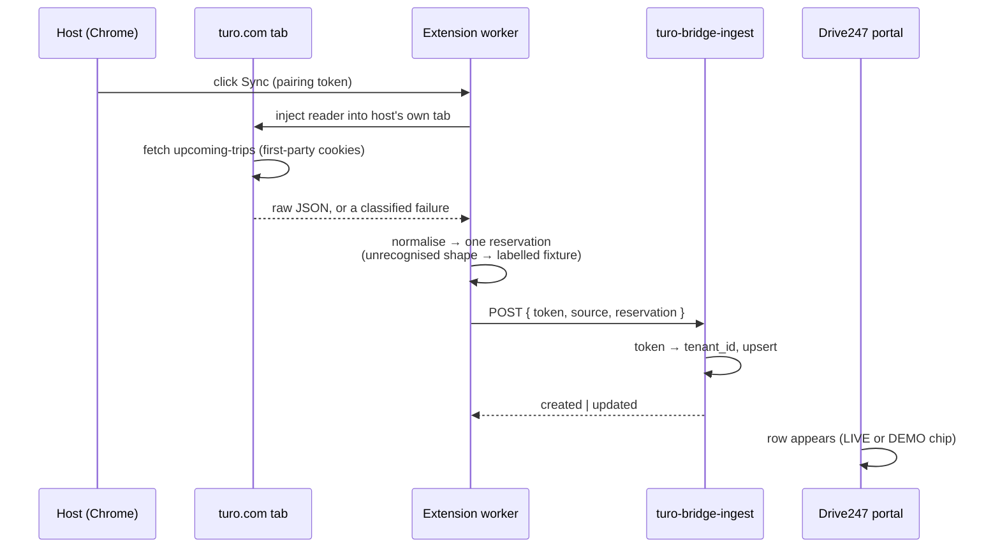

# Drive247 Turo Bridge — Blueprint

**Status: working proof-of-concept. Not a shippable product yet, and the reason is worth five minutes of your time.**

The headline finding: **Turo has no API.** Not a private one we need a key for — none at all. They retired the public one and publish no schema. Every migration tool in this space works the same way: read the host's own already-logged-in browser session. That is a real constraint on the shape of the product, not a delay in building it, and it is why the plan below looks the way it does.

---

## 1. What works today

An unpacked Chrome extension that pulls **one upcoming reservation** out of a Turo host session and lands it in the Drive247 portal.

**Run it in under a minute:**

1. `chrome://extensions` → Developer mode ON → **Load unpacked** → select `turo-bridge-poc/extension/`
2. Pin it, click it, paste the pairing token
3. Click **Sync one reservation**
4. Open the portal → **Turo Bridge** → the row is there

**What that proves**

- The read path works without ever asking for a Turo password. We use the session already in the browser. No credentials are collected, stored, or transmitted — this matters, because asking a host to hand over their Turo login is both a ToS violation and an instant trust problem in a sales conversation.
- The pairing token is the whole auth model. The operator pastes one opaque string; the extension never sends a tenant id, so a cross-tenant write is not expressible in the wire format. Token is stored hashed (sha256), revocable.
- Re-clicking Sync produces one row, not two. Idempotent on `(tenant_id, reservation_id)`.
- Every row records whether it came from a live session or the bundled sample, and the portal shows a **LIVE** / **DEMO** chip per row. A demo you can't tell apart from the real thing is worth nothing.

**What's in the box:** MV3 extension (4 permissions, no `<all_urls>`, no content scripts — inert until clicked), `turo-bridge-ingest` edge function, two tenant-scoped tables with RLS on, and a read-only portal page. 66 automated tests over the parser and wire contract.

---

## 2. The approach

Two design calls worth naming. The fetch runs **inside the turo.com tab**, not in the extension's background worker — a worker request goes out with `Origin: chrome-extension://...`, which is exactly the fingerprint Turo's bot protection rejects. And the parser **refuses to guess a date**: if Turo returns `"Sep 14 – Sep 18"` instead of a timestamp, we fall back to the labelled sample rather than silently inventing a confidently-wrong booking. A visible fallback beats a plausible lie.

---

## 3. What is not done, and why

**We have no Turo host account.** Turo does not operate here, so nothing in the read path has ever met a real response. The endpoint is confirmed; every field name in it is an educated guess. The parser is built so that being wrong is survivable — it discovers structure rather than assuming it, and an unrecognised shape yields the sample plus an honest reason string. But "survivable when wrong" is not "verified right", and the demo narration should not imply otherwise. This is the single biggest gap.

**Turo sits behind Cloudflare and PerimeterX.** In-tab fetching is the pattern shipping extensions use, and we implement it correctly, including a retry in the page's own JS context when the first attempt looks challenged. It will still occasionally get a captcha. That is a permanent operating condition of this integration, not a bug to be closed.

**MV3 service workers get killed at will.** Handled — zero state in worker memory, one click is one bounded round trip, retry is just clicking again. But it constrains anything long-running.

**Nothing syncs while Chrome is shut.** This is browser-resident by construction. There is no server-side path to Turo. A host who closes their laptop syncs nothing until they open it. Any "keeps your calendar in sync" claim has that asterisk on it forever.

**Chrome Web Store review is a real dependency.** An extension that injects into a third-party site draws scrutiny and a written justification for every permission. First submission commonly takes days to a few weeks, and a rejection resets the clock. It is not a step we control.

**Scope gaps by design:** one reservation, no pagination, no vehicles or guests, and rows land in a staging table — they are *not* promoted into `rentals`. A half-formed row in `rentals` enters pricing, agreements and Stripe. That promotion is deliberate future work.

---

## 4. Phased plan

Effort is engineering time for one developer, and assumes a Turo account exists from Phase 1 onward.

| Phase | Scope | Effort |
|---|---|---|
| **0 — done** | PoC: one reservation, end to end | — |
| **1 — Ground truth** | Run against a real host account. Capture actual response shapes for trips and vehicles. Correct the field mapping. Measure how often bot protection fires. **This phase is where the estimates below stop being guesses.** | 1–2 weeks |
| **2 — Real import** | All upcoming trips + pagination, vehicles, guests. Incremental re-sync. Conflict handling for records already in Drive247. | 3–4 weeks |
| **3 — Promotion** | Staged rows become real `rentals`, `vehicles`, `customers`. Review-and-confirm screen — this must never be silent. Rollback path. | 3–4 weeks |
| **4 — Packaging** | Self-service pairing token in Settings, install flow, error copy a non-technical host can act on, privacy policy, store listing and permission justifications. | 2 weeks |
| **5 — Store review** | Submit, respond to review feedback, resubmit. **Not effort we control.** | 1–4 weeks elapsed |
| **6 — Steady state** | Turo changes their frontend without notice. Budget ongoing repair. | ~2 days/month |

Realistic first-customer window: **10–14 weeks from a working Turo account**, with Phase 5 the widest variance. Phases 2 and 3 are the ones most likely to move once Phase 1 tells us what the data actually looks like — if the feed returns rendered display strings rather than clean objects, Phase 2 grows.

---

## 5. What we need

**One Turo host account with at least one upcoming trip.** That is the unblocker. Everything from Phase 1 onward is guesswork until we can watch a real response. A partner host willing to click Sync once on a screenshare would get us most of the way; a test account we control is better.

Two smaller asks:
- A decision on where imported rows land — staging table with a confirm step (our recommendation) versus straight into `rentals`.
- A Chrome Web Store developer account registered under Drive247, since store review is on the critical path and registration is not instant.
